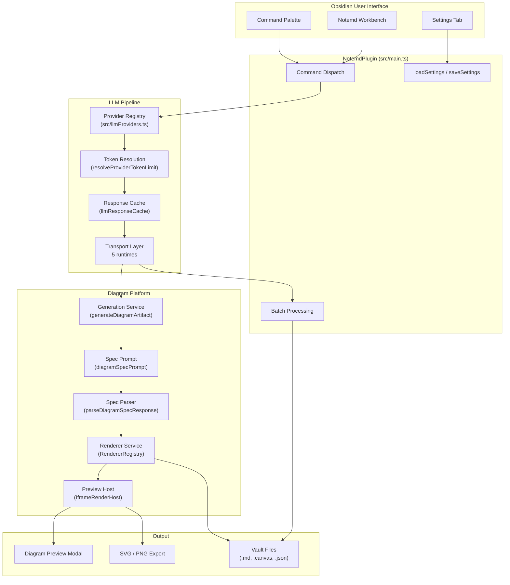
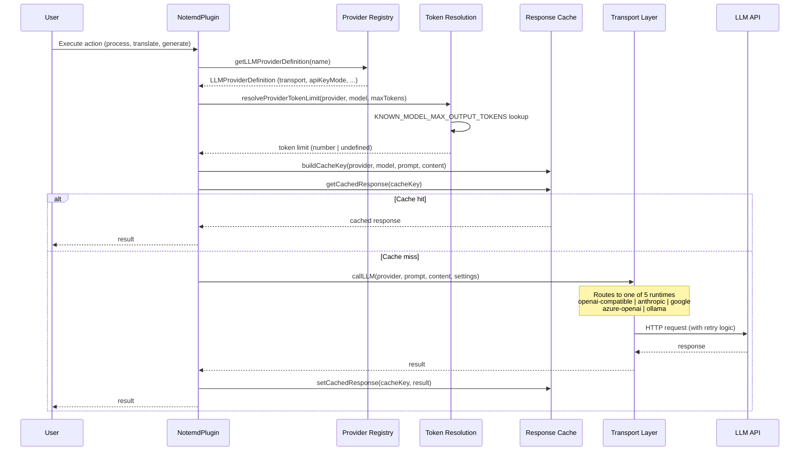
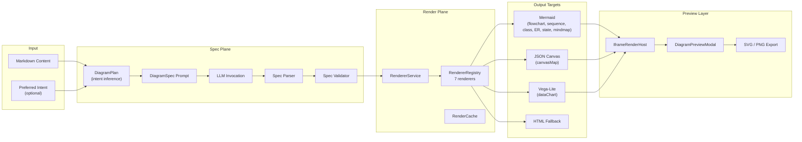

# Notemd Architecture Overview

> Updated: 2026-05-02

## System Architecture



## LLM Calling Pipeline



### Token Resolution Logic

```
User config (maxTokens, provider.maxOutputTokens)
  → resolveProviderTokenLimit()
    → Connection test? → return 1
    → Provider maxOutputTokens override set?
      → Known model? → min(override, knownModelMax)
      → Unknown model? → override (as-is)
    → Global maxTokens set?
      → Known model?
        → maxTokens === DEFAULT? → knownModelMax (auto)
        → Otherwise → min(maxTokens, knownModelMax)
      → Unknown model?
        → maxTokens === DEFAULT? → undefined (API decides, Cline-aligned)
        → Otherwise → maxTokens (user value)
    → Otherwise → knownModelMax ?? undefined
```

### Supported Transports

| Transport | Provider Count | Protocol |
|---|---|---|
| `openai-compatible` | 21 providers | OpenAI Chat Completions API |
| `anthropic` | 1 | Anthropic Messages API |
| `google` | 1 | Google Gemini API |
| `azure-openai` | 1 | Azure OpenAI Deployment API |
| `ollama` | 1 | Ollama Native API |

## Diagram Rendering Platform



### Supported Diagram Intents

| Intent | Render Target | Renderer | Preview | Export |
|---|---|---|---|---|
| `mindmap` | mermaid | MermaidRenderer | modal/iframe | SVG, PNG |
| `flowchart` | mermaid | MermaidRenderer | modal/iframe | SVG, PNG |
| `sequence` | mermaid | MermaidRenderer | modal/iframe | SVG, PNG |
| `classDiagram` | mermaid | MermaidRenderer | modal/iframe | SVG, PNG |
| `erDiagram` | mermaid | MermaidRenderer | modal/iframe | SVG, PNG |
| `stateDiagram` | mermaid | MermaidRenderer | modal/iframe | SVG, PNG |
| `canvasMap` | json-canvas | JsonCanvasRenderer | modal/iframe | SVG, source |
| `dataChart` | vega-lite | VegaLiteRenderer | modal/iframe (sandboxed) | SVG, source |

## Module Map

| Module | Responsibility |
|---|---|
| `src/main.ts` | Plugin entrypoint, command registration, orchestration |
| `src/llmProviders.ts` | 25 provider definitions, metadata, KNOWN_MODEL table |
| `src/llmUtils.ts` | Transport dispatch, token resolution, retry, response cache |
| `src/fileUtils.ts` | File processing, Mermaid repair, concept extraction |
| `src/searchUtils.ts` | Web research, Tavily/DuckDuckGo integration |
| `src/translate.ts` | Translation pipeline with chunking |
| `src/promptUtils.ts` | Task-specific prompts (legacy + spec-first) |
| `src/diagram/` | Diagram domain model, adapters, renderers |
| `src/rendering/` | Render host, preview, export, theme |
| `src/ui/` | Settings tab, sidebar, modals, welcome screen |
| `src/i18n/` | 22 locales, task language policy |
| `src/batchProgressStore.ts` | Interrupt-resume batch state persistence |
| `src/providerDiagnostics.ts` | LLM provider connection diagnostics |

## CLI Boundary Reality

Current host evidence matters:

- the local stable wrapper `obsidian-cli` on this machine exposes desktop/debug entrypoints such as `help`, `version`, `vaults`, `vault`, `doctor`, `native`, `gui`, and `debug`
- the underlying official `obsidian` CLI already supports `commands` and `command id=<command-id>`, and it can list/execute plugin-registered commands
- however, this is still only a **command trigger surface**, not a mature plugin integration protocol with typed arguments, result contracts, capability metadata, or stable automation semantics

That means Notemd's future CLI story still cannot stop at "reuse sidebar buttons from the terminal". The real extraction targets are lower-level capabilities that already have partial independent shape:

- `src/providerDiagnostics.ts`
- `src/diagram/diagramGenerationService.ts`
- `src/workflowButtons.ts`
- `src/batchProgressStore.ts`
- config/profile semantics such as `LLMProviderConfig.localOnly`

The architectural gap is that `src/main.ts` still owns too much orchestration, UI lifecycle, and Obsidian runtime coupling. Until a host-neutral operation layer exists, plugin command IDs can be triggered from the official CLI, but they still remain product surfaces rather than stable engineering APIs.

## Key Design Decisions

1. **Spec-first diagram generation**: LLM emits structured `DiagramSpec` JSON, not raw Mermaid syntax. Decouples intent from renderer.
2. **Transport-driven dispatch**: 21 OpenAI-compatible providers share one runtime. No per-provider code paths.
3. **Cline-aligned token resolution**: Unknown models defer to API provider. Known models use metadata table.
4. **Iframe-host preview**: Vega-Lite and HTML rendered in sandboxed iframe. Mermaid rendered inline.
5. **LocalOnly provider storage**: API keys can be device-local while workflow settings sync.
6. **Response caching**: Identical LLM calls within 5-minute TTL return cached results.

## Verification

- `npm run build` — TypeScript compilation + esbuild bundle
- `npm test -- --runInBand` — 109 suites, 585 tests
- `npm run audit:i18n-ui` — No hardcoded UI strings
- `npm run audit:render-host` — Render host self-contained in main.js
- `git diff --check` — Whitespace hygiene
