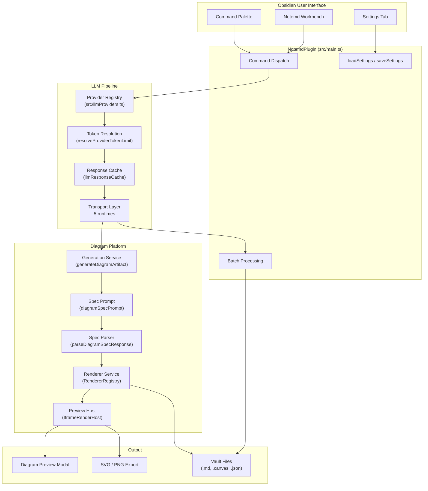
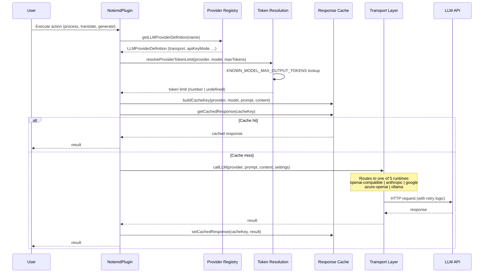
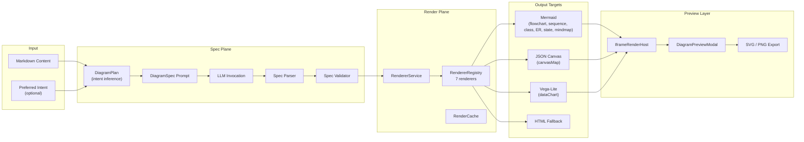

# Notemd Architecture Overview

> Updated: 2026-05-05

## System Architecture



## LLM Calling Pipeline



### Token Resolution Logic

```
User config (maxTokens, provider.maxOutputTokens)
  → resolveProviderTokenLimit()
    → Connection test? → return 1
    → Provider maxOutputTokens override set?
      → Known model? → min(override, knownModelMax)
      → Unknown model? → override (as-is)
    → Global maxTokens set?
      → Known model?
        → maxTokens === DEFAULT? → knownModelMax (auto)
        → Otherwise → min(maxTokens, knownModelMax)
      → Unknown model?
        → maxTokens === DEFAULT? → undefined (API decides, Cline-aligned)
        → Otherwise → maxTokens (user value)
    → Otherwise → knownModelMax ?? undefined
```

### Supported Transports

| Transport | Provider Count | Protocol |
|---|---|---|
| `openai-compatible` | 21 providers | OpenAI Chat Completions API |
| `anthropic` | 1 | Anthropic Messages API |
| `google` | 1 | Google Gemini API |
| `azure-openai` | 1 | Azure OpenAI Deployment API |
| `ollama` | 1 | Ollama Native API |

## Diagram Rendering Platform



### Supported Diagram Intents

| Intent | Render Target | Renderer | Preview | Export |
|---|---|---|---|---|
| `mindmap` | mermaid | MermaidRenderer | modal/iframe | SVG, PNG |
| `flowchart` | mermaid | MermaidRenderer | modal/iframe | SVG, PNG |
| `sequence` | mermaid | MermaidRenderer | modal/iframe | SVG, PNG |
| `classDiagram` | mermaid | MermaidRenderer | modal/iframe | SVG, PNG |
| `erDiagram` | mermaid | MermaidRenderer | modal/iframe | SVG, PNG |
| `stateDiagram` | mermaid | MermaidRenderer | modal/iframe | SVG, PNG |
| `canvasMap` | json-canvas | JsonCanvasRenderer | modal/iframe | SVG, source |
| `dataChart` | vega-lite | VegaLiteRenderer | modal/iframe (sandboxed) | SVG, source |

## Module Map

| Module | Responsibility |
|---|---|
| `src/main.ts` | Plugin entrypoint, command registration, orchestration |
| `src/llmProviders.ts` | 25 provider definitions, metadata, KNOWN_MODEL table |
| `src/llmUtils.ts` | Transport dispatch, token resolution, retry, response cache |
| `src/fileUtils.ts` | File processing, Mermaid repair, concept extraction |
| `src/searchUtils.ts` | Web research, Tavily/DuckDuckGo integration |
| `src/translate.ts` | Translation pipeline with chunking |
| `src/promptUtils.ts` | Task-specific prompts (legacy + spec-first) |
| `src/diagram/` | Diagram domain model, adapters, renderers |
| `src/rendering/` | Render host, preview, export, theme |
| `src/ui/` | Settings tab, sidebar, modals, welcome screen |
| `src/i18n/` | 22 locales, task language policy |
| `src/operations/` | Operation registry, host adapters, capability/contract export, reusable command orchestration |
| `src/batchProgressStore.ts` | Interrupt-resume batch state persistence |
| `src/providerDiagnostics.ts` | LLM provider connection diagnostics |

## CLI Boundary Reality

Current host evidence matters:

- the local stable wrapper `obsidian-cli` on this machine exposes desktop/debug entrypoints such as `help`, `version`, `vaults`, `vault`, `doctor`, `native`, `gui`, and `debug`
- the underlying official `obsidian` CLI already supports `commands` and `command id=<command-id>`, and it can list/execute plugin-registered commands
- however, this is still only a **command trigger surface**, not a mature plugin integration protocol with typed arguments, result contracts, capability metadata, or stable automation semantics

That means Notemd's future CLI story still cannot stop at "reuse sidebar buttons from the terminal". The real extraction targets are lower-level capabilities that already have partial independent shape:

- `src/providerDiagnostics.ts`
- `src/diagram/diagramGenerationService.ts`
- `src/workflowButtons.ts`
- `src/batchProgressStore.ts`
- config/profile semantics such as `LLMProviderConfig.localOnly`

The architectural gap is that `src/main.ts` still owns too much orchestration, UI lifecycle, and Obsidian runtime coupling. Until a host-neutral operation layer exists, plugin command IDs can be triggered from the official CLI, but they still remain product surfaces rather than stable engineering APIs.

The gap is smaller than before:

- `src/operations/diagramGenerateOperation.ts` now carries reusable diagram execution below the command layer
- `src/operations/providerDiagnosticCommand.ts` now carries provider-diagnostic command orchestration below the command layer
- `src/operations/diagramCommandHostAdapter.ts` now carries Mermaid/artifact save completion, direct Vega-Lite preview orchestration, and the public diagram command wrappers (`runGenerateDiagramCommandWithHost`, `runPreviewExperimentalDiagramCommandWithHost`) below the command layer
- `src/operations/configProfileCommands.ts` now carries provider-profile import/export plus CLI capability/contract export orchestration below the command layer
- `src/operations/providerDiagnosticReportPersistence.ts` now carries collision-safe provider-diagnostic report file creation below the command layer
- `src/operations/providerDiagnosticCommandHostAdapter.ts` now carries developer-diagnostic host loading, report-persistence wiring, and notice shaping below the command layer
- `src/operations/configProfileCommandHostAdapter.ts` now carries config/profile state persistence, CLI export notice shaping, and import/export error mapping below the command layer
- `src/operations/providerConnectionTestCommandHostAdapter.ts` now carries shared provider connection test loading plus both the raw test runner and the interactive busy/reporter wrapper, and is now reused by the command path and the settings tab
- `src/operations/noteProcessingCommandHostAdapter.ts` now carries not only `process-current-add-links`, `process-folder-add-links`, `batch-generate-from-titles`, `generate-from-title`, and `research-and-summarize`, but also `translate-current-file`, `batch-translate-folder`, `extract-concepts-current`, `extract-concepts-folder`, `extract-original-text`, and `extract-concepts-and-generate-titles`
- `src/operations/utilityCommandHostAdapter.ts` now carries current-file duplicate checks, duplicate cleanup, batch Mermaid fix, and single/batch formula-fix command orchestration below `src/main.ts`; `check-for-duplicates` is no longer inlined inside command registration
- `src/operations/utilityCommandHostAdapter.ts` now also owns duplicate-deletion confirmation plus the no-file/success notice semantics for duplicate cleanup and batch Mermaid repair, so those user-surface effects no longer leak from `src/fileUtils.ts`
- `src/operations/registry.ts` now also covers the remaining selection/export-adjacent automation seams: `editor.create-link-and-generate`, `provider.profile.export`, `provider.profile.import`, `cli.capability-manifest.export`, and `cli.invocation-contract.export` now share the same registry/capability/contract surface as the earlier batches
- Write-heavy contract enrichment is now proven across the first `src/fileUtils.ts` sub-slice as well: `processFile()` returns `ProcessFileResult`, `generateContentForTitle()` returns `GenerateContentForTitleResult`, `batchGenerateContentForTitles()` returns `BatchGenerateContentForTitlesResult`, and `runProcessFolderWithNotemdCommandWithHost()` now returns `BatchProcessFolderResult` with `savedCount`, `fileResults`, `errors`, and `cancelled`
- `src/fileUtils.ts` no longer decides the user-surface "no eligible markdown files" batch-generation outcome by itself; it returns structured batch state and `src/operations/noteProcessingCommandHostAdapter.ts` now owns the no-file notice semantics
- The remaining `src/fileUtils.ts` tail is now landed too: `batchFixMermaidSyntaxInFolder()` returns `BatchMermaidFixResult`, `checkAndRemoveDuplicateConceptNotes()` returns `ConceptDedupeResult`, destructive confirmation is injected from the host adapter, and batch Mermaid no-file handling is now host-owned instead of utility-owned
- `src/operations/registry.ts` now models the richer `file.process-add-links`, `file.process-folder-add-links`, `content.generate-from-title`, `content.batch-generate-from-titles`, `mermaid.batch-fix`, `concept.dedupe`, `translate.*`, and `formula.*` result schemas directly, so capability export and invocation-contract export no longer flatten those flows into path-only or count-only semantics
- `src/fileUtils.ts` and `src/extractOriginalText.ts` now accept narrower runtime contexts instead of the concrete `NotemdPlugin` class, which shows the boundary work has moved beyond wrapper extraction into utility host-coupling reduction
- `src/main.ts` now mainly retains command registration, host construction, and the deeper diagram execution helpers; the previous highest-value public direct command surfaces now delegate through host adapters instead of inlining busy/reporter/preview lifecycle logic
- The newly-landed direct-surface wrapper batch covers `testLlmConnectionCommand`, `generateDiagramCommand`, and `previewExperimentalDiagramCommand`; each now returns a structured result boundary instead of remaining fire-and-forget UI glue
- The next real gap is no longer the public command entrypoints themselves: typed contracts already exist for `diagram.preview` and `provider.connection.test`, so the remaining pressure point is the deeper `executeSaveMermaidDiagramCommand` / `executeArtifactDiagramCommand` helpers and any richer save/artifact branch contract depth below those wrappers
- The ordered convergence path is now explicit: finish deeper diagram/provider command-core convergence first, then packaging/semantic-verification convergence work, and only then reopen stronger public CLI claims or broader architectural reshaping

## Key Design Decisions

1. **Spec-first diagram generation**: LLM emits structured `DiagramSpec` JSON, not raw Mermaid syntax. Decouples intent from renderer.
2. **Transport-driven dispatch**: 21 OpenAI-compatible providers share one runtime. No per-provider code paths.
3. **Cline-aligned token resolution**: Unknown models defer to API provider. Known models use metadata table.
4. **Iframe-host preview**: Vega-Lite and HTML rendered in sandboxed iframe. Mermaid rendered inline.
5. **LocalOnly provider storage**: API keys can be device-local while workflow settings sync.
6. **Response caching**: Identical LLM calls within 5-minute TTL return cached results.

## Verification

- `npm run build` — TypeScript compilation + esbuild bundle
- `npm test -- --runInBand` — the full Jest matrix currently covers 134 suites and 853 tests; in a `/.worktrees/` checkout use `npx jest --runInBand --config /tmp/notemd-worktree-jest.cjs` because the repo Jest ignore pattern excludes worktree paths
- `npm run audit:i18n-ui` — No hardcoded UI strings
- `npm run audit:render-host` — Render host self-contained in main.js
- `git diff --check` — Whitespace hygiene
