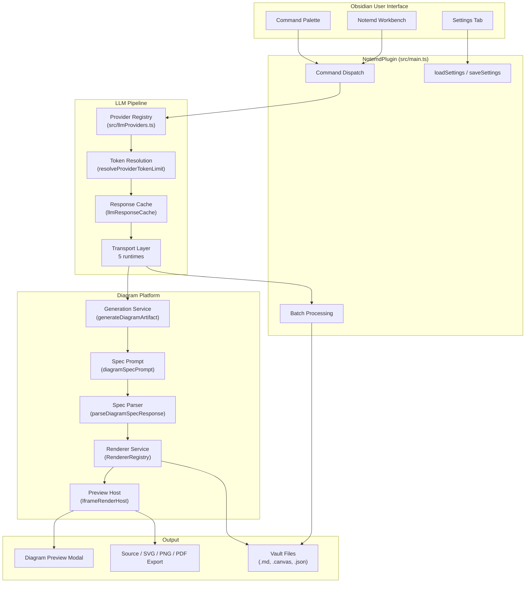
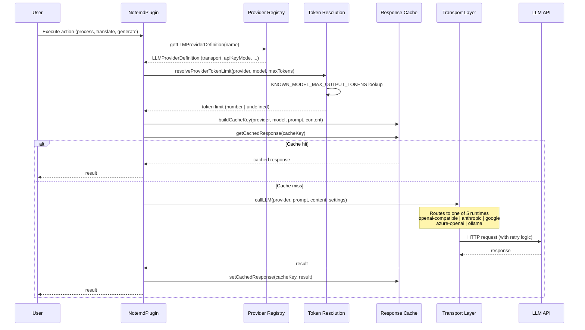
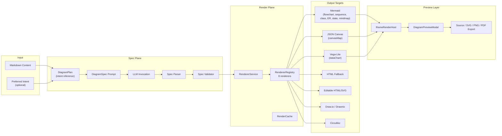

# Notemd Architecture Overview

> Updated: 2026-08-14

## System Architecture


```mermaid
flowchart TB
    subgraph User["Obsidian User Interface"]
        CMD["Command Palette"]
        SIDEBAR["Notemd Workbench"]
        SETTINGS["Settings Tab"]
    end

    subgraph Plugin["NotemdPlugin (src/main.ts)"]
        LOAD["loadSettings / saveSettings"]
        DISPATCH["Command Dispatch"]
        BATCH["Batch Processing"]
    end

    subgraph LLM["LLM Pipeline"]
        PROV["Provider Registry<br/>(src/llmProviders.ts)"]
        TOKEN["Token Resolution<br/>(resolveProviderTokenLimit)"]
        CACHE["Response Cache<br/>(llmResponseCache)"]
        TRANS["Transport Layer<br/>5 runtimes"]
    end

    subgraph Diagram["Diagram Platform"]
        PROMPT["Spec Prompt<br/>(diagramSpecPrompt)"]
        GEN["Generation Service<br/>(generateDiagramArtifact)"]
        PARSE["Spec Parser<br/>(parseDiagramSpecResponse)"]
        RENDER["Renderer Service<br/>(RendererRegistry)"]
        HOST["Preview Host<br/>(IframeRenderHost)"]
    end

    subgraph Output["Output"]
        VAULT["Vault Files<br/>(.md, .canvas, .json)"]
        PREVIEW["Diagram Preview Modal"]
        EXPORT["Source / SVG / PNG / PDF Export"]
    end

    CMD --> DISPATCH
    SIDEBAR --> DISPATCH
    SETTINGS --> LOAD

    DISPATCH --> PROV
    PROV --> TOKEN
    TOKEN --> CACHE
    CACHE --> TRANS
    TRANS --> GEN
    TRANS --> BATCH

    GEN --> PROMPT
    PROMPT --> PARSE
    PARSE --> RENDER
    RENDER --> HOST
    HOST --> PREVIEW
    HOST --> EXPORT
    RENDER --> VAULT
    BATCH --> VAULT
```

## LLM Calling Pipeline


```mermaid
sequenceDiagram
    participant User
    participant Plugin as NotemdPlugin
    participant Provider as Provider Registry
    participant Token as Token Resolution
    participant Cache as Response Cache
    participant Transport as Transport Layer
    participant API as LLM API

    User->>Plugin: Execute action (process, translate, generate)
    Plugin->>Provider: getLLMProviderDefinition(name)
    Provider-->>Plugin: LLMProviderDefinition (transport, apiKeyMode, ...)
    Plugin->>Token: resolveProviderTokenLimit(provider, model, maxTokens)
    Token->>Token: KNOWN_MODEL_MAX_OUTPUT_TOKENS lookup
    Token-->>Plugin: token limit (number | undefined)
    Plugin->>Cache: buildCacheKey(provider, model, prompt, content)
    Plugin->>Cache: getCachedResponse(cacheKey)
    
    alt Cache hit
        Cache-->>Plugin: cached response
        Plugin-->>User: result
    else Cache miss
        Plugin->>Transport: callLLM(provider, prompt, content, settings)
        Note over Transport: Routes to one of 5 runtimes<br/>openai-compatible | anthropic | google<br/>azure-openai | ollama
        Transport->>API: HTTP request (with retry logic)
        API-->>Transport: response
        Transport-->>Plugin: result
        Plugin->>Cache: setCachedResponse(cacheKey, result)
        Plugin-->>User: result
    end
```

### Token Resolution Logic

```
User config (maxTokens, provider.maxOutputTokens)
  → resolveProviderTokenLimit()
    → Connection test? → return 1
    → Provider maxOutputTokens override set?
      → Known model? → min(override, knownModelMax)
      → Unknown model? → override (as-is)
    → Global maxTokens set?
      → Known model?
        → maxTokens === DEFAULT? → knownModelMax (auto)
        → Otherwise → min(maxTokens, knownModelMax)
      → Unknown model?
        → maxTokens === DEFAULT? → undefined (API decides, Cline-aligned)
        → Otherwise → maxTokens (user value)
    → Otherwise → knownModelMax ?? undefined
```

### Supported Transports

| Transport | Provider Count | Protocol |
|---|---|---|
| `openai-compatible` | 22 providers | OpenAI Chat Completions API |
| `anthropic` | 1 | Anthropic Messages API |
| `google` | 1 | Google Gemini API |
| `azure-openai` | 1 | Azure OpenAI Deployment API |
| `ollama` | 1 | Ollama Native API |

## Diagram Rendering Platform


```mermaid
flowchart LR
    subgraph Input["Input"]
        MD["Markdown Content"]
        INTENT["Preferred Intent<br/>(optional)"]
    end

    subgraph Spec["Spec Plane"]
        PLAN["DiagramPlan<br/>(intent inference)"]
        PROMPT2["DiagramSpec Prompt"]
        LLM["LLM Invocation"]
        PARSE2["Spec Parser"]
        VALIDATE["Spec Validator"]
    end

    subgraph Render["Render Plane"]
        REGISTRY["RendererRegistry<br/>8 renderers"]
        SERVICE["RendererService"]
        CACHE2["RenderCache"]
    end

    subgraph Target["Output Targets"]
        MERMAID["Mermaid<br/>(flowchart, sequence, class, ER, state, mindmap)"]
        CANVAS["JSON Canvas<br/>(canvasMap)"]
        VEGA["Vega-Lite<br/>(dataChart)"]
        HTML["HTML Fallback"]
        FIGURE["Editable HTML/SVG"]
        BOARD["Draw.io / Drawnix"]
        CIRCUIT["Circuitikz"]
    end

    subgraph Host["Preview Layer"]
        IFRAME["IframeRenderHost"]
        MODAL["DiagramPreviewModal"]
        EXPORT2["Source / SVG / PNG / PDF Export"]
    end

    MD --> PLAN
    INTENT --> PLAN
    PLAN --> PROMPT2
    PROMPT2 --> LLM
    LLM --> PARSE2
    PARSE2 --> VALIDATE
    VALIDATE --> SERVICE
    SERVICE --> REGISTRY
    REGISTRY --> MERMAID
    REGISTRY --> CANVAS
    REGISTRY --> VEGA
    REGISTRY --> HTML
    REGISTRY --> FIGURE
    REGISTRY --> BOARD
    REGISTRY --> CIRCUIT
    MERMAID --> IFRAME
    CANVAS --> IFRAME
    VEGA --> IFRAME
    IFRAME --> MODAL
    MODAL --> EXPORT2
```

### Supported Diagram Intents

| Intent | Render Target | Renderer | Preview | Export |
|---|---|---|---|---|
| `mindmap` | mermaid | MermaidRenderer | modal/iframe | SVG, PNG |
| `drawnixMindmap` | drawnix | DrawnixRenderer | dedicated SVG companion | `.drawnix`, SVG, PNG, PDF |
| `flowchart` | mermaid | MermaidRenderer | modal/iframe | SVG, PNG |
| `sequence` | mermaid | MermaidRenderer | modal/iframe | SVG, PNG |
| `classDiagram` | mermaid | MermaidRenderer | modal/iframe | SVG, PNG |
| `erDiagram` | mermaid | MermaidRenderer | modal/iframe | SVG, PNG |
| `stateDiagram` | mermaid | MermaidRenderer | modal/iframe | SVG, PNG |
| `canvasMap` | json-canvas | JsonCanvasRenderer | modal/iframe | source, SVG, PNG, PDF |
| `dataChart` | vega-lite | VegaLiteRenderer | modal/iframe (sandboxed) | source, SVG, PNG, PDF |
| `circuit` | circuitikz | CircuitikzRenderer | SVG companion or source-only preview | `.tex`, SVG, PNG, PDF |

`drawnixMindmap` is the only native Drawnix diagram intent. It projects `DiagramSpec.nodes` into an editable knowledge-map forest and generates an SVG companion from Notemd's placed projection. Relation layout has two geometry passes: the first reserves horizontal gutter space from measured label widths; after node placement, the second classifies endpoints relative to their roots. Same-side relations use a compact exterior gutter with a row scheduled between their endpoints. Cross-forest relations use the lower lanes. The router owns obstacle-safe ingress only, while the allocator owns lane placement. There is no fixed hierarchy-depth or relation-count quota; rejection is limited to invalid semantics or geometry that cannot fit without crossing a protected region or the canvas boundary. Source coverage follows the same rule: Markdown headings and unmatched model branches retain their hierarchy and IDs. It remaps edges only after an actual semantic merge and drops only invalid, duplicate, or hierarchy-ownership edges. The upstream `withMind` runtime places native child nodes, so full SVG/native pixel parity needs a real consumer test and cannot be inferred from the exported JSON alone. Standard `mindmap` remains a Mermaid intent and continues through `MermaidRenderer`. See [Drawnix Presentation Architecture Review](./brainstorms/2026-08-14-drawnix-presentation-architecture-review.md).

### Explicit Render Targets

The spec-first pipeline can also force a render target independently from the inferred intent for `Generate diagram` and `Preview diagram`. The standard `Summarise as Mermaid diagram` command remains Mermaid-compatible.

| Render target | Artifact boundary | Runtime dependency policy |
|---|---|---|
| `editable-html-svg` | Self-contained HTML with semantic inline SVG | no external editor runtime |
| `drawio` | `.drawio` XML plus SVG/MD review companions | no diagrams.net runtime in the plugin |
| `drawnix` | `.drawnix` JSON subset with inline Mermaid/source visuals by default; optional `.assets` companions when complete Mermaid export is enabled | no Drawnix or Plait runtime in the plugin; legacy companion scopes remain readable, missing legacy Mermaid SVGs can be rebuilt from metadata source text, and regeneration removes only manifest-backed plugin-owned scopes; a two-pass relation allocator keeps same-side links in exterior gutters and sends cross-forest links through lower lanes. Relation-label calculations can be reused by native metadata and SVG; full native/SVG geometry parity is a consumer-test gate, not a serialization assumption. |
| `circuitikz` | validated `.tex` source plus SVG/MD review companions | dependency-free preview/export; optional desktop compiler or managed Tectonic |

Circuitikz support is intentionally constrained. The front-end settings expose `Circuit (Circuitikz)` as a preferred diagram type and `Circuitikz + SVG preview` as a preferred render target without requiring Developer mode, but the renderer accepts only a validated `DiagramSpec(intent: "circuit", circuitSpec)`. It writes deterministic circuitikz TeX and a reviewable SVG companion. Desktop users may then reuse a custom/system compiler or explicitly install pinned Tectonic 0.16.9 outside the Vault for compile diagnostics, native PDF evidence, and guarded repair acceptance; mobile and ordinary preview/export do not load desktop process code.

The managed-runtime boundary is ownership-based rather than name-based. Downloaded assets are host-allowlisted, size-bounded, checksum-verified, extracted without links or traversal, smoke-tested in staging, and activated under a filesystem lock. Existing paths must remain under the configured runtime root after canonical `realpath` resolution. Removal accepts only valid Notemd pointer/install-local ownership evidence, while stale-lock recovery atomically quarantines a claimed dead-owner lock and revalidates its owner and claim token before deletion.

Drawnix source visuals follow the same compatibility boundary. The default **Also export complete Mermaid visuals** setting is off: sanitized Mermaid SVG/source and resolved binary previews are embedded in `.drawnix` metadata, so a generation does not create an `.assets` folder. Enabling the setting writes the complete Mermaid source, SVG, and manifest companions for external handoff. Preview loading checks embedded data first, then legacy companion paths, then rebuilds a Mermaid visual from retained source text; this keeps old artifacts useful even when users clean up their companion folder.

The embedded `metadata.notemd` source-visual manifest uses schema version 1. New readers accept numeric v1 and the legacy string `"1"`; unknown versions are left untouched and do not get guessed into preview panels. Visual IDs are unique within a manifest, and duplicate entries are ignored at the host boundary.

## Module Map

| Module | Responsibility |
|---|---|
| `src/main.ts` | Plugin entrypoint, command registration, orchestration |
| `src/llmProviders.ts` | 26 provider definitions, metadata, KNOWN_MODEL table |
| `src/llmUtils.ts` | Transport dispatch, token resolution, retry, response cache |
| `src/fileUtils.ts` | File processing, Mermaid repair, concept extraction |
| `src/searchUtils.ts` | Web research, Tavily/DuckDuckGo integration |
| `src/translate.ts` | Translation pipeline with chunking |
| `src/promptUtils.ts` | Task-specific prompts (legacy + spec-first) |
| `src/diagram/` | Diagram domain model, adapters, renderers |
| `src/rendering/` | Render host, preview, export, theme |
| `src/ui/` | Settings tab, sidebar, modals, welcome screen |
| `src/i18n/` | 22 locales, task language policy |
| `src/operations/` | Operation registry, host adapters, capability/contract export, reusable command orchestration |
| `src/batchProgressStore.ts` | Interrupt-resume batch state persistence |
| `src/providerDiagnostics.ts` | LLM provider connection diagnostics |

## CLI Boundary Reality

Current host evidence matters:

- the optional `obsidian-cli` wrapper may expose desktop/debug entrypoints such as `native`, but it is not installed on the current Windows Study host; the stale npm package with the same name is not a safe substitute because it predates the official CLI and shadows the `obsidian` executable
- the official `obsidian` CLI supports `commands`, `command id=<command-id>`, and `eval`; it can list/execute plugin-registered commands and invoke the maintainer bridge directly
- `scripts/invoke-maintainer-cli-operation.js` prefers `obsidian-cli native eval` when a compatible wrapper exists, then falls back to official `obsidian eval` only when the wrapper command is unavailable; a present-but-failing wrapper is surfaced rather than masked
- however, this is still only a **command trigger surface**, not a mature plugin integration protocol with typed arguments, result contracts, capability metadata, or stable automation semantics

That means Notemd's future CLI story still cannot stop at "reuse sidebar buttons from the terminal". The real extraction targets are lower-level capabilities that already have partial independent shape:

- `src/providerDiagnostics.ts`
- `src/diagram/diagramGenerationService.ts`
- `src/workflowButtons.ts`
- `src/batchProgressStore.ts`
- config/profile semantics such as `LLMProviderConfig.localOnly`

The architectural gap is that `src/main.ts` still owns too much orchestration, UI lifecycle, and Obsidian runtime coupling. Until a host-neutral operation layer exists, plugin command IDs can be triggered from the official CLI, but they still remain product surfaces rather than stable engineering APIs.

The gap is smaller than before:

- `src/operations/diagramGenerateOperation.ts` now carries reusable diagram execution below the command layer
- `src/operations/providerDiagnosticCommand.ts` now carries provider-diagnostic command orchestration below the command layer
- `src/operations/diagramCommandHostAdapter.ts` now carries Mermaid/artifact save completion, direct Vega-Lite preview orchestration, and the public diagram command wrappers (`runGenerateDiagramCommandWithHost`, `runPreviewExperimentalDiagramCommandWithHost`) below the command layer
- `src/operations/configProfileCommands.ts` now carries provider-profile import/export plus CLI capability/contract export orchestration below the command layer
- `src/operations/providerDiagnosticReportPersistence.ts` now carries collision-safe provider-diagnostic report file creation below the command layer
- `src/operations/providerDiagnosticCommandHostAdapter.ts` now carries developer-diagnostic host loading, report-persistence wiring, and notice shaping below the command layer
- `src/operations/configProfileCommandHostAdapter.ts` now carries config/profile state persistence, CLI export notice shaping, and import/export error mapping below the command layer
- `src/operations/providerConnectionTestCommandHostAdapter.ts` now carries shared provider connection test loading plus both the raw test runner and the interactive busy/reporter wrapper, and is now reused by the command path and the settings tab
- `src/operations/noteProcessingCommandHostAdapter.ts` now carries not only `process-current-add-links`, `process-folder-add-links`, `batch-generate-from-titles`, `generate-from-title`, and `research-and-summarize`, but also `translate-current-file`, `batch-translate-folder`, `extract-concepts-current`, `extract-concepts-folder`, `extract-original-text`, and `extract-concepts-and-generate-titles`
- `src/operations/utilityCommandHostAdapter.ts` now carries current-file duplicate checks, duplicate cleanup, batch Mermaid fix, and single/batch formula-fix command orchestration below `src/main.ts`; `check-for-duplicates` is no longer inlined inside command registration
- `src/operations/utilityCommandHostAdapter.ts` now also owns duplicate-deletion confirmation plus the no-file/success notice semantics for duplicate cleanup and batch Mermaid repair, so those user-surface effects no longer leak from `src/fileUtils.ts`
- `src/operations/registry.ts` now also covers the remaining selection/export-adjacent automation seams: `editor.create-link-and-generate`, `provider.profile.export`, `provider.profile.import`, `cli.capability-manifest.export`, and `cli.invocation-contract.export` now share the same registry/capability/contract surface as the earlier batches
- Write-heavy contract enrichment is now proven across the first `src/fileUtils.ts` sub-slice as well: `processFile()` returns `ProcessFileResult`, `generateContentForTitle()` returns `GenerateContentForTitleResult`, `batchGenerateContentForTitles()` returns `BatchGenerateContentForTitlesResult`, and `runProcessFolderWithNotemdCommandWithHost()` now returns `BatchProcessFolderResult` with `savedCount`, `fileResults`, `errors`, and `cancelled`
- `src/fileUtils.ts` no longer decides the user-surface "no eligible markdown files" batch-generation outcome by itself; it returns structured batch state and `src/operations/noteProcessingCommandHostAdapter.ts` now owns the no-file notice semantics
- The remaining `src/fileUtils.ts` tail is now landed too: `batchFixMermaidSyntaxInFolder()` returns `BatchMermaidFixResult`, `checkAndRemoveDuplicateConceptNotes()` returns `ConceptDedupeResult`, destructive confirmation is injected from the host adapter, and batch Mermaid no-file handling is now host-owned instead of utility-owned
- `src/operations/registry.ts` now models the richer `file.process-add-links`, `file.process-folder-add-links`, `content.generate-from-title`, `content.batch-generate-from-titles`, `mermaid.batch-fix`, `concept.dedupe`, `translate.*`, and `formula.*` result schemas directly, so capability export and invocation-contract export no longer flatten those flows into path-only or count-only semantics
- `src/fileUtils.ts` and `src/extractOriginalText.ts` now accept narrower runtime contexts instead of the concrete `NotemdPlugin` class, which shows the boundary work has moved beyond wrapper extraction into utility host-coupling reduction
- `src/main.ts` now mainly retains command registration, host construction, and the deeper diagram execution helpers; the previous highest-value public direct command surfaces now delegate through host adapters instead of inlining busy/reporter/preview lifecycle logic
- The newly-landed direct-surface wrapper batch covers `testLlmConnectionCommand`, `generateDiagramCommand`, and `previewExperimentalDiagramCommand`; each now returns a structured result boundary instead of remaining fire-and-forget UI glue
- The latest refinement is that `diagram.generate` should be read as the host-neutral generation contract, not as a synonym for the shipped active-file commands. Its operation-level `safe` / `read-only` metadata describes the explicit `sourceMarkdown -> DiagramGenerationResult` core, while the mapped command bindings still truthfully carry `requires-active-file` / `write-file` semantics.
- The next real gap is therefore no longer the public command entrypoints themselves: typed contracts already exist for `diagram.preview` and `provider.connection.test`, the substantive save/artifact execution path now lives in `src/operations/diagramCommandExecution.ts`, and `diagram.generate` now returns explicit follow-through details (`kind`, `outputPath`, `previewOpened`, `autoFixAttempted`, `artifactTarget`) alongside the backward-compatible top-level `outputPath` / `previewOpened` fields.
- The maintainer-local semantic verification layer is now no longer just prose: `npm run verify:diagram-semantics` generates a secret-free Markdown checklist template with repo gates, vault-aware CLI checks, and Mermaid / JSON Canvas / Vega-Lite evidence sections without relying on tracked vault paths or live secrets.
- The build-to-Vault boundary is now executable: `npm run verify:vault-bundle -- --vault <vault-path>` fails closed when `main.js`, `styles.css`, or `manifest.json` is missing, differs by SHA-256, or carries a different manifest version.
- The ordered convergence path is now explicit: keep `diagram.generate` as the host-neutral core, treat the newly landed typed follow-through as the command-completion layer beneath it, then move to packaging/semantic-verification convergence work and only after that reopen stronger public CLI claims or broader architectural reshaping.

## Implemented Hardening Architecture

The delivered hardening phase keeps the same host-neutral pipeline and makes three boundaries explicit: `DiagramSpec` for semantics and provenance, a target-owned placed projection for geometry/layers/collision diagnostics, and `RenderArtifact` for preview panels, source-visual metadata, optional companions, and export. The document-root presentation policy is source-backed and does not invalidate forest-shaped semantic input. The detailed bilingual delivery record is [Diagram Platform Robustness And Settings Integrity Plan](./brainstorms/2026-08-08-diagram-platform-robustness-and-settings-integrity-plan.md).

The delivered phases cover semantic structure integrity, geometry/layer collision auditing, source-visual rehydration, unified image export, settings discovery/runtime verification, and documentation closure. Full Drawnix host embedding, Mermaid round-tripping as the native path, and PDF-specific re-layout remain rejected.

## Key Design Decisions

1. **Spec-first diagram generation**: LLM emits structured `DiagramSpec` JSON, not raw Mermaid syntax. Decouples intent from renderer.
2. **Transport-driven dispatch**: OpenAI-compatible providers share one runtime. No per-provider code paths.
3. **Cline-aligned token resolution**: Unknown models defer to API provider. Known models use metadata table.
4. **Operation-core vs command-binding split**: Registry operation metadata can describe a host-neutral reusable core even when the shipped commands remain active-file, write-file, or preview-bound surfaces. `diagram.generate` is the current proof case.
5. **Iframe-host preview**: Vega-Lite and HTML rendered in sandboxed iframe. Mermaid rendered inline.
6. **LocalOnly provider storage**: API keys can be device-local while workflow settings sync.
7. **Response caching**: Identical LLM calls within 5-minute TTL return cached results.

## Verification

- `npm run build` — TypeScript compilation + esbuild bundle
- `npm test -- --runInBand` — the full Jest matrix currently covers 243 suites and 2150 tests (2149 passed, 1 skipped); in a `/.worktrees/` checkout use `npx jest --runInBand --config /tmp/notemd-worktree-jest.cjs` because the repo Jest ignore pattern excludes worktree paths
- `npm run audit:i18n-ui` — No hardcoded UI strings
- `npm run audit:render-host` — Render host self-contained in main.js
- `npm run verify:vault-bundle -- --vault <vault-path>` — Source/Vault bundle hashes and manifest version agree
- `git diff --check` — Whitespace hygiene
