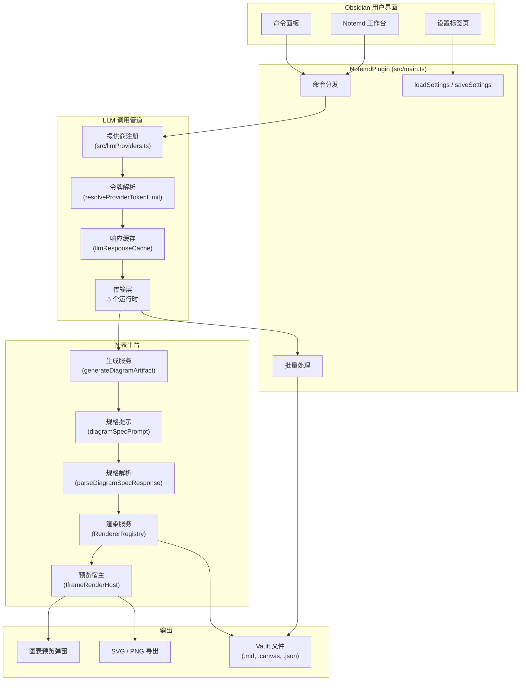
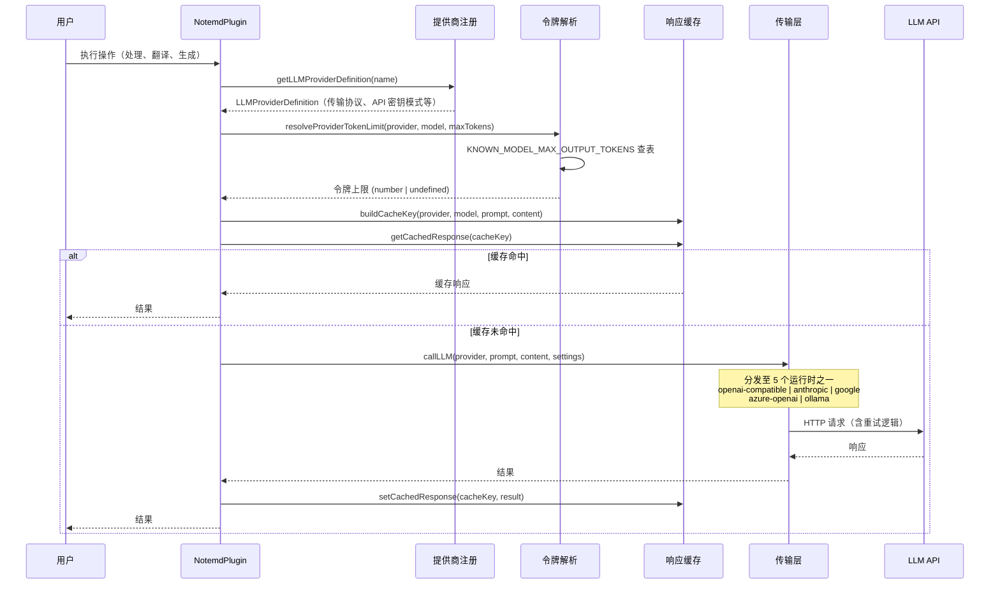
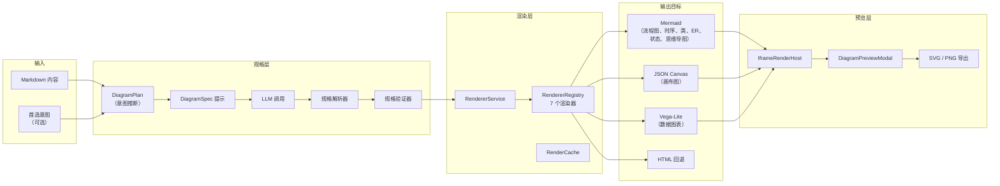

# Notemd 系统架构总览

> 更新：2026-05-02

## 系统架构



## LLM 调用管道



### 令牌解析逻辑

```
用户配置 (maxTokens, provider.maxOutputTokens)
  → resolveProviderTokenLimit()
    → 连接测试？ → 返回 1
    → 提供商 maxOutputTokens 覆盖已设置？
      → 已知模型？ → min(覆盖值, 已知上限)
      → 未知模型？ → 覆盖值（直接使用）
    → 全局 maxTokens 已设置？
      → 已知模型？
        → maxTokens === DEFAULT？ → 已知模型上限（自动）
        → 否则 → min(maxTokens, 已知上限)
      → 未知模型？
        → maxTokens === DEFAULT？ → undefined（API 自行决定，Cline 对齐）
        → 否则 → maxTokens（用户值）
    → 否则 → 已知上限 ?? undefined
```

### 支持的传输协议

| 传输协议 | 提供商数量 | 协议 |
|---|---|---|
| `openai-compatible` | 21 个提供商 | OpenAI Chat Completions API |
| `anthropic` | 1 个 | Anthropic Messages API |
| `google` | 1 个 | Google Gemini API |
| `azure-openai` | 1 个 | Azure OpenAI Deployment API |
| `ollama` | 1 个 | Ollama Native API |

## 图表渲染平台



### 支持的图表意图

| 意图 | 渲染目标 | 渲染器 | 预览 | 导出 |
|---|---|---|---|---|
| `mindmap` | mermaid | MermaidRenderer | 弹窗/iframe | SVG、PNG |
| `flowchart` | mermaid | MermaidRenderer | 弹窗/iframe | SVG、PNG |
| `sequence` | mermaid | MermaidRenderer | 弹窗/iframe | SVG、PNG |
| `classDiagram` | mermaid | MermaidRenderer | 弹窗/iframe | SVG、PNG |
| `erDiagram` | mermaid | MermaidRenderer | 弹窗/iframe | SVG、PNG |
| `stateDiagram` | mermaid | MermaidRenderer | 弹窗/iframe | SVG、PNG |
| `canvasMap` | json-canvas | JsonCanvasRenderer | 弹窗/iframe | SVG、源文件 |
| `dataChart` | vega-lite | VegaLiteRenderer | 弹窗/iframe（沙盒） | SVG、源文件 |

## 模块地图

| 模块 | 职责 |
|---|---|
| `src/main.ts` | 插件入口、命令注册、流程编排 |
| `src/llmProviders.ts` | 25 个提供商定义、元数据、KNOWN_MODEL 表 |
| `src/llmUtils.ts` | 传输分发、令牌解析、重试、响应缓存 |
| `src/fileUtils.ts` | 文件处理、Mermaid 修复、概念提取 |
| `src/searchUtils.ts` | 网络搜索、Tavily/DuckDuckGo 集成 |
| `src/translate.ts` | 翻译管道（含分块） |
| `src/promptUtils.ts` | 任务提示词（旧版 + spec-first） |
| `src/diagram/` | 图表领域模型、适配器、渲染器 |
| `src/rendering/` | 渲染宿主、预览、导出、主题 |
| `src/ui/` | 设置标签页、侧边栏、弹窗、欢迎页 |
| `src/i18n/` | 22 种语言、任务语言策略 |
| `src/batchProgressStore.ts` | 中断恢复批量状态持久化 |
| `src/providerDiagnostics.ts` | LLM 提供商连接诊断 |

## CLI 边界现实

当前宿主事实必须明确写清：

- 本机上的稳定包装器 `obsidian-cli` 暴露的是 `help`、`version`、`vaults`、`vault`、`doctor`、`native`、`gui`、`debug` 等桌面/调试入口
- 底层官方 `obsidian` CLI 实际已经支持 `commands` 与 `command id=<command-id>`，并且可以列出/执行插件注册命令
- 但这仍然只是**命令触发表面**，不是成熟的插件集成协议：它还缺少类型化参数、返回结果契约、能力元数据和稳定自动化语义

因此，Notemd 的未来 CLI 路线仍不能停留在“把 sidebar 按钮搬到终端”。真正值得抽取的是已经开始具备独立形态的低层能力：

- `src/providerDiagnostics.ts`
- `src/diagram/diagramGenerationService.ts`
- `src/workflowButtons.ts`
- `src/batchProgressStore.ts`
- `LLMProviderConfig.localOnly` 这类 config/profile 语义

当前架构缺口在于：`src/main.ts` 仍持有过多 orchestration、UI 生命周期和 Obsidian runtime 耦合。在形成宿主无关 operation 层之前，插件 command IDs 虽然已经可以被官方 CLI 触发，但它们仍然只是产品表面，不应被当成稳定工程 API。

## 关键设计决策

1. **规格优先图表生成**：LLM 输出结构化 `DiagramSpec` JSON，而非原始 Mermaid 语法。解耦意图与渲染器。
2. **传输驱动分发**：21 个 OpenAI-compatible 提供商共享一个运行时。无逐提供商代码路径。
3. **Cline 对齐令牌解析**：未知模型由 API 提供商自行决定。已知模型使用元数据表。
4. **Iframe 宿主预览**：Vega-Lite 和 HTML 在沙盒 iframe 中渲染。Mermaid 内联渲染。
5. **本地存储提供商配置**：API 密钥可设备本地保留，工作流设置可同步。
6. **响应缓存**：5 分钟 TTL 内相同 LLM 调用返回缓存结果。

## 验证

- `npm run build` — TypeScript 编译 + esbuild 打包
- `npm test -- --runInBand` — 109 套件，585 项测试
- `npm run audit:i18n-ui` — 无硬编码 UI 字符串
- `npm run audit:render-host` — 渲染宿主自包含于 main.js
- `git diff --check` — 空白符卫生
