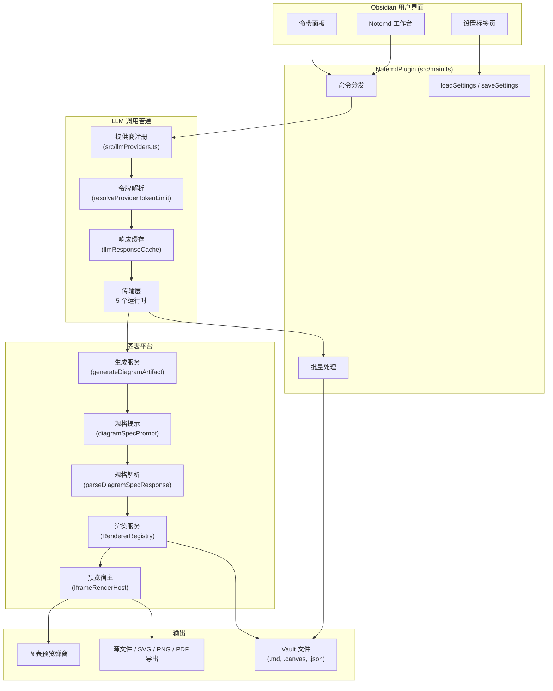
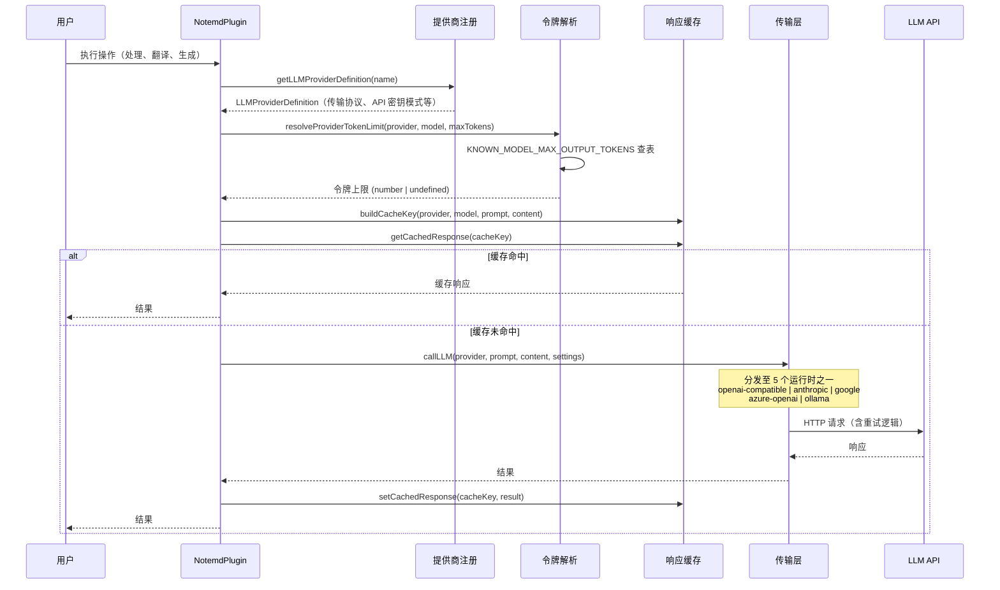
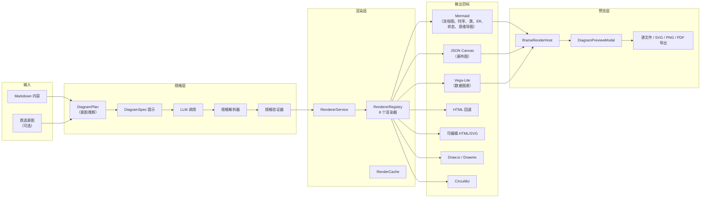

# Notemd 系统架构总览

> 更新：2026-08-16

## 系统架构


```mermaid
flowchart TB
    subgraph User["Obsidian 用户界面"]
        CMD["命令面板"]
        SIDEBAR["Notemd 工作台"]
        SETTINGS["设置标签页"]
    end

    subgraph Plugin["NotemdPlugin (src/main.ts)"]
        LOAD["loadSettings / saveSettings"]
        DISPATCH["命令分发"]
        BATCH["批量处理"]
    end

    subgraph LLM["LLM 调用管道"]
        PROV["提供商注册<br/>(src/llmProviders.ts)"]
        TOKEN["令牌解析<br/>(resolveProviderTokenLimit)"]
        CACHE["响应缓存<br/>(llmResponseCache)"]
        TRANS["传输层<br/>5 个运行时"]
    end

    subgraph Diagram["图表平台"]
        PROMPT["规格提示<br/>(diagramSpecPrompt)"]
        GEN["生成服务<br/>(generateDiagramArtifact)"]
        PARSE["规格解析<br/>(parseDiagramSpecResponse)"]
        RENDER["渲染服务<br/>(RendererRegistry)"]
        HOST["预览宿主<br/>(IframeRenderHost)"]
    end

    subgraph Output["输出"]
        VAULT["Vault 文件<br/>(.md, .canvas, .json)"]
        PREVIEW["图表预览弹窗"]
        EXPORT["源文件 / SVG / PNG / PDF 导出"]
    end

    CMD --> DISPATCH
    SIDEBAR --> DISPATCH
    SETTINGS --> LOAD

    DISPATCH --> PROV
    PROV --> TOKEN
    TOKEN --> CACHE
    CACHE --> TRANS
    TRANS --> GEN
    TRANS --> BATCH

    GEN --> PROMPT
    PROMPT --> PARSE
    PARSE --> RENDER
    RENDER --> HOST
    HOST --> PREVIEW
    HOST --> EXPORT
    RENDER --> VAULT
    BATCH --> VAULT
```

## LLM 调用管道


```mermaid
sequenceDiagram
    participant User as 用户
    participant Plugin as NotemdPlugin
    participant Provider as 提供商注册
    participant Token as 令牌解析
    participant Cache as 响应缓存
    participant Transport as 传输层
    participant API as LLM API

    User->>Plugin: 执行操作（处理、翻译、生成）
    Plugin->>Provider: getLLMProviderDefinition(name)
    Provider-->>Plugin: LLMProviderDefinition（传输协议、API 密钥模式等）
    Plugin->>Token: resolveProviderTokenLimit(provider, model, maxTokens)
    Token->>Token: KNOWN_MODEL_MAX_OUTPUT_TOKENS 查表
    Token-->>Plugin: 令牌上限 (number | undefined)
    Plugin->>Cache: buildCacheKey(provider, model, prompt, content)
    Plugin->>Cache: getCachedResponse(cacheKey)
    
    alt 缓存命中
        Cache-->>Plugin: 缓存响应
        Plugin-->>User: 结果
    else 缓存未命中
        Plugin->>Transport: callLLM(provider, prompt, content, settings)
        Note over Transport: 分发至 5 个运行时之一<br/>openai-compatible | anthropic | google<br/>azure-openai | ollama
        Transport->>API: HTTP 请求（含重试逻辑）
        API-->>Transport: 响应
        Transport-->>Plugin: 结果
        Plugin->>Cache: setCachedResponse(cacheKey, result)
        Plugin-->>User: 结果
    end
```

### 令牌解析逻辑

```
用户配置 (maxTokens, provider.maxOutputTokens)
  → resolveProviderTokenLimit()
    → 连接测试？ → 返回 1
    → 提供商 maxOutputTokens 覆盖已设置？
      → 已知模型？ → min(覆盖值, 已知上限)
      → 未知模型？ → 覆盖值（直接使用）
    → 全局 maxTokens 已设置？
      → 已知模型？
        → maxTokens === DEFAULT？ → 已知模型上限（自动）
        → 否则 → min(maxTokens, 已知上限)
      → 未知模型？
        → maxTokens === DEFAULT？ → undefined（API 自行决定，Cline 对齐）
        → 否则 → maxTokens（用户值）
    → 否则 → 已知上限 ?? undefined
```

### 支持的传输协议

| 传输协议 | 提供商数量 | 协议 |
|---|---|---|
| `openai-compatible` | 22 个提供商 | OpenAI Chat Completions API |
| `anthropic` | 1 个 | Anthropic Messages API |
| `google` | 1 个 | Google Gemini API |
| `azure-openai` | 1 个 | Azure OpenAI Deployment API |
| `ollama` | 1 个 | Ollama Native API |

## 图表渲染平台


```mermaid
flowchart LR
    subgraph Input["输入"]
        MD["Markdown 内容"]
        INTENT["首选意图<br/>（可选）"]
    end

    subgraph Spec["规格层"]
        PLAN["DiagramPlan<br/>（意图推断）"]
        PROMPT2["DiagramSpec 提示"]
        LLM["LLM 调用"]
        PARSE2["规格解析器"]
        VALIDATE["规格验证器"]
    end

    subgraph Render["渲染层"]
        REGISTRY["RendererRegistry<br/>8 个渲染器"]
        SERVICE["RendererService"]
        CACHE2["RenderCache"]
    end

    subgraph Target["输出目标"]
        MERMAID["Mermaid<br/>（流程图、时序、类、ER、状态、思维导图）"]
        CANVAS["JSON Canvas<br/>（画布图）"]
        VEGA["Vega-Lite<br/>（数据图表）"]
        HTML["HTML 回退"]
        FIGURE["可编辑 HTML/SVG"]
        BOARD["Draw.io / Drawnix"]
        CIRCUIT["Circuitikz"]
    end

    subgraph Host["预览层"]
        IFRAME["IframeRenderHost"]
        MODAL["DiagramPreviewModal"]
        EXPORT2["源文件 / SVG / PNG / PDF 导出"]
    end

    MD --> PLAN
    INTENT --> PLAN
    PLAN --> PROMPT2
    PROMPT2 --> LLM
    LLM --> PARSE2
    PARSE2 --> VALIDATE
    VALIDATE --> SERVICE
    SERVICE --> REGISTRY
    REGISTRY --> MERMAID
    REGISTRY --> CANVAS
    REGISTRY --> VEGA
    REGISTRY --> HTML
    REGISTRY --> FIGURE
    REGISTRY --> BOARD
    REGISTRY --> CIRCUIT
    MERMAID --> IFRAME
    CANVAS --> IFRAME
    VEGA --> IFRAME
    IFRAME --> MODAL
    MODAL --> EXPORT2
```

### 支持的图表意图

| 意图 | 渲染目标 | 渲染器 | 预览 | 导出 |
|---|---|---|---|---|
| `mindmap` | mermaid | MermaidRenderer | 弹窗/iframe | SVG、PNG |
| `drawnixMindmap` | drawnix | DrawnixRenderer | 专用 SVG companion | `.drawnix`、SVG、PNG、PDF |
| `flowchart` | mermaid | MermaidRenderer | 弹窗/iframe | SVG、PNG |
| `sequence` | mermaid | MermaidRenderer | 弹窗/iframe | SVG、PNG |
| `classDiagram` | mermaid | MermaidRenderer | 弹窗/iframe | SVG、PNG |
| `erDiagram` | mermaid | MermaidRenderer | 弹窗/iframe | SVG、PNG |
| `stateDiagram` | mermaid | MermaidRenderer | 弹窗/iframe | SVG、PNG |
| `canvasMap` | json-canvas | JsonCanvasRenderer | 弹窗/iframe | 源文件、SVG、PNG、PDF |
| `dataChart` | vega-lite | VegaLiteRenderer | 弹窗/iframe（沙盒） | 源文件、SVG、PNG、PDF |
| `circuit` | circuitikz | CircuitikzRenderer | SVG companion 或 source-only 预览 | `.tex`、SVG、PNG、PDF |

`drawnixMindmap` 是唯一的原生 Drawnix 图表意图。它把 `DiagramSpec.nodes` 投影为可编辑的知识导图 forest，并由 Notemd 的已布局投影生成 SVG companion。关系布局分两次计算：第一步按已测量标签宽度预留水平 gutter；节点落位后，第二步按端点相对 root 的方位分类。同侧关系在外侧 gutter 中分配位于两个端点之间的行，跨 forest 关系进入底部通道。router 只处理避障端点接入，通道位置由分配器负责。预留通道会先尝试确定性的水平接入；若所有水平端口组合都无法抵达预留行，grid retry 才加入节点顶部和底部端口，标签仍落在原定通道中。这样不会因为分支封住两侧端口而拒绝一张仍有外部出口的复杂树，也不引入节点数、层级深度或关系数量配额。source coverage 也遵循这一规则：Markdown 标题链与未匹配的模型分支保留原有层级和 ID。只有实际发生语义合并时才会重映射关系边；无效、重复或重复层级所有权的关系边才会被丢弃。当前 native board 由上游 `withMind` 决定子节点落位，因此 SVG 与 native 的完整像素几何必须通过真实 consumer test 验证，不能只从导出 JSON 推断。标准 `mindmap` 仍由 MermaidRenderer 处理，生成与回退语义不变。

### 能力目录契约（2026-08-16）

图形平台保持三条独立轴：语义类型、渲染目标和导出格式。当前可执行真值是类型目录加 example fixture；向前计划将增加唯一 target descriptor 和带版本的生成式 capability manifest。`SVG`、`PNG`、`PDF` 是导出格式，不是 render target。

当前已交付 10 个语义类型、8 个渲染目标和 3 个导出格式。设置页 gallery 已有每类一个生产 renderer fixture，但生成流缩略图和静态 docs gallery 尚未实现。`ref/diagram-design` 的参考布局在具备 renderer、fixture、预览、持久化映射、文档行和自动化门禁之前，保持 `reference-only/planned`。

后续顺序是先解决正确性基础，再做目录/契约生成，最后接入确定性预览资产和选择器。这是必要的先后关系：当前重试产物身份、target 映射、local-only 设置持久化、cache 隔离和 operation schema 漂移都是边界缺陷。见[当前进度审计](./brainstorms/2026-08-16-mainline-diagram-architecture-progress-and-next-direction.zh-CN.md)、[图形能力目录](./maintainer/diagram-capability-catalog.zh-CN.md)和[向前架构计划](./superpowers/plans/2026-08-16-diagram-capability-catalog-and-forward-architecture.zh-CN.md)。

### 可执行类型目录与原生 Drawnix 树

`DiagramTypeCatalog` 负责面向用户的类型名称、语义模式、prompt profile、renderer binding、visual-role 词表和可执行示例。`ref/diagram-design` 中还没有完整 Notemd 链路的参考布局仍只留在文档与路线图中，不进入选择器。

`drawnixMindmap` 继续作为持久化兼容 ID，在目录中展示为 **Drawnix 知识导图**。它只有一条原生输出契约：

```text
DiagramSpec
  -> mergeDrawnixSourceCoverage(源 Markdown, 源路径)
  -> 唯一的文件名根节点树
  -> buildDrawnixMindMapProjection()
  -> DrawnixRenderer
  -> .drawnix + SVG companion + Markdown wrapper
```

文档根节点使用去掉扩展名后的源文件名。标题结构保留为嵌套分支；模型生成但未匹配到源结构的分支会进入 `Additional concepts`，不会被删除。跨分支关系保留为原生 `arrow-line`。两阶段分配器根据实测标签尺寸预留外侧通道，先尝试确定性的直接接入，再进入 grid route。只有所有水平接入组合都被阻断时，grid 才会从顶部和底部端口重试，因此标签的预留几何不变，同时复杂分支仍可沿外侧通道离开。grid 坐标会保留有限端点的精确值；量化端点坐标会让合法的亚像素节点边界在路由图中消失。没有固定的层级、节点或关系数量限制。

旧交付矩阵与 replay metadata 已有意移除。它们复制了语义状态，并让一次真实 vault 运行在写 artifact 前失败。`loadSettings()` 会删除废弃字段 `drawnixKnowledgeMapDelivery`，并在首次读到旧字段时持久化清理后的记录。离线 CLI 仍接受 `--drawnix-delivery` 以兼容脚本，但该参数是 no-op。新 board 不再带 `metadata.notemd.knowledgeMap`。

标准 `mindmap` 仍是 Mermaid intent，继续经由 `MermaidRenderer`。Drawnix 的路由、source coverage 和原生导出不会改变它的 prompt、fallback、repair 或 cache 行为。类型目录中的 Drawnix 示例与架构演示一致，使用唯一的 `architecture.zh-CN` 根节点。

### 图表请求存活性

外部 CLI 超时只会结束客户端进程，不会取消 Obsidian 内部仍在执行的 `eval` Promise。因此，`runDiagramGenerateOperation()` 自己持有五分钟的 LLM deadline。它把 controller 注册到既有 progress reporter，经由结构化生成、旧 Mermaid fallback 和 provider retry 传递，并在 `finally` 清理。超时或用户取消都会释放命令的 busy state，避免 UI 长期锁定。该 deadline 只约束 provider 可用性，不限制源文档大小、树深度、节点数、关系数，也不改变 Mermaid 行为。

### 显式渲染目标

对 `Generate diagram` 与 `Preview diagram` 而言，规格优先 pipeline 可以在意图推断之外显式指定渲染目标。标准的 `Summarise as Mermaid diagram` 命令仍保持 Mermaid 兼容输出。

| 渲染目标 | Artifact 边界 | Runtime 依赖策略 |
|---|---|---|
| `editable-html-svg` | 带语义 inline SVG 的自包含 HTML | 不依赖外部编辑器 runtime |
| `drawio` | `.drawio` XML 加 SVG/MD review companion | 插件内不嵌入 diagrams.net runtime |
| `drawnix` | `.drawnix` JSON 默认内联 Mermaid/源图形；开启完整 Mermaid 输出后才写入可选 `.assets` companion | 每份源笔记只生成一个以文件名为根的原生树。不在插件中打包 Drawnix、Plait 或 React runtime。旧 source-visual companion 仍可读取，缺失的旧 Mermaid SVG 可以从保留的 metadata 源文本重建。 |
| `circuitikz` | 经过验证的 `.tex` 源文件加 SVG/MD review companion | 预览/导出零依赖；桌面端可选本机编译器或托管 Tectonic |

Circuitikz 支持仍然是受约束的。前端设置无需开启 Developer mode 就会显示 `Circuit (Circuitikz)` 首选图表类型与 `Circuitikz + SVG preview` 首选渲染目标，但 renderer 只接受经过验证的 `DiagramSpec(intent: "circuit", circuitSpec)`。它会写出确定性的 circuitikz TeX 和可审阅的 SVG companion。桌面用户随后可以复用自定义/系统编译器，或在 Vault 外显式安装固定版本 Tectonic 0.16.9，用于编译诊断、原生 PDF 证据与受保护的修复验收；移动端与常规预览/导出不会加载桌面进程代码。

托管运行时边界按所有权而不是目录名称判断。下载资产经过主机白名单、体积上限和 checksum 校验，解压拒绝链接与路径穿越，在 staging 中通过 smoke 后才在文件系统锁内激活。已有路径必须在规范化 `realpath` 解析后仍位于配置的运行时根目录内。删除只接受有效 Notemd pointer 或安装目录内所有权证据；过期锁恢复会先把已声明的死亡 owner 锁原子隔离，再复核 owner 与 claim token 后删除。

Drawnix 源图形遵循同一条兼容性边界。默认关闭 **同时完整输出 Mermaid 图**：安全清理后的 Mermaid SVG/源代码与已解析的二进制预览会内嵌在 `.drawnix` metadata 中，因此生成不会创建 `.assets` 文件夹。开启设置后，才会写出用于外部交接的完整 Mermaid 源码、SVG 与 manifest companion。预览加载顺序是内嵌数据、旧 companion 路径，最后从 metadata 中保留的源文本重建 Mermaid 图；即使用户清理了旧 companion 目录，旧 artifact 仍然可用。

内嵌的 `metadata.notemd` source-visual manifest 使用 schema version 1。新读取器接受数字 v1 和旧的字符串 `"1"`；未知版本会保持不变，不会被猜测成预览面板。一个 manifest 内的 visual ID 必须唯一，重复项会在 host 边界被忽略。

## 模块地图

| 模块 | 职责 |
|---|---|
| `src/main.ts` | 插件入口、命令注册、流程编排 |
| `src/llmProviders.ts` | 26 个提供商定义、元数据、KNOWN_MODEL 表 |
| `src/llmUtils.ts` | 传输分发、令牌解析、重试、响应缓存 |
| `src/fileUtils.ts` | 文件处理、Mermaid 修复、概念提取 |
| `src/searchUtils.ts` | 网络搜索、Tavily/DuckDuckGo 集成 |
| `src/translate.ts` | 翻译管道（含分块） |
| `src/promptUtils.ts` | 任务提示词（旧版 + spec-first） |
| `src/diagram/` | 图表领域模型、适配器、渲染器 |
| `src/rendering/` | 渲染宿主、预览、导出、主题 |
| `src/ui/` | 设置标签页、侧边栏、弹窗、欢迎页 |
| `src/i18n/` | 22 种语言、任务语言策略 |
| `src/operations/` | operation registry、host adapter、capability/contract 导出、可复用命令编排 |
| `src/batchProgressStore.ts` | 中断恢复批量状态持久化 |
| `src/providerDiagnostics.ts` | LLM 提供商连接诊断 |

## CLI 边界现实

当前宿主事实必须明确写清：

- 可选的 `obsidian-cli` 包装器可能提供 `native` 等桌面/调试入口，但当前 Windows Study 主机并未安装；npm 上同名的旧包早于官方 CLI，且会遮蔽 `obsidian` 可执行文件，因此不能作为安全替代品
- 官方 `obsidian` CLI 已支持 `commands`、`command id=<command-id>` 与 `eval`，能够列出/执行插件命令，也可直接调用 maintainer bridge
- `scripts/invoke-maintainer-cli-operation.js` 在兼容包装器存在时优先使用 `obsidian-cli native eval`，只在命令不存在时回退到官方 `obsidian eval`；如果包装器已存在但执行失败，则原样暴露失败，不会静默掩盖
- `diagram.generate` 会忽略废弃的 `drawnixKnowledgeMapDelivery` 输入；按源文件路径调用时，Drawnix source coverage 会使用该文件名作为根标签
- 若启用了既有的 Mermaid 自定义输出目录，图表 artifact 也会写入该目录。遗留的测试路径会让成功生成看起来没有写在源笔记旁；关闭该设置后会恢复同目录输出
- 但这仍然只是**命令触发表面**，不是成熟的插件集成协议：它还缺少类型化参数、返回结果契约、能力元数据和稳定自动化语义

因此，Notemd 的未来 CLI 路线仍不能停留在“把 sidebar 按钮搬到终端”。真正值得抽取的是已经开始具备独立形态的低层能力：

- `src/providerDiagnostics.ts`
- `src/diagram/diagramGenerationService.ts`
- `src/workflowButtons.ts`
- `src/batchProgressStore.ts`
- `LLMProviderConfig.localOnly` 这类 config/profile 语义

当前架构缺口在于：`src/main.ts` 仍持有过多 orchestration、UI 生命周期和 Obsidian runtime 耦合。在形成宿主无关 operation 层之前，插件 command IDs 虽然已经可以被官方 CLI 触发，但它们仍然只是产品表面，不应被当成稳定工程 API。

不过这个缺口已经比之前更小了：

- `src/operations/diagramGenerateOperation.ts` 现在承接命令层之下可复用的 diagram 执行逻辑
- `src/operations/providerDiagnosticCommand.ts` 现在承接命令层之下的 provider diagnostic command orchestration
- `src/operations/diagramCommandHostAdapter.ts` 现在承接 Mermaid/artifact 保存收尾、直接 Vega-Lite 预览编排，以及公共 diagram command wrapper（`runGenerateDiagramCommandWithHost`、`runPreviewExperimentalDiagramCommandWithHost`）
- `src/operations/configProfileCommands.ts` 现在承接 provider profile 导入导出与 CLI capability/contract 导出编排
- `src/operations/providerDiagnosticReportPersistence.ts` 现在承接带冲突规避的 provider diagnostic report 文件创建逻辑
- `src/operations/providerDiagnosticCommandHostAdapter.ts` 现在承接开发者诊断命令的宿主装载、报告落盘接线与 notice 整形逻辑
- `src/operations/configProfileCommandHostAdapter.ts` 现在承接 config/profile 状态持久化、CLI 导出 notice 整形与导入导出错误映射逻辑
- `src/operations/providerConnectionTestCommandHostAdapter.ts` 现在承接共享 provider 连接测试的 settings 装载，以及底层测试 runner 与交互式 busy/reporter wrapper，并已被命令路径与设置页共同复用
- `src/operations/noteProcessingCommandHostAdapter.ts` 现在不仅承接 `process-current-add-links`、`process-folder-add-links`、`batch-generate-from-titles`、`generate-from-title` 与 `research-and-summarize`，还继续承接 `translate-current-file`、`batch-translate-folder`、`extract-concepts-current`、`extract-concepts-folder`、`extract-original-text` 与 `extract-concepts-and-generate-titles` 的 busy-guard、reporter 生命周期、notice/error-log 编排逻辑
- `src/operations/utilityCommandHostAdapter.ts` 现在也已承接当前文件 duplicate check、duplicate cleanup、batch Mermaid fix 与 single/batch formula fix 的 command orchestration；`check-for-duplicates` 已不再内联写在命令注册里
- `src/operations/utilityCommandHostAdapter.ts` 现在也已承接 duplicate cleanup 与 batch Mermaid fix 的删除确认、无文件 notice 与成功 notice 语义，这些用户侧效果已不再从 `src/fileUtils.ts` 泄漏出来
- `src/operations/registry.ts` 现在也已覆盖剩余 selection/export 邻接自动化表面：`editor.create-link-and-generate`、`provider.profile.export`、`provider.profile.import`、`cli.capability-manifest.export` 与 `cli.invocation-contract.export` 已进入与前几批相同的 registry/capability/contract 表面
- 第一批 `src/fileUtils.ts` 子切片也已经完成 write-heavy contract enrichment 验证：`processFile()` 现在返回 `ProcessFileResult`，`generateContentForTitle()` 返回 `GenerateContentForTitleResult`，`batchGenerateContentForTitles()` 返回 `BatchGenerateContentForTitlesResult`，`runProcessFolderWithNotemdCommandWithHost()` 现在也会返回带 `savedCount`、`fileResults`、`errors` 与 `cancelled` 的 `BatchProcessFolderResult`
- `src/fileUtils.ts` 现在不再自行决定“无可处理 Markdown 文件”的用户侧批量生成结果；它只返回结构化 batch state，这一 no-file notice 语义改由 `src/operations/noteProcessingCommandHostAdapter.ts` 承接
- `src/fileUtils.ts` 的剩余尾部现在也已落地：`batchFixMermaidSyntaxInFolder()` 返回 `BatchMermaidFixResult`，`checkAndRemoveDuplicateConceptNotes()` 返回 `ConceptDedupeResult`，破坏性确认由 host adapter 注入，batch Mermaid 的无文件处理也已从 utility-owned 改为 host-owned
- `src/operations/registry.ts` 现在也直接建模了 `file.process-add-links`、`file.process-folder-add-links`、`content.generate-from-title`、`content.batch-generate-from-titles`、`mermaid.batch-fix`、`concept.dedupe`、`translate.*` 与 `formula.*` 的 richer result schema，因此 capability export 与 invocation-contract export 不再把这些流程压平成仅路径或仅计数语义
- `src/fileUtils.ts` 与 `src/extractOriginalText.ts` 现在已经接受更窄的 runtime context，而不是直接依赖具体 `NotemdPlugin` 类，这说明边界正在从 wrapper 抽离继续推进到 utility 对宿主类型耦合的削弱
- `src/main.ts` 现在主要保留命令注册、host 构造，以及更深一层的 diagram 执行 helper；先前最高价值的公共 direct command surface 现在已经改为通过 host adapter 代理，不再内联 busy/reporter/preview 生命周期逻辑
- 新落地的 direct-surface wrapper 批次已经覆盖 `testLlmConnectionCommand`、`generateDiagramCommand` 与 `previewExperimentalDiagramCommand`；这些表面现在都具备结构化 result 边界，而不是 fire-and-forget 的 UI glue
- 最新一层细化是：`diagram.generate` 应被理解为“宿主无关 generation contract”，而不是对当前 active-file 命令的另一种命名。它在 operation-level 上的 `safe` / `read-only` 元数据描述的是显式的 `sourceMarkdown -> DiagramGenerationResult` core；映射过去的 command binding 仍然要如实保留 `requires-active-file` / `write-file` 语义。
- 当前真正剩余的缺口因此已经不是公共 command entrypoint 本身：`diagram.preview` 与 `provider.connection.test` 现已具备 typed contract，save/artifact 的实质执行路径也已进入 `src/operations/diagramCommandExecution.ts`，而 `diagram.generate` 现在也会返回显式的 follow-through 细节（`kind`、`outputPath`、`previewOpened`、`autoFixAttempted`、`artifactTarget`），同时继续保留向后兼容的顶层 `outputPath` / `previewOpened` 字段。
- 维护者本地语义核验层现在也不再只是文字说明：`npm run verify:diagram-semantics` 已能生成无 secrets 的 Markdown 检查模板，其中包含仓库硬门、vault 感知的 CLI 检查命令，以及 Mermaid / JSON Canvas / Vega-Lite 的证据区块，不依赖仓库中跟踪的 vault 路径或 live 凭据。
- 构建产物到 Vault 的边界现在可执行：`npm run verify:vault-bundle -- --vault <vault-path>` 会在 `main.js`、`styles.css` 或 `manifest.json` 缺失、SHA-256 不一致或 manifest 版本漂移时 fail closed。
- 下一阶段顺序已经明确：先把 `diagram.generate` 保持为宿主无关 core，把这批已落地的 typed follow-through 视作其下的 command-completion 层，再做 packaging / semantic verification 的后续收敛，最后才重开更强 public CLI 声明或更大规模的结构重排。

## 已实现的加固架构

已交付的加固阶段保留宿主无关管线，并明确三条边界：`DiagramSpec` 负责语义与 provenance；目标专属的 placed projection 负责几何、层级和碰撞诊断；`RenderArtifact` 负责预览面板、源图形 metadata、可选 companion 和导出。文件名根节点树是源文档展示策略，不会否定语义输入。详细的双语交付记录见[图形平台稳健性与设置真值推进方案](./brainstorms/2026-08-08-diagram-platform-robustness-and-settings-integrity-plan.zh-CN.md)。

已交付阶段覆盖：语义结构真值、几何/层级碰撞审计、源图形 rehydrate、统一图片导出、设置发现与运行时验证、文档收口。完整 Drawnix 宿主嵌入、Mermaid round-trip 作为原生路径，以及 PDF 专用重新布局仍然拒绝。

## 关键设计决策

1. **规格优先图表生成**：LLM 输出结构化 `DiagramSpec` JSON，而非原始 Mermaid 语法。解耦意图与渲染器。
2. **传输驱动分发**：OpenAI-compatible 提供商共享一个运行时。无逐提供商代码路径。
3. **Cline 对齐令牌解析**：未知模型由 API 提供商自行决定。已知模型使用元数据表。
4. **operation-core 与 command-binding 分层**：registry 中的 operation 元数据可以描述可复用的宿主无关 core，而当前出货命令本身仍保留 active-file、write-file 或 preview-bound 的真实产品语义。`diagram.generate` 是当前最明确的证明案例。
5. **Iframe 宿主预览**：Vega-Lite 和 HTML 在沙盒 iframe 中渲染。Mermaid 内联渲染。
6. **Local-only 设置是边界要求，而非已验证保证**：`src/main.ts` 当前双写是 P0 缺陷，单次清洗后写入属于 active 计划。
7. **响应缓存是临时决策**：当前五分钟缓存没有包含 endpoint、transport、运行参数和配置版本，且没有容量上限；在它被视为稳定架构决策前必须替换。

## 验证

- `npm run build` — TypeScript 编译 + esbuild 打包
- `npm test -- --runInBand` — 完整 Jest 验证；若在 `/.worktrees/` checkout 中验证，请改用 `npx jest --runInBand --config /tmp/notemd-worktree-jest.cjs`，因为仓库默认 Jest ignore 规则会排除 worktree 路径
- `npm run audit:i18n-ui` — 无硬编码 UI 字符串
- `npm run audit:render-host` — 渲染宿主自包含于 main.js
- `npm run verify:vault-bundle -- --vault <vault-path>` — 源码/Vault bundle hash 与 manifest 版本一致
- `git diff --check` — 空白符卫生
