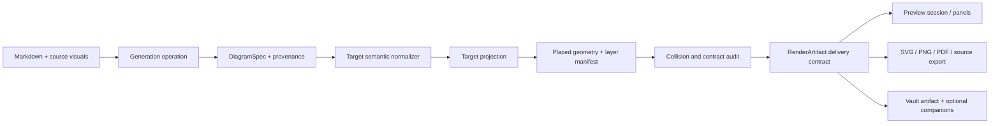

# Diagram Platform Robustness And Settings Integrity Plan

## Status And Scope

This is the follow-up plan to the implemented Drawnix knowledge-map delivery plan. It covers the next hardening slice for Drawnix structure, Mermaid source visuals, preview/export fidelity, settings discovery, and build-to-Vault verification. It does not reopen the rejected full Drawnix host embedding or add a second architecture-canvas algorithm.

The current implementation is useful, but its guarantees are spread across `DiagramSpec`, Drawnix projection code, transient preview panels, serialized metadata, and UI command code. The goal of this plan is to make those guarantees explicit and mechanically testable.

## Implementation Status

The first hardening slice is implemented; its latest repository, Vault, and host verification is recorded below:

- Settings discovery uses an explicit catalog shape, stable IDs, field-aware scoring, and an independent listbox result panel with direct navigation.
- SVG, PNG, and PDF preview exports share the folder-selection boundary for single-panel and multi-panel flows; the default remains the source folder and custom paths are Vault-relative.
- Drawnix source coverage preserves deep source and unmatched model branches. It records deterministic node merge, edge remap, and edge drop diagnostics; LLM-supplied diagnostics are cleared before enrichment and only renderer-owned diagnostics reach the artifact.
- Drawnix relation label dimensions are supplied to the route planner before lane selection. Repeated relations use obstacle-envelope lanes with label clearance, and the native normalized text position is copied back into the shared label rectangle consumed by SVG and JSON. Native position candidates are derived from segment capacity, so short horizontal lanes remain addressable even when long detours dominate the normalized path length.
- Drawnix source-visual metadata now has an explicit v1 guard at the exporter/host boundary. Numeric v1 and legacy string `"1"` readers are accepted; unknown versions and duplicate visual IDs are ignored or rejected deterministically.
- Relation-label layout fails closed when no collision-free native position exists; it does not silently emit an artifact whose SVG and native text geometry disagree. The routing boundary reserves label-safe canvas insets without over-inflating every node obstacle, preserving sparse-grid routes for dense forests.
- The build-to-Vault boundary now has a fail-closed verifier (`scripts/verify-vault-bundle.js`) that compares SHA-256 hashes for `main.js`, `styles.css`, and `manifest.json`, and validates the deployed manifest version before a reload is treated as evidence.

Phases 0-6 are implemented and have fresh repository, loaded-Vault, and documentation evidence. The release tag `1.9.5` already exists; this plan records the hardening closure for the current mainline commit and does not create a second release.

## Executive Decision

Keep the existing host-neutral pipeline:

```text
source Markdown
  -> generation operation
  -> DiagramSpec
  -> target-specific projection
  -> placed projection
  -> RenderArtifact
  -> preview / export / Vault save
```

Three contracts become architectural boundaries:

1. **Semantic contract**: `DiagramSpec` retains source meaning, hierarchy, provenance, and cross-branch relationships. A forest is valid at this layer; “one document root” is a source-backed presentation policy, not a global validator rule.
2. **Geometry contract**: a target projection owns node bounds, route points, label rectangles, layer order, canvas bounds, and diagnostics. SVG and native Drawnix serialization consume the same placed projection.
3. **Delivery contract**: `RenderArtifact` carries the primary artifact, ordered preview panels, source-visual manifest, inline payloads, optional companions, and export capabilities. Preview and export do not reconstruct meaning by scraping rendered DOM.

Drawnix remains a target-specific exporter. The plugin does not embed the Drawnix application, Plait runtime, React shell, or browser persistence layer. Mermaid remains a source visual and a separate renderer; it is not used as an intermediate representation for the native Drawnix tree.

## Root-Cause Audit

| Area | Evidence in current code | Failure mode | Required guardrail |
|---|---|---|---|
| Structure | `mergeDrawnixSourceCoverage()` builds a synthetic document root, merges by normalized label, caps depth at three, and uses `Additional concepts` for unmatched model roots | Meaningful model branches can be compressed or moved without a provenance record; label equality is not identity | Preserve stable IDs and an explicit source/model mapping. Emit compression diagnostics instead of silently dropping structure. Keep forest-valid validation separate from the document-rooted policy. |
| Cross-root routing | `drawnixCrossRootRouter.ts` avoids unrelated root regions and has bounded fallbacks | A route can be geometrically valid for the SVG but still be reordered or obscured by the native Drawnix reader; route warnings are not a complete quality result | Validate route segments, inflated node obstacles, root-region crossings, and native label rectangles as one post-layout invariant. Fail closed when the invariant cannot be satisfied. |
| Layering | `drawnixMindMapSvgRenderer.ts` paints paths, nodes, labels, source panels, then the header; the exporter serializes roots followed by arrow lines | SVG paint order and upstream Drawnix z-order are not the same contract; arrow text can be hidden by a native node even when the SVG looks correct | Introduce an explicit layer manifest and a cross-format collision audit. Treat relation labels as first-class placed geometry, not only `arrow-line.texts`. |
| Source visuals | Mermaid previews are inline by default, while `previewPanels` are transient and legacy companion loading is in the host adapter | Reopening an old `.drawnix` can lose panels when metadata, companion paths, or the runtime renderer differ | Version the source-visual metadata schema. Resolve embedded data first, legacy companions second, and rebuildable source text third. Always produce a visible panel or a diagnostic. |
| Export | Multi-panel export opens a folder selector, but single-panel export still uses a direct source-folder path. SVG, PNG, and PDF each duplicate path and write logic | User intent is inconsistent across formats and partial failures are harder to report | Use one export-selection boundary with separate `exportAllPanels` and `exportPanel` operations. All image formats use the same default/custom Vault-folder chooser and atomic write policy. |
| PDF fidelity | `buildPdfFromSvg()` correctly starts from sanitized SVG, but font registration and SVG-to-PDF conversion remain environment-sensitive | A PDF can reflow text or change line breaks even when the SVG is correct | Add an SVG geometry fingerprint and PDF text/layout evidence. Never regenerate Mermaid or measure labels again during PDF export. |
| Settings discovery | `settingSearch.ts` searches `name`, `description`, `categoryId`, and aliases with ordered fuzzy matching; `NotemdSettingTab` hides native `<option>` entries | Internal category IDs create false matches such as unrelated stable-API settings; hidden options are unreliable in Electron selects; there is no setting-level result list | Search only user-facing fields with weighted matching, expose scored setting results, and navigate directly to a concrete setting element. |
| Live delivery | The Vault can load a stale ignored `main.js` even when repository source and a newly built bundle are current | “Version 1.9.5” can be true while a feature is absent from the loaded code | Add a build/deploy evidence step that compares bundle hash, manifest version, and CLI-observed runtime capabilities before claiming a reload. |

## Target Architecture



### Semantic Plane

`DiagramSpec` remains the only LLM-facing diagram schema. The parser validates IDs, references, cycles, intent, and target requirements. Drawnix-specific source coverage is a deterministic enrichment step, not an LLM-generated Drawnix JSON blob.

The enrichment step must retain:

- the source heading or file-derived identity;
- the model node identity and its mapped source node, when a match exists;
- the reason a node was merged, compressed, or placed under a fallback branch;
- edge remapping evidence when a depth cap changes an endpoint.

For source-backed architecture notes, the default presentation policy is a document node derived from the filename or H1, followed by module/section branches. The raw semantic validator still accepts multiple roots. This resolves the apparent conflict between “multiple roots are valid” and “the user needs one readable article map” without making the validator lie about the domain.

### Projection And Geometry Plane

Introduce a target projection result with these conceptual fields (names may be adapted to local conventions):

```text
PlacedProjection
  nodes: placed node bounds and source identity
  hierarchyRoutes: primary tree routes
  relationRoutes: cross-branch routes and warnings
  relationLabels: collision-free rectangles and native positions
  layers: explicit paint/serialization order
  bounds: finite canvas rectangle
  diagnostics: compression, route, and overflow evidence
```

Drawnix owns this projection. The generic three-column `SemanticFigureModel` is never an intermediate for `drawnixMindmap`.

Layout is deterministic and two-pass:

1. Place each root tree and pack root regions with a bounded row width.
2. Route cross-relations around inflated node/root obstacles, place labels against the route, then validate the complete geometry.

The layer manifest is explicit:

```text
background -> hierarchy routes -> cross-relations -> node shells
           -> relation labels -> source visual panels -> header/accessibility metadata
```

The exporter serializes the same order where the upstream format permits it and stores a namespaced layer hint where it does not. The SVG renderer and Drawnix validator share the same collision predicates. A warning is not a successful layout when a label intersects a node; that result must be rejected or routed through an explicit fallback target.

### Delivery Plane

Treat source visuals as a versioned `SourceVisualBundle` inside the delivery contract:

```text
manifest entry
  -> source identity, hash, line range, status
  -> inline source / inline SVG (default for Drawnix)
  -> optional companion descriptors (explicit user opt-in)
  -> preview panel descriptor
```

Read order is embedded payload, legacy companion path, then source-text rebuild. The read path must never require `.assets` for a preview. The write path must never create `.assets` unless the user enabled complete Mermaid companion output.

`previewPanels` should be treated as a normalized presentation of the same bundle, not a second source of truth. Rehydration from a saved `.drawnix` must return the same ordered panel IDs as live generation, including the primary Drawnix panel and every Mermaid block.

## Settings And Runtime Integrity

### Settings Search

Keep settings rendering and discovery separate:

- the settings tab declares an explicit stable setting ID, user-facing name, description, aliases, category, and element reference;
- the search index excludes internal category IDs and implementation paths;
- scoring is field-aware: exact/prefix name matches outrank description and alias matches, and fuzzy matching is only a low-confidence fallback;
- the result model returns the stable setting ID (`id`), category, matched fields, and score;
- the UI uses an explicit listbox/popover for results. Selecting a result focuses and scrolls to the setting, then closes the list. Escape, blur, and an empty query have deterministic behavior;
- the category dropdown remains a category navigator, not the search-result renderer.

This is deliberately a setting-level navigation model. Hiding `<option>` elements cannot provide reliable result semantics in Electron.

#### Search Catalog Contract

The catalog is a declared, user-facing index rather than a projection of rendered DOM or translation paths. Each setting declaration supplies the following stable shape:

```ts
interface SettingCatalogEntry {
    id: string;
    categoryId: string;
    categoryLabel: string;
    name: string;
    description: string;
    aliases: string[];
    elementId: string;
}

interface SettingSearchMatch extends SettingCatalogEntry {
    score: number;
    matchedFields: Array<'name' | 'description' | 'alias' | 'category'>;
}
```

`elementId` is the DOM anchor for one concrete `.setting-item`; it is not derived from translated copy. A declaration must use an explicit ID when the setting is part of a stable product surface, for example `settings.experimentalDiagramPipeline.drawnixCompanions`. The i18n-path resolver remains a read-time migration fallback for older declarations, never the source of truth for new IDs.

The matcher follows a field-aware, deterministic contract:

1. Normalize each field and query with Unicode NFKC, locale-independent lower casing, and token boundaries. Chinese text uses normalized substring matching.
2. Every query token must match at least one user-visible field (`name`, `description`, an alias, or `categoryLabel`). Matching across the concatenation of different fields is invalid.
3. Rank exact name matches first, then name prefix and name substring, alias matches, description matches, and category-label matches. The implementation may use numeric weights, but the ordering must be stable and documented in tests.
4. English/Latin fuzzy matching is a bounded fallback within one field and one word only. It must not run against a concatenated catalog string, must not apply to category IDs or implementation paths, and must not fuzzy-match short CJK tokens.
5. Results are returned as `SettingSearchMatch` values with all matched fields and a deterministic tie-breaker: catalog declaration order, then stable ID. An empty query returns no search panel, while navigation state may still treat all catalog entries as visible.

For the query `Mermaid`, expected high-signal results include `同时完整输出 Mermaid 图`, `启用 Spec-first Mermaid 管线`, `首选生成格式`, `任务：Summarise as Mermaid diagram`, and `批量修复 Mermaid` when those declarations are present. An unrelated `稳定 API 调用` entry must not be returned merely because an internal category ID or implementation path contains a fuzzy character sequence.

#### Search Result Interaction Contract

The settings tab owns a dedicated result panel, independent of the category selector:

- the input exposes `aria-controls` and `aria-expanded`; the result container has `role="listbox"`, and each result has `role="option"` plus a stable setting ID;
- every result renders the setting name, a bounded description summary, and the visible category label;
- clicking a result, or pressing Enter on the active result, closes the panel, scrolls the target `.setting-item` into view, focuses its control when focusable, and applies a temporary target highlight;
- ArrowUp/ArrowDown moves the active result and updates `aria-activedescendant`; Escape, blur, outside click, and successful navigation close the panel;
- an empty query hides the panel completely; a non-empty query with no matches shows an explicit empty state rather than a filtered category selector;
- the category `<select>` continues to perform only coarse category navigation and never owns search result semantics.
- the favorites control preserves the existing favorites-only filtering behavior while exposing an independent `role="list"` panel; each favorite entry has a stable setting ID, direct navigation, an accessible remove action, and an explicit empty state.

This boundary prevents a browser/Electron-specific `<select>` implementation detail from becoming the settings search API. It also makes the result list testable without relying on hidden native options.

#### Collapsible Discovery Toolbar Contract (2026-08-09)

The search bar is a toolbar, not a permanently occupying panel. Its collapse behavior is explicit and backward-compatible:

- the toolbar is expanded on first render so existing settings workflows keep their current entry point;
- an icon-only `type="button"` with a stable ID, `aria-controls`, `aria-expanded`, localized `aria-label`, and a matching tooltip owns the collapse state;
- the search input, favorites filter, category navigator, result count, and listbox are grouped under `#notemd-settings-discovery-controls`;
- collapsing sets the controlled element's `hidden` state, applies `.is-collapsed` to the toolbar, and closes the result listbox without clearing the current query;
- expanding restores the controls and re-applies the existing query/filter state, so a partially composed search is not lost;
- the icon and accessible label change with the state (`chevron-up`/collapse versus `chevron-down`/expand), and the control remains keyboard-operable with a minimum 44px hit target;
- in the collapsed state the toolbar becomes a zero-height sticky anchor in the settings content column; the 44x44px toggle is absolutely positioned at that anchor's top-right, while the header is transparent and `pointer-events: none`;
- CSS hides the controlled region through both the semantic `hidden` attribute and the collapsed visual state while preserving stable desktop and mobile geometry. Safe-area insets are included for narrow/mobile hosts.

The UI regression contract must assert default-expanded state, `aria-controls` wiring, collapse/expand transitions, result-panel closure, query preservation, and restored matches. A loaded Obsidian CLI probe must exercise the same transitions after a real disable/enable reload; source-only assertions are insufficient evidence that users can reclaim the toolbar space.

#### Search Result Layout Regression Hardening (2026-08-09)

The result card layout is part of the interaction contract, not incidental styling. The previous implicit two-column grid placed the long, non-wrapping description in the `auto` column. In Chromium/Electron that column consumed the row's intrinsic width, collapsed the name column to zero, and produced the observed one-character-per-line setting name plus a misleading oversized focus region.

The robust contract is now explicit:

- the desktop card uses named grid areas (`name category` / `description category`) and bounded category width;
- name and description own their areas and set `min-width: 0`, so long localized copy cannot change the grid's intrinsic sizing;
- every clickable result card has a stable `min-height: 44px` target, including a name-only result whose description is empty;
- the mobile breakpoint switches to one column (`name` / `description` / `category`) and left-aligns the category;
- `providerSettingsStyles.test.ts` asserts the named areas and ownership selectors, and the Obsidian CLI probe must verify a non-zero name rectangle after a `Mermaid` query.

This keeps the declared catalog/search architecture independent from browser-specific implicit placement and prevents a visual regression from invalidating direct setting navigation.

#### Settings Search Test Contract

`src/tests/settingCatalog.test.ts` must cover the pure catalog and matcher contract: `Mermaid` excludes stable-API noise; exact name and description matches both work; cross-field concatenation cannot create a false positive; weighted results have stable ordering and complete `matchedFields`; duplicate IDs fail; and an explicit stable ID remains unchanged when locale copy or category labels change. The same file should retain locale-alias and favorite-retention coverage.

The settings UI test surface must cover query visibility, listbox semantics, keyboard selection, direct scroll/focus/highlight navigation, favorites-panel rendering/removal/empty state, and closing on Escape, blur, outside click, successful selection, and empty query. These tests must assert the concrete `elementId`, not only visible text. The Obsidian CLI smoke path must reload the plugin, open the settings tab, query `Mermaid`, assert that the result list contains `同时完整输出 Mermaid 图`, assert that it does not contain `稳定 API 调用`, and verify that a favorited setting appears in the dedicated list.

### PPI And Companion Settings

`diagramPreviewExportPpi` keeps the default at 300 PPI and accepts integer values from 72 through 600. It affects raster PNG generation only; SVG and vector PDF retain SVG geometry. `drawnixExportMermaidCompanions` defaults to false and controls only external companion emission, never preview availability.

The settings tests must assert both registration and live DOM visibility. A runtime smoke test must inspect the loaded setting tab, not only the TypeScript source.

### Build-To-Vault Evidence

The release/development verification path must record:

1. repository commit and built bundle hash;
2. Vault `main.js` hash and manifest version;
3. plugin enabled state after reload;
4. capability probes for PPI, companion output, multi-panel preview, and Drawnix metadata;
5. `dev:errors` result.

This is a verification boundary, not a new public CLI API. Official `obsidian` CLI remains the preferred host evidence surface; a failing optional wrapper must be reported rather than silently substituted.

Maintainers can verify a deployed Vault bundle with:

```bash
npm run verify:vault-bundle -- --vault E:\\1Knowledge
```

The command fails closed on missing files, invalid manifests, version drift, or any hash mismatch. `--plugin-dir`, `--project-root`, and `--version` are available for CI and non-default layouts.

## Delivery Phases

### Phase 0: Freeze Evidence And Contracts

**Deliverables**

- Capture architecture-note fixtures for one rooted map, a valid forest, multiple Mermaid blocks, cross-root relations, long multilingual labels, and a deliberately over-constrained route.
- Define the versioned source-visual metadata read contract and the layer/collision audit vocabulary.
- Record current CLI and bundle-hash evidence as the baseline.

**Gate**

Existing artifacts remain readable; no renderer or standard Mermaid behavior changes.

### Phase 1: Semantic Structure Integrity

**Deliverables**

- Separate forest validation from source-backed document-root presentation.
- Replace label-only merge decisions with stable identity plus explicit provenance/remap diagnostics.
- Preserve all meaningful model branches without a numeric depth budget. Surface a deterministic geometry diagnostic only when a placed projection cannot satisfy its safety invariants.
- Keep explicit Drawnix requests strict; best-fit inference may fall back only with a structured reason.

**Gate**

The architecture fixture has one document root, visible module branches, complete Mermaid source references, and no silent edge loss.

### Phase 2: Geometry, Layering, And Collision Audit

**Deliverables**

- Add the placed-projection/layer contract.
- Validate route segments, root-region avoidance, node clearance, relation-label clearance, finite bounds, and native label positions.
- Make SVG and native serialization consume one geometry snapshot.
- Measure each relation label before routing and pass its size into the router. Repeated same-root relations must use deterministic obstacle-envelope lanes whose center-to-center spacing includes the native label height and clearance; the canvas reserve is derived from the actual label metrics rather than a fixed relation count cap.
- Select the native normalized text position against the same node/header/label obstacles, then write its exact rectangle back to `labelLayout`. If no position satisfies the invariant, fail closed with a diagnostic instead of exporting divergent SVG and Drawnix geometry.
- Add adversarial fixtures for dense roots, long labels, same-root edges, cross-root edges, and source panels.

**Gate**

No label rectangle intersects an inflated node rectangle; no cross-root route crosses an unrelated root; SVG and Drawnix coordinates match exactly.

### Phase 3: Source-Visual Rehydration And Preview

**Deliverables**

- Version and parse embedded source-visual metadata with backward-compatible v1 readers.
- Rehydrate every Mermaid panel from embedded SVG/source, legacy companions, or source-text rebuild.
- Keep default generation free of `.assets` while retaining fully functional previews.
- Ensure scrolling is owned by the preview scroll region and not by an oversized fixed iframe.

**Gate**

Opening a generated or legacy `.drawnix` yields one primary panel plus all Mermaid panels in stable order, with no error when `.assets` is absent.

### Phase 4: Unified Image Export

**Deliverables**

- Split export operations into explicit `exportAllPanels` and `exportPanel` paths.
- Use the same folder selector for SVG, PNG, and PDF: source folder by default, validated custom Vault-relative folder as an option, cancel as a no-op.
- Generate each panel from its own SVG artifact; never compose a multi-panel PDF when the user selected an individual panel.
- Keep PNG PPI metadata and raster scale deterministic. Keep PDF conversion on the exact SVG source with embedded font registration and no second layout pass.
- Record per-panel paths and partial failures in history.

**Gate**

For every panel, exported SVG and PDF have the same viewBox, text line count, and label geometry; PNG carries the selected PPI metadata.

### Phase 5: Settings Discovery And Live Runtime Verification

**Deliverables**

- Replace path-derived/DOM-scraped search entries with explicit `SettingCatalogEntry` declarations and stable `elementId` anchors. Keep a migration-only resolver for legacy localized IDs.
- Implement `SettingSearchMatch` scoring with visible-field token matching, bounded same-field English fuzzy fallback, `matchedFields`, deterministic ties, and no `categoryId` search.
- Build the dedicated listbox result panel with direct scroll/focus/highlight navigation, keyboard selection, collapse, Escape, blur, outside-click, empty-query, and no-result states. Keep the category selector as coarse navigation only.
- Expose an independent favorites settings panel with stable IDs, direct navigation, keyboard activation, an accessible remove action, persistence through `favoriteSettingIds`, and a localized empty state. Keep the existing favorites-only filter behavior compatible.
- Make the whole discovery toolbar collapsible with an explicit button and controlled region; preserve the query while collapsed and restore results on expansion.
- Add pure matcher and stable-ID regression cases in `src/tests/settingCatalog.test.ts`, plus UI/DOM and Obsidian CLI checks for the result panel contract.
- Make result-card geometry explicit and responsive; add a CSS regression test for named grid areas and a runtime geometry assertion so long descriptions cannot collapse the setting name.
- Add a deployment verification script or documented maintainer command that compares source build and Vault bundle hashes.
- Exercise PPI and companion controls through the loaded Obsidian setting tab.

**Gate**

A fresh reload exposes `图形图片导出 PPI` at 300 and the companion toggle; a `Mermaid` query returns the expected Mermaid-related settings without `稳定 API 调用`; listbox navigation resolves the declared `elementId`; the favorites button opens an independent list that supports direct navigation/removal and a localized empty state; and the CLI capability probe and visible settings DOM agree.

### Phase 6: Documentation And Release Closure (Complete)

**Deliverables**

- Update architecture docs, English/Chinese manuals, and the docs site with the actual contract and limitations.
- Publish a fixture-backed acceptance record for `architecture.zh-CN.md`.
- Re-run the complete repository and Obsidian CLI gates before any version/tag operation.

**Gate**

Documentation does not claim a full Drawnix editor, universal graph support, or asset-free external handoff when those are not true.

**Closure evidence**

- Architecture and manual links are updated in both languages, and the docs site build passes.
- Repository build, full Jest, UI/render audits, and `git diff --check` pass.
- The loaded Vault bundle matches the repository bundle hash and the official Obsidian capability probes pass after an eval-based disable/enable reload.

## Verification Record (2026-08-09)

- TypeScript check: passed (`tsc -noEmit -skipLibCheck`).
- Production bundle: passed (`npm run build`).
- Jest: 243 suites passed, 2151 tests passed, 1 skipped (2152 total); the settings behavior suite includes the interactive listbox/navigation and favorite-panel regression coverage, and the Vault verifier has fail-closed missing/version/hash cases.
- UI/render audits: `audit:i18n-ui` and `audit:render-host` passed.
- Documentation site: VitePress build passed.
- Official `obsidian help`: available. `obsidian-cli help`: unavailable because the optional `obsidian-cli` executable is not installed.
- The official `plugin:reload` command returned a non-zero result in this desktop session. Reload was completed through the official CLI `eval` surface by disabling and enabling `notemd`, then waiting for the plugin to reinitialize.
- `npm run verify:vault-bundle -- --vault E:\\1Knowledge` passed after deployment to `E:\\1Knowledge\\.obsidian\\plugins\\notemd`: `main.js` SHA-256 `b1adec85e50a22c2831ef73abd3b24b0fc3f4f9aeb32ee4f7ec964afee639041`, `styles.css` SHA-256 `048539f23789aff959b8328e849fe7ab319706b6c4c61904db1b78aee1c59753`, and `manifest.json` SHA-256 `fc88f5d7d90561ae73c324413ef58b937086e1901c7c7faf45686b12320a02a` all match; manifest version is `1.9.5`.
- Loaded setting-tab probes after the eval disable/enable reload: PPI control exists with value `300`; companion control exists and is `false`; search result container has `role=listbox`; query `Mermaid` returns 13 visible-field matches and excludes `稳定 API 调用`; stable element IDs resolve for every result and both controls.
- The same CLI probe reports `grid-template-columns: 422.667px 210px`, named areas `"name category" "description category"`, `min-height: 44px`, a first-card size of `664x44px`, and a non-zero name rectangle (`422.667px` wide) for every result. Six rows are visible in the bounded 360px panel; all 13 matches remain reachable by scrolling. Escape and empty-query probes hide the panel, and pointer selection closes it while applying the target highlight.
- `obsidian dev:errors` reports `No errors captured`. `dev:dom` and the optional `obsidian-cli` wrapper are unavailable in this session, so equivalent DOM assertions were executed through official `eval` against `app.setting.contentEl`.
- The official `dev:screenshot` command remains unavailable in this Windows desktop session; the runtime geometry and interaction probes above are the authoritative regression evidence for this CSS defect.
- Fresh `frontend-law-auditor` strict audit: `100.00/100`, zero fast-gate failures, zero principle failures, zero unknown checks (threshold `85`).
- Architecture note CLI smoke: `architecture.zh-CN.md` is present and the diagram/preview commands are registered and executable. Existing history contains both Mermaid and Drawnix preview entries; no new error was captured during the command probe.

## Verification Matrix

| Layer | Required evidence |
|---|---|
| Semantic | parser/normalizer tests for forest validity, rooted presentation, stable IDs, deep source/model preservation, and edge remap diagnostics |
| Projection | deterministic coordinates, finite bounds, branch order, one placement per node, and no node overlap |
| Routing | segment/obstacle checks, root-region policy, relation-label rectangles, native label positions, and fallback diagnostics |
| Serialization | Drawnix fixture contract, explicit layer order, metadata schema version, and backward reader tests |
| Preview | live-generated panels and rehydrated panels have identical ordered IDs and non-empty SVGs |
| Export | folder selection, single/all panel paths, exact SVG-to-PDF geometry, PPI metadata, and partial failure reporting |
| Settings | explicit catalog fields, stable IDs across locales, visible-field weighted search, bounded same-field fuzzy fallback, matched-field evidence, deterministic ordering, listbox semantics, direct navigation, collapse/Escape/blur/outside-click, no-result state, favorites list/navigation/removal/empty state, PPI range/default, and companion default |
| Host | official `obsidian` CLI reload/status/eval, loaded setting DOM, capability probes, and zero captured errors |
| Repository | `npm run build`, `npm test -- --runInBand`, `npm run audit:i18n-ui`, `npm run audit:render-host`, and `git diff --check` |

## Compatibility And Migration

- Keep reading Drawnix metadata version 1 and legacy companion paths. Do not rewrite or delete user artifacts during preview.
- New writes default to inline Mermaid source/SVG and no `.assets`; the opt-in companion setting is additive.
- Keep `diagramPreviewExportPpi` default 300 and sanitize persisted values into 72-600. Existing missing values receive the default during settings load.
- Treat explicit setting IDs as persistent data. When an ID changes, provide a one-time alias/migration map; never silently regenerate it from translated name/description text. Category labels and locale copy may change without changing the ID or `elementId` contract.
- Keep the search index limited to declared user-visible fields. Existing saved favorites and category filters are migrated by stable ID; stale IDs are dropped, not matched heuristically against new copy.
- Preserve the standard Mermaid command and renderer path. Drawnix validation and fallback rules must not change ordinary Mermaid output.
- If an explicitly requested Drawnix projection cannot satisfy geometry or semantic invariants, fail with a diagnostic rather than writing a misleading `.drawnix` file. Best-fit planning may choose a documented fallback target.
- Avoid a generic `layoutMode`, `exportMode`, or `previewMode` flag that hides unrelated algorithms. Use separate target-owned operations and explicit policies.

## Risks And Rejected Alternatives

- **Full Drawnix embedding** is rejected: it expands the bundle, couples lifecycle and storage to an external editor, and does not solve source provenance or export contracts.
- **Mermaid round-trip as the Drawnix mainline** is rejected: it discards structured node identity and makes quality depend on two parsers.
- **Exactly one root in `DiagramSpec`** is rejected: forests are valid domain data. One document root belongs in the source-backed presentation policy.
- **Label-only merging** is rejected: equal labels are not proof of identity, especially across translated or repeated sections.
- **Native importer tolerance as quality evidence** is rejected: permissive import does not prove readable geometry or stable editing behavior.
- **PDF-specific re-layout** is rejected: it is the direct cause of SVG/PDF text divergence. PDF must consume the already laid-out SVG.
- **Filtered native `<select>` as search UI** is rejected: hidden/disabled options do not expose setting-level result semantics, keyboard state, or stable direct navigation in Electron.
- **Concatenated full-text fuzzy search** is rejected: it creates false positives across field boundaries and leaks internal category/implementation identifiers into user-facing discovery.

## Verification Addendum (2026-08-09, collapsible toolbar)

- Latest deployed bundle verification: `main.js` SHA-256 `63a0b94fb1950bf07f0f28dc7ac00ce2363a7488bb55116ce5568ea914e6d82e`, `styles.css` SHA-256 `cd952e88f02106cc1eb3766cdf14d8f6e19e5d2875be50683324957fc753d5a6`, and `manifest.json` SHA-256 `fc88f5d7d90561ae73c324413efc58b937086e1901c7c7faf45686b12320a02a`; Vault verifier passed with manifest `1.9.5`.
- Official `obsidian` eval after disable/enable reload confirmed default `aria-expanded="true"`, `aria-controls="notemd-settings-discovery-controls"`, and visible controls. After a `Mermaid` query it rendered 13 result options and excluded the unrelated stable-API entry.
- The same live DOM probe confirmed collapse sets `aria-expanded="false"`, `hidden=true` on the controlled region, `.is-collapsed` on the toolbar, and `hidden=true` on the result panel without changing the query. Expansion restores the controls, query, and all 13 results.
- The live geometry probe confirmed a collapsed zero-height `position: sticky` header in the settings content column, with an absolutely positioned `44x44px` interactive top-right button and a transparent/no-pointer-event shell. The first setting moved up by the former discovery-row height (`145.958px`), proving the collapsed toolbar no longer reserves a full row or escapes toward the window controls.
- `obsidian dev:errors` returned `No errors captured`; `obsidian-cli` and `dev:screenshot` remain unavailable in this Windows desktop session.

## Verification Addendum (2026-08-09, favorite settings panel)

- The current repository build was deployed to `E:\\1Knowledge\\.obsidian\\plugins\\notemd` and passed `npm run verify:vault-bundle -- --vault E:\\1Knowledge --version 1.9.5`: `main.js` SHA-256 `5265e00ec2f543676aa0ba28b61e9e0ddea88c28257b23a1ea52c7bebe82e2d0`, `styles.css` SHA-256 `69731a9ead34b285ee8e882ab797f4f7aefab775a51e527601e3aab9ec7a7fb8`, and `manifest.json` SHA-256 `fc88f5d7d90561ae73c324413ef58b937086e1901c7c7faf45686b12320a02a`; manifest version is `1.9.5`.
- After the official `obsidian` eval disable/enable reload, the live setting tab accepted a star click and persisted `favoriteSettingIds=["settings.settingsReset.heading"]`. Clicking `★ Favorites` exposed `#notemd-settings-favorites-panel` with `role="list"`, `aria-expanded="true"`, one `role="listitem"`, and the stable setting ID.
- Activating that favorite entry closed the panel and applied `notemd-setting-search-target` to the original setting. Reopening the panel and using its remove button cleared the persisted favorite while keeping the panel open; the panel then rendered the localized empty state `当前还没有收藏设置。`.
- `obsidian dev:errors` returned `No errors captured`. The optional `obsidian-cli` executable, `dev:dom`, and `dev:screenshot` remain unavailable; the assertions above were executed through the official `obsidian eval` surface.

## Definition Of Done

The hardening phase is complete when the architecture fixture produces a readable document-rooted Drawnix tree with complete source-visual coverage, collision-free native and SVG geometry, rehydratable Mermaid panels without `.assets`, unified per-panel/all-panel image export with a 300 PPI default, and a settings UI whose explicit catalog, weighted search results, direct navigation, and loaded runtime capabilities agree. All gates in the verification matrix pass, and the English/Chinese documentation states the same boundaries.
