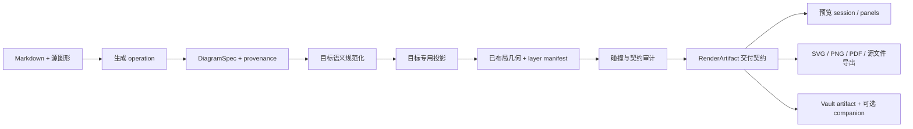

# 图形平台稳健性与设置真值推进方案

## 状态与范围

这是已落地 Drawnix 知识导图方案的后续加固计划，覆盖 Drawnix 结构、Mermaid 源图形、预览/导出一致性、设置发现，以及构建产物到 Vault 的验证边界。不重新打开被拒绝的完整 Drawnix 宿主嵌入，也不新增第二套架构画布算法。

当前实现已经可用，但保证分散在 `DiagramSpec`、Drawnix 投影、临时预览面板、序列化 metadata 与命令 UI 中。本方案的目标是把这些保证变成显式且可以机械验证的契约。

## 实现状态

第一阶段加固已经实现；最新仓库、Vault 与宿主验证记录如下：

- 设置发现使用显式目录结构、稳定 ID、字段感知评分，以及支持直接导航的独立 listbox 结果面板。
- SVG、PNG、PDF 预览导出在单图和多图流程中共用目录选择边界；默认仍为源文件夹，自定义路径必须是 Vault-relative 路径。
- Drawnix source coverage 现在记录确定性的节点合并、深度压缩、edge remap 与 edge drop 诊断；LLM 返回的诊断会在 enrichment 前清除，只有 renderer 自己产生的诊断会进入 artifact。
- Drawnix 关系标签尺寸在路由选 lane 前传入路由器。重复关系依据障碍包络和标签间距分配 lane，原生归一化文本位置再回写到 SVG 与 JSON 共用的最终标签矩形。原生位置候选依据 segment 可容纳空间生成，即使长绕行线段主导 normalized path length，短水平 lane 仍可被准确寻址。
- Drawnix source-visual metadata 在 exporter/host 边界增加了显式 v1 guard。读取器接受数字 v1 和旧的字符串 `"1"`，未知版本与重复 visual ID 会被确定性地忽略或拒绝。
- 找不到无碰撞的原生位置时 fail closed，不静默生成 SVG 与原生文本几何不一致的 artifact。路由边界按标签安全 inset 预留画布，但不再把所有节点障碍过度膨胀，从而保留稠密 forest 的稀疏网格合法路径。
- 构建产物到 Vault 的边界现在有 fail-closed 校验器（`scripts/verify-vault-bundle.js`）：逐项比较 `main.js`、`styles.css`、`manifest.json` 的 SHA-256，并在把重载视为证据前校验部署 manifest 版本。

Phase 0-6 已实现，并取得新鲜仓库、已加载 Vault 与文档证据。发布 tag `1.9.5` 已存在；本方案记录当前 mainline commit 的加固收口，不重复创建第二个发布。

## 总体决策

保留现有的宿主无关管线：

```text
Markdown 源文档
  -> 生成 operation
  -> DiagramSpec
  -> 目标专用投影
  -> 已布局投影
  -> RenderArtifact
  -> 预览 / 导出 / Vault 保存
```

将三个契约设为架构边界：

1. **语义契约**：`DiagramSpec` 保留源文档含义、层级、来源和跨分支关系。forest 在这一层合法；“一个文档 root”是源文档展示策略，不是全局校验规则。
2. **几何契约**：目标投影负责节点边界、路由点、标签矩形、层级顺序、画布边界与诊断。SVG 与原生 Drawnix 序列化消费同一份已布局投影。
3. **交付契约**：`RenderArtifact` 携带主 artifact、有序预览面板、源图形 manifest、内嵌数据、可选 companion 与导出能力。预览/导出不通过抓取渲染后的 DOM 重新猜测语义。

Drawnix 仍然是目标专用 exporter。插件不嵌入 Drawnix 应用、Plait runtime、React 壳或浏览器持久化层。Mermaid 是源图形和独立 renderer，不作为原生 Drawnix 树的中间表示。

## 根因审计

| 领域 | 当前代码证据 | 失败方式 | 必须增加的防线 |
|---|---|---|---|
| 结构 | `mergeDrawnixSourceCoverage()` 创建 synthetic document root，按规范化标签合并，深度限制为 3，并将未匹配模型 root 放入 `Additional concepts` | 有意义的模型分支可能被压缩或移动，且没有 provenance；标签相同不等于身份相同 | 保留稳定 ID 与显式 source/model 映射。压缩必须产生诊断，不能静默丢结构。forest 校验与 document-root 展示策略分离。 |
| 跨 root 路由 | `drawnixCrossRootRouter.ts` 会避开无关 root 区域，并提供有界 fallback | SVG 中几何合法的线，在原生 Drawnix 读取时仍可能被重排或遮挡；route warning 不是完整质量结果 | 将线段、膨胀后的节点障碍、root 区域穿越和原生标签矩形作为一个 post-layout 不变量校验。无法满足时 fail closed。 |
| 层级 | `drawnixMindMapSvgRenderer.ts` 按路径、节点、标签、源面板、header 绘制；exporter 则先序列化 root 再序列化 arrow-line | SVG paint order 与上游 Drawnix z-order 不是同一契约；arrow text 可能被原生节点遮挡，即使 SVG 看起来正常 | 引入显式 layer manifest 与跨格式碰撞审计。关系标签必须是已布局的一等几何，不只存在于 `arrow-line.texts`。 |
| 源图形 | Mermaid 预览默认内嵌，但 `previewPanels` 是临时数据，旧 companion 加载在 host adapter 中完成 | 重新打开旧 `.drawnix` 时，如果 metadata、companion 路径或 runtime 有差异，面板可能丢失 | 为 source-visual metadata 版本化。读取顺序为内嵌、旧 companion、源文本重建。始终产生可见面板或诊断。 |
| 导出 | 多面板导出会打开目录选择器，但单面板仍直接写入源目录。SVG、PNG、PDF 各自复制路径与写入逻辑 | 不同格式的用户意图不一致，部分失败也难以汇总 | 建立统一导出选择边界，分别提供 `exportAllPanels` 与 `exportPanel`。所有图片格式使用相同的默认/自定义 Vault 目录选择和原子写入策略。 |
| PDF 质量 | `buildPdfFromSvg()` 已从清理后的 SVG 开始，但字体注册和 SVG-to-PDF 仍受环境影响 | SVG 正确时 PDF 仍可能重排文字或改变换行 | 增加 SVG geometry fingerprint 与 PDF 文本/布局证据。PDF 导出绝不重新生成 Mermaid 或重新测量标签。 |
| 设置发现 | `settingSearch.ts` 搜索 `name`、`description`、`categoryId` 与 aliases，并使用有序模糊匹配；`NotemdSettingTab` 隐藏原生 `<option>` | 内部 category ID 导致无关设置命中；Electron select 中隐藏 option 不可靠；没有设置级结果列表 | 只搜索用户可见字段，使用带权评分的结果模型，直接导航到具体设置元素。 |
| 实时交付 | Vault 可能加载旧的、被忽略的 `main.js`，即使仓库源码和新 bundle 已更新 | “版本 1.9.5”可能为真，但运行代码仍没有某项功能 | 增加构建/部署证据：比较 bundle hash、manifest 版本和 CLI 实测 runtime capability 后才宣称重载完成。 |

## 目标架构



### 语义层

`DiagramSpec` 仍是唯一面向 LLM 的图形 schema。parser 负责校验 ID、引用、环、intent 与 target 约束。Drawnix 源覆盖是确定性的 enrichment，不是让 LLM 直接生成 Drawnix JSON。

enrichment 必须保留：

- 源 heading 或文件推导出的身份；
- 模型节点身份，以及成功匹配时对应的 source 节点；
- 节点被合并、压缩或放入 fallback 分支的原因；
- 深度限制改变 endpoint 后的 edge remap 证据。

对于源文档架构图，默认展示策略是用文件名或 H1 生成 document node，再展开模块/章节分支。原始语义校验仍然接受多个 root。这样同时解决“forest 合法”和“用户需要一个可读的文章导图”之间的表面冲突，而不会让 validator 伪装成只有一个 root 的领域。

### 投影与几何层

引入目标投影结果的概念字段（命名可以按仓库风格调整）：

```text
PlacedProjection
  nodes: 已布局节点边界与来源身份
  hierarchyRoutes: 主树路由
  relationRoutes: 跨分支路由与 warning
  relationLabels: 无碰撞标签矩形与原生位置
  layers: 显式绘制/序列化顺序
  bounds: 有限画布矩形
  diagnostics: 压缩、路由与溢出证据
```

Drawnix 自己拥有这份投影。`drawnixMindmap` 路径绝不经过通用三列 `SemanticFigureModel`。

布局采用确定性的两阶段：

1. 先布局每棵 root tree，再按最大行宽打包 root 区域。
2. 对膨胀后的节点/root 障碍路由跨关系，放置标签，然后校验完整几何。

layer manifest 明确为：

```text
background -> hierarchy routes -> cross-relations -> node shells
           -> relation labels -> source visual panels -> header/accessibility metadata
```

在上游格式允许时 exporter 按同样顺序序列化；不允许时写入 namespaced layer hint。SVG renderer 与 Drawnix validator 共用碰撞谓词。标签与节点相交时，warning 不能算成功布局，必须拒绝或走显式 fallback target。

### 交付层

将源图形作为交付契约中的版本化 `SourceVisualBundle`：

```text
manifest entry
  -> source identity、hash、行号范围、status
  -> inline source / inline SVG（Drawnix 默认）
  -> 可选 companion 描述（用户显式启用）
  -> preview panel 描述
```

读取顺序为内嵌 payload、旧 companion 路径、源文本重建。预览绝不依赖 `.assets`。写入只有在用户打开完整 Mermaid companion 设置时才创建 `.assets`。

`previewPanels` 应是同一 bundle 的规范化展示，而不是第二个真值来源。从已保存 `.drawnix` rehydrate 后，必须得到与实时生成相同的有序 panel ID，包括 primary Drawnix panel 和每个 Mermaid block。

## 设置与运行时真值

### 设置搜索

设置渲染与发现必须分离：

- 设置声明显式 stable ID、用户可见名称、说明、aliases、分类和元素引用；
- 搜索索引排除内部 category ID 与实现路径；
- 采用字段感知评分：名称精确/前缀命中优先级高于说明和 alias，模糊匹配仅作为低置信度 fallback；
- 结果模型返回稳定设置 ID（`id`）、分类、命中字段和 score；
- UI 使用显式 listbox/popover。点击结果聚焦并滚动到设置，然后关闭列表；Escape、失焦和空查询均有确定行为；
- 分类下拉只负责分类导航，不再负责承载搜索结果。

这是设置级导航模型。在 Electron 中依靠隐藏 `<option>` 无法提供可靠的结果语义。

#### 设置目录契约

设置目录必须是显式声明的用户可见索引，不能从渲染后的 DOM 或翻译路径反推。每个设置声明提供以下稳定结构：

```ts
interface SettingCatalogEntry {
    id: string;
    categoryId: string;
    categoryLabel: string;
    name: string;
    description: string;
    aliases: string[];
    elementId: string;
}

interface SettingSearchMatch extends SettingCatalogEntry {
    score: number;
    matchedFields: Array<'name' | 'description' | 'alias' | 'category'>;
}
```

`elementId` 是具体 `.setting-item` 的 DOM 锚点，不能由翻译后的文案推导。稳定产品设置必须显式声明 ID，例如 `settings.experimentalDiagramPipeline.drawnixCompanions`。i18n-path resolver 只保留为旧声明的读取时迁移 fallback，不能继续作为新 ID 的真值来源。

匹配器遵循字段感知且确定性的契约：

1. 对每个字段和 query 使用 Unicode NFKC、与 locale 无关的小写化和 token 边界规范化。中文使用规范化后的子串匹配。
2. 每个 query token 必须至少命中一个用户可见字段（`name`、`description`、alias 或 `categoryLabel`）。跨字段拼接后的字符串命中无效。
3. 结果优先级依次为名称精确、名称前缀、名称子串、alias、说明、分类标签。可以使用数值权重，但顺序必须固定并由测试记录。
4. 英文/Latin 模糊匹配只能在同一个字段、同一个单词内作为有界 fallback。不能对拼接后的目录字符串执行，不能匹配 category ID 或实现路径，也不能对短中文 token 做模糊匹配。
5. 结果返回带有 `matchedFields` 的 `SettingSearchMatch`，并使用确定性的平局规则：先按目录声明顺序，再按 stable ID。空 query 不显示搜索面板，但导航状态可以继续把全部目录项视为可见。

查询 `Mermaid` 时，预期的高信号结果包括 `同时完整输出 Mermaid 图`、`启用 Spec-first Mermaid 管线`、`首选生成格式`、`任务：Summarise as Mermaid diagram` 和 `批量修复 Mermaid`（若这些声明存在）。无关的 `稳定 API 调用` 不应仅因为内部 category ID 或实现路径中存在模糊字符序列而被返回。

#### 搜索结果交互契约

设置页拥有独立于分类选择器的结果面板：

- 输入暴露 `aria-controls` 和 `aria-expanded`；结果容器使用 `role="listbox"`，每项使用 `role="option"` 和稳定 setting ID；
- 每项显示设置名称、有限长度的说明摘要和用户可见分类标签；
- 点击结果或对当前结果按 Enter 后，关闭面板，将目标 `.setting-item` 滚动到视口，聚焦可聚焦控件，并临时高亮目标设置；
- ArrowUp/ArrowDown 移动当前结果并更新 `aria-activedescendant`；Escape、失焦、外部点击和成功跳转都会关闭面板；
- 空 query 完全隐藏面板；非空 query 无匹配时显示明确的空状态，而不是把分类选择器过滤成结果列表；
- 分类 `<select>` 继续只负责粗粒度分类导航，不拥有搜索结果语义。

这个边界避免浏览器/Electron 的 `<select>` 实现细节变成设置搜索 API，也使结果列表不依赖隐藏原生 option 即可测试。

#### 可收起设置发现工具栏契约（2026-08-09）

搜索栏是一个工具栏，而不是永久占用空间的结果面板。收起行为必须显式定义，并保持向前兼容：

- 首次渲染默认展开，保留既有设置入口和使用习惯；
- 由一个 `type="button"` 的图标按钮拥有收起状态。按钮具有稳定 ID、`aria-controls`、`aria-expanded`、本地化 `aria-label` 和一致的 tooltip；
- 搜索输入、收藏过滤、分类导航、结果计数和 listbox 统一放在 `#notemd-settings-discovery-controls` 下；
- 收起时设置受控区域的 `hidden` 状态，为工具栏添加 `.is-collapsed` 状态，并关闭结果面板，但不清空当前 query；
- 展开时恢复受控区域并重新应用原有 query/过滤状态，用户不会丢失正在输入的搜索；
- 图标与无障碍标签随状态切换（`chevron-up`/收起、`chevron-down`/展开），按钮保持键盘可操作且命中区域至少 44px；
- 收起态工具栏从正常文档流移除，使用右上角固定的 44x44px 锚点；header 外壳透明且 `pointer-events: none`，只有收起/展开按钮保留 pointer events；
- CSS 同时依赖语义 `hidden` 属性和收起视觉状态隐藏受控区域，并在桌面和移动宽度下保持稳定的工具栏几何，同时包含窄屏/移动端 safe-area inset。

UI 回归契约必须覆盖默认展开、`aria-controls` 关联、收起/展开状态转换、结果面板关闭、query 保留和匹配结果恢复。加载后的 Obsidian CLI 探针必须在真实 disable/enable 重载后执行同样的转换；仅验证源码不足以证明用户确实可以收回工具栏占用的空间。

#### 搜索结果布局回归加固（2026-08-09）

结果卡片的布局属于交互契约，而不是偶然的样式细节。此前的隐式两列 grid 会把不换行的长说明放进 `auto` 列；在 Chromium/Electron 中该列会占用整行的 intrinsic width，使名称列塌缩为 0，最终出现截图中的“名称每行一个字”和误导性的超大高亮区域。

现在采用显式且可验证的布局契约：

- 桌面端使用命名 grid area（`name category` / `description category`），并限制分类列宽度；
- 名称与说明各自声明所属 area 和 `min-width: 0`，长的本地化文案不能再改变 grid 的 intrinsic sizing；
- 每个可点击结果卡片都具有稳定的 `min-height: 44px` 命中区域，包括说明为空的仅名称结果；
- 移动端 breakpoint 切换为单列（`name` / `description` / `category`），分类改为左对齐；
- `providerSettingsStyles.test.ts` 断言命名 area 与元素归属，Obsidian CLI 探针在查询 `Mermaid` 后必须验证名称矩形宽度非零。

这样显式目录/搜索架构不会依赖浏览器的隐式布局，也不会因为视觉回归破坏设置级直接导航。

#### 设置搜索测试契约

`src/tests/settingCatalog.test.ts` 必须覆盖纯目录和匹配契约：搜索 `Mermaid` 时排除稳定 API 噪声；名称命中和说明命中均有效；跨字段拼接不能制造误命中；带权结果具有稳定排序并完整返回 `matchedFields`；重复 ID 失败；locale 文案或分类标签变化时显式 stable ID 保持不变。原有 locale alias 和 favorite 保留测试继续保留。

设置 UI 测试必须覆盖查询后的可见性、listbox 语义、键盘选择、直接滚动/聚焦/高亮导航，以及 Escape、失焦、外部点击、成功选择和空 query 的关闭行为。测试应断言具体 `elementId`，不能只断言可见文本。Obsidian CLI smoke 路径必须重载插件、打开设置页、查询 `Mermaid`，确认结果包含 `同时完整输出 Mermaid 图`，并确认不包含 `稳定 API 调用`。

### PPI 与 companion 设置

`diagramPreviewExportPpi` 默认保持 300 PPI，接受 72 到 600 的整数。它只影响 PNG 栅格生成；SVG 与矢量 PDF 保留 SVG 几何。`drawnixExportMermaidCompanions` 默认关闭，只控制外部 companion 输出，绝不控制预览是否可用。

设置测试必须同时断言注册和 live DOM 可见性。runtime smoke 必须检查加载后的 setting tab，而不是只读取 TypeScript 源码。

### 构建到 Vault 的证据

发布/开发验证路径必须记录：

1. 仓库 commit 和构建 bundle hash；
2. Vault `main.js` hash 与 manifest version；
3. 重载后的 plugin enabled 状态；
4. PPI、companion、多 panel 预览和 Drawnix metadata capability probe；
5. `dev:errors` 结果。

这是一条验证边界，不是新的 public CLI API。官方 `obsidian` CLI 仍是首选宿主证据面；可选 wrapper 失败时必须暴露失败，不能静默替代。

维护者可以使用以下命令校验已部署的 Vault bundle：

```bash
npm run verify:vault-bundle -- --vault E:\\1Knowledge
```

文件缺失、manifest 非法、版本漂移或任意 hash 不一致时命令都会 fail closed。CI 或非默认布局可使用 `--plugin-dir`、`--project-root` 与 `--version`。

## 推进阶段

### Phase 0：冻结证据与契约

**交付物**

- 为单 document root、合法 forest、多 Mermaid block、跨 root 关系、多语言长标签和故意过约束路由建立 architecture fixture。
- 定义版本化 source-visual metadata 读取契约和 layer/collision 审计术语。
- 记录当前 CLI 与 bundle hash 作为基线。

**门禁**

现有 artifact 仍可读取；标准 Mermaid 与其他 renderer 行为不变。

### Phase 1：语义结构真值

**交付物**

- 分离 forest validator 与源文档 document-root 展示策略。
- 用 stable identity 和 provenance/remap 诊断取代仅按 label 合并。
- 在深度预算内保留所有有意义模型分支，或给出确定性压缩诊断。
- 显式 Drawnix 请求保持严格；best-fit 推断只在带结构化原因时 fallback。

**门禁**

架构 fixture 具有一个 document root、可见模块分支、完整 Mermaid source 引用，且没有静默 edge 丢失。

### Phase 2：几何、层级与碰撞审计

**交付物**

- 增加 placed-projection/layer 契约。
- 校验路由线段、root 区域规避、节点间距、关系标签矩形、有限边界和原生标签位置。
- SVG 与原生序列化消费同一份 geometry snapshot。
- 在路由前测量每条关系标签，并把尺寸传入路由器。重复的同 root 关系必须依据障碍包络分配确定性 lane，中心线间距包含原生标签高度与 clearance；画布预留依据实际标签度量计算，而不是固定关系数量上限。
- 针对同一份节点/header/标签障碍选择原生归一化文本位置，再把精确矩形回写到 `labelLayout`。若不存在满足不变量的位置，必须带诊断 fail closed，不能导出 SVG 与 Drawnix 几何不一致的结果。
- 增加密集 root、长标签、同 root edge、跨 root edge 和 source panel 的 adversarial fixture。

**门禁**

没有关系标签矩形与膨胀节点矩形相交；跨 root 路由不穿过无关 root；SVG 与 Drawnix 坐标逐项一致。

### Phase 3：源图形 rehydrate 与预览

**交付物**

- 对内嵌 source-visual metadata 版本化，并提供 v1 backward reader。
- 从内嵌 SVG/source、旧 companion 或 source-text rebuild 恢复每个 Mermaid panel。
- 默认生成不产生 `.assets`，同时保留完整预览。
- 让预览滚动由 scroll region 管理，而不是依赖超大固定 iframe。

**门禁**

打开新旧 `.drawnix` 都得到一个 primary panel 加全部 Mermaid panel，`.assets` 缺失也没有错误。

### Phase 4：统一图片导出

**交付物**

- 将导出拆成显式 `exportAllPanels` 与 `exportPanel` 路径。
- SVG、PNG、PDF 共用同一个目录选择器：默认源文件夹，可选经过验证的 Vault-relative 自定义目录，取消则 no-op。
- 每个 panel 从自己的 SVG artifact 生成；用户选择单图时绝不组成多图 PDF。
- PNG PPI metadata 与栅格倍率保持确定性；PDF 使用准确 SVG、嵌入字体且不再执行第二次布局。
- 在 history 中记录每个 panel 的路径和部分失败。

**门禁**

每个 panel 的 SVG/PDF 具有相同 viewBox、文本行数和标签几何；PNG 带有选定 PPI metadata。

### Phase 5：设置发现与实时运行时验证

**交付物**

- 用显式 `SettingCatalogEntry` 声明和稳定 `elementId` 锚点替代按路径/DOM 抓取的搜索条目；为旧的本地化 ID 保留仅用于迁移的 resolver。
- 实现基于用户可见字段的 `SettingSearchMatch` 评分、同字段同词的有界英文模糊 fallback、`matchedFields`、确定性平局排序，并删除 `categoryId` 搜索。
- 构建独立的 listbox 结果面板，实现直接滚动/聚焦/高亮、键盘选择、收起、Escape、失焦、外部点击、空 query 和无结果状态；分类选择器只承担粗粒度导航。
- 让整个设置发现工具栏支持显式按钮收起/展开；收起时保留 query，展开时恢复结果。
- 在 `src/tests/settingCatalog.test.ts` 增加纯匹配与 stable ID 回归，并增加结果面板 DOM 与 Obsidian CLI 契约测试。
- 将结果卡片几何改为显式且响应式布局；增加命名 grid area 的 CSS 回归测试和运行时几何断言，防止长说明把设置名称挤塌。
- 增加部署验证脚本或维护者命令，比较源码构建产物与 Vault bundle hash。
- 通过已加载的 Obsidian setting tab 实测 PPI 与 companion 控件。

**门禁**

新鲜重载后能看到 `图形图片导出 PPI` 且值为 300，并能看到 companion toggle；搜索 `Mermaid` 时返回预期 Mermaid 设置且不返回 `稳定 API 调用`；listbox 导航能解析声明的 `elementId`；CLI capability probe 与可见 settings DOM 一致。

### Phase 6：文档与发布收口（已完成）

**交付物**

- 用真实契约与限制更新架构文档、英文/中文手册和 docs site。
- 为 `architecture.zh-CN.md` 发布 fixture-backed 验收记录。
- 在版本/tag 操作前重新运行完整仓库与 Obsidian CLI 门禁。

**门禁**

文档不声称完整 Drawnix editor、全图类型支持，或在实际未满足时声称外部交接也完全不需要 assets。

**收口证据**

- 英文与中文架构页、手册链接均已更新，docs site 构建通过。
- 仓库构建、全量 Jest、UI/render 审计和 `git diff --check` 通过。
- loaded Vault bundle 与仓库 bundle hash 一致；通过官方 Obsidian CLI 的 eval disable/enable 重载后，能力探针全部通过。

## 验证记录（2026-08-09）

- TypeScript 检查：通过（`tsc -noEmit -skipLibCheck`）。
- 生产 bundle：通过（`npm run build`）。
- Jest：243 个 suite 通过，2149 个测试通过，1 个跳过（总计 2150）；设置行为 suite 已包含 listbox/键盘导航回归测试，Vault verifier 也覆盖缺失/版本/hash fail-closed 分支。
- UI/render 审计：`audit:i18n-ui` 与 `audit:render-host` 通过。
- 文档站：VitePress 构建通过。
- 官方 `obsidian help`：可用。`obsidian-cli help`：不可用，因为系统未安装可选的 `obsidian-cli` 可执行文件。
- 官方 `plugin:reload` 在本桌面会话返回非零结果。已通过官方 CLI `eval` 关闭并重新启用 `notemd`，等待插件重新初始化完成重载。
- `npm run verify:vault-bundle -- --vault E:\\1Knowledge` 在部署到 `E:\\1Knowledge\\.obsidian\\plugins\\notemd` 后通过：`main.js` SHA-256 为 `b1adec85e50a22c2831ef73abd3b24b0fc3f4f9aeb32ee4f7ec964afee639041`，`styles.css` SHA-256 为 `048539f23789aff959b8328e849fe7ab319706b6c4c61904db1b78aee1c59753`，`manifest.json` SHA-256 为 `fc88f5d7d90561ae73c324413efc58b937086e1901c7c7faf45686b12320a02a`，三者均一致；manifest 版本为 `1.9.5`。
- 通过 eval disable/enable 重载后的 loaded settings DOM 探针：PPI 控件存在且值为 `300`；companion 控件存在且为 `false`；搜索结果容器为 `role=listbox`；查询 `Mermaid` 返回 13 个用户可见字段命中，排除 `稳定 API 调用`；所有结果和两个控件的稳定 element ID 均可解析。
- 同一个 CLI 探针报告 `grid-template-columns: 422.667px 210px`、命名 area 为 `"name category" "description category"`、`min-height: 44px`，第一张结果卡片为 `664x44px`，每个结果的名称矩形宽度均为非零（`422.667px`）。受限的 360px 面板同时显示 6 项，全部 13 项仍可滚动访问；Escape 与空查询会收起面板，点击结果会关闭面板并高亮目标设置。
- `obsidian dev:errors` 报告 `No errors captured`。本会话的 `dev:dom` 与可选 `obsidian-cli` wrapper 不可用，因此通过官方 `eval` 直接对 `app.setting.contentEl` 执行等价 DOM 断言。
- 本次 Windows 桌面会话的官方 `dev:screenshot` 仍不可用；以上运行时几何和交互探针是这次 CSS 缺陷的权威回归证据。
- 新鲜 `frontend-law-auditor` strict 审计：`100.00/100`，fast gate 失败为 0，原则失败为 0，未知检查为 0（门槛 `85`）。
- architecture note CLI smoke：`architecture.zh-CN.md` 存在，图形/预览命令已注册并可执行。现有 history 同时包含 Mermaid 与 Drawnix preview 条目；命令探针期间没有捕获新错误。

## 验证矩阵

| 层级 | 必须证据 |
|---|---|
| 语义 | forest 合法性、root 展示、stable ID、深度压缩和 edge remap 诊断测试 |
| 投影 | 确定性坐标、有限边界、分支顺序、每节点一次布局、无节点重叠 |
| 路由 | 线段/障碍校验、root 区域策略、关系标签矩形、原生标签位置和 fallback 诊断 |
| 序列化 | Drawnix fixture 契约、显式 layer 顺序、metadata schema 版本和 backward reader |
| 预览 | 实时生成与 rehydrate 后的 panel ID 顺序一致且 SVG 非空 |
| 导出 | 目录选择、单图/全图路径、SVG-to-PDF 几何一致、PPI metadata 和部分失败报告 |
| 设置 | 显式目录字段、跨 locale stable ID、用户可见字段带权搜索、同字段有界模糊 fallback、命中字段证据、确定性排序、listbox 语义、直接导航、收起/Escape/失焦/外部点击、无结果状态、PPI 范围/默认值和 companion 默认值 |
| 宿主 | 官方 `obsidian` CLI 重载/状态/eval、loaded setting DOM、capability probe、零错误缓冲 |
| 仓库 | `npm run build`、`npm test -- --runInBand`、`npm run audit:i18n-ui`、`npm run audit:render-host`、`git diff --check` |

## 兼容与迁移

- 继续读取 Drawnix metadata v1 和旧 companion 路径。预览时不重写、不删除用户 artifact。
- 新写入默认内嵌 Mermaid source/SVG 且不生成 `.assets`；开启 companion 设置只是增加外部交接文件。
- `diagramPreviewExportPpi` 默认 300，持久化值统一清理到 72-600；缺失值在设置加载时补默认值。
- 将显式设置 ID 视为持久化数据。ID 变更时必须提供一次性的 alias/migration map，不能静默依据翻译后的名称/说明重新生成。分类标签和 locale 文案可以变化，但不能改变 ID 或 `elementId` 契约。
- 搜索索引只包含声明的用户可见字段。已有 favorites 和分类过滤按 stable ID 迁移；过期 ID 直接丢弃，不能根据新文案启发式匹配。
- 保留标准 Mermaid command 与 renderer 路径。Drawnix 校验和 fallback 不能改变普通 Mermaid 输出。
- 显式请求的 Drawnix 投影无法满足语义或几何不变量时，返回诊断，不写出误导性的 `.drawnix`；best-fit 规划可以选择有文档说明的 fallback target。
- 不引入把无关算法隐藏在其中的通用 `layoutMode`、`exportMode` 或 `previewMode` flag；使用目标专属 operation 和显式 policy。

## 风险与拒绝方案

- **完整 Drawnix 嵌入**：拒绝。它扩大 bundle，把生命周期与存储耦合到外部 editor，也不解决来源和导出契约。
- **Mermaid round-trip 作为 Drawnix 主路径**：拒绝。它丢失结构化 node identity，并让质量依赖两个 parser。
- **要求 `DiagramSpec` 恰好一个 root**：拒绝。forest 是合法领域数据；一个 document root 属于源文档展示策略。
- **仅按 label 合并**：拒绝。标签相同不能证明身份相同，尤其是翻译或重复章节。
- **把 importer 容忍度当质量证据**：拒绝。可导入不代表几何可读或编辑行为稳定。
- **PDF 专用重新布局**：拒绝。这正是 SVG/PDF 文本差异的直接来源；PDF 必须消费已布局 SVG。
- **把过滤后的原生 `<select>` 当搜索 UI**：拒绝。隐藏/禁用 option 无法在 Electron 中提供设置级结果语义、键盘状态和稳定直接导航。
- **拼接全文后做模糊搜索**：拒绝。它会在字段边界制造误命中，并把内部 category/实现标识泄漏到用户搜索结果。

## 实测补充（2026-08-09，可收起工具栏）

- live geometry 探针确认：收起态 header 为 `position: fixed`、尺寸 `44x44px`，外壳透明且不接收 pointer events，交互按钮为 `44x44px` 并锚定右上角；首个设置项相较展开态上移原发现行高度 `145.958px`，证明收起后不再占据整行。

- 最新部署包校验通过：`main.js` SHA-256 为 `63a0b94fb1950bf07f0f28dc7ac00ce2363a7488bb55116ce5568ea914e6d82e`，`styles.css` SHA-256 为 `cd952e88f02106cc1eb3766cdf14d8f6e19e5d2875be50683324957fc753d5a6`，`manifest.json` SHA-256 为 `fc88f5d7d90561ae73c324413efc58b937086e1901c7c7faf45686b12320a02a`；Vault verifier 通过，manifest 版本为 `1.9.5`。
- 通过官方 `obsidian eval` 在 disable/enable 重载后确认：默认 `aria-expanded="true"`，`aria-controls="notemd-settings-discovery-controls"` 正确关联，工具栏控件可见。输入 `Mermaid` 后得到 13 个结果，且排除无关的“稳定 API 调用”。
- 同一 live DOM 探针确认：收起时 `aria-expanded="false"`，受控区域 `hidden=true`，工具栏带 `.is-collapsed`，结果面板关闭，query 不变；展开后控件、query 和 13 个结果全部恢复。
- `obsidian dev:errors` 返回 `No errors captured`；当前 Windows 桌面会话仍不可用 `obsidian-cli` 和 `dev:screenshot`。

## 完成标准

加固阶段完成时，architecture fixture 应生成可读的 document-rooted Drawnix 树，完整保留 source visual，原生与 SVG 几何无碰撞；`.assets` 缺失时仍可恢复 Mermaid panel；图片导出支持统一的单图/全图目录选择且默认 300 PPI；设置显式目录、带权搜索结果、直接导航与已加载 runtime capability 一致。验证矩阵全部通过，英文与中文文档陈述完全相同的边界。
