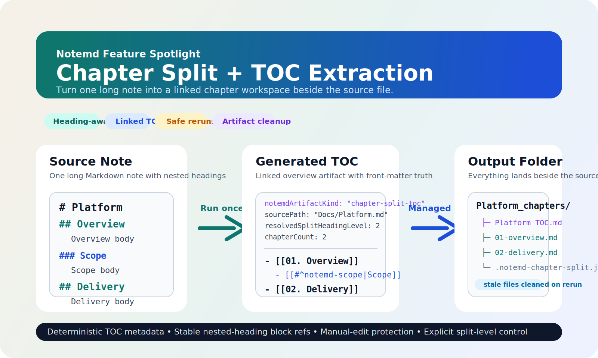

# Chapter Split + TOC Extraction



Turn one long note into a managed chapter workspace beside the source file.

Notemd's `Chapter Split + TOC Extraction` flow is designed for notes that have already grown past the point where one flat Markdown file is still pleasant to navigate. Instead of asking you to manually duplicate headings, create chapter files, and wire a hand-written table of contents, Notemd generates a linked TOC artifact, chapter notes, and managed metadata in one pass.

## What You Get

- Heading-aware chapter note generation beside the source note
- A linked TOC artifact with deterministic front-matter metadata
- Stable nested-heading block references such as `#^notemd-scope`
- Manifest-backed rerun safety and stale generated-file cleanup
- Explicit split-level control: `Auto` or force `H1`-`H6`

## Real Output Shape

```text
Docs/Platform.md
└─ Docs/Platform_chapters/
   ├─ Platform_TOC.md
   ├─ 01-overview.md
   ├─ 02-delivery.md
   └─ .notemd-chapter-split.json
```

## Example TOC Excerpt

```md
---
notemdGenerated: true
notemdArtifactKind: "chapter-split-toc"
sourcePath: "Docs/Platform.md"
requestedSplitHeadingLevel: "auto"
resolvedSplitHeadingLevel: 2
chapterCount: 2
---

# Platform TOC

- [[Docs/Platform_chapters/01-overview|01. Overview]]
  - [[Docs/Platform_chapters/01-overview#^notemd-scope|Scope]]
- [[Docs/Platform_chapters/02-delivery|02. Delivery]]
```

## Why This Feature Is Useful

- It converts a large note into a navigable chapter set without losing the original source context.
- It keeps the TOC as a first-class artifact instead of a disposable copy-paste summary.
- It stays safe on reruns: generated artifacts are tracked, stale artifacts can be removed, and manually edited generated notes are protected from blind overwrite.

## Best-Fit Scenarios

- Research notes that started as one file and need chapter-level navigation
- Long project plans that should keep an overview note plus per-section notes
- Reading notes or technical roadmaps where nested sections need deep links
- Knowledge-base curation where a TOC should remain shareable and explicit

## What Makes Notemd's Approach Different

- It does not stop at "split headings into files."
- It keeps TOC generation, artifact tracking, block-ref stability, and rerun cleanup in the same managed flow.
- It is explicit about failure: if you force `H3` and the note has no `H3`, the operation fails instead of silently guessing.

## Related Feature Surface

- Command / sidebar entry: `Chapter Split`
- Output truth: `<basename>_chapters`, `<basename>_TOC.md`, `.notemd-chapter-split.json`
- Setting: `Chapter Split -> Split heading level`
