# Diagram Examples And Real-Vault Evidence

Language: **English** | [简体中文](./README.zh-CN.md)

These examples were generated through the running Notemd plugin with the configured provider. They are separate from the [static fixture gallery](../diagram-gallery.md): the gallery proves deterministic preview coverage, while this directory records real-vault evidence from each run.

- [Machine-readable manifest](./manifest.json)
- Every input is available in English and Simplified Chinese.
- `passed` means the provider-backed run completed and copied at least one artifact or visual result. `failed` and `unavailable` remain explicit limitations.
- The generator cleans its dedicated temporary Vault prefix after each run and never removes pre-existing user notes.

## 1.9.7 Regression Evidence

The `quadrant` run confirms that provider-copied structural brackets are removed from point labels while intentional metadata punctuation remains intact. The `data-flow` run confirms that the summary/header region, lane cells, connectors, and edge labels occupy separate measured regions; cross-lane routes are orthogonal and avoid occupied cells. These entries are real runs through the reloaded plugin bundle, not hand-edited screenshots.

## Example Directory

### [Research themes](./mermaid-mindmap/input.md)

- Type: `mermaid-mindmap`; target: `mermaid`; status: `passed`
- [English input](./mermaid-mindmap/input.md)
- [SVG result](./mermaid-mindmap/result.svg)
- 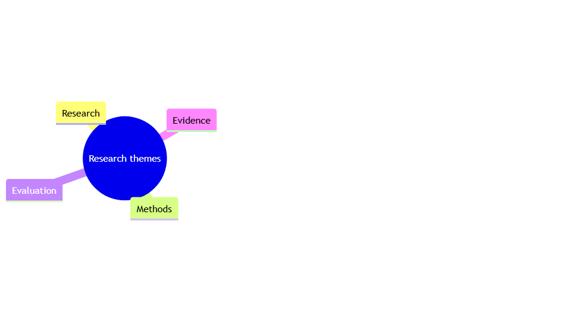

### [Diagram delivery architecture](./drawnix-knowledge-map/input.md)

- Type: `drawnix-knowledge-map`; target: `drawnix`; status: `passed`
- [English input](./drawnix-knowledge-map/input.md)
- [SVG result](./drawnix-knowledge-map/result.svg)
- 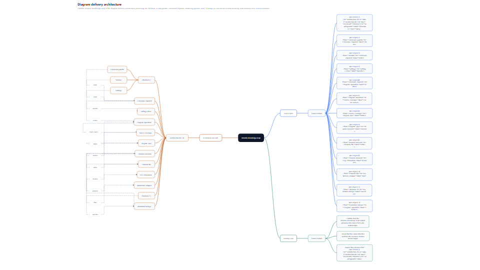

### [Release decision](./flowchart/input.md)

- Type: `flowchart`; target: `mermaid`; status: `passed`
- [English input](./flowchart/input.md)
- [SVG result](./flowchart/result.svg)
- 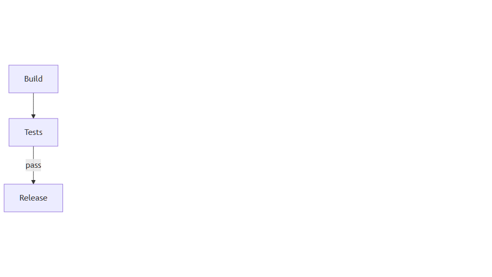

### [Artifact request](./sequence/input.md)

- Type: `sequence`; target: `mermaid`; status: `passed`
- [English input](./sequence/input.md)
- [SVG result](./sequence/result.svg)
- 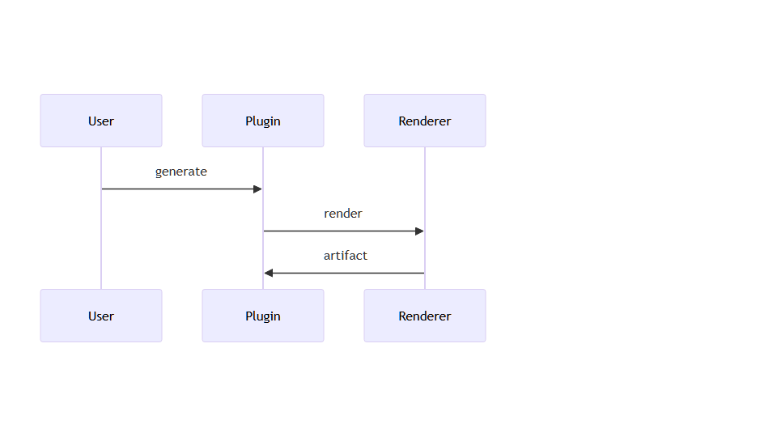

### [Artifact lifecycle](./state/input.md)

- Type: `state`; target: `mermaid`; status: `passed`
- [English input](./state/input.md)
- [SVG result](./state/result.svg)
- 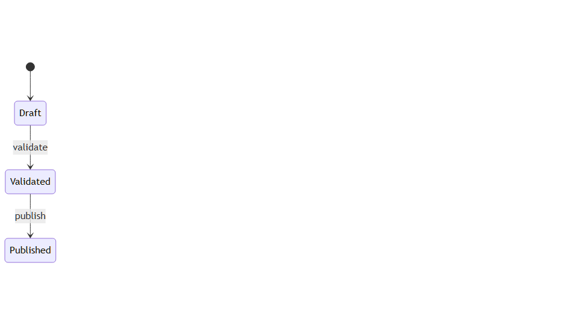

### [Diagram domain](./class/input.md)

- Type: `class`; target: `mermaid`; status: `passed`
- [English input](./class/input.md)
- [SVG result](./class/result.svg)
- 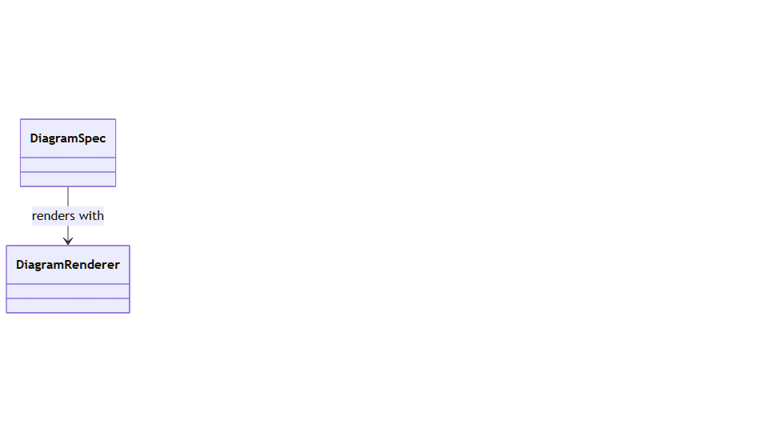

### [Artifact schema](./entity-relationship/input.md)

- Type: `entity-relationship`; target: `mermaid`; status: `passed`
- [English input](./entity-relationship/input.md)
- [SVG result](./entity-relationship/result.svg)
- 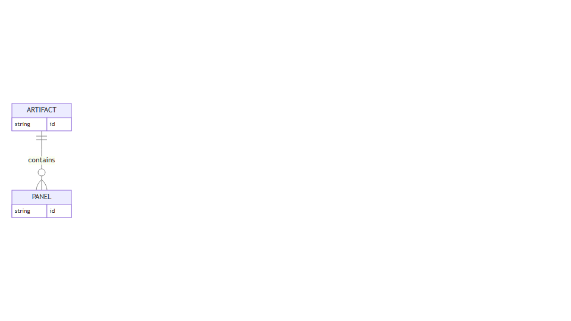

### [Diagram domains](./canvas-map/input.md)

- Type: `canvas-map`; target: `json-canvas`; status: `passed`
- [English input](./canvas-map/input.md)
- [SVG result](./canvas-map/result.svg)
- 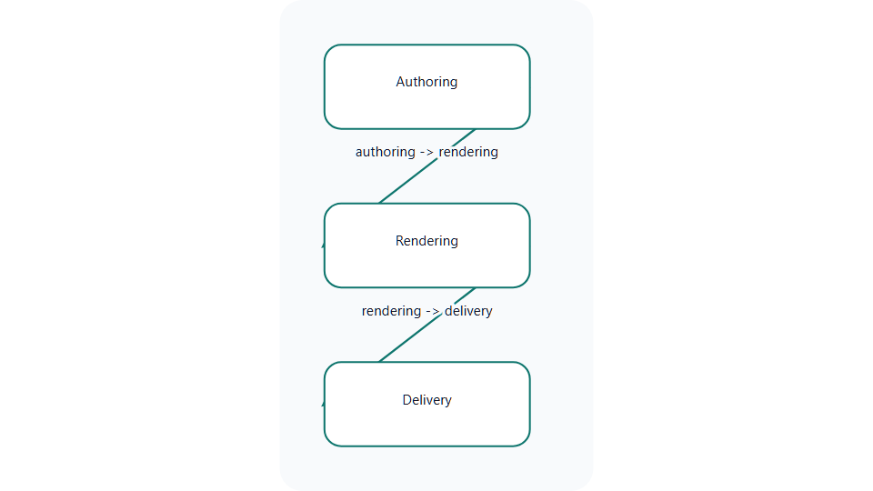

### [Rendering trend](./data-chart/input.md)

- Type: `data-chart`; target: `vega-lite`; status: `passed`
- [English input](./data-chart/input.md)
- [SVG result](./data-chart/result.svg)
- 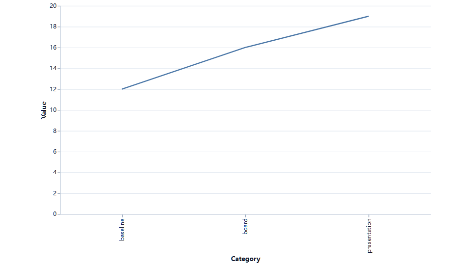

### [Capability profile](./radar-chart/input.md)

- Type: `radar-chart`; target: `vega-lite`; status: `passed`
- [English input](./radar-chart/input.md)
- [SVG result](./radar-chart/result.svg)
- 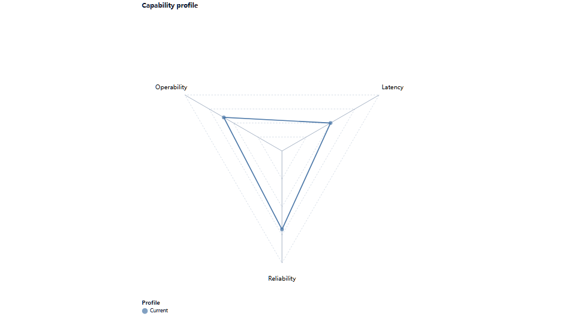

### [Support ownership](./org-chart/input.md)

- Type: `org-chart`; target: `mermaid`; status: `passed`
- [English input](./org-chart/input.md)
- [SVG result](./org-chart/result.svg)
- 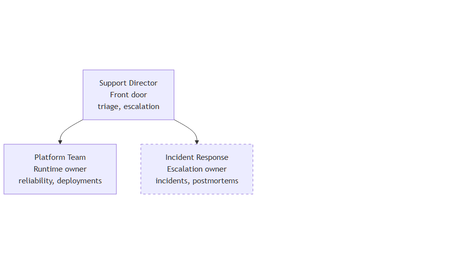

### [Delivery roadmap](./timeline/input.md)

- Type: `timeline`; target: `mermaid`; status: `passed`
- [English input](./timeline/input.md)
- [SVG result](./timeline/result.svg)
- 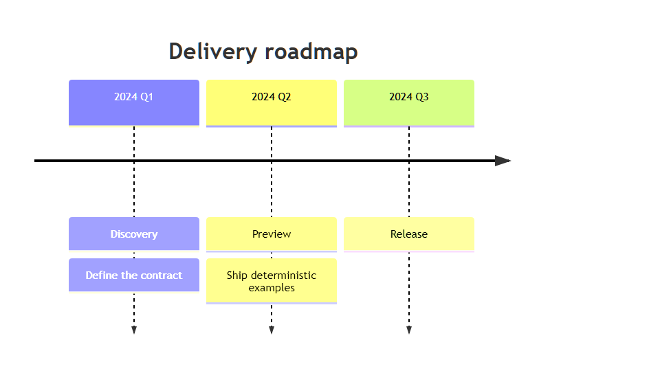

### [Release handoff](./swimlane/input.md)

- Type: `swimlane`; target: `mermaid`; status: `passed`
- [English input](./swimlane/input.md)
- [SVG result](./swimlane/result.svg)
- 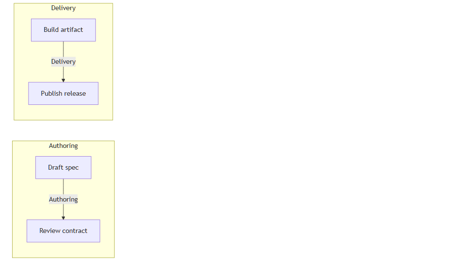

### [Priority matrix](./quadrant/input.md)

- Type: `quadrant`; target: `mermaid`; status: `passed`
- [English input](./quadrant/input.md)
- [SVG result](./quadrant/result.svg)
- 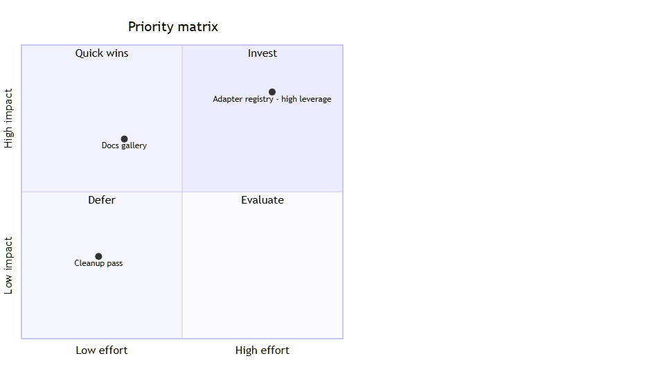

### [CMOS inverter](./circuit/input.md)

- Type: `circuit`; target: `circuitikz`; status: `passed`
- [English input](./circuit/input.md)
- [SVG result](./circuit/result.svg)
- 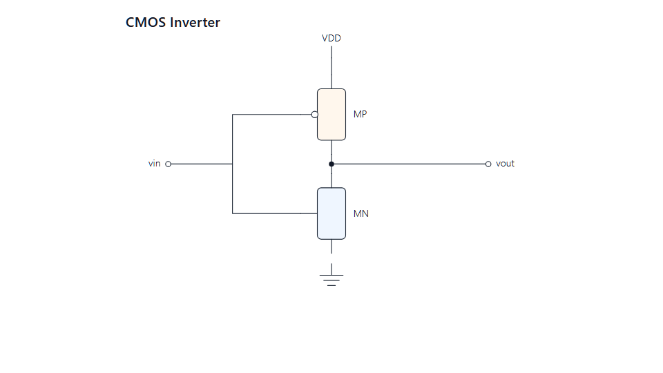

### [Feature adoption](./bar-chart/input.md)

- Type: `bar-chart`; target: `vega-lite`; status: `passed`
- [English input](./bar-chart/input.md)
- [SVG result](./bar-chart/result.svg)
- 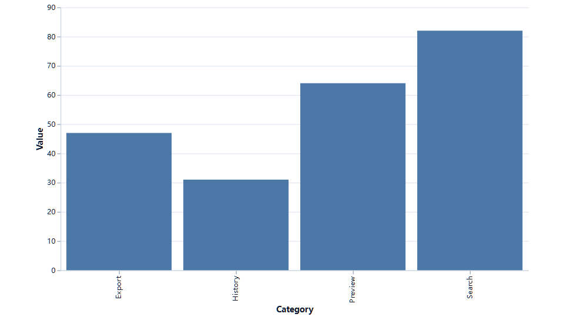

### [Render time trend](./line-chart/input.md)

- Type: `line-chart`; target: `vega-lite`; status: `passed`
- [English input](./line-chart/input.md)
- [SVG result](./line-chart/result.svg)
- 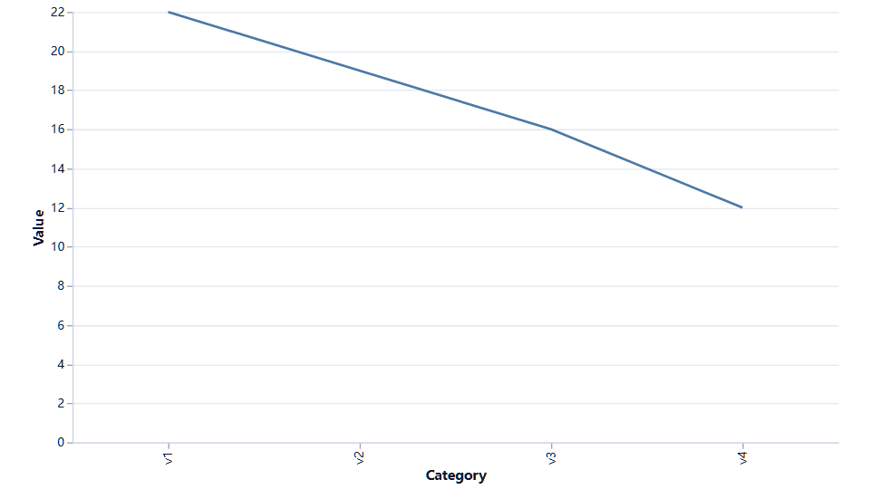

### [Quality and latency](./scatter-plot/input.md)

- Type: `scatter-plot`; target: `vega-lite`; status: `passed`
- [English input](./scatter-plot/input.md)
- [SVG result](./scatter-plot/result.svg)
- 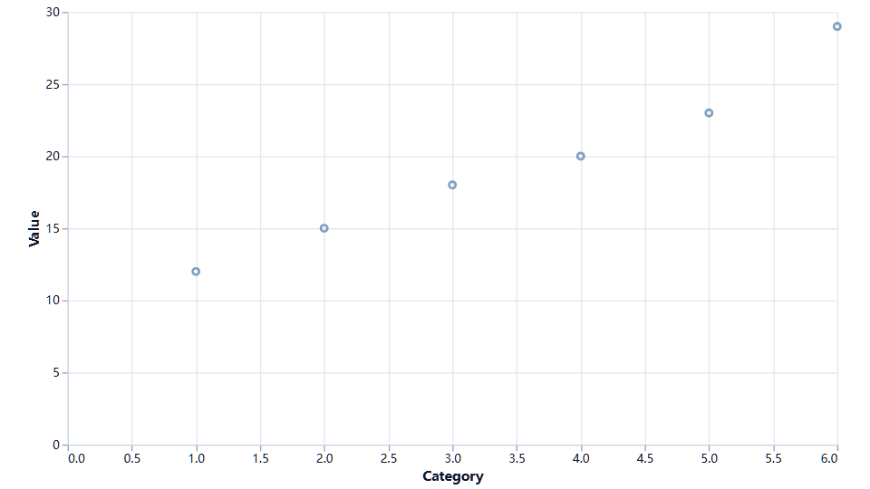

### [Platform architecture](./architecture/input.md)

- Type: `architecture`; target: `editable-html-svg`; status: `passed`
- [English input](./architecture/input.md)
- [SVG result](./architecture/result.svg)
- 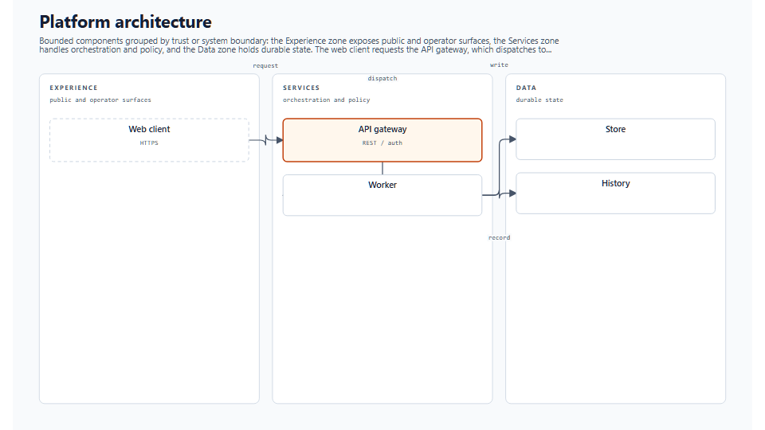

### [Legacy current state](./current-state/input.md)

- Type: `current-state`; target: `editable-html-svg`; status: `passed`
- [English input](./current-state/input.md)
- [SVG result](./current-state/result.svg)
- 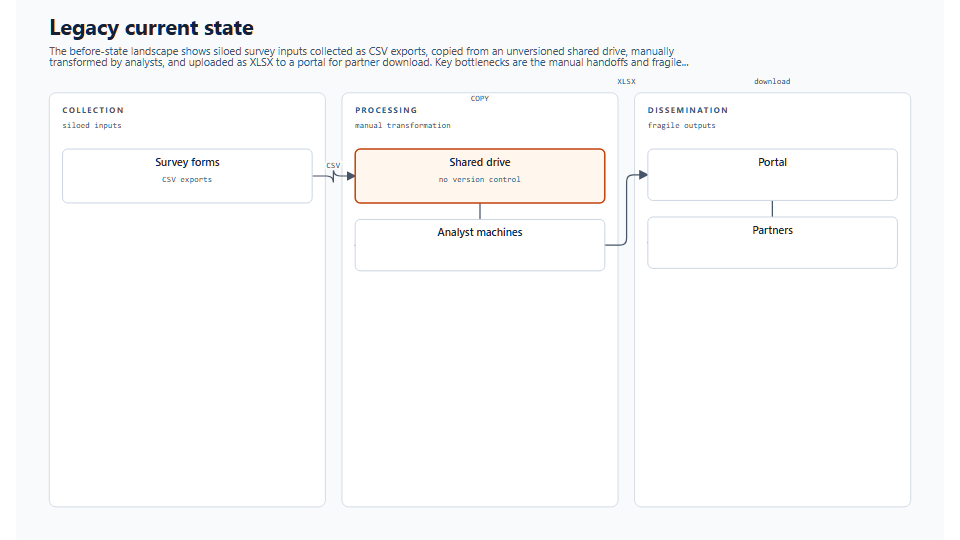

### [Integration topology](./integration-topology/input.md)

- Type: `integration-topology`; target: `editable-html-svg`; status: `passed`
- [English input](./integration-topology/input.md)
- [SVG result](./integration-topology/result.svg)
- 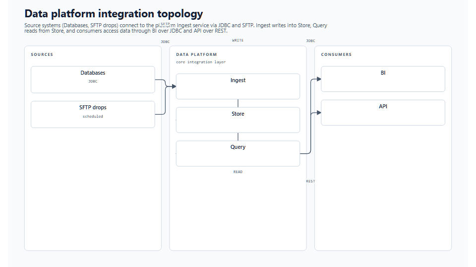

### [Role-scoped data flow](./data-flow/input.md)

- Type: `data-flow`; target: `editable-html-svg`; status: `passed`
- [English input](./data-flow/input.md)
- [SVG result](./data-flow/result.svg)
- 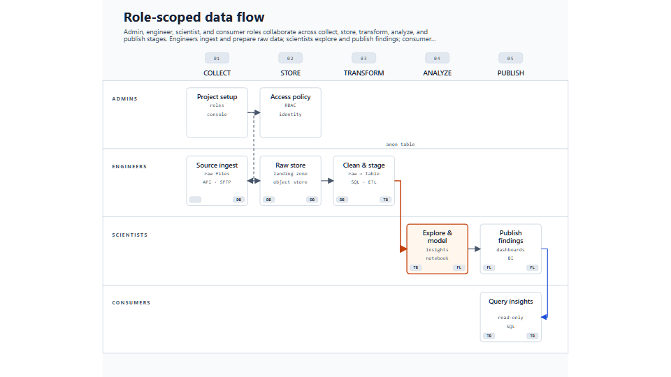

### [Platform access matrix](./access-matrix/input.md)

- Type: `access-matrix`; target: `editable-html-svg`; status: `passed`
- [English input](./access-matrix/input.md)
- [SVG result](./access-matrix/result.svg)
- 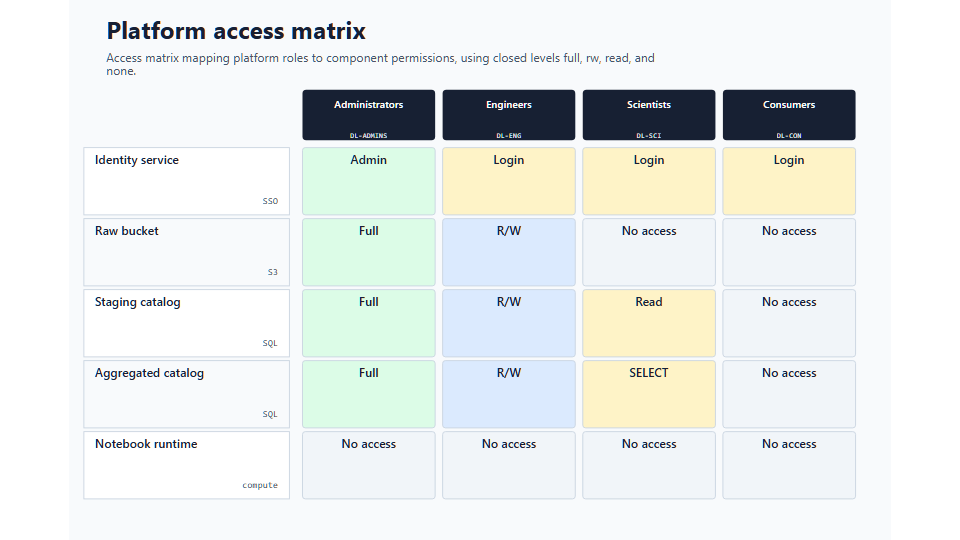

### [Release plan](./gantt/input.md)

- Type: `gantt`; target: `editable-html-svg`; status: `passed`
- [English input](./gantt/input.md)
- [SVG result](./gantt/result.svg)
- 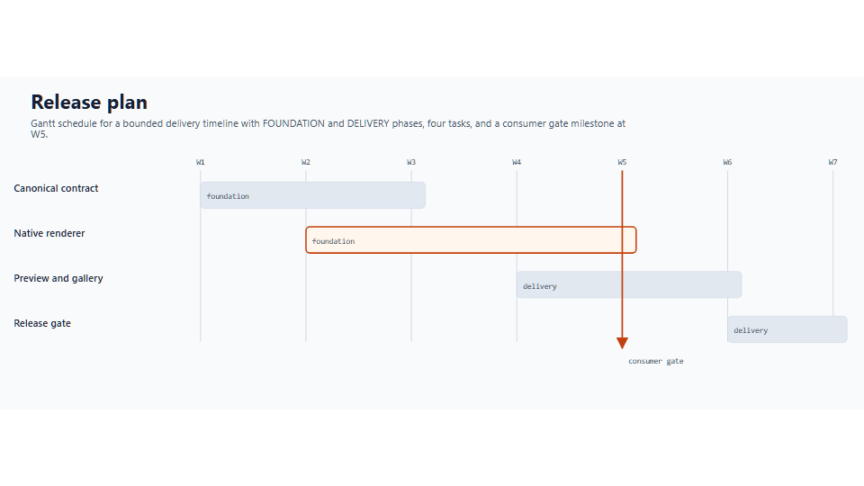

### [Platform layers](./layer-stack/input.md)

- Type: `layer-stack`; target: `editable-html-svg`; status: `passed`
- [English input](./layer-stack/input.md)
- [SVG result](./layer-stack/result.svg)
- 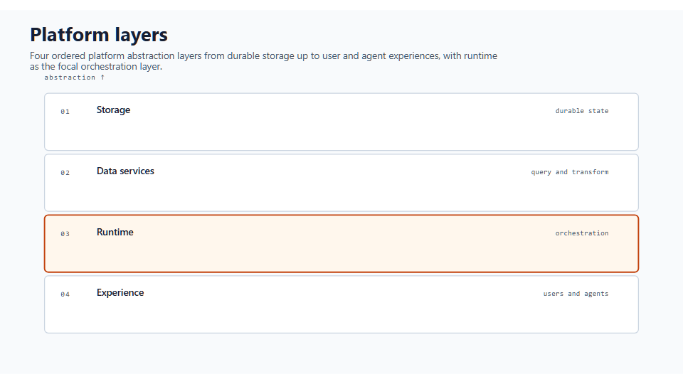

### [Platform fit](./venn/input.md)

- Type: `venn`; target: `editable-html-svg`; status: `passed`
- [English input](./venn/input.md)
- [SVG result](./venn/result.svg)
- 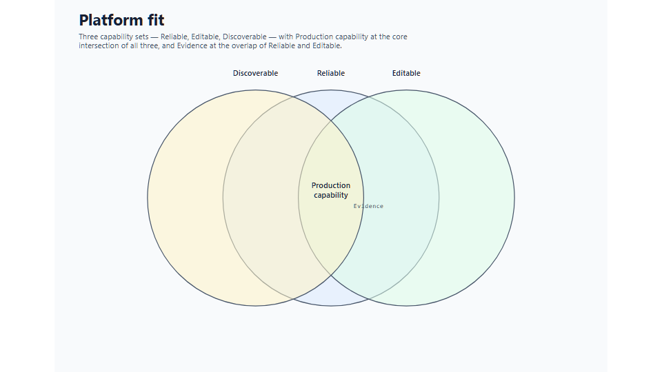

### [Release funnel](./ranked-funnel/input.md)

- Type: `ranked-funnel`; target: `editable-html-svg`; status: `passed`
- [English input](./ranked-funnel/input.md)
- [SVG result](./ranked-funnel/result.svg)
- 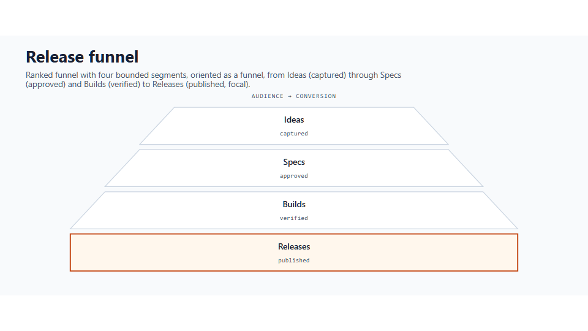

### [Operating loop](./loop/input.md)

- Type: `loop`; target: `editable-html-svg`; status: `passed`
- [English input](./loop/input.md)
- [SVG result](./loop/result.svg)
- 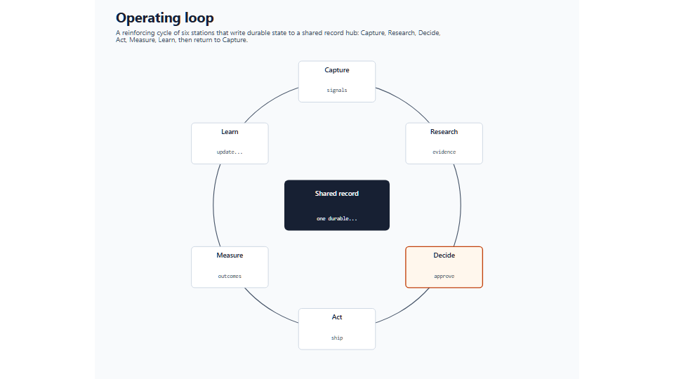

### [Scope cascade](./nested/input.md)

- Type: `nested`; target: `editable-html-svg`; status: `passed`
- [English input](./nested/input.md)
- [SVG result](./nested/result.svg)
- 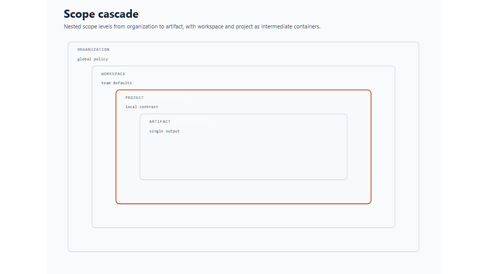

### [Ownership tree](./tree/input.md)

- Type: `tree`; target: `editable-html-svg`; status: `passed`
- [English input](./tree/input.md)
- [SVG result](./tree/result.svg)
- 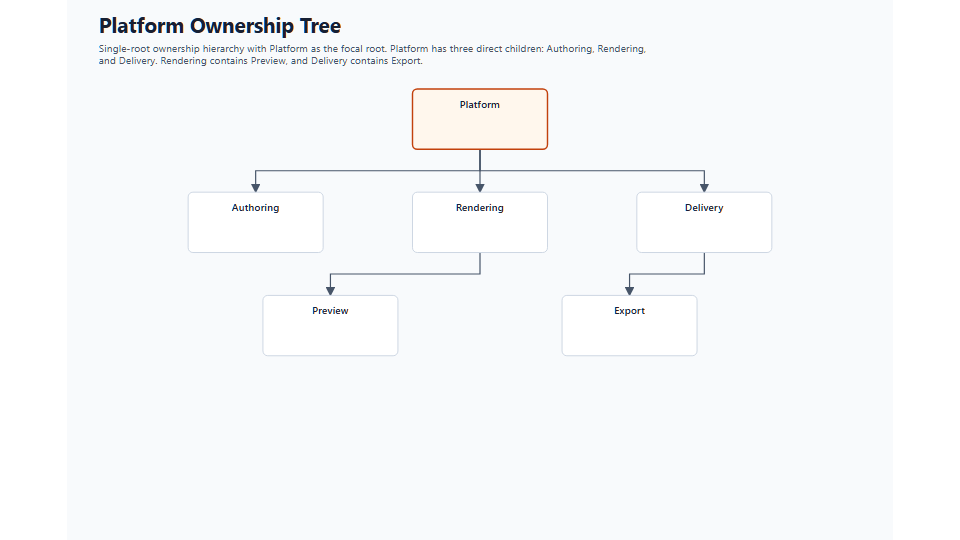

### [Release process](./process/input.md)

- Type: `process`; target: `editable-html-svg`; status: `passed`
- [English input](./process/input.md)
- [SVG result](./process/result.svg)
- 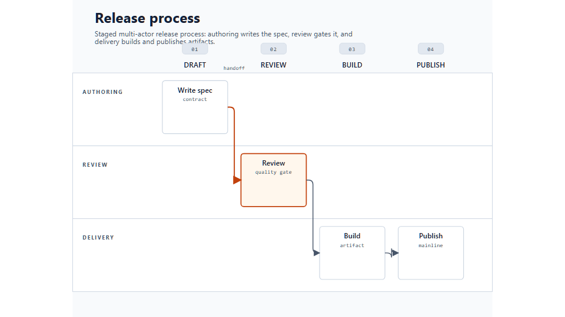

### [Data quality tiers](./medallion/input.md)

- Type: `medallion`; target: `editable-html-svg`; status: `passed`
- [English input](./medallion/input.md)
- [SVG result](./medallion/result.svg)
- 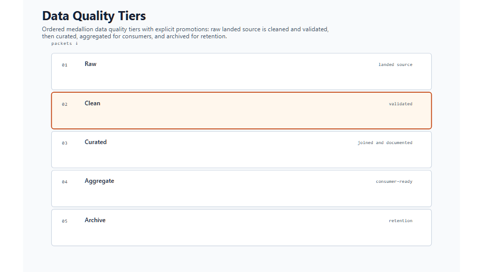

### [High-level platform](./high-level/input.md)

- Type: `high-level`; target: `editable-html-svg`; status: `passed`
- [English input](./high-level/input.md)
- [SVG result](./high-level/result.svg)
- 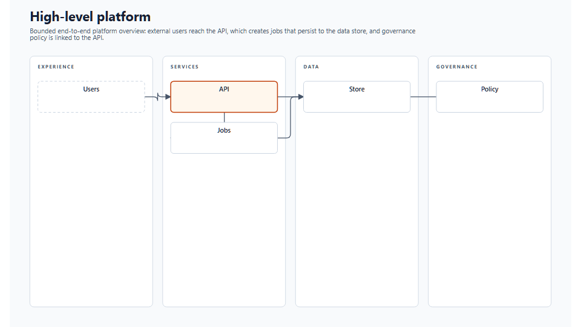
