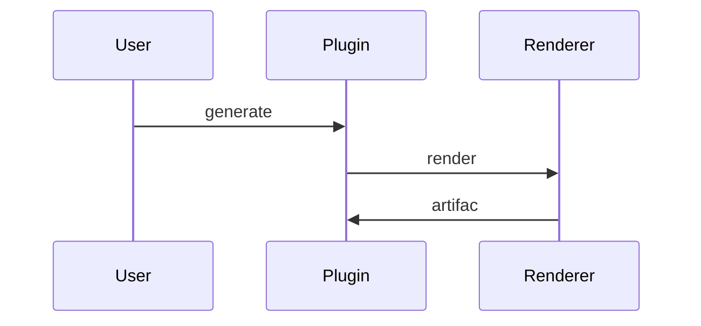

# Artifact 请求

> 使用 Notemd 的“预览图表”命令查看此图表。

```mermaid
sequenceDiagram
    participant user as User
    participant plugin as Plugin
    participant renderer as Renderer
    user->>plugin: generate
    plugin->>renderer: render
    renderer->>plugin: artifac
```
