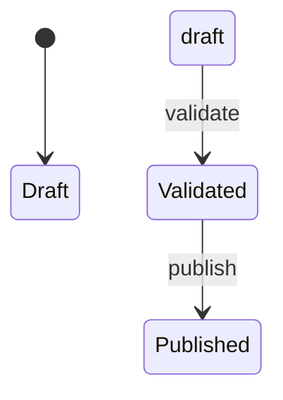

```mermaid
stateDiagram-v2
    [*] --> draf
    state "Draft" as draf
    state "Validated" as validated
    state "Published" as published
    draft --> validated : validate
    validated --> published : publish
```

