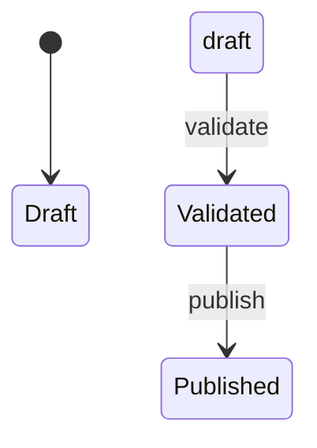

# Artifact 生命周期

> 使用 Notemd 的“预览图表”命令查看此图表。

```mermaid
stateDiagram-v2
    [*] --> draf
    state "Draft" as draf
    state "Validated" as validated
    state "Published" as published
    draft --> validated : validate
    validated --> published : publish
```
