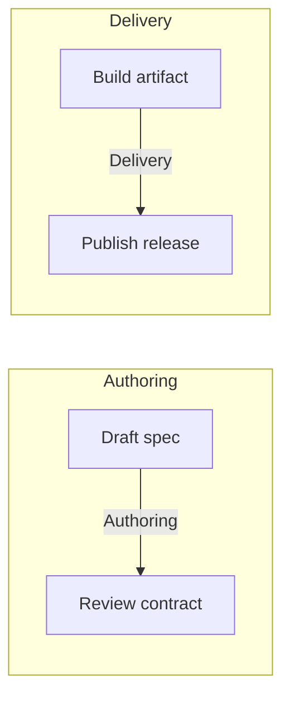

# 发布交接

> 使用 Notemd 的“预览图表”命令查看此图表。

```mermaid
flowchart LR
    subgraph authoring["Authoring"]
        draft["Draft spec"]
        review["Review contract"]
        draft -->|Authoring| review
    end subgraph delivery["Delivery"]
        build["Build artifact"]
        publish["Publish release"]
        build -->|Delivery| publish
    end
```
