# Diagram Gallery

Language: **English** | [简体中文](./diagram-gallery.zh-CN.md)

This page is the user-facing inventory of the diagram types that Notemd can execute today. It is generated from the same executable fixtures used by the settings preview. The committed [gallery manifest](./assets/diagrams/manifest.json) records the production target, preview target, and SVG hash for every image.

## Scope And Contract

- **Shipped** means the semantic type is present in `src/diagram/diagramTypeCatalog.ts`, has an executable fixture, and is covered by the capability manifest.
- **Default target** is the planner's normal render target. **Compatible targets** are explicit renderer contracts, not a promise that every target has identical layout semantics.
- Preview images are production renderer output, generated with `npm run diagram:gallery`. Run `npm run diagram:gallery:check` in CI or before publishing docs.
- The reference repository [cathrynlavery/diagram-design](https://github.com/cathrynlavery/diagram-design) is used as a taxonomy and documentation reference. Its layouts are listed separately below and are not shipped Notemd features.

## Shipped Types

| Type ID | Semantic intent | Default target | Compatible targets |
| --- | --- | --- | --- |
| `mermaid-mindmap` | Concept hierarchy | `mermaid` | `mermaid`, `editable-html-svg`, `drawio`, `html` |
| `drawnix-knowledge-map` | Filename-rooted knowledge map | `drawnix` | `drawnix` |
| `flowchart` | Control flow and decisions | `mermaid` | `mermaid`, `editable-html-svg`, `drawio`, `html` |
| `sequence` | Ordered participant interaction | `mermaid` | `mermaid`, `editable-html-svg`, `drawio`, `html` |
| `state` | State transition lifecycle | `mermaid` | `mermaid`, `editable-html-svg`, `drawio`, `html` |
| `class` | Type relationships and ownership | `mermaid` | `mermaid`, `editable-html-svg`, `drawio`, `html` |
| `entity-relationship` | Entity cardinality and attributes | `mermaid` | `mermaid`, `editable-html-svg`, `drawio`, `html` |
| `canvas-map` | Spatially grouped concepts | `json-canvas` | `json-canvas` |
| `data-chart` | Measured comparison over a shared axis | `vega-lite` | `vega-lite`, `html` |
| `radar-chart` | Multi-axis profile comparison | `vega-lite` | `vega-lite`, `html` |
| `timeline` | Ordered milestones over time | `mermaid` | `mermaid` |
| `swimlane` | Cross-functional responsibility flow | `mermaid` | `mermaid` |
| `quadrant` | Two-axis prioritization matrix | `mermaid` | `mermaid` |
| `circuit` | Electrical components and nets | `circuitikz` | `circuitikz` |

## Preview Examples

### Mermaid mindmap

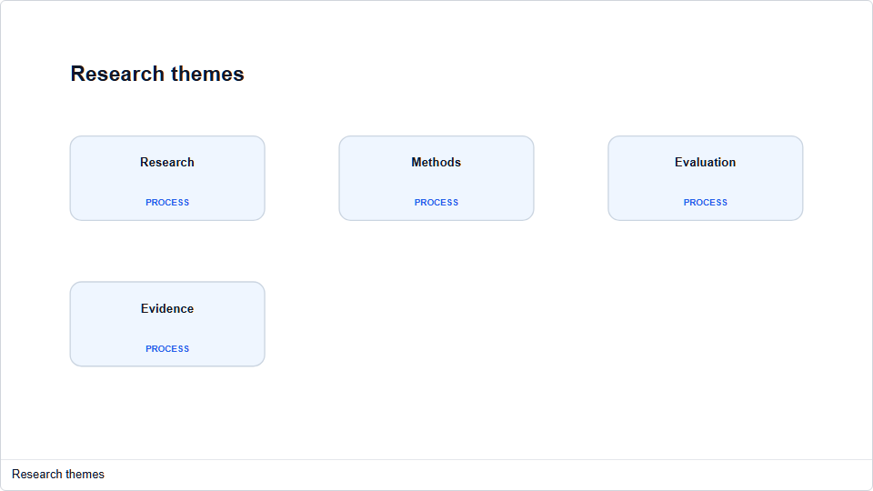

### Drawnix knowledge map

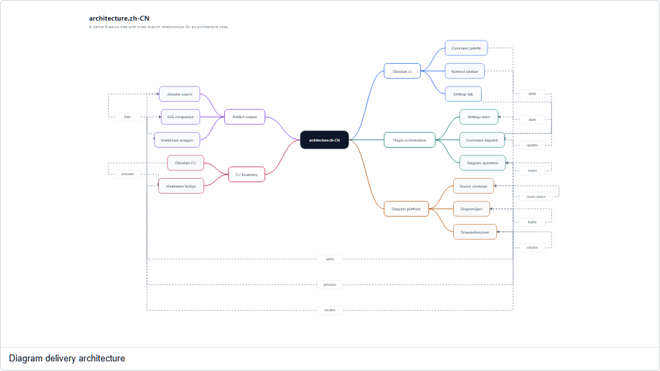

### Flowchart

### Sequence

### State diagram

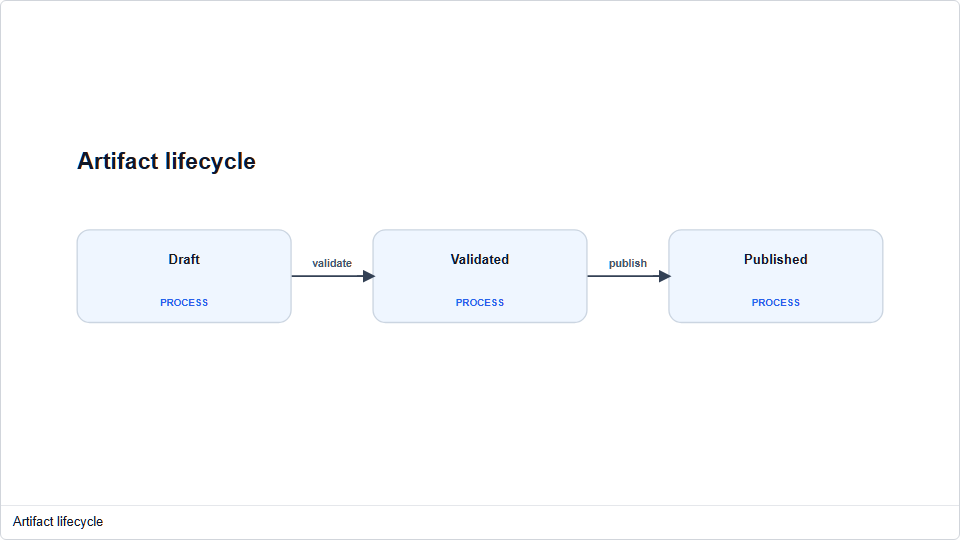

### Class diagram

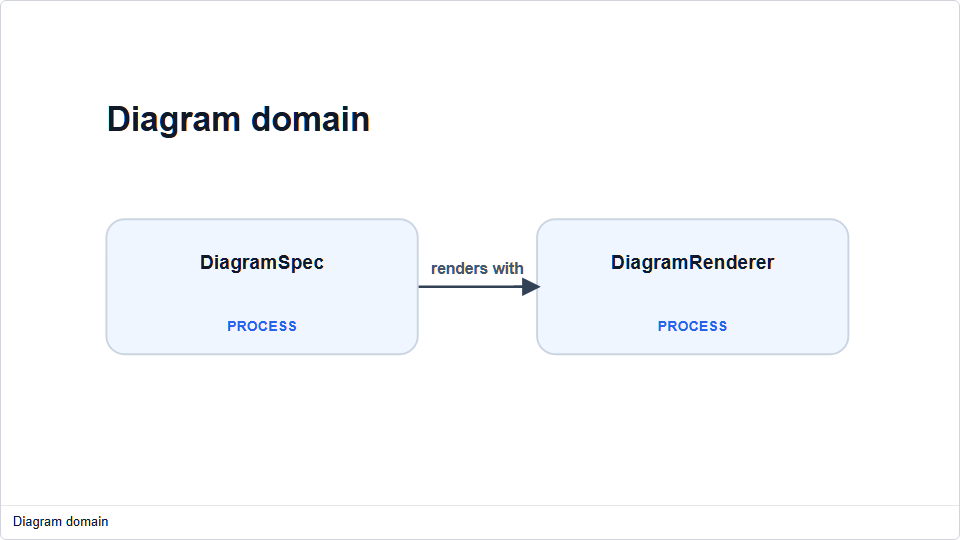

### Entity relationship

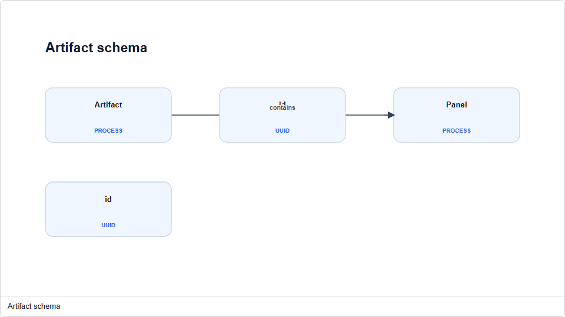

### JSON Canvas map

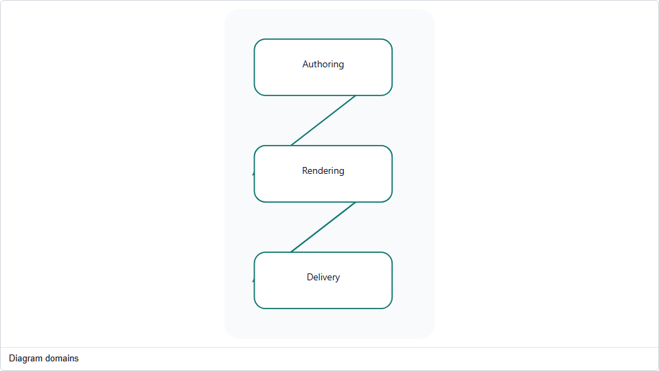

### Vega-Lite data chart

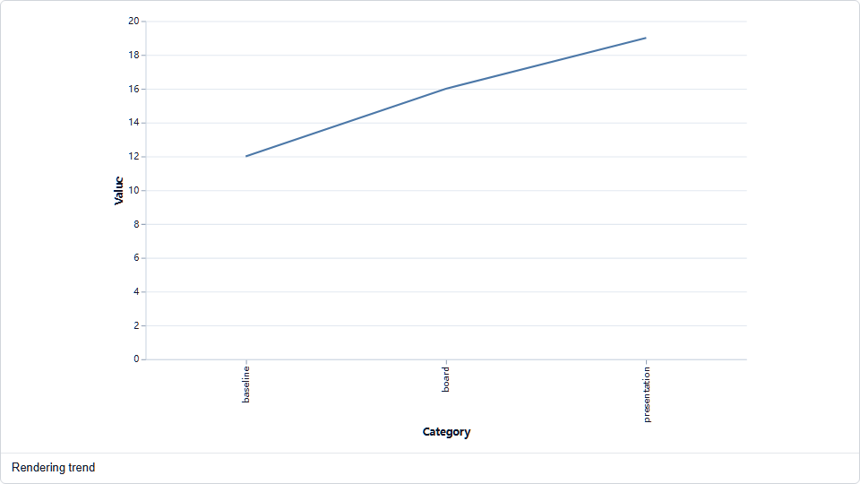

### Vega-Lite radar profile

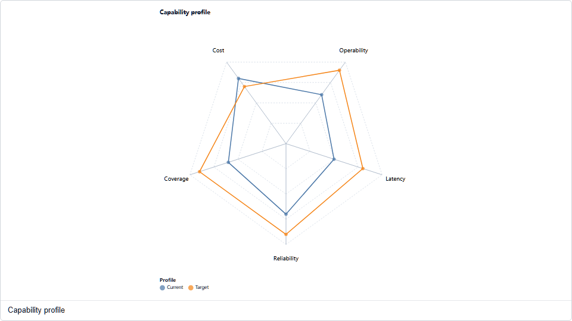

### Timeline

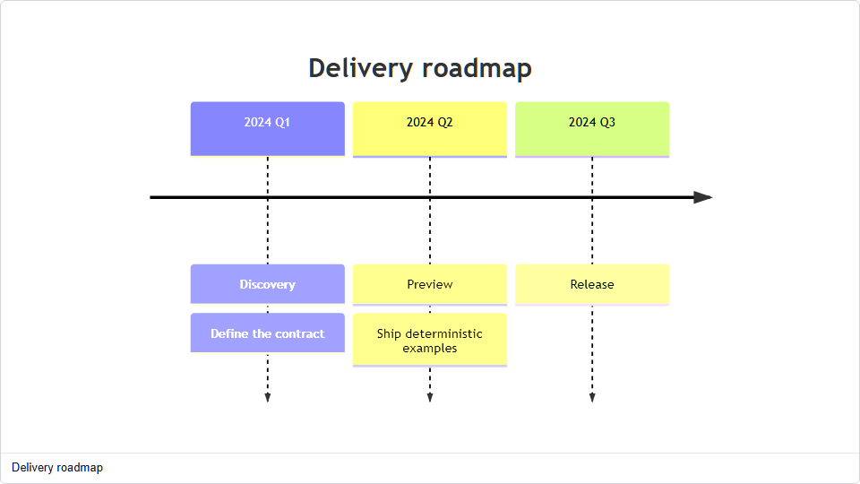

### Swimlane

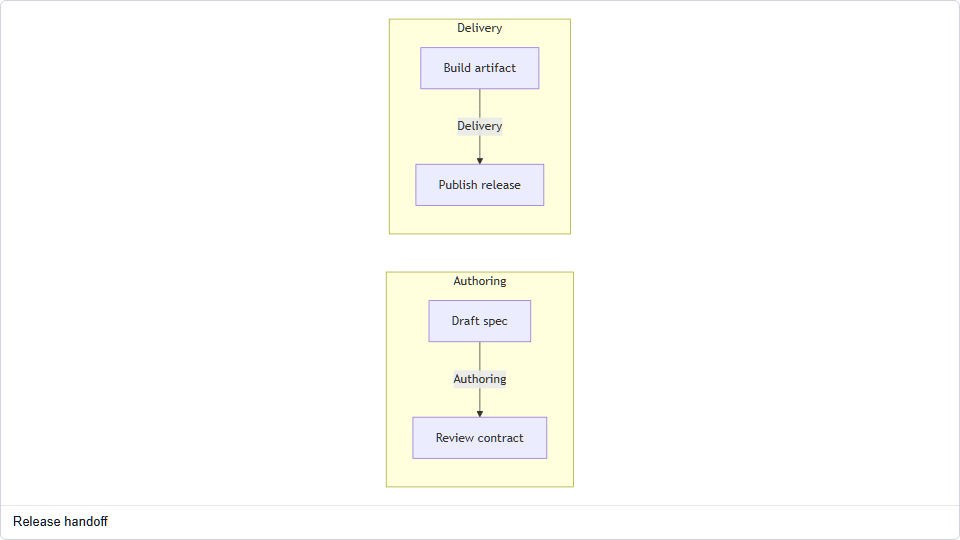

### Quadrant

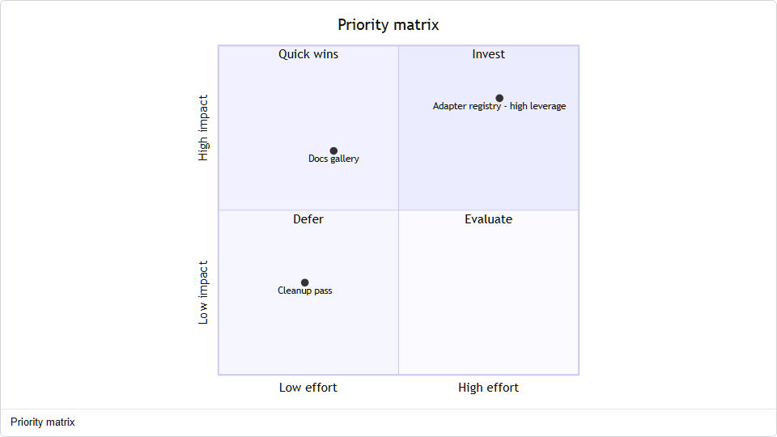

### Circuitikz circuit

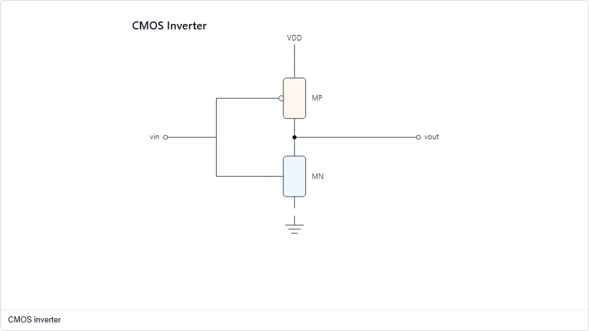

## Reference-Only Layouts

The following 23 IDs are imported from `ref/diagram-design` for comparison and future admission discussions. They are intentionally namespaced as `diagram-design:*`, carry reference revision `09df49d8d1a1c7fb2efdfcdc7a2a0713534350a6`, and do not appear in the runtime type selector:

`architecture`, `it-current-state`, `flowchart`, `sequence`, `state-machine`, `er-data-model`, `loop`, `nested`, `tree`, `org-chart`, `layer-stack`, `venn`, `pyramid-funnel`, `bar-chart`, `line-chart`, `gantt`, `scatter-plot`, `high-level`, `process`, `medallion`, `data-flow`, `dp-integration`, `dp-security-matrix`.

Promoting one of these layouts requires a semantic input contract, a production renderer, a fixture, a target/export matrix, accessibility checks, and deterministic gallery output. A visual resemblance to the reference is not sufficient evidence of support.
