# Diagram Gallery

Language: **English** | [简体中文](./diagram-gallery.zh-CN.md)

This page is the user-facing inventory of the diagram types that Notemd can execute today. It is generated from the the same executable fixtures used by the Settings and Workbench type selectors. The committed [gallery manifest](./assets/diagrams/manifest.json) records the production target, preview target, and SVG hash for every image.

## Scope And Contract

- **Shipped** means the semantic type is present in `src/diagram/diagramTypeCatalog.ts`, has an executable fixture, and is covered by the capability manifest.
- **Default target** is the planner's normal render target. **Compatible targets** are explicit renderer contracts, not a promise that every target has identical layout semantics.
- Preview images are production renderer output, generated with `npm run diagram:gallery`. Run `npm run diagram:gallery:check` in CI or before publishing docs.
- The reference repository [cathrynlavery/diagram-design](https://github.com/cathrynlavery/diagram-design) is used as a taxonomy and documentation reference. Its layouts are listed separately below and are not shipped Notemd features.
- The workbench and settings type pickers list only executable Notemd types. After a user selects one type, a single preview panel renders that type through Notemd's production renderer; no `diagram-design` screenshot is loaded or bundled.

## Shipped Types

| Type ID | Semantic intent | Default target | Compatible targets |
| --- | --- | --- | --- |
| `mermaid-mindmap` | Concept hierarchy | `mermaid` | `mermaid`, `editable-html-svg`, `drawio`, `html` |
| `drawnix-knowledge-map` | Filename-rooted knowledge map | `drawnix` | `drawnix` |
| `flowchart` | Control flow and decisions | `mermaid` | `mermaid`, `editable-html-svg`, `drawio`, `html` |
| `sequence` | Ordered participant interaction | `mermaid` | `mermaid`, `editable-html-svg`, `drawio`, `html` |
| `state` | State transition lifecycle | `mermaid` | `mermaid`, `editable-html-svg`, `drawio`, `html` |
| `class` | Type relationships and ownership | `mermaid` | `mermaid`, `editable-html-svg`, `drawio`, `html` |
| `entity-relationship` | Entity cardinality and attributes | `mermaid` | `mermaid`, `editable-html-svg`, `drawio`, `html` |
| `canvas-map` | Spatially grouped concepts | `json-canvas` | `json-canvas` |
| `data-chart` | Measured comparison over a shared axis | `vega-lite` | `vega-lite`, `html` |
| `bar-chart` | Discrete category comparison | `vega-lite` | `vega-lite`, `html` |
| `line-chart` | Continuous trend over an ordered axis | `vega-lite` | `vega-lite`, `html` |
| `scatter-plot` | Correlation and paired-value distribution | `vega-lite` | `vega-lite`, `html` |
| `radar-chart` | Multi-axis profile comparison | `vega-lite` | `vega-lite`, `html` |
| `org-chart` | Accountable ownership hierarchy and reporting paths | `mermaid` | `mermaid`, `html` |
| `timeline` | Ordered milestones over time | `mermaid` | `mermaid` |
| `swimlane` | Cross-functional responsibility flow | `mermaid` | `mermaid` |
| `quadrant` | Two-axis prioritization matrix | `mermaid` | `mermaid` |
| `circuit` | Electrical components and nets | `circuitikz` | `circuitikz` |
| `architecture` | Bounded system topology | `editable-html-svg` | `editable-html-svg`, `html` |
| `current-state` | Legacy IT landscape and handoffs | `editable-html-svg` | `editable-html-svg`, `html` |
| `integration-topology` | Source/platform/consumer integration surfaces | `editable-html-svg` | `editable-html-svg`, `html` |
| `data-flow` | Role-scoped typed data pipeline | `editable-html-svg` | `editable-html-svg`, `html` |
| `access-matrix` | Role-to-component permission contract | `editable-html-svg` | `editable-html-svg`, `html` |
| `gantt` | Tasks and milestones on a schedule | `editable-html-svg` | `editable-html-svg`, `html` |
| `layer-stack` | Ordered abstraction layers | `editable-html-svg` | `editable-html-svg`, `html` |
| `venn` | Explicit set overlap | `editable-html-svg` | `editable-html-svg`, `html` |
| `ranked-funnel` | Ranked hierarchy or conversion funnel | `editable-html-svg` | `editable-html-svg`, `html` |
| `loop` | Reinforcing cycle with shared state | `editable-html-svg` | `editable-html-svg`, `html` |
| `nested` | Containment and scope boundaries | `editable-html-svg` | `editable-html-svg`, `html` |
| `tree` | Parent-to-child hierarchy | `editable-html-svg` | `editable-html-svg`, `html` |
| `process` | Multi-actor staged process | `editable-html-svg` | `editable-html-svg`, `html` |
| `medallion` | Data quality promotion tiers | `editable-html-svg` | `editable-html-svg`, `html` |
| `high-level` | End-to-end platform overview | `editable-html-svg` | `editable-html-svg`, `html` |

## Preview Examples

### Mermaid mindmap

### Drawnix knowledge map

### Flowchart

### Sequence

### State diagram

### Class diagram

### Entity relationship

### JSON Canvas map

### Vega-Lite data chart

### Bar chart

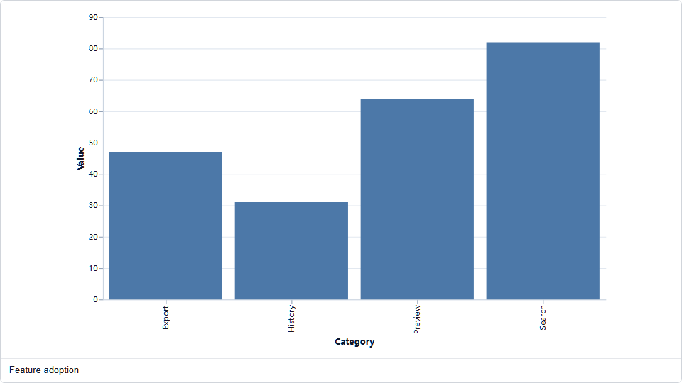

### Line chart

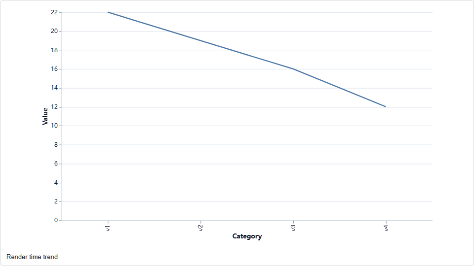

### Scatter plot

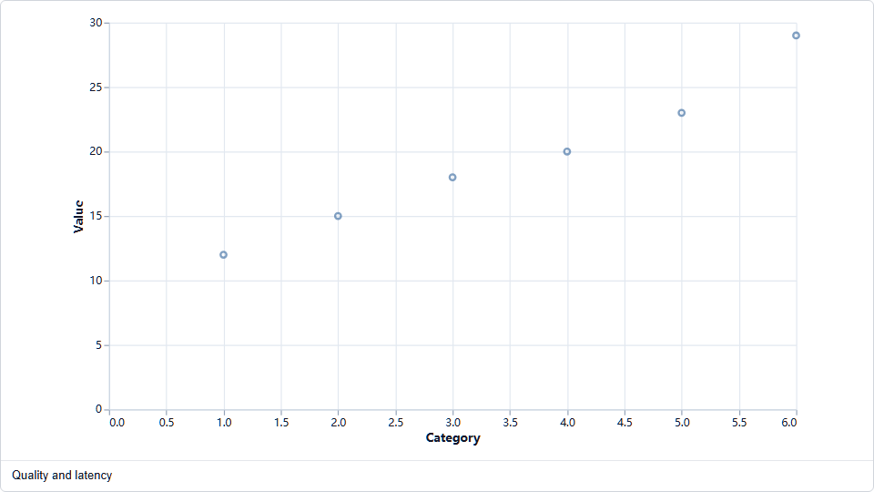

### Vega-Lite radar profile

### Org chart

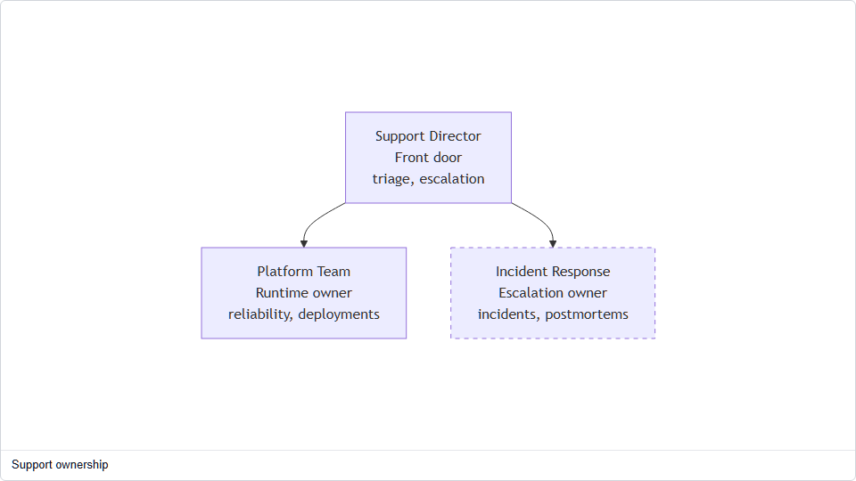

### Timeline

### Swimlane

### Quadrant

### Circuitikz circuit

### Architecture

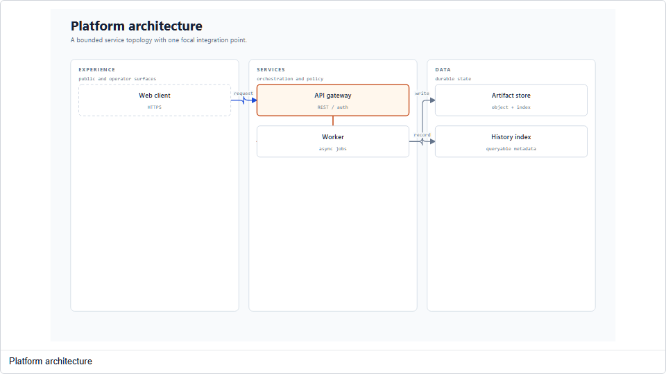

### Current state

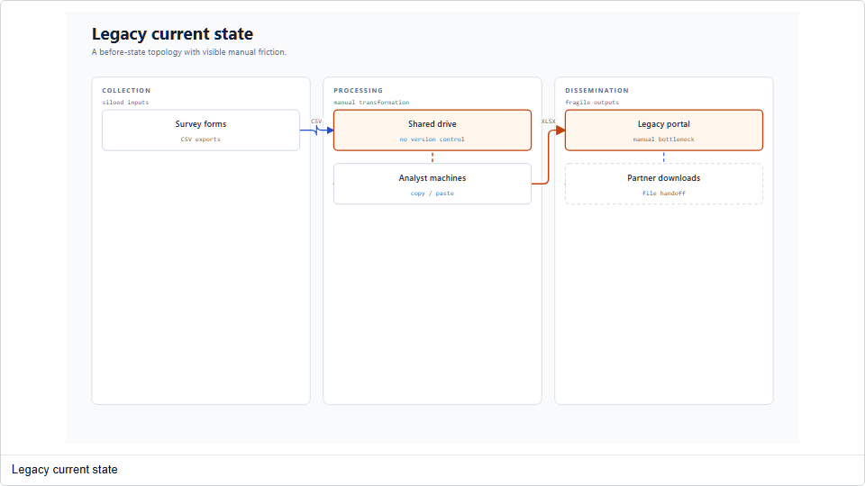

### Integration topology

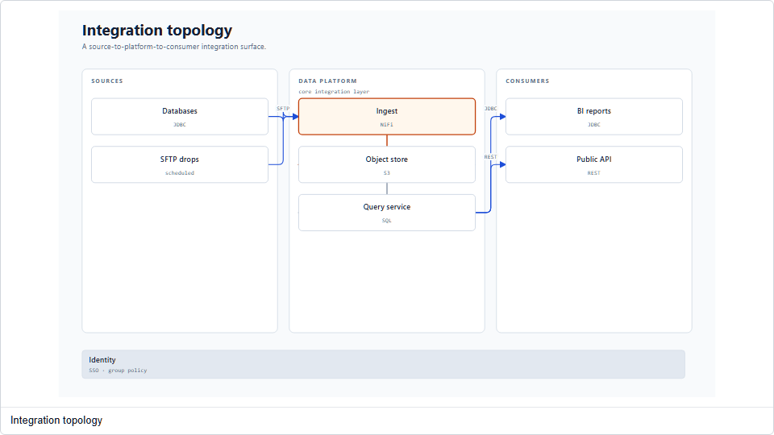

### Data flow

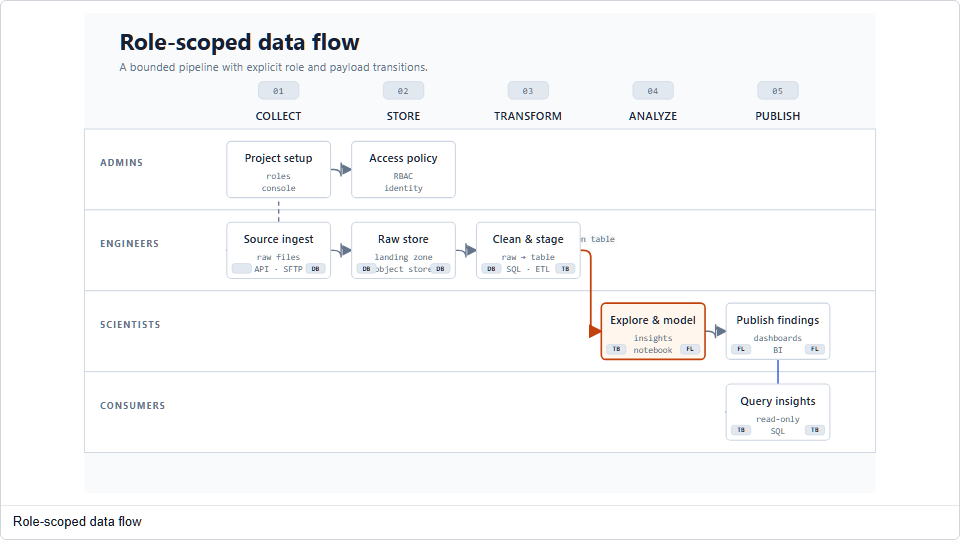

### Access matrix

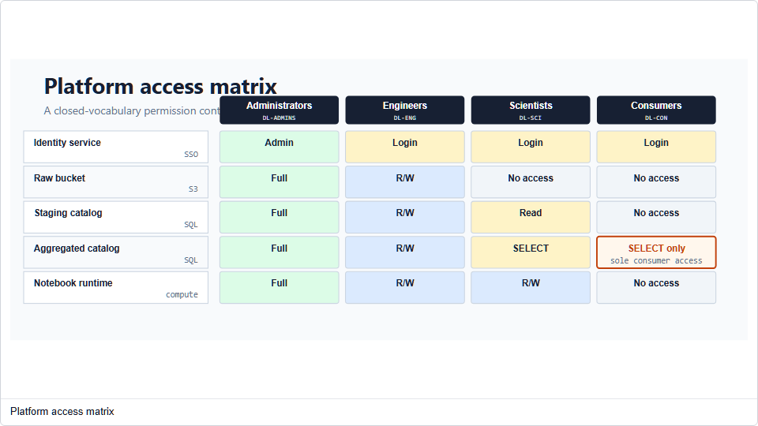

### Gantt

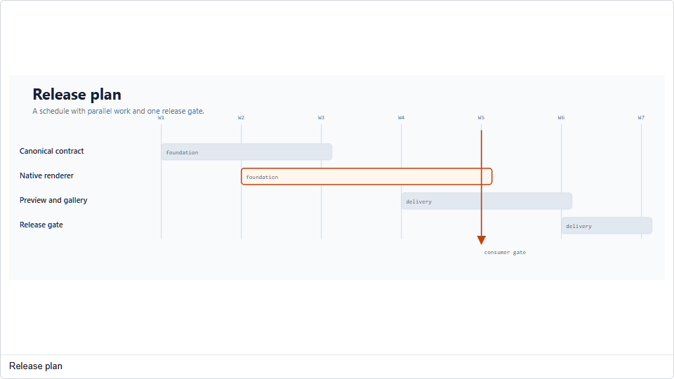

### Layer stack

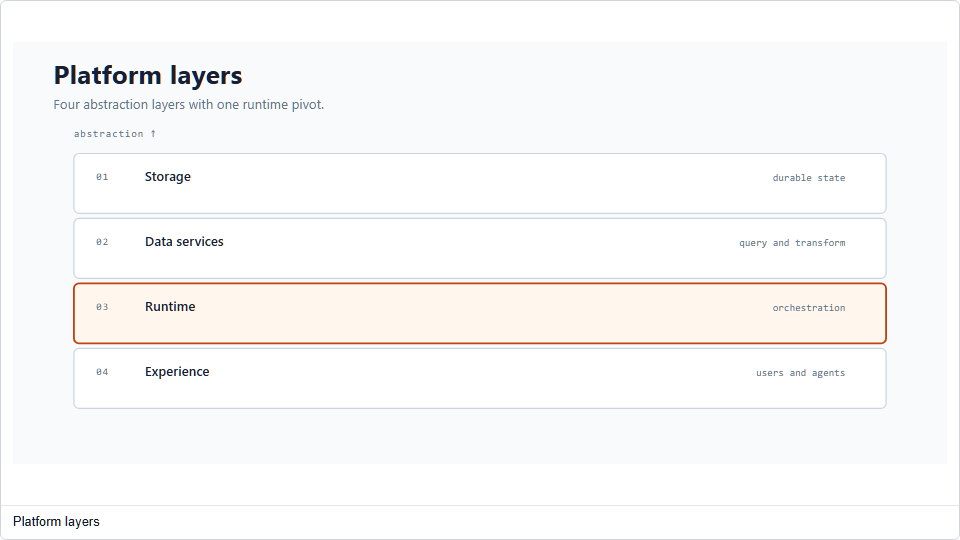

### Venn overlap

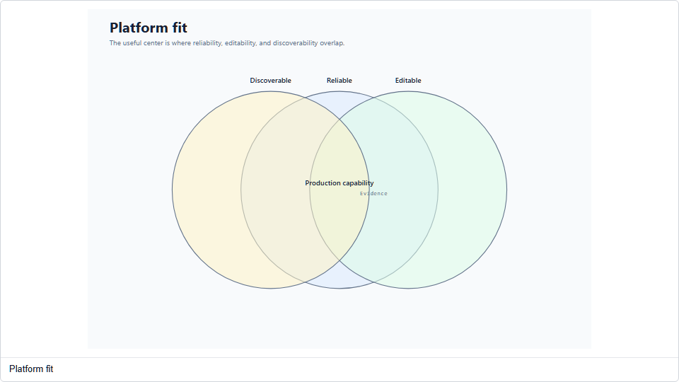

### Ranked funnel

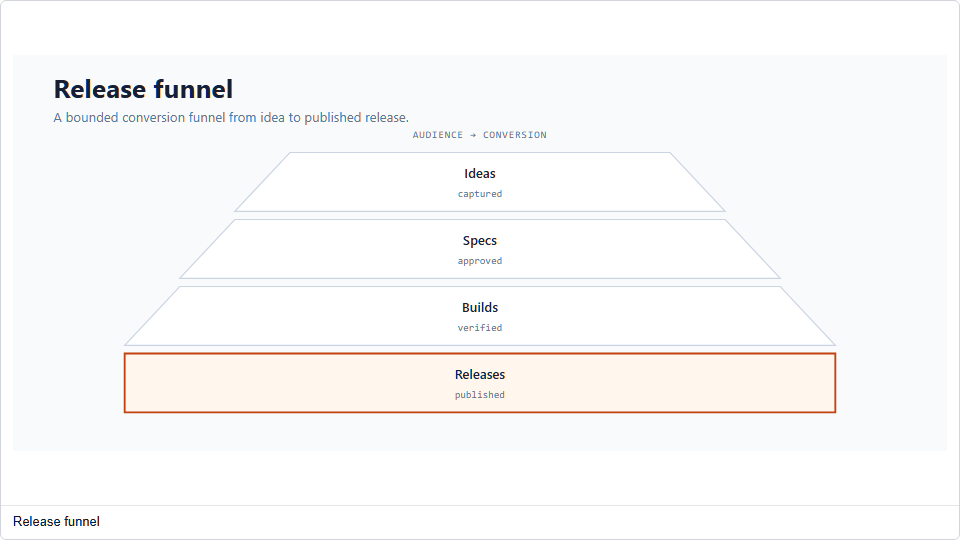

### Loop

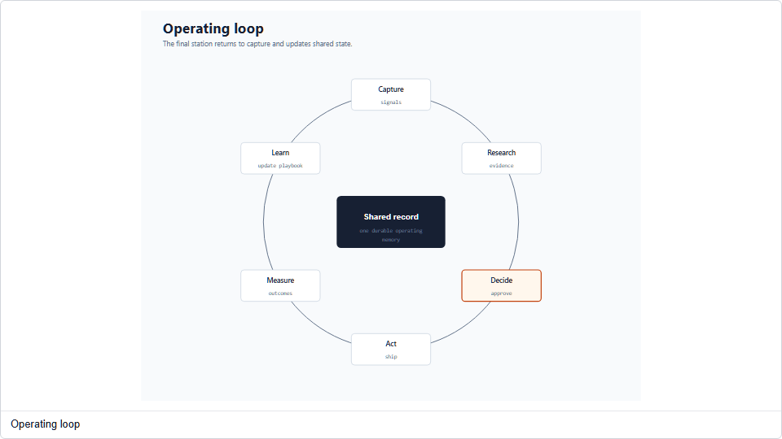

### Nested scope

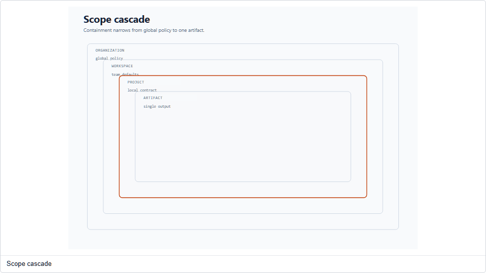

### Tree

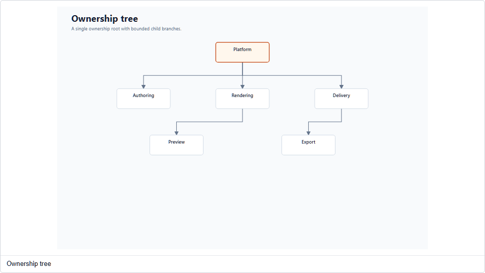

### Process

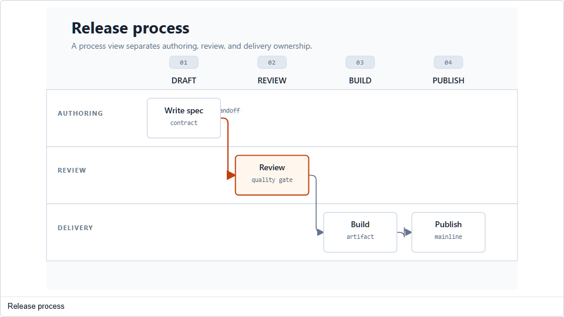

### Medallion

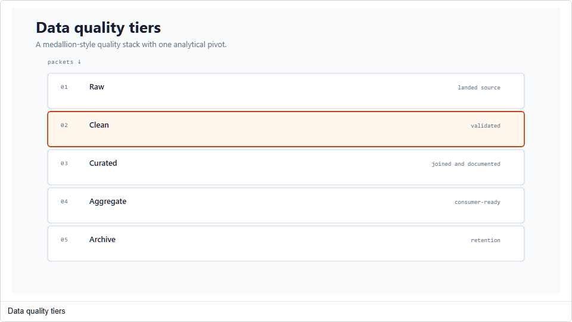

### High-level overview

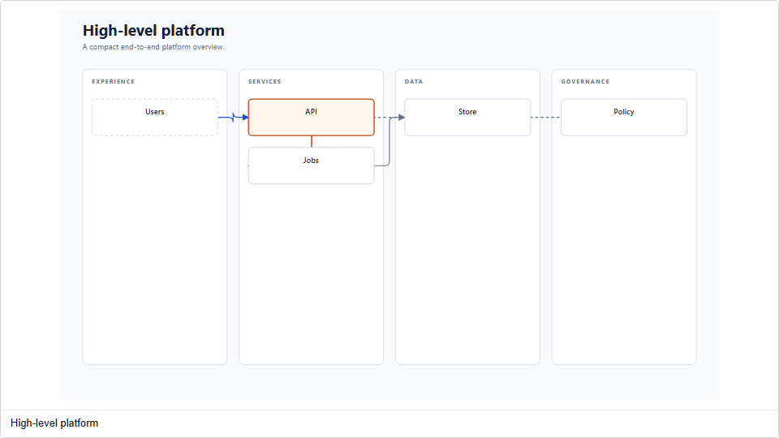

## Reference-Only Layouts

The following 5 IDs remain imported from `ref/diagram-design` for development-time taxonomy comparison and future admission discussions. They are intentionally namespaced as `diagram-design:*`, carry reference revision `09df49d8d1a1c7fb2efdfcdc7a2a0713534350a6`, and do not appear in the runtime intent selector or plugin UI. The checkout is never bundled and its original screenshots are never displayed:

`flowchart`, `sequence`, `state-machine`, `er-data-model`, `pyramid-funnel`.

Promoting one of these layouts requires a semantic input contract, a production renderer, a fixture, a target/export matrix, accessibility checks, and deterministic gallery output. A visual resemblance to the reference is not sufficient evidence of support.
