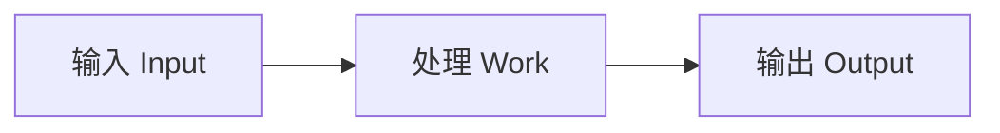

# Office 保真度与中文排版

## 可编辑文本

**中文粗体 Bold** 与常规 Latin 共用基线。行内代码 `const retry = 3` 必须保持可读。

- 第一项 / First item
- 第二项包含足够长的内容，需要自然换行，不能产生第二个项目符号，也不能覆盖相邻段落。

缺失字体回退：中文内容仍然可以编辑。

## 表格度量

| 契约 | 中英文内容 | 状态 |
| --- | --- | --- |
| 取消 | 晚到响应不能重新写入文件 | 已验证 |
| 恢复 | 保留外部编辑的内容，并保存可恢复的写入前像。 | 已验证 |
| 边界 | 长文本应在单元格内换行，并保留四周内边距。This text must not overlap an adjacent cell. | 待复核 |

<table><tr><th colspan="2">合并标题 / Merged header</th></tr><tr><td>左 Left</td><td>右 Right</td></tr></table>

## 图层顺序

背层 / Background layer

前层 / Foreground layer

## 图表回退

Mermaid 几何继续采用明确的图片 fallback，周围文本保持可编辑。
