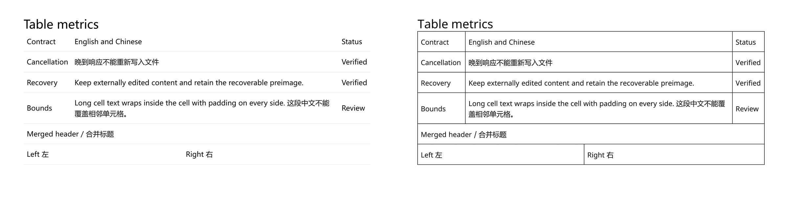

# Mainline Reliability: Implementation And Acceptance

Language: **English** | [简体中文](./reliability-acceptance-2026-09-12.zh-CN.md)

The [implementation plan](../plans/2026-09-12-mainline-reliability-and-evidence.en.md) follows the `7638cec` audit. This record owns execution evidence. [Machine-readable measurements and artifact hashes](./evidence/2026-09-12/verification.json) distinguish each measured bundle from the final production bundle. Version metadata remains `1.9.7`; this batch does not create a release or tag.

## Disposition

| Unit | Implemented / measured outcome | Acceptance boundary |
|---|---|---|
| U1 | Scheduler settlement, live child cancellation, effective signals through five transports and retries; completed writes retain their count | Real Obsidian cancellation passed; non-abortable `requestUrl` still cannot stop server-side work |
| U2 | Complete output reservation, per-Vault overlap serialization, atomic text compensation, recovery copies and explicit failures | No cross-process/crash transaction promise; retain creations/binaries when ownership cannot be proved |
| U3 | Linux/Windows Node 20 verification and diagnostic-level lint ratchet | Normal PR passed; isolated negative PR failed only the intended assertion on both platforms and was closed unmerged |
| U4 | PNG hashes, canonical SVG text comparison, structural docs tests | Archive integrity is separate from pixel equivalence and consumer acceptance |
| U5 | Named host timing, repeated preview/GC control, desktop/mobile-emulation checks | Keep inline; physical mobile and Obsidian 0.15.0 remain unverified |
| U6 | Drawnix and diagrams.net edit/save/reopen; six compiler fixtures plus five orientation variants | Drawnix node roundtrip passed, attached cross-branch arrows failed; its runtime now reports that limitation |
| U7 | Immutable batch snapshots, removed/moved-file handling, frozen corpus and real Vault timing | Lexical quality has measured misses; this is not semantic-search acceptance |
| U8 | Correct DrawingML ordering, per-edge alpha, collapsed row separators, merged outer borders | Actual PowerPoint edit/save/reopen passed; native fonts are not pixel-identical to Chromium |

## Cancellation And Persistence

`callApiWithRetry` owns or inherits one signal across attempts. It only clears a controller it created. `requestUrl` cancellation settles the logical request and consumes late fulfillment/rejection; desktop HTTP/fetch abort their connection where supported. The scheduler awaits every worker, including cancellation before the first timer. Batch child reporters read live state instead of copying a boolean.

Artifact saves reserve the complete primary/SVG/wrapper/companion path set synchronously. Conflicting saves serialize within one Vault; independent outputs can progress concurrently. Text preimages are captured through `Vault.process`. Compensation changes a file only when its identity and current contents still match this operation. Legacy hosts without that atomic API receive recovery copies instead of unsafe read-then-write rollback.

Path identity is checked inside the host's atomic transform, and after legacy text/binary snapshot reads. Checking before an asynchronous `Vault.process` call was insufficient: a queued callback could act on a renamed/replaced file. Five new red/green cases cover those schedules. All five also passed in real Obsidian on the final bundle, including recovery-copy contents and subsequent queue usability: [host evidence](./evidence/2026-09-12/obsidian-persistence.json). The separate `verify:obsidian-persistence` probe requires the disposable-Vault marker and performs no window timing measurements.

There is no atomic binary restore or compare-and-delete API. Partial creations and binary outputs are retained and reported; recovery filenames end in `.notemd-recovery-<id>` so Markdown batches do not consume them. Old Drawnix companion folders are retained for inspection: generated names and a manifest do not establish ownership after editor/sync changes. Cancellation is checked again after snapshot reads and before subsequent directory creation.

Real Obsidian 1.13.7, installer 1.12.7, Electron 39.8.3 / Chromium 142.0.7444.265, Windows x64:

- Two concurrent loopback-provider calls cancelled in approximately **5 ms** after the cancellation request; zero generated/moved notes, zero active tasks. Both late responses were subsequently delivered and the source notes remained unchanged.
- An injected wrapper failure preserved an external edit and wrote the recoverable preimage. A later save succeeded, demonstrating that failure did not poison the output queue.
- The official `obsidian` CLI ran successfully. `obsidian-cli` was absent. Long multiline CLI parameters triggered a host JSON parsing error; the committed probe loads a local script through a short expression and fails on missing structured output.

## Verification And CI

Fresh local build and full Jest: **282 suites, 2589 passed, 1 skipped**. The skipped case requires POSIX descendant-process termination. The lint ratchet inspected 25 changed TypeScript files and found **zero regressions**. UI-string and render-host audits, 33 gallery fixtures, and 33 archived real-Vault examples passed. Full lint still has historical debt; a clean ratchet does not mean a clean global lint run. Bilingual coverage includes untracked repository documents so new fixtures cannot evade pre-commit checks; the Office fixture has a separate Chinese counterpart.

The workflow uses `npm ci`, Node 20 on Linux and Windows, and installs the browser revisions resolved by both `playwright` 1.61.0 and `playwright-chromium` 1.61.1. It has read-only repository permission, no provider secrets and no publication step. The ratchet matches path/rule/severity/message/column and mapped original line, consumes duplicate diagnostics one-to-one, handles renames and fails closed on tool/configuration failure. Removed debt cannot hide a different new error. Branch protection remains a separate administrative setting.

```bash
npm run build
npm test -- --runInBand
npm run lint:regressions -- --base-ref origin/main
npm run audit:i18n-ui
npm run audit:render-host
npm run diagram:gallery:check
npm run diagram:examples:check
git diff --check
```

Use `rtk proxy npm.cmd` / `rtk proxy git` on this Windows workstation. The fresh-install CI gate is the cross-platform verification source, not local Node 22 alone.

VitePress 1.6.4 and the 34-locale Docusaurus website build/audit passed. Paired Markdown documents have valid local links and matching plan/finding IDs; the register covers all 19 historical formal plans and 32 brainstorm records. Native evidence downloads are published at their relative URLs with byte equality checked; scoped Git attributes preserve archived bytes across Windows/POSIX checkouts.

The [positive PR run](https://github.com/Jacobinwwey/obsidian-NotEMD/actions/runs/34716224065) verified `805bda2` with **282 suites / 2590 tests on Linux**, and **282 suites / 2589 tests plus one POSIX skip on Windows**; build, audits, lint and diff hygiene all passed. The [negative PR run](https://github.com/Jacobinwwey/obsidian-NotEMD/actions/runs/34716310309) rejected only the deliberate `ciGateNegative` assertion on each platform. [PR 13](https://github.com/Jacobinwwey/obsidian-NotEMD/pull/13) is closed and unmerged; its remote branch was removed. Independent local compiler and lint probes rejected TS2322 and `no-debugger` respectively. The [machine receipt](./evidence/2026-09-12/ci-verification.json) retains revision/job URLs and counts, including the first CI-discovered bilingual-fixture gap and its correction. No gate was weakened to obtain acceptance.

## Host Cost And Packaging Decision

Measured on an i5-12600K with 64 GiB RAM. The final bundle is **10,059,753 bytes**, gzip **3,730,433 bytes**. Recorded activation is an eight-sample disable/enable measurement in an already running renderer, not complete OS process startup. Performance and final persistence probes identify their respective tested bundle hashes in the evidence JSON.

| Foreground path | First use (ms) | Warm p50 / p95 (ms), n=8 |
|---|---:|---:|
| Plugin activation | — | 226.7 / 289.3 |
| Mermaid, 5 CJK nodes | 54.8 | 23.4 / 27.4 |
| Mermaid, 40 CJK nodes | 95.8 | 92.1 / 120.0 |
| Vega, 8 CJK categories | 76.4 | 29.1 / 31.0 |
| Vega, 80 CJK categories | 38.5 | 42.8 / 55.2 |
| Drawnix architecture preview | 35.4 | 25.6 / 70.2 |

After a fresh Vault reload and explicit CDP GC, heap was 62.92 MB. After 30 catalog-preview cycles it was 66.30 MB; after another 30, 66.58 MB, with no residual preview modals. Thirty mobile-emulation cycles also completed; emulation is not physical-device evidence. Hidden-window scheduling is excluded from timing acceptance. Repeated development hot reloads retained much more memory and required a full Vault reload; this deserves a separate lifecycle investigation, not an automatic asset-loader rewrite.

**Decision: keep inline.** Use a provisional budget on this named host of activation p95 ≤500 ms, dense preview p95 ≤250 ms and ≤10 MB additional retained heap per 30 warmed preview cycles. Re-measure on lower-powered/physical mobile devices before generalizing. An isolation project must demonstrate a measurable benefit and update packaging/loader/release assets together.

## External Consumers

- **diagrams.net 31.4.5 / Chrome 152.0.7977.83:** imported the production XML exporter result, edited `API Gateway 已验证`, downloaded, reopened, and retained three native vertices and two edges. [Reopened source](./evidence/2026-09-12/native-roundtrip-edited.drawio) and [screenshot](./evidence/2026-09-12/drawio-reopened.png).
- **Drawnix source commit `9939f452745c3f401766d378f98faa5d26bcc48a`, package 0.0.2, Plait 0.93.1:** native node edit/save/reopen retained 38 nodes, 12 semantic relation records and one root. Its application layout detached the fixed-coordinate arrows. `source.id` / `target.id` are Notemd references, not Plait `boundId` handles. The upstream shape-binding contract excludes Mind nodes; substituting field names would not fix this. The renderer exposes `drawnix-static-cross-relations`, and the Plait gate explicitly limits its claim to hierarchy/static-arrow serialization. [Actual reopen screenshot](./evidence/2026-09-12/drawnix-reopened.png) records the failure. Prefer the existing SVG for connectivity; attached editable cross-links require a separately evaluated upstream capability or a different native target.
- **Tectonic 0.16.9**, pinned archive SHA verified; **Circuitikz 1.4.6**, PGF 3.1.9a, LaTeX 2021-11-15 patch 1: six golden templates and five mirrored/same-side variants compiled with `--only-cached`, with unchanged topology signatures. PDFium (`pypdfium2` 5.12.1) review found and led to fixes for NAND/NOR crossed gate wiring and mirrored component text, and transmission-gate S/D/control routing. Initial cold-cache downloads required a separate bootstrap. [Golden-template sheet](./evidence/2026-09-12/circuitikz/compiled-contact-sheet.png), [orientation sheet](./evidence/2026-09-12/circuitikz/orientation-contact-sheet.png), source/PDF/PNG hashes and logs are retained. A Fontconfig configuration warning remained in Windows output; the fonts rendered successfully.

These application checks used generated fixtures in isolated contexts. They do not promote every Drawnix layout, every external application version, or the oldest manifest support declaration.

## Retrieval Quality And Batch Semantics

The frozen corpus contains **13 files / 13 queries**, with synonyms, Chinese compounds, navigation, duplicate titles, long sections, mixed file/folder scopes and no-answer cases. It was authored independently from the earlier fixture; it is synthetic engineering material, not an externally labeled benchmark. Scores were not used to tune the retriever.

| Configuration | Positive-query recall | Macro source precision, abstention=0 | Context characters p50 / p95 |
|---|---:|---:|---:|
| Top-1 | 6/9 (66.7%) | 66.7% | 272 / 566 |
| Top-3 | 7/9 (77.8%) | 51.9% | 313 / 1106 |

The payment synonym and continuous Chinese query miss. Navigation and current-file-exclusion cases can still return unrelated sources. Top-3 improves recall at an explicit precision/context cost. A real Obsidian inspect run performed 65 rebuilds: total p50/p95 **8.6/23.8 ms**, file-read p95 **16.5 ms**, enumeration p95 **0.1 ms**. This small corpus uses a warm OS cache. Normal title batches reuse one retriever; these inspect timings must not be multiplied into the batch query path.

Candidate paths/titles are captured before asynchronous reads. A file moved during its read is omitted; a disappeared file does not discard other knowledge; unrelated I/O errors still propagate. Once built, the batch snapshot retains acquired text even if the Vault changes. A new operation rebuilds it. This is a per-file read snapshot, not an atomic whole-Vault snapshot. Use narrow task scopes now; evaluate CJK tokenization/ranking on a new validation split before considering embeddings.

```bash
npm run evaluate:local-kb
npm test -- --runInBand src/tests/localKnowledgeSnapshot.test.ts
```

The evaluator's tests assert scope/budget/schema behavior. Its score report can contain poor recall; a passing test is not a search-quality endorsement.

## PowerPoint Fidelity

The [bilingual content fixture](./fixtures/pptx-office-fidelity.md) produced 10 slides, 18 editable text boxes and two native tables. PowerPoint **16.0 build 14332** edited a native cell, saved a separate PPTX, reopened it and rendered all ten slides. The edited cell and all six CJK-bearing table grid cells survived. [Roundtrip report](./evidence/2026-09-12/office-roundtrip.json).

The fix family is table paint: DrawingML line properties now precede the fill group, each edge retains its opacity, collapsed row separators reach native cells, and merged continuation cells carry only the external border. Before/after table-slide RMSE improved from **0.192665 to 0.159463**. The repository's existing visible-native profile passed (max 0.25, mean 0.145); the additional raster-strict experiment (0.12/0.08) remains failed. No thresholds were changed. Font shaping, CJK baselines and complex CSS still differ between Chromium and Office; Mermaid/SVG geometry remains explicit image fallback.




```bash
npm run verify:slidev-export -- --vault docs/maintainer/fixtures --source pptx-office-fidelity.md --format pptx --output-subfolder export --sample-slides all --require-pptx-visual-match --pptx-visual-renderer powerpoint --json
```

For native editing acceptance on Windows, run `scripts/verify-powerpoint-roundtrip.ps1` with `-InputPptx` and a new `-OutputDirectory`; it refuses an already running PowerPoint session and never overwrites the input. For Obsidian, use `npm run verify:obsidian-host -- --vault <disposable-vault> --cli <obsidian-cli-executable>` after copying the built plugin and creating the explicit marker. No committed gate depends on `.trellis/` or an untracked cache report.

For the focused rename/replacement acceptance, run `npm run verify:obsidian-persistence -- <disposable-vault> <obsidian-cli-executable> <report.json>`. Reload the copied plugin first; bundle hashes must match. This command is independent of foreground-window profiling and restores every injected Vault method and in-memory setting before returning.
