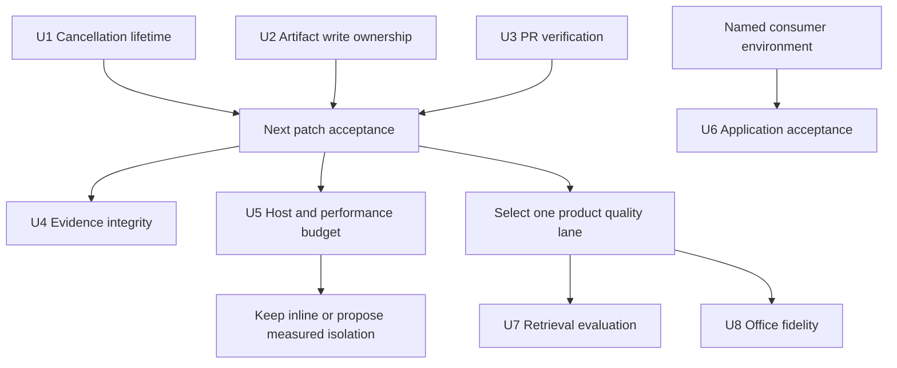

# Mainline Reliability And Evidence Implementation Plan

Language: **English** | [简体中文](./2026-09-12-mainline-reliability-and-evidence.zh-CN.md)

This plan follows the [September 12 assessment](../maintainer/project-plan-status.md) and the updated [current-main record](../brainstorms/2026-09-02-current-main-progress-and-forward-plan.md). Implementation is authorized and runs inline. The earlier audit is a separate completed documentation baseline; runtime progress is recorded below.

## Execution Record

| Unit | State | Evidence / remaining gate |
|---|---|---|
| U1 | Implemented and verified | Red/green regressions, real HTTP/fetch abort and Obsidian 1.13.7 cancellation; caller-owned signals preserved. |
| U2 | Implemented and verified | Output reservations, guarded compensation, real Vault rename/conflict/retry; stateful tests cover both same-basename failure orders, shared companions and failed-save history handoff. |
| U3 | Complete | Linux/Windows Node 20 PR checks passed; an isolated PR failed only its deliberate Jest assertion on both platforms and was closed unmerged. Compiler/lint negative probes also rejected their injected errors. [CI receipt](../maintainer/evidence/2026-09-12/ci-verification.json). |
| U4 | Complete | Committed PNG hashes, normalized SVG comparison and contract-focused docs assertions. |
| U5 | Investigation closed: keep inline | Activation p95 289.3 ms, dense Mermaid p95 120 ms, stable warmed preview heap. Physical mobile and Obsidian 0.15.0 remain unverified. |
| U6 | Evaluation complete; claims qualified by target | diagrams.net edit/save/reopen passed; six Tectonic templates plus five orientation variants compiled and visually reviewed. Drawnix native nodes roundtrip; attached cross-links fail and are explicitly unsupported. |
| U7 | Bounded lane complete | Frozen 13-query corpus, snapshots, real Vault I/O, estimated context tokens and GC-controlled retained/released heap. `benchmark:local-kb` records build/query distributions; semantic/CJK misses remain visible. |
| U8 | Bounded lane complete | Table border/alpha/merge fixes, actual PowerPoint 16 edit/save/reopen and unchanged visible-native fidelity gate. Raster-strict fidelity remains unclaimed. |

The [acceptance record](../maintainer/reliability-acceptance-2026-09-12.md) owns versions, measurements, hashes, screenshots and integration results. The user's full execution request included both bounded product lanes: U7 measures retrieval and fixes snapshot semantics; U8 fixes the observed table-paint defect family. Neither adds embeddings or general native Office reconstruction. Completed evaluation does not turn an unavailable device or failed consumer capability into a passing support claim.

## Objective And Scope

Make cancellation terminate predictably and protect user artifacts through failed or overlapping operations. Establish PR verification and evidence that measures actual outcomes. Preserve the existing product surface while deciding optimization and quality work from measurements.

Requirements:

- Q1: cancelling before scheduling, during requests, or before persistence has an explicit terminal outcome; late work cannot start new mutations after cancellation is observed.
- Q2: a failed artifact save cannot restore/delete a different operation's successful output; incomplete recovery is visible.
- Q3: plugin regressions are detected before merge/tagging without secrets, live providers or release privileges.
- Q4: evidence distinguishes archive integrity, runtime behavior, visual fidelity and application interoperability.
- Q5: performance and product-quality work uses named environments, baselines and stop conditions.

Runtime expansion, public mutation-API promotion, a generic transaction framework, application embedding, wholesale legacy rewriting and a global lint autofix are outside this batch. Persisted settings, command IDs, file formats, shared streaming fallbacks and the default One-Click Extract workflow remain compatibility constraints.

## Sequence And Effort

U1, U2 and U3 have independent implementation ownership but must pass integration together before the next patch. Start U3 early so it protects the correctness work. U4/U5 follow as a measured slice; their investigations can overlap the first batch without blocking it. U6 depends only on the relevant consumer environment. U7/U8 are alternative next product priorities, not prerequisites for each other or for bug fixes.

Planning estimate for one engineer familiar with the repository: U1 **2–3**, U2 **2–4**, U3 **1–2 engineering days**; approximately **5–9 days** before additional review/device setup. These are sizing estimates, not a delivery-date promise. Discovery for U5 is limited to two engineering days before a keep/defer/propose decision; do not leave it as a permanently open prerequisite.

## U1 — Own Cancellation For The Complete Operation

- [x] Implement and verify Q1; closes R1, R2 and R3.

**Owner and files:** `src/utils.ts#createConcurrentProcessor`, `src/fileUtils.ts#batchGenerateContentForTitles`, `src/llmUtils.ts#callApiWithRetry` and provider executors. Check `src/types.ts`, `src/ui/ProgressModal.ts` and the operation/host caller only where the lifetime contract crosses them. Regression files: `src/tests/parallelBatch.test.ts`, `src/tests/llmUtilsProviderSupport.test.ts`; create a focused `src/tests/concurrentProcessorCancellation.test.ts` for scheduler terminal-state coverage.

**Approach:** the operation owns cancellation, the scheduler owns settlement, and each transport owns its physical abort capability. Children read live state and consume the operation signal; they must not replace the parent's controller with request-local state. Forward the effective signal produced by the existing boundary. Ensure queued/staggered callbacks settle exactly once even when cancellation occurs before any worker starts. Preserve completed results and prohibit additional mutation starts after cancellation is observed.

`requestUrl` may lack physical abort support. Cancel the logical operation at its transport boundary, consume late completion safely and prohibit retries/persistence from it; do not claim that this stops server-side generation or billing. Existing writes already in flight have a different boundary from writes not yet started. Do not promise cancellation undoes earlier successful writes.

**Test first:** turn the audit schedules into assertions of corrected behavior:

1. Cancel before the first timer and during a stagger delay: the Promise settles, queued tasks do not run, active counts return to zero and no timers keep dispatching.
2. Start two pending title-generation calls, cancel, deliver both late responses: no new `vault.modify` or `vault.rename`; the result is cancelled and already-completed work remains accurately counted.
3. With no supplied signal, reporter cancellation aborts desktop/fetch transport; with a supplied signal, its ownership and listener cleanup are preserved.
4. Exercise cancellation during each transport's success, interrupted stream, fallback and retry delay. Preserve partial debug output and prevent post-cancel fallback attempts. Include a cached response and repeated cancellation.
5. Verify the host that cannot physically abort: operation settles, late response/rejection is handled, and no file mutation follows.

**Exit:** focused tests, full build/Jest and a real supported Obsidian cancellation smoke agree. If a host version cannot supply the expected API, document the limitation rather than silently expanding its support claim. Do not replace this with a new workflow/controller framework.

## U2 — Make Artifact Persistence Respect Write Ownership

- [x] Implement and verify Q2; closes R4.

**Owner and files:** `src/fileUtils.ts#saveDiagramArtifactFile` and its companion-path preparation. Preserve the complete save operation as the boundary. Regression files: `src/tests/saveDiagramArtifactFile.test.ts` and `src/tests/diagramCommandHostAdapter.test.ts`; check history recording only at the successful save handoff.

**Approach:** preflight the full primary/SVG/wrapper/companion path set before mutation. Serialize overlapping writes per Vault within the plugin; unrelated outputs should remain independent. The operation owns snapshots, bytes it wrote and created-path cleanup. On failure, compensation may touch only state still attributable to that operation. Return the original failure together with recovery conflicts/failures and affected paths; never silently discard restoration errors.

A separate read-then-`modify` comparison is not an atomic compare-and-swap against editor/sync writes. Confirm a supported atomic text-update primitive against the declared Obsidian support range before using it. Where ownership cannot be established atomically, preserve recovery data and report the conflict instead of blindly restoring or deleting. A per-instance queue also does not coordinate another Obsidian process/device. Keep these guarantees explicit; do not describe the result as crash-atomic multi-file storage.

**Test first:** use a stateful in-memory Vault and controlled scheduling, not only `toHaveBeenCalledWith`:

1. A reaches wrapper persistence, B requests the same output set, A fails: B's eventual successful bytes survive. Reverse completion/failure order as well.
2. Two source notes with the same basename and a shared custom output directory collide deterministically; overlapping companions also serialize. Independent directories can progress concurrently.
3. Fail after SVG, binary companion, primary artifact and wrapper writes. Restore owned existing bytes and clean only owned creations; report every failed recovery step.
4. Simulate an external edit between write and rollback: preserve the edit and expose recoverable prior content. Cover path replacement and a newly created file subsequently changed by another writer.
5. A rejected queue item must not poison the next save. History contains no successful entry for an unsuccessful save.

**Exit:** R4 cannot be reproduced, single-invocation failure recovery remains correct, and conflicting edits are preserved or explicitly surfaced. If safe compensation requires unsupported host primitives, choose generation-specific staging/recovery before changing compatibility promises. Do not spread locks across command/sidebar/preview callers.

## U3 — Verify Plugin Changes Before Merge

- [x] Implement and verify Q3; closes R5 and starts lint debt containment.

**Owner and files:** new `.github/workflows/verify-plugin.yml`; existing release workflow stays tag-scoped. Use `package-lock.json` and repository scripts. A small lint comparison script belongs under `scripts/`; add `src/tests/lintBaselineRatchet.test.ts` for its comparison behavior. Review `src/tests/toolingIsolationConfig.test.ts`, `.eslintrc` and `.eslintignore` only as needed.

**Approach:** PR/main verification runs reproducible dependency installation, typecheck/build, the full Jest suite, UI-string and render-host audits, and diff hygiene. Cover Linux and Windows, with the release job's Node version explicitly represented. Pin browser installation for the existing Playwright-backed tests. Fork PRs receive read-only repository permissions and no provider credentials; never use a privileged PR trigger to run untrusted code. Do not add publication or real Vault mutation to this workflow.

The current ESLint baseline is 231 errors/1374 warnings. Compare relevant diagnostics with the merge-base baseline using stable path/rule/location mapping; fail newly introduced errors and require touched logic to address applicable correctness warnings. A single aggregate count is inadequate because one removed warning could hide a new error. Account for line movement and renamed files. Keep the existing npm lock/install contract despite the `packageManager` metadata naming pnpm; choose any package-manager migration separately.

**Verification scenarios:** a failing plugin test prevents the PR job succeeding; a compiler error cannot hide behind Jest's disabled TypeScript diagnostics; a new lint error fails even if another file's debt decreases; unchanged shifted diagnostics do not fail; deleted/renamed files and Windows separators compare correctly; linter execution/JSON failure fails closed. YAML itself needs no implementation-mirroring unit test: validate workflow execution and uploaded failure evidence.

**Exit:** successful and deliberately failing PR runs demonstrate the gate. Requiring the check through branch protection is a separate repository-admin setting and is not assumed from the YAML alone. No remote settings are changed by this planning audit.

## U4 — Make Evidence Verify What It Claims

- [x] Implement and verify Q4; closes R6/R7.

**Owner and files:** `scripts/generate-diagram-gallery.js`, `scripts/lib/diagram-gallery-runtime.js`, `docs/assets/diagrams/manifest.json`, `src/tests/diagramGalleryGenerator.test.ts`, `src/tests/currentMainProgressDocsContract.test.ts`, and the paired capability/progress docs. Reuse the existing schema/manifest pattern; do not invent a second capability registry.

**Approach:** record and check committed PNG hashes as asset identity. Treat regenerated pixel comparison separately under pinned renderer/browser/font conditions; cross-platform PNG byte equality is not a fidelity requirement. Preserve examples' input/output hashes, producer/environment and archive status. A documentation-only commit does not require paid LLM regeneration. Remove assertions that pin audit opinions, while retaining source-derived catalog coverage, bilingual existence and stable format contracts.

**Tests:** replace a PNG with a different valid PNG and expect integrity failure; corrupt an SVG or required manifest entry and fail; change only audit judgment wording without changing capabilities and keep structural tests passing; missing paired docs/unsupported capability claims still fail. Keep explicit failed/unavailable evidence representable.

**Exit:** every gate names whether it proves archive integrity, executable behavior, visual equivalence or actual consumer acceptance. Classify compatibility exports by documented support and real consumers; migrate internal tests with internal aliases instead of demanding proof that no hypothetical external caller exists. Persisted identifiers still require migration coverage.

## U5 — Measure Host Cost Before Choosing Runtime Isolation

- [x] Establish Q5's host and performance baseline; addresses R8.

**Owner and files:** `scripts/lib/esbuild-bundle-config.js`, `src/rendering/host/iframeRenderHost.ts`, `src/rendering/webview/bundledPreviewDeps.ts`, existing `scripts/verify-vault-bundle.js`, `manifest.json`, and a compact maintainer measurement record. Add measurement code only at the existing build/host seam; production instrumentation is optional, not a prerequisite.

**Measurements:** retain bundle size/hash; named Obsidian/OS/device/browser/font versions; plugin activation; cold/warm Mermaid, Drawnix and Vega preview p50/p95; heap growth and recovery across repeated open/close cycles. Use small and dense CJK fixtures. Record the sample count and variance. Verify desktop/mobile behavior and the oldest support boundary being claimed; `isDesktopOnly: false` and `minAppVersion: 0.15.0` currently exceed this audit's real-host evidence.

**Decision:** first establish a repeatable baseline and an explicit acceptable budget; then choose keep-inline, targeted load reduction, or a separately scoped asset-isolation implementation. The measured 10,056,115-byte bundle alone cannot select between them. Check algorithm/render work and repeated runtime initialization before assuming bytes are the bottleneck.

**Exit/stop:** within the two-day investigation timebox, record measured keep/propose or environment-blocked/deferred status. An unavailable device is not a passing support test. If isolation is justified, build output, loader, audit, required release assets, docs and real-host consumption must change together; do not ship the candidate loader independently. Pure measurement has no new unit-test requirement; validate the measurements and fixture repeatability.

## U6 — Admit External Consumer Claims Individually

- [x] Establish target-specific Q4 evidence where the consumer is available.

**Owner and files:** `scripts/run-drawnix-consumer-gate.mjs`, `scripts/test-drawnix-plait-consumer.mjs`, `scripts/run-circuitikz-smoke-fixtures.js`, corresponding maintainer runbooks and capability records. Add an application harness only for the chosen target; no embedded copy of the application. Regression paths include `src/tests/drawnixPlaitConsumer.test.ts`, `src/tests/drawioExporter.test.ts` and `src/tests/circuitikzSmokeFixturesCli.test.ts`.

**Acceptance:** for a named Drawnix/diagrams.net version, open/import, edit a native node/label, save, reopen and verify hierarchy/relations plus a readable screenshot. A custom viewer using Notemd's own projection is not independent application evidence. For Circuitikz, pin compiler/package versions and compile the six golden templates, retaining input/output hashes, logs and render checks. Preserve the distinction between a compiler producing a file and legible electrical meaning.

**Tests and failure policy:** malformed/unsupported native artifacts fail with target-qualified diagnostics; unavailable executables produce an explicit unavailable result, not green acceptance; serializer/Plait checks still run without the application. Gate only the target's promoted interoperability claim. This unit does not depend on a split runtime and does not block the U1/U2 fixes.

## U7 — Improve Retrieval From An Independent Corpus

- [x] Pursue Q5 product quality after the correctness patch; default recommended quality lane.

**Owner and files:** `src/localKnowledgeBase.ts`, `src/markdownSectionUtils.ts`, `src/tests/localKnowledgeEvaluationFixture.test.ts`, `src/tests/localKnowledgeBase.test.ts`, `src/tests/localKnowledgeTaskIntegration.test.ts`, and the paired June 9 retrieval documents.

**Approach:** retain the existing offline fixture and batch retriever reuse. Add a held-out corpus whose queries/relevance labels are not copied from the same note wording: Chinese/English, synonymous phrasing, navigation notes, duplicate titles, long sections, mixed file/folder scopes and edited/deleted notes during a batch. Report recall at the configured top-K, source precision, context characters/tokens, build/query p50/p95 and retained memory. The current fixture's path-recall proxy is not evidence of semantic retrieval quality.

Index construction currently enumerates Vault files and serially reads candidate bytes before building MiniSearch; budget enumeration, file I/O and indexing separately. Preserve explicit task/path scope. Establish snapshot semantics for a long batch before adding cache invalidation or a persisted index. Only consider embeddings if held-out misses are meaningfully semantic and the privacy/install/storage/cost budget is acceptable.

**Tests/exit:** unchanged bounded behavior passes current fixtures; irrelevant and current-file leakage stay controlled; deleted/changed candidates have an explicit outcome; the held-out report shows the quality/cost tradeoff without tuning against its labels. Do not add a server, vector database or generic RAG subsystem merely to improve the architecture diagram.

## U8 — Improve Office Fidelity Under A Named Renderer

- [x] Pursue Q5 when actual PPTX usage/defects justify this alternative quality lane.

**Owner and files:** `src/slideExport/pptxDomExtractor.ts`, `src/slideExport/pptxWriter.ts`, `src/slideExport/pptxFontContract.ts`, `scripts/verify-slidev-export-workflow.cjs`, `src/tests/pptxWriter.test.ts`, `src/tests/pptxVisualDiff.test.ts`, `src/tests/pptxExportReport.test.ts`, and paired PPTX acceptance docs.

**Approach:** fix one defect family at a time: font substitution, table padding/baseline, paragraph/list spacing, or layer order. Compare rendered-HTML reference with actual opened/reopened Office output. Attribute native text/table/shapes separately from fallback images. LibreOffice evidence must be labeled as LibreOffice; do not generalize it to PowerPoint.

**Tests/exit:** CJK and missing-font cases, long/merged table cells, inline code, rich text and z-order maintain editable visible text without duplicate/background residue; per-slide drift and fallback ownership are recorded. Mermaid/SVG geometry remains explicit fallback unless a separate user requirement warrants native reconstruction. Without a real consumer, this stays a local writer/structure improvement and cannot close the Office fidelity claim.

## Tradeoffs And Rejected Shortcuts

| Choice | Benefit | Cost / decision |
|---|---|---|
| Complete-operation cancellation | Fixes both resource lifetime and late mutation | Requires coherent scheduler/transport/persistence seams; a copied boolean or local UI flag is insufficient. |
| Per-output save ownership | Prevents one plugin save undoing another without serializing all work | Does not provide cross-process/crash ACID; conflicts need explicit recovery rather than unsafe confidence. |
| PR gate plus lint ratchet | Prevents new debt without rewriting working code | Baseline comparison must handle source movement and tool failures; do not hide defects in aggregate counts. |
| Keep inline after profiling | Preserves current packaging/release contract | Named desktop budgets passed; re-measure other devices and investigate specific lifecycle failures before proposing isolation. |
| Lexical quality before embeddings | Improves four task families with existing dependencies | May expose semantic misses it cannot solve; use that evidence to justify a later architecture change. |
| Targeted Office fidelity before wider object extraction | Improves existing editable output | Requires a consuming application and font-controlled evidence; source XML tests alone are insufficient. |

## Delivery And Review Discipline

Begin runtime fixes with failing behavior tests; use characterization coverage for legacy paths. Keep the shared OpenAI-compatible and non-compatible streaming fallback/debug contracts. Each unit lands a complete invariant at its owner; do not move conditionals into options/strategy/pass-through layers to disguise complexity.

For the correctness patch, run the fresh build, focused then full Jest, i18n/render-host audits and diff hygiene. For affected docs/gallery/export units add their specific gates. Preserve bilingual docs and the four required release assets; publishing remains a separately authorized action. Do not make committed gates depend on `.trellis/` or local audit cache contents.

Before declaring a unit complete, record source revision, environment, observed output, remaining limitations and the exact supported claim. The review must challenge logical-versus-physical cancellation, atomicity against external writers, independent consumer evidence, unsupported host versions and false packaging dependencies. Missing external evidence remains explicit; it is neither success nor a reason to freeze unrelated progress.
