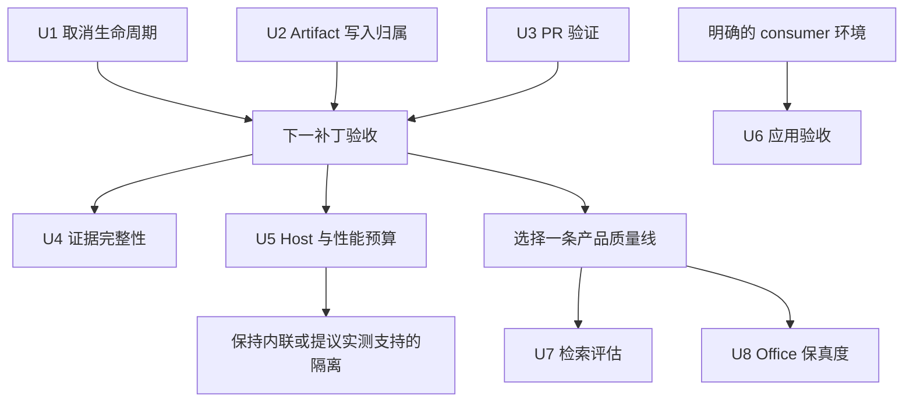

# 主线可靠性与证据推进计划

语言：[English](./2026-09-12-mainline-reliability-and-evidence.en.md) | **简体中文**

本计划承接[9 月 12 日评估](../maintainer/project-plan-status.zh-CN.md)和更新后的[当前主线记录](../brainstorms/2026-09-02-current-main-progress-and-forward-plan.zh-CN.md)。审计／文档工作按其记录的验证结果收尾；**本轮审计没有实施下列任何 runtime 单元**。

## 目标与范围

让取消确定地结束操作，在失败或重叠操作中保护用户产物；建立 PR 验证与面向真实结果的证据。维持既有产品范围，通过测量选择优化和质量工作。

需求：

- Q1：排程前、请求中、持久化前取消都具有明确终态；观察到取消后，迟到工作不能启动新的变更。
- Q2：失败的 artifact 保存不能恢复／删除另一操作的成功输出；恢复不完整必须可见。
- Q3：合并／打 tag 前发现插件回归，不依赖密钥、真实 provider 或发布权限。
- Q4：证据区分归档完整性、运行行为、视觉保真度、应用互操作。
- Q5：性能与产品质量工作有明确环境、基线和停止条件。

本批不包含 runtime 扩容、公开变更 API 升级、通用事务框架、应用嵌入、整体重写 legacy 或全仓 lint autofix。持久化设置、command ID、文件格式、共享流式 fallback、默认 One-Click Extract 工作流继续作为兼容约束。

## 顺序与工作量

U1、U2、U3 的实现归属独立，但下一补丁必须联合通过集成验收。尽早启动 U3，让它保护正确性修复。U4／U5 是随后的一轮实测切片，其调查可以与前一批重叠，不阻塞前一批。U6 仅依赖相应 consumer 环境。U7／U8 是下一产品优先级的备选，不互为前置，也不阻塞 bugfix。

按一名熟悉仓库的工程师估算：U1 **2–3**、U2 **2–4**、U3 **1–2 工程日**，合计约 **5–9 日**，不含额外评审／设备准备。这是范围估算，不是交付日期承诺。U5 调查限制在两个工程日内，之后给出保持／延后／提议决定，不允许成为永久开放的前置条件。

## U1 — 完整操作拥有取消生命周期

- [ ] 实现并验证 Q1，关闭 R1、R2、R3。

**责任方与文件：** `src/utils.ts#createConcurrentProcessor`、`src/fileUtils.ts#batchGenerateContentForTitles`、`src/llmUtils.ts#getAbortSignal` 及各 provider executor。仅当生命周期契约跨越边界时检查 `src/types.ts`、`src/ui/ProgressModal.ts`、operation／host caller。回归文件：`src/tests/parallelBatch.test.ts`、`src/tests/llmUtilsProviderSupport.test.ts`；新增聚焦排程终态的 `src/tests/concurrentProcessorCancellation.test.ts`。

**方案：** operation 拥有取消，scheduler 拥有结束责任，各 transport 拥有物理中断能力。子任务读取实时状态、消费 operation signal，不能用请求局部状态替换父 controller。向下传递已有边界生成的实际生效 signal。即使第一个 worker 尚未启动，排队／错峰 callback 在取消后也必须只结束一次。保留已完成结果，观察到取消后禁止启动额外变更。

`requestUrl` 可能不支持物理中断。在 transport 边界结束逻辑操作，安全消费迟到结果，并禁止它继续 retry／持久化；不能据此宣称服务端生成或计费已停止。正在执行的写入和尚未开始的写入是不同边界，取消不承诺撤销此前成功的写入。

**测试先行：** 将审计调度转为断言正确行为的用例：

1. 首次 timer 前、错峰延迟中取消：Promise 结束、排队任务不执行、活动计数归零、timer 不再继续派发。
2. 两个标题生成请求挂起，取消后均迟到返回：不新增 `vault.modify`／`vault.rename`；结果为 cancelled，已完成工作计数准确保留。
3. 未提供 signal 时，reporter 取消实际中断 desktop／fetch；提供 signal 时，保持它的归属与 listener 清理。
4. 每类 transport 覆盖成功、断流、fallback、retry delay 中取消；保留 partial debug，取消后不再 fallback。包括缓存命中和重复取消。
5. 对无法物理中断的 host，验证逻辑操作结束、迟到成功／失败均被处理、后续没有文件变更。

**退出条件：** focused tests、完整 build／Jest、受支持 Obsidian 中的真实取消 smoke 一致。host 版本不提供所需 API 时明确限制，不悄悄扩大支持声明；不以新 workflow／controller 框架替代这个修复。

## U2 — Artifact 持久化遵守写入归属

- [ ] 实现并验证 Q2，关闭 R4。

**责任方与文件：** `src/fileUtils.ts#saveDiagramArtifactFile` 及其 companion 路径准备；保留完整保存操作作为边界。回归文件：`src/tests/saveDiagramArtifactFile.test.ts`、`src/tests/diagramCommandHostAdapter.test.ts`；仅在成功保存交接处核对 history 记录。

**方案：** 首次变更前预检 primary／SVG／wrapper／companion 的完整路径集合。在同一 Vault 的插件实例内串行化重叠写入，无关输出维持独立。操作拥有快照、自身写入的字节、创建路径的清理责任。失败补偿只能触碰仍可归属于本操作的状态。原始失败必须连同恢复冲突／失败和受影响路径一起报告，不能静默丢弃恢复错误。

独立的 read 再 `modify` 不是对 editor／sync 写入的原子 compare-and-swap。使用原子文本更新原语前，先验证其覆盖声明的 Obsidian 支持范围。无法原子确认归属时，保留恢复数据并报告冲突，不盲目恢复／删除。实例内队列也不会协调另一 Obsidian 进程／设备。明确这些保证，不将其描述为多文件崩溃原子存储。

**测试先行：** 使用有状态内存 Vault 与可控调度，不只验证 `toHaveBeenCalledWith`：

1. A 到达 wrapper 持久化，B 请求相同输出集合，A 失败：B 最终成功字节保留；反转完成／失败顺序再验。
2. 不同源笔记同 basename、共用自定义输出目录时，冲突确定；companion 重叠也串行；独立目录可并发前进。
3. 在 SVG、二进制 companion、primary artifact、wrapper 各阶段失败：恢复自身拥有的旧字节，仅清理自身创建，报告每次恢复失败。
4. 模拟写入到回滚之间的外部编辑：保留编辑，暴露可恢复旧内容；包括路径被替换，以及新建文件随后被其他 writer 修改。
5. 队列中的一次失败不破坏下一次保存；失败保存不进入成功 history。

**退出条件：** R4 无法复现，单次调用失败恢复仍正确，冲突编辑被保留或明确报告。安全补偿若依赖不支持的 host 原语，先选择按生成批次隔离的 staging／恢复方案，再考虑兼容承诺变化；不把锁散布到 command／sidebar／preview caller。

## U3 — 合并前验证插件变更

- [ ] 实现并验证 Q3，关闭 R5，并开始控制新增 lint 债务。

**责任方与文件：** 新增 `.github/workflows/verify-plugin.yml`；既有发布工作流继续限于 tag。使用 `package-lock.json` 和仓库脚本。小型 lint 比较脚本放入 `scripts/`，以 `src/tests/lintBaselineRatchet.test.ts` 验证比较行为。按需检查 `src/tests/toolingIsolationConfig.test.ts`、`.eslintrc`、`.eslintignore`。

**方案：** PR／main 验证运行可复现依赖安装、typecheck／build、全量 Jest、UI string 与 render-host 审计、diff hygiene。覆盖 Linux 和 Windows，并明确包含发布工作流的 Node 版本；为现有 Playwright 测试固定 browser 安装。fork PR 使用只读仓库权限，不提供 provider 凭据；不使用高权限 PR 触发器执行未信任代码。此工作流不包含发布或真实 Vault 变更。

当前 ESLint 基线为 231 errors／1374 warnings。使用稳定的 path／rule／location 映射与 merge-base 基线比较，新增 error 失败，触及逻辑处理适用的正确性 warning。单一总数不够：删除一个 warning 可能掩盖另一个新 error。处理行移动和文件重命名。尽管 `packageManager` metadata 指向 pnpm，本批维持既有 npm lock／install 契约；包管理器迁移单独决策。

**验证场景：** 插件测试失败会阻止 PR job 成功；编译错误不能被 Jest 关闭的 TypeScript diagnostics 掩盖；即使别处债务减少，新增 lint error 仍失败；仅移动行号的旧诊断不误报；删除／重命名文件、Windows 分隔符比较正确；linter 执行或 JSON 失败必须 fail closed。YAML 本身不需要照抄实现的单测，验证真实 workflow 执行和失败证据上传。

**退出条件：** 成功及刻意失败的 PR 运行证明门禁有效。通过 branch protection 强制该 check 属于单独的仓库管理设置，不能从 YAML 推定已生效；本次规划不修改远端设置。

## U4 — 让证据验证它实际声称的内容

- [ ] 实现并验证 Q4，关闭 R6／R7。

**责任方与文件：** `scripts/generate-diagram-gallery.js`、`scripts/lib/diagram-gallery-runtime.js`、`docs/assets/diagrams/manifest.json`、`src/tests/diagramGalleryGenerator.test.ts`、`src/tests/currentMainProgressDocsContract.test.ts`、配对能力／进度文档。复用现有 schema／manifest 模式，不建立第二份能力 registry。

**方案：** 记录并检查已提交 PNG 的哈希，验证资产身份；固定 renderer／browser／font 后单独比较重新生成的像素，跨平台 PNG 字节一致不作为保真要求。保留示例输入／输出哈希、生产者／环境、归档状态。仅改文档不要求付费重跑 LLM。移除冻结审计观点的断言，保留从源码派生的目录覆盖、双语存在性和稳定格式契约。

**测试：** 替换成另一张合法 PNG 必须完整性失败；损坏 SVG 或必要 manifest 项必须失败；只修改审计判断、不改变能力时，结构测试仍通过；缺少配对文档／声明未支持能力仍失败；明确的 failed／unavailable 证据仍可表达。

**退出条件：** 每个门禁标明证明的是归档完整性、执行行为、视觉等价还是实际 consumer 验收。兼容 export 根据已承诺支持面和真实调用方分类；内部 alias 与内部测试一起迁移，不要求证明假想外部 caller 不存在。持久化 ID 仍需要迁移覆盖。

## U5 — 先测 Host 成本，再决定 Runtime 隔离

- [ ] 建立 Q5 的 host／性能基线，处理 R8。

**责任方与文件：** `scripts/lib/esbuild-bundle-config.js`、`src/rendering/host/iframeRenderHost.ts`、`src/rendering/webview/bundledPreviewDeps.ts`、现有 `scripts/verify-vault-bundle.js`、`manifest.json`、一份简短维护者测量记录。只在已有 build／host 接口处增加测量代码；生产 instrumentation 可选，不作为前置条件。

**测量：** 保留 bundle 体积／哈希，明确 Obsidian／OS／设备／browser／font 版本；记录插件激活、Mermaid／Drawnix／Vega 冷热预览 p50／p95，以及反复打开关闭后的 heap 增长／恢复。采用小型及稠密 CJK fixture，记录样本量和方差。验证 desktop／mobile 行为及实际声称支持的最老边界；当前 `isDesktopOnly: false`、`minAppVersion: 0.15.0` 超出了本轮真实 host 证据。

**决策：** 先取得可重复基线与明确可接受预算，再选择保持内联、定向降低加载成本，或单独界定 asset isolation 实施。10,056,115 字节的 bundle 不能单独决定方案；先检查算法／渲染工作及重复 runtime 初始化，不预设字节是瓶颈。

**退出／停止：** 两个工程日的调查窗口内，记录实测支持的保持／提议，或环境阻塞／延后。设备不可用不等于支持测试通过。若隔离确有依据，build output、loader、audit、必要 release asset、docs、真实 host 消费必须一起调整，不单独发布候选 loader。纯测量无需新增单测，验证测量和 fixture 可重复性。

## U6 — 分别验收外部 Consumer 声明

- [ ] Consumer 可用时建立对应 target 的 Q4 证据。

**责任方与文件：** `scripts/run-drawnix-consumer-gate.mjs`、`scripts/test-drawnix-plait-consumer.mjs`、`scripts/run-circuitikz-smoke-fixtures.js`、相关维护者 runbook 与能力记录。只为选定 target 增加应用 harness，不嵌入应用副本。回归路径包括 `src/tests/drawnixPlaitConsumer.test.ts`、`src/tests/drawioExporter.test.ts`、`src/tests/circuitikzSmokeFixturesCli.test.ts`。

**验收：** 对明确的 Drawnix／diagrams.net 版本，执行打开／导入、编辑原生节点／标签、保存、重开，核对层级／关系并留存可读截图。使用 Notemd 自身投影的自制 viewer 不算独立应用证据。Circuitikz 固定 compiler／package 版本，编译 6 个 golden template，保留输入／输出哈希、日志及 render 检查；编译器产出文件与电气含义清晰可读仍是不同结论。

**测试与失败策略：** 非法／不支持的原生产物应以明确 target 的诊断失败；执行程序不可用返回 unavailable，不作为绿色验收；应用缺席时 serializer／Plait 检查仍运行。仅限制该 target 的互操作升级声明。本单元不依赖 runtime 拆分，也不阻塞 U1／U2 修复。

## U7 — 用独立语料改善检索

- [ ] 正确性补丁后推进 Q5 产品质量；默认推荐的质量线。

**责任方与文件：** `src/localKnowledgeBase.ts`、`src/markdownSectionUtils.ts`、`src/tests/localKnowledgeEvaluationFixture.test.ts`、`src/tests/localKnowledgeBase.test.ts`、`src/tests/localKnowledgeTaskIntegration.test.ts`、6 月 9 日配对检索文档。

**方案：** 保留已有离线 fixture 和批量 retriever 复用。新增独立留出语料，查询／相关性标注不能复制目标笔记措辞；覆盖中英、同义表达、导航笔记、重名标题、长 section、文件／文件夹混合范围、batch 中编辑／删除笔记。报告配置 top-K 下的 recall、source precision、上下文字数／token、build／query p50／p95、保留内存。当前 fixture 的 path-recall proxy 不是语义检索质量证据。

当前索引构建枚举 Vault 文件，串行读取候选字节后构建 MiniSearch；分别预算枚举、I/O、索引成本，保留显式 task／path 范围。加入失效机制或持久索引前先定义长 batch 的 snapshot 语义。只有独立语料的漏检确属语义问题，且隐私／安装／存储／费用预算可接受时，才考虑 embedding。

**测试／退出：** 既有有界行为通过原 fixture；无关来源和当前文件泄漏受控；候选删除／变化有明确结果；独立报告展示质量／成本取舍，不针对留出标签调参。不为改善架构图而新增 server、vector database 或通用 RAG 子系统。

## U8 — 对明确的 Renderer 改善 Office 保真度

- [ ] 真实 PPTX 使用／缺陷支持成本时，推进这条备选 Q5 质量线。

**责任方与文件：** `src/slideExport/pptxDomExtractor.ts`、`src/slideExport/pptxWriter.ts`、`src/slideExport/pptxFontContract.ts`、`scripts/verify-slidev-export-workflow.cjs`、`src/tests/pptxWriter.test.ts`、`src/tests/pptxVisualDiff.test.ts`、`src/tests/pptxExportReport.test.ts`、配对 PPTX 验收文档。

**方案：** 每次只修一类缺陷：字体替换、table padding／baseline、段落／列表间距、layer order。将 rendered HTML reference 与真实 Office 打开／重开输出比较，单独归因 native text／table／shape 与 fallback image。LibreOffice 证据标记为 LibreOffice，不推及 PowerPoint。

**测试／退出：** CJK、缺失字体、长／合并单元格、inline code、rich text、z-order 保持可见可编辑文本，没有重复／背景残留；记录每页 drift 和 fallback 归属。除非另有明确用户需求，Mermaid／SVG geometry 保持显式 fallback。没有真实 consumer 时，只能称为本地 writer／结构改善，不能关闭 Office 保真声明。

## 权衡与否决的捷径

| 选择 | 收益 | 成本／决策 |
|---|---|---|
| 完整操作取消 | 同时处理资源生命周期与迟到变更 | scheduler／transport／persistence 接合必须一致，复制 boolean 或局部 UI flag 不足。 |
| 按输出集合管理保存归属 | 避免某次插件保存撤销另一笔，不串行化所有工作 | 不提供跨进程／崩溃 ACID；冲突需要显式恢复，不能虚构保证。 |
| PR 门禁与 lint 基线约束 | 不改写正常代码即可防新增债务 | 基线比较需处理源码移动和工具失败，不能用总数藏住新缺陷。 |
| 性能测量前保持内联 | 保持当前打包／发布契约 | 实测前接受已有 bundle 成本；若隔离解决已证明的瓶颈，仍可采用。 |
| 词法质量先于 embedding | 现有依赖即可改善四类任务 | 可能暴露词法无法解决的语义漏检，以该证据论证后续架构变化。 |
| Office 定向保真先于扩展对象抽取 | 改善已有可编辑输出 | 需要消费应用和可控字体证据，源码 XML 测试不足。 |

## 交付与复核纪律

Runtime 修复先有失败行为测试；legacy 路径先有特征覆盖。保留共享 OpenAI-compatible 及其他协议的流式 fallback／debug 契约。每个单元在责任方落地完整不变量，不能把 conditional 搬进 options／strategy／透传层来伪装复杂度下降。

正确性补丁运行新鲜 build、focused 后 full Jest、i18n／render-host audit、diff hygiene。涉及 docs／gallery／export 时增加对应门禁。维护双语文档和发布必需的 4 项资产；发布仍是另行授权的动作。已提交的门禁不依赖 `.trellis/` 或本地审计 cache。

宣告完成前记录源码 revision、环境、观察输出、剩余限制、准确支持声明。复核必须质疑逻辑／物理取消、对外部 writer 的原子性、独立 consumer 证据、未验证 host 版本和虚假的打包依赖。外部证据缺失明确保留，既不算成功，也不冻结无关推进。
