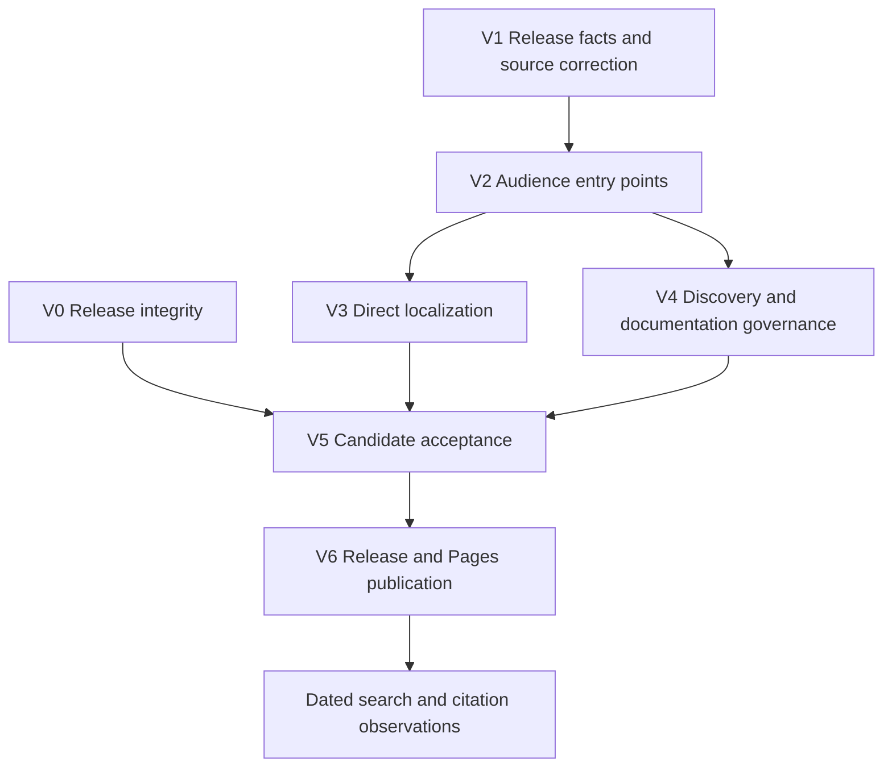

# Release 1.9.8, Documentation, And Discoverability

Language: **English** | [简体中文](./2026-09-13-001-feat-1-9-8-release-docs-geo-plan.zh-CN.md)

## Decision And Delivery Boundary

Position 1.9.8 as a **reliability and documentation release**. Its strongest existing improvements are cancellation, artifact ownership, retrieval snapshots, native export correctness, and reproducible verification. The 36 provider presets and 33 diagram catalog entries already existed in 1.9.7; they are product context, not new features in 1.9.8.

Execution is active. The current public release is still 1.9.7; implementation and publication are tracked separately below. Work stays inline, without subagents. All new or revised translations are authored and reviewed directly by Codex, without LM Studio or a translation API.

“Excellent documentation” means readers can complete their task, claims match the implementation, translations preserve those claims, and published artifacts can be verified. Search ranking, indexing and AI citations remain external observations rather than promised release outcomes.

## Verified Baseline

| Surface | Observed state | Consequence |
|---|---|---|
| Release base | Numeric tag `1.9.7` resolves to `ef777883`; public release dated 2026-08-31 | Use the peeled tag commit, not the release API's moving `targetCommitish: main`. |
| Current main | `291ea45`; 14 commits after 1.9.7, including 11 non-merge commits | Recompute this range at candidate freeze; subsequent implementation commits must also enter the release ledger. |
| Plugin verification | Main CI `34730477791` passed: Linux 282 suites / 2599 tests; Windows 282 suites / 2598 tests / one POSIX skip | Historical baseline for planning; the actual release candidate needs fresh verification. |
| Public Pages | Latest successful deployment `33608574614`, source `7638cec`, 2026-09-02 | Runtime improvements on main have not automatically updated the public website. |
| Live homepage samples | English, zh-CN and French returned HTTP 200; self-canonicals and `lang` were correct; French emitted `noindex,follow` | Preserve working metadata behavior. English had no document-wide horizontal overflow at 1440 px or 390 px. This is not a complete accessibility or performance audit. |
| Documentation volume | 31 root READMEs; 21 English website pages plus 693 localized pages; 34 website locales | There are 714 existing website documents. Route completeness is already satisfied; semantic correctness is a separate problem. |
| Language boundaries | 21 plugin UI locales; 34 website locales; only English and zh-CN are currently indexable | Do not advertise these three counts as one language-support promise. |
| Installation / community | Official Obsidian catalog contains plugin id `notemd`; repository Issues enabled, Discussions disabled, homepage metadata empty | Keep the valid installation entry; replace the dead Discussions destination with existing support and set the repository homepage. |
| Release assets | 1.9.7 includes `main.js`, `manifest.json`, `styles.css`, `README.md` | Preserve all four mandatory assets and independently verify their uploaded bytes. |

Research used the local Git history and source, GitHub release/repository/Pages APIs, live browser inspection, and official Google/Bing/GitHub documentation. The [current reliability acceptance](../maintainer/reliability-acceptance-2026-09-12.md) supplies the existing host and consumer evidence.

## Every Commit Since 1.9.7

This is the complete baseline ledger for `1.9.7..291ea45`; merge commits are accounted for without counting their contents twice.

| Commit | Delivered change | Release treatment |
|---|---|---|
| `b26e466` | Refreshed the quarterly development chronicle for 1.9.7 | Documentation follow-up; not a new runtime feature. |
| `af68ebf` | Reorganized the 1.9.7 release description by category | Use its bilingual presentation as a reference; preserve the historical release. |
| `7638cec` | Reconciled capability, CLI, language and packaging documentation with main | Documentation accuracy and scope clarification. |
| `ff41938` | Audited historical plans and prioritized operation reliability | Planning provenance; link to the resolved findings rather than advertising a feature. |
| `cb1902c` | Fixed cancellation lifetime, delayed mutations, overlapping artifact writes and recovery ownership | Primary user-facing reliability improvement. |
| `e4c1486` | Fixed native export fidelity, Circuitikz wiring/labels and retrieval snapshot behavior | Native-output and batch-consistency improvements. |
| `e969f52` | Added PR/main verification, lint regression control and bilingual consumer acceptance | Engineering assurance and documented support boundaries. |
| `805bda2` | Included new/untracked documentation in bilingual coverage | Documentation regression prevention. |
| `c9e30e7` | Recorded successful and deliberately failing CI receipts | Evidence closure; not an additional implementation claim. |
| `090098f` | Merged PR #12 | Integration record for the preceding work. |
| `845c312` | Added same-basename/shared-companion regressions and controlled retrieval heap/cost measurements | Stronger persistence and retrieval evidence. |
| `607c35d` | Merged PR #14 | Integration record. |
| `7ad4888` | Fixed incomplete collapsed row separators beneath merged PPTX cells; added native PowerPoint assertions and retained PPTX artifacts | Additional export correctness fix; the previous full-slide score had missed this defect. |
| `291ea45` | Merged PR #15 | Current baseline integration record. |

Candidate release narrative, following the existing English/Chinese release format:

- **Highlights:** predictable cancellation and artifact recovery; consistent batch retrieval snapshots; corrected PowerPoint/Circuitikz output; clearer audience-specific documentation once V1–V4 pass.
- **Fixes and robustness:** scheduler settlement, effective signals across five transports/retries, late-response mutation prevention, per-Vault overlapping-path ownership, visible recovery conflicts, and native table separator fidelity.
- **Verification:** Linux/Windows CI, diagnostic-level lint checks, PNG/archive integrity, frozen retrieval evaluation, named Obsidian/Office/compiler acceptance.
- **Upgrade and limits:** preserve settings and command ids; explain recovery artifacts and retained companion folders. Logical cancellation does not guarantee server-side cancellation or billing cancellation. Static Drawnix cross-branch arrows remain unsupported after reflow.

The final release description must also cover new release-tooling and documentation changes produced by this plan. Do not silently freeze the final scope at the 14-commit research baseline.

## Findings That Change The Plan

| ID / priority | Evidence | Required response |
|---|---|---|
| F1 / P0 | `scripts/release/publish-github-release.js` calls `hasExistingRelease()` before its dry-run branch; every nonzero lookup becomes “absent”; unknown flags are ignored; asset existence is checked without version/tag provenance | Make preview genuinely local, reject unknown arguments, distinguish a real 404 from authentication/network failure, and verify candidate identity before publishing or repairing. |
| F2 / P0 | Release workflow lacks the two explicit locked Chromium installations used by `verify-plugin.yml`; dispatch input is embedded in Bash before numeric validation | Close the source-level reproducibility/input-handling gaps and demonstrate a clean-run release rehearsal. Missing browser installation is a risk identified from source, not a claimed reproduced release failure. |
| F3 / P1 | Quick Start describes add-links → extract → research → diagram, while `DEFAULT_CUSTOM_WORKFLOW_BUTTONS_DSL` is add-links → batch title generation → batch Mermaid fix; it also claims a default `concepts/` folder and automatic backlinks despite empty folder configuration and `extractConceptsAddBacklink: false` | Correct all 21 English pages against actual defaults/commands first, then propagate the corrected source to translations. Include prerequisites and expected output. |
| F4 / P1 | French Quick Start retains English instructional prose inside fenced blocks; sampled Arabic provider guidance contains malformed bracket text; the build audit applies its language-signal check only to diagrams and FAQ | Distinguish executable code from prose, review all changed localized instructions, and extend content checks beyond two pages. These samples do not establish a global translation-error percentage. |
| F5 / P1 | Website navigation/sidebars lack developer and Agent guides; the live footer links to disabled Discussions; repository homepage metadata is empty | Add focused task entry points, use the existing Issues channel, and connect the repository About panel to Pages. |
| F6 / P1 | Version strings are independently stored in website config, homepage/catalog and audit; `releaseFacingVersionTruth.test.ts` pins 1.9.7-era highlight wording and requires the chronicle refresh tag to equal the software version | Centralize current release facts, preserve editorial freedom, and separate software version from historical chronicle freshness. Never fabricate a refresh receipt to satisfy a test. |
| F7 / P1 | Release/GEO runbooks still prescribe LM Studio; only a version-specific 1.9.7 exception forbids it. The release runbook also says ordinary PR CI is absent | Make direct authoring the current workflow, move legacy instructions out of the active path, and reconcile runbooks with AGENTS and actual workflows. |
| F8 / P2 | Homepage space is allocated to “Answer-engine source map” and indexing terminology; `audit-build.cjs` requires those exact phrases; broken links are configured as warnings | Lead with tasks and outputs. Test discoverability and valid destinations instead of specific marketing wording; reject unexpected internal link failures. |

## Requirements And Source Ownership

- N1: account for every commit since 1.9.7 and describe user impact without double counting.
- N2: publish numeric `1.9.8` from a tested immutable commit, with complete bilingual notes and all four verified assets.
- N3: synchronize metadata, welcome notes, 31 READMEs, repository docs and public website facts while preserving historical records.
- N4: Codex authors translations directly; all 34 website locales remain route-complete. No LM Studio or translation-engine call is part of authoring or validation.
- N5: newcomers, regular users, developers and Agents each have an explicit entry and an executable/documented task path.
- N6: improve crawlability, factual clarity, internal discovery and metadata consistency; measure external search/citation outcomes honestly.
- N7: make release, locale, link and audience regressions detectable before publication, with live post-deploy acceptance.
- N8: preserve current product contracts and documented limits; do not turn a documentation release into new provider, embedding, public mutation-API or render-runtime architecture work.

| Fact | Owner / consumer |
|---|---|
| Defaults, provider presets, UI languages, operation contracts | Existing `src/constants.ts`, `src/workflowButtons.ts`, `src/llmProviders.ts`, `src/i18n/uiLocales.ts`, `src/operations/` definitions |
| Candidate software version | `package.json`, root entries in `package-lock.json`, `manifest.json`, `versions.json`, checked by the version contract |
| English/Chinese GitHub release text | `docs/releases/1.9.8.md` and `docs/releases/1.9.8.zh-CN.md`; existing publisher composes them |
| Public how-to content | `website/docs/` and its 33 independently authored localized counterparts |
| Route availability and indexability | Existing `publishedLocales.mjs` and `localePublication.mjs`; no second locale registry |
| Public current-release facts | Proposed `website/src/lib/releaseFacts.mjs`, a small build-consumed projection of repository release metadata; homepage, JSON-LD, release page, `llms.txt` and audit consume the same facts |
| Operational rules / history | AGENTS and paired maintainer runbooks; historical release/measurement/chronicle records keep their own revision and date |

## Audience And Content Architecture

Retain Docusaurus as the public site and VitePress/repository Markdown as engineering evidence. Their existing separation is useful; migrating both into a new documentation platform would add URL and localization risk without solving the observed content errors.

| Audience | Public entry | Completion scenario |
|---|---|---|
| Newcomer | Existing installation + Quick Start | Find the official plugin, choose a prepared provider, process a disposable note, identify output and know how cancellation/recovery behaves. |
| Regular user | Existing workflows, batch processing and troubleshooting | Configure a task scope, run a batch, distinguish completed/cancelled/failed output, inspect recovery paths and choose a supported export. |
| Developer | New `developers/overview` | Find build/test instructions, architecture, provider/operation extension contracts, contribution/support rules and release ownership without treating user docs as an internal architecture dump. |
| Agent | New `agents/overview` | Discover the existing four bounded export commands, obtain schemas/results, identify host prerequisites and handling tags, and distinguish them from maintainer-only mutation operations. |

Add one further public route, `releases/1.9.8`, for an upgrade and release guide linked to the canonical bilingual release notes. Reuse existing guides for privacy, recovery and configuration rather than creating competing manuals. Three added routes mean **102 new language documents**, bringing the complete site to 24 canonical routes / 816 documents if no current route is removed.

The four bounded commands are `notemd:export-provider-profiles-redacted`, `notemd:export-cli-capability-manifest`, `notemd:export-cli-invocation-contract`, and `notemd:export-cli-public-surface`. They still require a working Obsidian host/Vault and can write exports. Redaction does not make endpoint metadata automatically suitable for public sharing. The nine repo-local maintainer operations remain separately qualified; this plan does not promote them.

Homepage direction: preserve the existing visual system; prioritize installation/first task, the four audience paths, concrete input/output examples, upgrade information and evidence links. Keep the compact machine-readable map reachable without making indexing implementation details the principal user journey. Existing URLs and useful anchors remain valid.

## Implementation Units

The graph describes dependencies, not concurrent delegation. Work remains inline.

- [ ] **V0 — Release integrity and candidate preflight**

  **Requirements / dependencies:** N2, N7, N8; research baseline available.

  **Files:** `scripts/release/publish-github-release.js`, `.github/workflows/release.yml`, `scripts/lib/packaging-contract.js` only where its existing contract changes; tests `src/tests/githubReleaseWorkflow.test.ts`, `src/tests/releaseFacingVersionTruth.test.ts`, `src/tests/releaseWorkflowDocsContract.test.ts`; paired release runbooks.

  **Approach:** keep preview and publication as complete operations at the existing owner. Preview performs no GitHub lookup and requires no translation service; it reports local candidate facts without pretending to know remote release state. CLI admission rejects unknown/malformed arguments. Publication owns draft creation/upload, asset verification and final promotion, validating tag/candidate metadata and provenance before mutation; remote lookup distinguishes absent releases from errors. Pass workflow inputs as data before validation. Align clean-run browser preparation with the existing lockfile/PR gate. Keep Linux Node 20 as the canonical release build environment and Windows as an independent behavior check; do not invent cross-platform byte equality for arbitrary text artifacts.

  **Test scenarios:** a misspelled preview flag causes no GitHub action; valid preview invokes no network client; a 401/403/5xx/EOF cannot select create mode; a true 404 can; mismatched manifest/package/tag or missing asset/notes fails before writes; repair cannot use an unrelated working tree; invalid dispatch text stays inert; a clean browser cache still allows the full release suite. Partial upload or hash failure must leave a draft rather than publish; repeated runs for the same tag serialize and resume only the matching verified candidate. Separate chronicle metadata assertions from current software version and replace literal highlight assertions with structural/version contracts.

  **Exit:** fresh positive/negative preflight evidence and a clean-run release rehearsal. The already-working four-asset, bilingual and numeric-tag contracts remain enforced.

- [ ] **V1 — Release ledger, source correctness and upgrade contract**

  **Requirements / dependencies:** N1, N2, N3, N8; baseline ledger above, V0 required before publication.

  **Files:** version metadata and lockfile root metadata, `src/ui/welcomeReleaseNotes.ts`, new `website/src/lib/releaseFacts.mjs`, `docs/releases/1.9.8.md` and `.zh-CN.md`, `change.md`, current-release sections of all 31 `README*.md`, the 21 English files under `website/docs/`, paired maintainer release/acceptance records. Tests: `src/tests/releaseFacingVersionTruth.test.ts`, `src/tests/websiteDocsContract.test.ts`, and existing workflow/default-setting tests used as sources.

  **Approach:** freeze accurate English content before translation. Correct One-Click Extract, folder/backlink defaults, offline prerequisites, model examples, cancellation/billing and recovery semantics. Update the three welcome-digest languages deliberately. Preserve historical 1.9.7 notes, archive hashes and chronicle timestamps. Current release facts should come from their owner, not independent string replacements.

  **Test scenarios:** every currently displayed version points to the candidate; historical 1.9.7 examples remain historical; documented default workflow matches its three source ids; missing concept-folder configuration is explained; backlinks are not promised when disabled; local model use is not described as making web research offline; old compatibility claims are not upgraded by a documentation edit.

  **Exit:** a reviewer can map each release bullet to a commit or evidence record; each canonical guide has a checked task/parameter/output contract. Recompute the complete commit ledger at V5.

- [ ] **V2 — Four audience paths with complete task guidance**

  **Requirements / dependencies:** N3, N5, N8; V1 source contracts.

  **Files:** `website/src/pages/index.js`, its existing CSS, `website/sidebars.js`, `website/docusaurus.config.js`, existing home/site-copy catalogs, new `website/docs/developers/overview.mdx`, `website/docs/agents/overview.mdx`, `website/docs/releases/1.9.8.mdx`, existing user guides, `docs/README.md` and `.zh-CN.md`, `docs/maintainer/repository-document-layout.md` and its pair. Tests: extend `src/tests/websiteDocsContract.test.ts` and `src/tests/cliPublicSurfaceDocsAlignment.test.ts`; add a bounded built-site navigation audit under `website/scripts/` using the existing Playwright dependency.

  **Approach:** provide identifiable paths from the homepage and Docs navigation; keep ordinary tasks within two navigation steps. Developer guidance links to authoritative repo rules and contribution procedures. Agent guidance derives its supported surface from `src/operations/publicCliSurface.ts`, not the count of operation definitions. Use Issues for support while Discussions is disabled. Maintain existing routes/anchors and a readable repository fallback.

  **Test scenarios:** all four audiences reach an actionable guide using keyboard navigation; absent protocol handlers still have web installation guidance; developer commands match the repo workflow; the Agent guide exposes only the four supported export commands as public; sensitive/provider and maintainer-only behavior remains qualified; old entry links still resolve.

  **Exit:** each audience completes its named scenario in review, and every entry has a usable destination rather than a placeholder page.

- [ ] **V3 — Direct authoring and full locale parity**

  **Requirements / dependencies:** N3, N4, N5; V1/V2 canonical text frozen.

  **Files:** all affected `website/i18n/<locale>/docusaurus-plugin-content-docs/current/` files, home/site-copy catalogs, all affected README language variants, `publishedLanguageScopeData.mjs`, existing locale-publication metadata and paired authoring runbooks. Tests: `src/tests/docsBilingualSupport.test.ts`, `src/tests/websiteDocsContract.test.ts`, `website/scripts/audit-build.cjs`.

  **Approach:** Codex writes and cross-checks every changed language directly, including 99 localized counterparts for the three new English routes. Track the source revision reviewed for each changed document. Tools may enumerate, format and validate text; they do not generate translations through external engines. Preserve executable syntax, identifiers and URLs; translate instructional prose even when an old document put it in a code fence. UI labels follow actual UI-locale support, with explicit English labels where the plugin has no matching UI locale. Retire active LM Studio authoring instructions without removing the product's legitimate local-provider documentation.

  **Test scenarios:** no missing route among 34 locales; no English fallback masquerading as a translation; required factual changes appear in every affected locale; code/MDX/Mermaid/table structure remains valid; Arabic/Persian/Hebrew direction and mixed code text remain usable; aliases such as zh-Hant/zh-TW preserve their declared routes; no authoring/validation command calls a translation endpoint.

  **Exit:** complete locale/source-revision coverage, structural checks and language-by-language semantic review of changed content. Record AI authorship honestly. Keep the existing English/zh-CN indexing boundary unless a locale separately meets its promotion criteria; Codex authoring is not evidence of an independent native-human review.

- [ ] **V4 — Discoverability, evidence and documentation governance**

  **Requirements / dependencies:** N3, N6, N7; V2 routes and V1 facts, joined with V3 before acceptance.

  **Files:** existing site metadata/theme owners, `website/static/llms.txt`, robots/sitemap configuration, `website/scripts/audit-build.cjs`, `.github/workflows/deploy-docs.yml`, paired GEO/release/layout runbooks and the plan-status index. Repository About metadata is a separate, small publication action. Tests: website contract tests and the built-site audit.

  **Approach:** preserve canonical/hreflang/noindex behavior already observed working. Align visible content, software facts and JSON-LD identity; maintain dated evidence links and a compact machine-readable route map including Agent guidance. Replace required slogan checks with factual/discovery contracts. Make unexpected internal Markdown/URL failures fatal. Extend the existing Pages workflow with read-only PR build/audit, keeping deployment permissions confined to deployment. Require published-release availability before promoting a new stable version, and retain an explicit post-release dispatch path. Keep authoring policy and current-plan authority in the existing owners; archived material is labeled by date/revision.

  **Test scenarios:** a changed release fact cannot leave stale homepage/schema/llms values; a missing or broken role route fails; a non-indexable locale is absent from sitemap/eligible alternates; a failed translation review cannot silently promote indexing; removing a required link fails even when slogan wording changes; PR builds cannot deploy or access release credentials; an unpublished 1.9.8 cannot be advertised as the current downloadable stable release.

  **Exit:** built-site contract coverage, working public support/install destinations, repository homepage set to the canonical Pages URL, and a documented distinction between local technical checks and external search observations.

- [ ] **V5 — Freeze and verify the complete release candidate**

  **Requirements / dependencies:** N1–N8; V0, V3 and V4 complete.

  **Files / evidence:** existing plugin/website test suites and workflows; diagram archive checks; committed Obsidian, PowerPoint and Circuitikz verification scripts; a paired 1.9.8 acceptance record under `docs/maintainer/`. No generic verification framework is required.

  **Acceptance:** fresh Linux/Windows Node 20 build/full Jest/lint/audits; Node 24 website build and audit over all 816 planned documents; repository-docs build/link/bilingual checks; archive identity checks. Rehearse installation/upgrading and the corrected default task in a marked disposable Vault. Recheck cancellation/recovery and the selected native export claims on the release candidate, retaining versions, hashes and failed/unavailable outcomes. Validate all four audience journeys at 390/768/1440 px, keyboard access and representative RTL/CJK layouts, with no unexpected console/page errors or document-wide horizontal overflow. Automated accessibility checks must have no unresolved serious/critical violations; manual focus/reading-order checks remain necessary. Record performance measurements before making speed claims.

  **Negative checks:** deliberately wrong version, missing release asset, absent locale, broken role link, stale default-workflow fact and unsafe public-CLI claim must each be rejected by the relevant gate. Maintain the native PowerPoint assertion that rejects the old partial merged separator; a whole-slide image score alone is insufficient.

  **Exit:** one exact candidate revision with a traceable verification receipt and no unresolved release blockers. Successful historical tests or document presence alone do not close this unit.

- [ ] **V6 — Publish 1.9.8 and verify the public result**

  **Requirements / dependencies:** N2, N3, N6, N7; V5 complete.

  **Approach:** publish the numeric tag from the accepted commit using one publishing owner; do not race a manual publisher with the tag workflow. Upload into a draft, verify bilingual notes, version metadata, all four assets and their download hashes, then promote it and confirm the latest-release destination. Serialize chronicle work and keep its real refresh provenance. Explicitly deploy the matching website after the release is available; do not assume a release or chronicle push made with `GITHUB_TOKEN` will trigger a second workflow. Close any post-release documentation synchronization with a clean mainline state.

  **Live acceptance:** English/zh-CN and representative non-indexable/RTL routes return the intended content; all 34 routes exist; current version, canonical/hreflang, robots, sitemap and llms agree; installation/download/support/role links work; the served Pages artifact corresponds to the accepted documentation revision. Record the release URL, tag commit, assets, workflow runs and deployed-source identity.

  **Failure policy:** before publication, fix the candidate and repeat affected gates. After public publication, preserve the immutable tag; do not silently substitute unrelated binaries. Same-tag repair is limited to verified identical provenance/incomplete delivery. A code correction requires a new patch release. Pages can return to the previous known-good artifact while the release problem is resolved. An external observation outage is recorded as unavailable, not success.

  **Exit:** GitHub Release and public Pages are both verified, documentation status reflects actual completion, and remaining compatibility/quality limits remain visible.

## GEO Measurement And Tradeoffs

Google explicitly states that AI Overviews/AI Mode need no additional AI files or special schema. Prioritize index eligibility, textual explanations, internal links, evidence and structured-data consistency. Retain `llms.txt` as a useful curated map, not a ranking mechanism. Do not add fabricated ratings, citations, testimonials or benchmark superiority.

Bing's AI Performance preview exposes citations, cited pages and sampled grounding queries. These metrics do not establish ranking or authority within an individual answer. If account access exists, record a dated baseline and 7/28-day observations from Search Console and Bing Webmaster Tools, segmented by URL/language where available. Missing account access means “not measured,” not zero traffic. These post-deploy observations do not block a correctly verified 1.9.8 release and cannot be substituted by a green local build.

| Decision | Benefit | Cost / boundary |
|---|---|---|
| Reuse existing sites and add three canonical pages | Complete audience coverage without a platform migration | 102 new language documents plus updates to existing content still require real review. |
| Correct the 21 English sources before translation | Prevents amplifying wrong instructions | Canonical text must stabilize before final locale review. |
| Keep long-tail route availability separate from indexing | Preserves access without an unsupported quality claim | Full route coverage does not immediately become 34 indexable languages. |
| Source-derived release facts and targeted contract tests | Reduces cross-surface drift | Keep the projection small; do not introduce a second capability registry or freeze prose wording. |
| Canonical release build with independent Windows checks | Reproducible artifact provenance and platform confidence | Verify uploaded bytes against that build, not a differently configured local rebuild. |
| Publish assets before stable website promotion | Avoids a new-version download promise pointing at old/missing assets | Requires explicit coordination between existing workflows and post-deploy verification. |

## Effort, Uncertainty And Completion Rules

For one engineer familiar with this repository, budget roughly **10–15 engineering days**, dominated by canonical-content correction, 34-locale authoring/review and publication acceptance. This is a planning range, not a completion-time claim; final sizing follows the V1 page audit. Search/citation observations have a separate calendar window.

Known limits carried into the release: physical mobile devices and Obsidian 0.15.0 remain unverified; Drawnix attached cross-branch arrows remain unsupported; Mermaid/SVG geometry in PPTX retains explicit image fallback; lexical retrieval's frozen Top-3 positive recall is 7/9 and does not establish semantic retrieval quality. Preserve these distinctions in marketing, guides, schemas and release notes.

Implementation-owned unknowns: clean release-run behavior after workflow alignment; the exact set of semantic corrections needed across all current pages; actual candidate page-performance measurements; account-authorized search/citation data. Resolve them with evidence at their named unit. Do not close them by changing a label to “verified.”

The plan is complete as a plan when its requirements, ownership, sequencing and gates agree. The release is complete only when V0–V6 have their actual execution evidence. Update this plan and the current status register rather than adding a competing global roadmap.

## Execution Record

- 2026-09-13, V0: implemented strict CLI parsing, offline JSON preview, version/source/tag checks, clean-source rebuilding, frozen asset bytes, authenticated draft discovery, provenance-constrained retry, downloaded SHA-256 verification and immutable public assets. Added same-tag workflow concurrency, inert dispatch input and both pinned Chromium installations. Updated the semantic checklist and bilingual release runbook; direct translation authoring is now the active policy.
- Local evidence: build passed; 282 Jest suites passed (2633 tests passed, one platform-specific skip); the publisher has 45 process-boundary cases. UI and render-host audits, lint regression comparison and diff hygiene passed. The Linux clean-runner gate remains part of candidate validation before closing V0/V5.
- V1 source audit is in progress. In addition to the initial findings, the batch guide documents nonexistent overwrite/recursion settings and an incorrect default concurrency of 3; the workflow guide contains invalid action IDs and incorrect defaults. Correct these at the English source before localization.

## References

- [1.9.7 GitHub Release](https://github.com/Jacobinwwey/obsidian-NotEMD/releases/tag/1.9.7)
- [Pinned baseline comparison](https://github.com/Jacobinwwey/obsidian-NotEMD/compare/1.9.7...291ea45ba84d0a63664681a65e8feb092fa37b38)
- [Verified current-main CI](https://github.com/Jacobinwwey/obsidian-NotEMD/actions/runs/34730477791)
- [Observed public Pages deployment](https://github.com/Jacobinwwey/obsidian-NotEMD/actions/runs/33608574614)
- [Project status register](../maintainer/project-plan-status.md), [release workflow](../maintainer/release-workflow.md), [GEO workflow](../maintainer/github-pages-language-geo-workflow.md), [CLI capability matrix](../maintainer/notemd-cli-capability-matrix.md)
- [Google: AI features and your website, official mirror](https://developers.google.cn/search/docs/appearance/ai-features?hl=en)
- [Bing: AI Performance in Webmaster Tools](https://blogs.bing.com/webmaster/February-2026/Introducing-AI-Performance-in-Bing-Webmaster-Tools-Public-Preview)
- [GitHub: Triggering a workflow](https://docs.github.com/en/actions/using-workflows/triggering-a-workflow)
