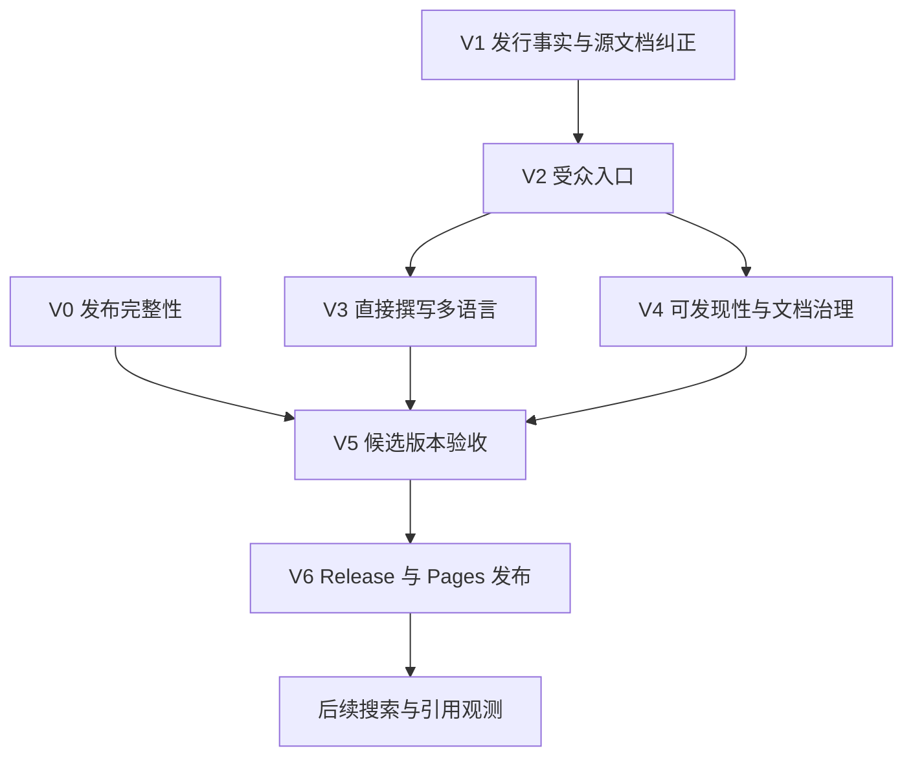

# 1.9.8 发布、文档与可发现性实施方案

Language: [English](./2026-09-13-001-feat-1-9-8-release-docs-geo-plan.en.md) | **简体中文**

## 决策与交付边界

将 1.9.8 定位为**可靠性与文档质量版本**。当前最有价值的改进是取消语义、产物写入归属、检索快照、原生导出正确性和可复现验证。36 个 provider preset、33 个图表目录项在 1.9.7 已存在，应作为产品背景，不应再次包装为 1.9.8 新功能。

实施已启动，当前公开版本仍为 1.9.7；实现与公开发布的进度分别记录。执行保持主线程内联，不使用 subagent。新增或修改的翻译均由 Codex 直接撰写和复核，不调用 LM Studio 或翻译 API。

“超一流文档”应落实为：读者能完成任务、声明与实现一致、翻译保留这些事实、发布产物可以验证。搜索排名、收录和 AI 引用属于外部观测，不能当成发版时保证达成的结果。

## 已核实基线

| 表面 | 当前事实 | 对方案的影响 |
|---|---|---|
| 发布基线 | 数字 tag `1.9.7` 指向 `ef777883`，公开 Release 日期为 2026-08-31 | 采用 tag 解引用后的 commit，不能用 Release API 中会移动的 `targetCommitish: main` 代替。 |
| 当前 main | `291ea45`；1.9.7 之后共 14 个提交，其中 11 个非合并提交 | 候选版本冻结时重算区间，实施本方案产生的后续提交也必须进入发行账本。 |
| 插件验证 | 主线 CI `34730477791` 通过：Linux 282 套件／2599 项；Windows 282 套件／2598 项／1 项 POSIX 跳过 | 这是规划基线；实际候选版本仍需新鲜验证。 |
| 公开 Pages | 最近成功部署为 `33608574614`，源码 `7638cec`，日期 2026-09-02 | main 的运行时改进没有自动同步到公开网页。 |
| 实网首页抽查 | 英文、zh-CN、法文均返回 HTTP 200；各自 canonical 和 `lang` 正确；法文输出 `noindex,follow` | 保留已成立的元数据行为。英文在 1440 px 和 390 px 下均无整页横向溢出；这不等于完成可访问性或性能审计。 |
| 文档规模 | 31 份根 README；21 份英文网页文档和 693 份本地化文档；34 个网站 locale | 已有 714 个网页文档。路由完整性已成立，语义准确性需要单独验证。 |
| 语言边界 | 插件 UI 为 21 个 locale，网站为 34 个；当前仅英文和 zh-CN 允许索引 | 三种计数不能合并成一种语言支持承诺。 |
| 安装与社区 | Obsidian 官方目录存在 id `notemd`；仓库 Issues 已启用、Discussions 未启用、homepage 元数据为空 | 保留有效安装入口，将失效 Discussions 入口改为现有支持渠道，并补齐仓库 About 的网站地址。 |
| Release 资产 | 1.9.7 包含 `main.js`、`manifest.json`、`styles.css`、`README.md` | 保留全部四项必需资产，独立验证上传后的字节。 |

调研使用本地 Git 历史和源码、GitHub Release／仓库／Pages API、真实浏览器，以及 Google／Bing／GitHub 官方文档。[当前可靠性验收记录](../maintainer/reliability-acceptance-2026-09-12.zh-CN.md)提供既有宿主与消费端证据。

## 1.9.7 之后的完整提交账本

以下完整覆盖 `1.9.7..291ea45`；合并提交单独登记，不重复计算其中的实现。

| 提交 | 已交付变化 | 发行摘要处理 |
|---|---|---|
| `b26e466` | 刷新 1.9.7 季度开发历程 | 文档追补，不计为新运行时功能。 |
| `af68ebf` | 按类别重整 1.9.7 Release 描述 | 参考其完整双语呈现方式，保留历史 Release。 |
| `7638cec` | 校正主线能力、CLI、语言和打包文档 | 文档准确性与支持范围澄清。 |
| `ff41938` | 审视历史计划，确定操作可靠性优先级 | 规划来源，链接已解决的问题，不包装成产品功能。 |
| `cb1902c` | 修复取消生命周期、晚到写入、重叠产物保存和恢复归属 | 主要用户价值：运行可靠性。 |
| `e4c1486` | 修复原生导出、Circuitikz 连线／标签及检索快照 | 原生输出与批处理一致性改进。 |
| `e969f52` | 新增 PR／main 验证、lint 回归约束和双语消费端验收 | 工程保障和明确的支持边界。 |
| `805bda2` | 将新增／未跟踪文档纳入双语检查 | 防止文档交付回归。 |
| `c9e30e7` | 登记正常与故意失败的 CI 证据 | 证据闭环，不另算一项实现。 |
| `090098f` | 合并 PR #12 | 前述改进的集成记录。 |
| `845c312` | 增补同名来源／共享附件回归及受控检索堆内存／成本测量 | 强化持久化和检索证据。 |
| `607c35d` | 合并 PR #14 | 集成记录。 |
| `7ad4888` | 修复合并 PPTX 单元格下方不完整的折叠行边框，新增原生 PowerPoint 断言与 PPTX 归档 | 补充导出正确性修复；先前全页分数漏检了该缺陷。 |
| `291ea45` | 合并 PR #15 | 当前基线集成记录。 |

沿用既有完整英文／中文 Release 结构，候选发行叙事为：

- **重点更新：** 更可预测的取消和产物恢复；稳定的批处理检索快照；修正的 PowerPoint／Circuitikz 输出；V1–V4 验收后增加分受众文档入口。
- **修复与鲁棒性：** 调度器收敛、五种传输及重试的有效信号、阻止晚到响应继续写入、Vault 内重叠路径归属、可见的恢复冲突、原生表格分隔线保真。
- **验证：** Linux／Windows CI、逐条诊断 lint 检查、PNG／归档完整性、冻结语料评估、明确版本的 Obsidian／Office／编译器验收。
- **升级与边界：** 保留设置和 command id；解释恢复产物和被保留的附件目录。逻辑取消不保证停止服务端生成或计费。Drawnix 跨分支静态箭头在重排后的附着仍不支持。

最终发行说明还必须包含本方案实施产生的发布工具和文档改进，不能把最终范围冻结在调研时的 14 个提交。

## 会改变推进顺序的发现

| 编号／优先级 | 证据 | 必须采取的措施 |
|---|---|---|
| F1／P0 | `scripts/release/publish-github-release.js` 在 dry-run 分支之前调用 `hasExistingRelease()`；所有非零返回均视为“不存在”；未知参数被忽略；仅检查文件存在，不验证版本／tag 归属 | 使预览真正离线，拒绝未知参数，区分真实 404 与鉴权／网络失败，在发布或修复前证明候选版本身份。 |
| F2／P0 | Release workflow 缺少 `verify-plugin.yml` 中两项显式锁定 Chromium 安装；dispatch 输入在数字 tag 验证前直接嵌入 Bash | 关闭源码中可见的可复现性／输入处理缺口，并完成干净环境发布演练。浏览器缺口是源码识别的风险，不冒称已复现 Release 失败。 |
| F3／P1 | Quick Start 写成“加链接→提取→研究→图表”，而 `DEFAULT_CUSTOM_WORKFLOW_BUTTONS_DSL` 是“加链接→按标题批量生成→批量 Mermaid 修复”；还宣称默认 `concepts/` 目录和自动回链，与空目录配置和 `extractConceptsAddBacklink: false` 不符 | 先依据真实默认值／命令校核全部 21 份英文源文档，再将正确来源同步到翻译；补齐前置条件和预期输出。 |
| F4／P1 | 法文 Quick Start 的 fenced block 内仍有英文操作步骤；阿拉伯文 provider 样本有括号语法污染；构建审计仅对 diagrams 和 FAQ 执行语言信号检查 | 区分可执行代码与说明文字，复核全部受影响语言步骤，扩大内容检查范围。抽样不能推导整个翻译集的错误率。 |
| F5／P1 | 网站导航／侧栏缺开发者和 Agent 指南；实网页脚链接到未启用的 Discussions；仓库 homepage 元数据为空 | 补齐明确任务入口，使用现有 Issues，并连接仓库 About 与 Pages。 |
| F6／P1 | 网站配置、首页／catalog、审计分别保存版本文本；`releaseFacingVersionTruth.test.ts` 固定了 1.9.7 风格的亮点文字，还要求 chronicle 刷新 tag 等于软件版本 | 集中当前发行事实，保留文字编辑自由，区分软件版本和历史 chronicle 新鲜度；不能为过测试伪造刷新记录。 |
| F7／P1 | 发布／GEO 手册仍以 LM Studio 为主流程，仅在 1.9.7 例外中禁止；发布手册还声称没有普通 PR CI | 将直接撰写设为当前流程，把旧指令移出活跃路径，对齐 AGENTS 和真实 workflow。 |
| F8／P2 | 首页大量空间用于“Answer-engine source map”和索引术语，`audit-build.cjs` 强制匹配这些原文；链接错误仅告警 | 以任务和产物为主线，测试可发现性与有效目标，不固定营销措辞；拒绝未解释的内部链接错误。 |

## 需求与事实归属

- N1：覆盖 1.9.7 之后每个提交，按用户收益总结，避免重复计算。
- N2：从通过验收的不可变 commit 发布数字 tag `1.9.8`，包含完整双语说明和四项已校验资产。
- N3：同步元数据、欢迎摘要、31 份 README、仓库文档与公开网页事实，同时保留历史记录。
- N4：Codex 直接撰写翻译；34 个网站 locale 保持路由完整，撰写和校验不调用 LM Studio 或翻译引擎。
- N5：新人、日常用户、开发者和 Agent 分别有明确入口和可执行／可理解的任务路径。
- N6：改善抓取条件、事实表达、内部发现与元数据一致性，如实测量外部搜索／引用效果。
- N7：发布前能够检测发行、语言、链接和受众入口回归，发布后核验实网。
- N8：保留现有产品契约与已知限制，不把文档发布扩张为新增 provider、embedding、公开写入 API 或渲染 runtime 重构。

| 事实 | 所有者／消费者 |
|---|---|
| 默认值、provider preset、UI 语言、操作契约 | 既有 `src/constants.ts`、`src/workflowButtons.ts`、`src/llmProviders.ts`、`src/i18n/uiLocales.ts`、`src/operations/` |
| 候选软件版本 | `package.json`、`package-lock.json` 根元数据、`manifest.json`、`versions.json`，由版本契约检查一致性 |
| GitHub Release 英／中文正文 | `docs/releases/1.9.8.md` 与 `docs/releases/1.9.8.zh-CN.md`，沿用现有 publisher 合并 |
| 公开操作指南 | `website/docs/` 和 33 个直接撰写的本地化配对 |
| 路由可用性与索引资格 | 既有 `publishedLocales.mjs` 和 `localePublication.mjs`，不新增第二套 locale registry |
| 公开当前发行事实 | 拟新增 `website/src/lib/releaseFacts.mjs`，只做仓库发行元数据的小型构建投影；首页、JSON-LD、发行页、`llms.txt` 与审计共用 |
| 操作规则与历史 | AGENTS、双语维护手册；历史发行、测量和 chronicle 保留各自版本及日期 |

## 受众与内容架构

保留 Docusaurus 公开站点，以及 VitePress／仓库 Markdown 的工程证据角色。两者现有分工有价值；迁移到新文档平台会增加 URL 和翻译风险，却不能解决已经发现的内容错误。

| 受众 | 公开入口 | 完成场景 |
|---|---|---|
| 新人 | 既有 installation 与 Quick Start | 找到官方插件，选择已准备好的 provider，在临时笔记上运行，识别输出并理解取消／恢复行为。 |
| 日常用户 | 既有 workflows、batch processing、troubleshooting | 配置任务范围，运行批处理，区分完成／取消／失败，检查恢复路径并选择有支持证据的导出目标。 |
| 开发者 | 新增 `developers/overview` | 找到构建／测试、架构、provider／operation 扩展契约、贡献／支持流程和发布归属，不把用户文档变成内部架构堆叠。 |
| Agent | 新增 `agents/overview` | 发现四项既有受限导出命令，取得 schema／结果，识别宿主前置条件和 handling tags，区分 maintainer-only 写入操作。 |

再新增 `releases/1.9.8` 公开路由，作为升级／发行指南并连接权威双语 Release 文本。隐私、恢复和配置复用既有指南，不制造重复手册。三个新路由意味着 **102 份新语言文档**；若不删除当前路由，完整网站将为 24 个 canonical route／816 份文档。

四项受限命令为 `notemd:export-provider-profiles-redacted`、`notemd:export-cli-capability-manifest`、`notemd:export-cli-invocation-contract`、`notemd:export-cli-public-surface`。它们仍需要可用的 Obsidian 宿主／Vault，并可能写出导出文件；脱敏不代表 endpoint 元数据自动适合公开分享。九项仓库级 maintainer operation 单独说明限制，本方案不提升其公开契约等级。

首页方向：沿用现有视觉系统，优先展示安装／首个任务、四类受众路径、真实输入输出示例、升级说明及证据入口。紧凑的机器索引仍可找到，但索引实现术语不应占据主要用户路径。保留现有 URL 和有用锚点。

## 实施单元

下图表达依赖，不表示多 Agent 并行。执行仍然内联。

- [ ] **V0 — 发布完整性与候选预检**

  **需求／依赖：** N2、N7、N8；调研基线已具备。

  **文件：** `scripts/release/publish-github-release.js`、`.github/workflows/release.yml`，仅在既有契约变化处修改 `scripts/lib/packaging-contract.js`；测试为 `src/tests/githubReleaseWorkflow.test.ts`、`src/tests/releaseFacingVersionTruth.test.ts`、`src/tests/releaseWorkflowDocsContract.test.ts`；配对发布手册。

  **实现方向：** 在现有 owner 内保留完整的预览与发布操作。预览不访问 GitHub，也不依赖翻译服务；只报告本地候选事实，不假装知道远端 Release 状态。CLI 边界拒绝未知／非法参数。发布操作负责草稿创建／上传、资产验证和最终转公开，写入前核对 tag、候选元数据及归属；远端查询区分“不存在”和错误。workflow 输入先作为数据传入，再校验。干净环境浏览器准备与现有 lockfile／PR 门禁一致。Linux Node 20 作为权威发布构建环境，Windows 单独验证行为；不强行要求任意文本资产在不同平台逐字节相同。

  **测试场景：** 拼错预览参数不得触发 GitHub 操作；合法预览零网络调用；401／403／5xx／EOF 不得选择 create 路径，真实 404 可以；manifest／package／tag 不一致或缺资产／说明须在写入前失败；repair 不得消费无关工作树；非法 dispatch 文本保持惰性；空浏览器缓存仍可运行完整发布测试。上传不完整或哈希失败必须保留草稿，不能转公开；同 tag 重复运行须串行化，只能恢复匹配的已验证候选版本。将 chronicle 元数据检查与当前软件版本分开，以结构／版本契约替代固定亮点措辞。

  **退出条件：** 新鲜的正／负预检证据和干净环境发布演练；四资产、完整双语和数字 tag 契约继续生效。

- [ ] **V1 — 发行账本、源文档正确性与升级契约**

  **需求／依赖：** N1、N2、N3、N8；采用上述账本，公开发布前必须完成 V0。

  **文件：** 版本元数据与 lockfile 根元数据、`src/ui/welcomeReleaseNotes.ts`、新增 `website/src/lib/releaseFacts.mjs`、`docs/releases/1.9.8.md` 和 `.zh-CN.md`、`change.md`、31 份 `README*.md` 的当前版本区块、`website/docs/` 的 21 份英文文档、配对维护者发布／验收记录。测试为 `src/tests/releaseFacingVersionTruth.test.ts`、`src/tests/websiteDocsContract.test.ts`，并以既有 workflow／默认设置测试为事实依据。

  **实现方向：** 翻译前冻结正确英文。修正 One-Click Extract、目录／回链默认值、离线前置条件、模型示例、取消／计费及恢复语义。明确更新三种欢迎摘要语言。保留历史 1.9.7 说明、归档哈希和 chronicle 日期。当前发行事实由其 owner 提供，不进行独立字符串替换。

  **测试场景：** 所有当前展示版本指向候选版本；1.9.7 历史示例不被重写；文档默认工作流与三个源 id 一致；说明概念目录未配置的情况；关闭回链时不承诺自动回链；使用本地模型不被描述为使联网研究离线；文档编辑不提升旧兼容性声明。

  **退出条件：** 每个 Release bullet 能映射到提交或证据；每份 canonical guide 的任务／参数／输出契约经过核对。V5 冻结时重算完整提交账本。

- [ ] **V2 — 四类受众入口及完整任务指导**

  **需求／依赖：** N3、N5、N8；依赖 V1 的源契约。

  **文件：** `website/src/pages/index.js` 及既有 CSS、`website/sidebars.js`、`website/docusaurus.config.js`、现有 home／site copy catalog，新增 `website/docs/developers/overview.mdx`、`website/docs/agents/overview.mdx`、`website/docs/releases/1.9.8.mdx`，既有用户指南、`docs/README.md` 与 `.zh-CN.md`、`docs/maintainer/repository-document-layout.md` 及其配对。测试扩展 `src/tests/websiteDocsContract.test.ts`、`src/tests/cliPublicSurfaceDocsAlignment.test.ts`；在 `website/scripts/` 增加使用既有 Playwright 的有界构建站点导航审计。

  **实现方向：** 首页与 Docs 导航均可识别四条路径，常用任务保持两次导航以内。开发者指南链接权威仓库规则和贡献流程。Agent 支持面来自 `src/operations/publicCliSurface.ts`，不能从 operation 总数推导。Discussions 未启用期间使用 Issues。保留旧路由／锚点及可阅读的仓库文档回退。

  **测试场景：** 四类受众均可用键盘到达可操作指南；未安装自定义协议 handler 时仍能查看网页安装说明；开发者命令符合仓库流程；Agent 指南仅把四项既有导出命令列为公开能力；敏感 provider 和 maintainer-only 行为保留限制；旧入口链接继续有效。

  **退出条件：** 逐类走通命名场景，每个入口均有完整内容，不交付占位页面。

- [ ] **V3 — 直接撰写与完整语言一致性**

  **需求／依赖：** N3、N4、N5；V1／V2 源文案已冻结。

  **文件：** 所有受影响 `website/i18n/<locale>/docusaurus-plugin-content-docs/current/` 文档、home／site copy catalog、受影响 README 语言版、`publishedLanguageScopeData.mjs`、既有 locale publication 元数据和配对撰写手册。测试为 `src/tests/docsBilingualSupport.test.ts`、`src/tests/websiteDocsContract.test.ts`、`website/scripts/audit-build.cjs`。

  **实现方向：** Codex 直接撰写并交叉复核每种受影响语言，包括三个英文新路由的 99 份本地化配对。记录各修改文档校核的源 revision。工具仅用于枚举、格式化与校验，不经外部引擎生成翻译。保留可执行语法、标识符和 URL；旧文档放入 code fence 的说明文字仍需翻译。UI 标签服从真实 UI locale 支持，没有对应 UI 语言时明确使用英文标签。将 LM Studio 撰写指令移出当前流程，同时保留产品合法的本地 provider 文档。

  **测试场景：** 34 个 locale 无缺页；英文 fallback 不伪装为翻译；每个受影响语言包含必需事实变化；代码／MDX／Mermaid／表格结构有效；阿拉伯语／波斯语／希伯来语方向及混排代码可用；zh-Hant／zh-TW 等别名维持声明的路由；撰写／验证命令不调用翻译 endpoint。

  **退出条件：** locale／源 revision 覆盖完整，结构检查及逐语言的修改内容语义复核完成。如实标记 AI 作者身份。保持现有英文／zh-CN 索引边界，其他语言只有独立满足推广条件后才提升；Codex 撰写不等于独立母语人士人审。

- [ ] **V4 — 可发现性、证据与文档治理**

  **需求／依赖：** N3、N6、N7；依赖 V2 路由和 V1 事实，验收前与 V3 汇合。

  **文件：** 既有站点 metadata／theme owner、`website/static/llms.txt`、robots／sitemap 配置、`website/scripts/audit-build.cjs`、`.github/workflows/deploy-docs.yml`、配对 GEO／发布／布局手册和计划状态索引。仓库 About 元数据作为单独的小型发布动作。测试为网站契约测试和构建站点审计。

  **实现方向：** 保留已观察到正确工作的 canonical／hreflang／noindex 行为。对齐可见内容、软件事实与 JSON-LD 实体身份，维护有日期的证据链接和包含 Agent 指南的紧凑机器索引。以事实／可发现性契约替换口号断言。未解释的内部 Markdown／URL 错误必须失败。扩展既有 Pages workflow，增加只读 PR 构建／审计，部署权限限定在部署阶段。新版本被宣传为可下载的当前稳定版前，必须确认 Release 已公开可用，并保留发布后显式 dispatch 路径。沿用现有 owner 管理撰写政策及当前计划权威，归档材料标明日期／revision。

  **测试场景：** 发行事实变化不能留下旧首页／schema／llms 版本；缺少受众路由或链接损坏须失败；不允许索引的 locale 不进入 sitemap／有效 alternates；翻译审阅失败不得自动提升索引资格；即使口号措辞改变，必需链接缺失仍失败；PR 构建不能部署或访问发布凭据；未发布的 1.9.8 不得被宣称为当前可下载稳定版。

  **退出条件：** 构建站点契约覆盖、公开安装／支持入口有效、仓库 homepage 指向 canonical Pages URL，本地技术检查和外部搜索观测的界限有明确记录。

- [ ] **V5 — 冻结并验证完整候选版本**

  **需求／依赖：** N1–N8；V0、V3、V4 已完成。

  **文件／证据：** 既有插件／网站测试及 workflow、图表归档检查、已提交 Obsidian／PowerPoint／Circuitikz 验证脚本、`docs/maintainer/` 下配对的 1.9.8 验收记录。无需新增通用验证框架。

  **验收：** 新鲜 Linux／Windows Node 20 构建、全量 Jest、lint／审计；Node 24 下完整构建并审计规划中的 816 份网站文档；仓库文档构建／链接／双语检查；归档身份核对。在有 marker 的 disposable Vault 演练安装／升级及已纠正的默认任务。对候选版本复核取消／恢复和选定原生导出声明，保留版本、哈希与失败／不可用状态。检查四类受众流程在 390／768／1440 px、键盘操作及代表性 RTL／CJK 布局下的表现，不得有未解释的 console／page error 或整页横向溢出。自动可访问性检查不得遗留 serious／critical 问题，仍需人工核对焦点和阅读顺序。宣称提速前先测量性能。

  **负例：** 错误版本、缺少 Release 资产、缺少 locale、损坏的受众入口、陈旧默认工作流事实和越界公开 CLI 声明，应分别被对应门禁拒绝。保留会拒绝旧版合并表头分隔线的原生 PowerPoint 断言，全页图像分数不能替代它。

  **退出条件：** 唯一、明确的候选 revision，具备可追溯验证记录，没有未解决发布阻塞。历史测试成功或文档文件存在不能直接关闭本单元。

- [ ] **V6 — 发布 1.9.8 并验证公开结果**

  **需求／依赖：** N2、N3、N6、N7；V5 已完成。

  **实现方向：** 从验收 commit 发布数字 tag，使用一个 publisher，避免手动发布与 tag workflow 竞争。先上传到草稿，核对双语正文、版本元数据、四项资产及下载哈希，再转公开并确认 latest-release 入口。串行运行 chronicle，保留真实刷新来源。Release 可用后显式部署匹配网站，不假设 `GITHUB_TOKEN` 创建的 Release 或 chronicle push 会触发第二个 workflow。发布后文档同步完成时，主线工作树应干净。

  **实网验收：** 英文／zh-CN 和代表性非索引／RTL 路由显示预期内容；34 个语言路由均存在；当前版本、canonical／hreflang、robots、sitemap、llms 一致；安装／下载／支持／受众链接有效；线上 Pages artifact 对应已经验收的文档 revision。登记 Release URL、tag commit、资产、workflow run 与部署源码身份。

  **失败策略：** 公开前修正候选版本并重跑受影响门禁。公开后保持 tag 不可变，不静默替换为无关二进制；同 tag repair 仅限已证明相同归属或补齐未完成交付。代码修正使用新的补丁版本。处理 Release 问题期间，Pages 可回到上一已知良好 artifact。外部观测不可用就记录 unavailable，不记为通过。

  **退出条件：** GitHub Release 与公开 Pages 均已验证，文档状态反映真实完成，兼容性／质量限制继续可见。

## GEO 观测与取舍

Google 明确说明，AI Overviews／AI Mode 不需要额外 AI 文件或特殊 schema。应优先改善索引资格、文本解释、内部链接、证据和结构化数据一致性。保留 `llms.txt` 作为有用的人工策划索引，不把它当成排名机制。不添加虚构评分、引用、用户证言或性能优势。

Bing AI Performance 预览提供引用次数、被引用页面和抽样 grounding query，这些指标不能证明某条回答内的排名或权威性。已有账号权限时，记录 Search Console／Bing Webmaster Tools 的有日期基线及 7／28 天观测，按可用 URL／语言维度区分。没有账号访问权应记“未测量”，不能记为零流量。这些发布后观测不阻塞正确验收的 1.9.8，也不能被本地构建通过替代。

| 决策 | 收益 | 成本／边界 |
|---|---|---|
| 复用既有站点，新增三个 canonical 页面 | 覆盖受众，不引入平台迁移 | 102 份新语言文档及旧内容更新仍需真实复核。 |
| 翻译前纠正 21 份英文源文档 | 避免扩散错误操作指引 | 完成 locale 终审前，源文案必须稳定。 |
| 分开管理长尾语言可访问性与索引资格 | 保留阅读入口，不作无依据质量承诺 | 全量路由覆盖不立即变成 34 个可索引语言。 |
| 发行事实来自源码，并使用聚焦契约测试 | 减少跨表面漂移 | 投影保持小型，不建立第二套能力 registry，也不固定自然语言措辞。 |
| 权威发布构建与独立 Windows 验证 | 产物归属可复现，同时有平台信心 | 上传字节与该构建比较，不与配置不同的本地重建强行等同。 |
| 资产发布先于网站稳定版推广 | 避免新版本下载承诺指向旧／缺失资产 | 需要明确协调现有 workflow，并进行发布后核验。 |

## 工作量、不确定项与完成规则

对熟悉仓库的一名工程师，初步按 **10–15 个工程日**规划，主要成本在源内容纠正、34 语言撰写／复核和发布验收。这是规划范围，不是完成时长承诺；V1 页面审计后再收敛估算。搜索／引用效果观测另有日历时间窗口。

必须继续披露的限制：物理移动设备和 Obsidian 0.15.0 未验证；Drawnix 跨分支箭头附着不支持；PPTX 中 Mermaid／SVG 几何保持显式图像回退；词法检索冻结语料 Top-3 正样本召回为 7/9，不构成语义检索质量证明。营销文案、指南、schema 与发行说明均需保持这些区分。

实施时解决的不确定项：workflow 对齐后的干净环境发布行为；全部现有页面所需语义修正范围；候选站点的真实页面性能；有授权账号的搜索／引用数据。在指定单元用证据解决，不能通过改成“verified”标签关闭。

需求、归属、顺序和门禁一致时，方案可以交付；只有 V0–V6 均有执行证据，Release 才算完成。持续更新本文和当前状态登记表，不新增互相竞争的全局路线图。

## 执行记录

- 2026-09-13，V0：已实现严格 CLI 参数、离线 JSON 预览、版本／源码／tag 校验、干净源码重建、上传字节冻结、已鉴权草稿发现、受归属约束的重试、下载 SHA-256 核验和公开资产不可变。加入同 tag 工作流串行化、作为惰性数据传递的 dispatch 输入及两个锁定 Chromium 安装步骤。同步语义检查清单和双语发布手册，直接撰写翻译已成为当前政策。
- 本地证据：构建通过；282 个 Jest 套件通过（2633 项通过，一项平台条件跳过），其中 publisher 有 45 个进程边界场景。UI／render-host 审计、lint 回归比较和 diff 格式通过。V0／V5 关闭前仍须完成 Linux 干净 runner 候选验证。
- V1 源文档审计进行中。除最初发现外，批处理指南还记录了不存在的覆盖／递归设置，并错误宣称默认并发为 3；工作流指南含无效 action id 和错误默认值。先纠正英文源文档，再本地化。

## 参考资料

- [1.9.7 GitHub Release](https://github.com/Jacobinwwey/obsidian-NotEMD/releases/tag/1.9.7)
- [固定基线提交比较](https://github.com/Jacobinwwey/obsidian-NotEMD/compare/1.9.7...291ea45ba84d0a63664681a65e8feb092fa37b38)
- [已验证的当前主线 CI](https://github.com/Jacobinwwey/obsidian-NotEMD/actions/runs/34730477791)
- [已观察到的公开 Pages 部署](https://github.com/Jacobinwwey/obsidian-NotEMD/actions/runs/33608574614)
- [项目状态登记表](../maintainer/project-plan-status.zh-CN.md)、[发布手册](../maintainer/release-workflow.zh-CN.md)、[GEO 工作流](../maintainer/github-pages-language-geo-workflow.zh-CN.md)、[CLI 能力矩阵](../maintainer/notemd-cli-capability-matrix.zh-CN.md)
- [Google：AI features and your website，官方镜像](https://developers.google.cn/search/docs/appearance/ai-features?hl=en)
- [Bing：Webmaster Tools AI Performance](https://blogs.bing.com/webmaster/February-2026/Introducing-AI-Performance-in-Bing-Webmaster-Tools-Public-Preview)
- [GitHub：触发工作流](https://docs.github.com/en/actions/using-workflows/triggering-a-workflow)
