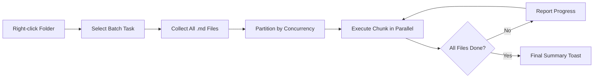

import TLDR from '@site/src/components/TLDR';

# Batch Processing

<TLDR>
**Notemd processes entire folders in one action with configurable concurrency and overwrite control.** Right-click a folder to batch-add wiki-links, extract concepts, research, or translate all notes within. Concurrency limits prevent API rate-limit errors. Progress is reported per file. Overwrite behavior is configurable: skip existing, append, or replace. Failed files are logged without aborting the batch.

This is part of the [Obsidian AI Knowledge Management Guide](/docs/pillar-ai-knowledge).
</TLDR>

## Overview

Batch processing turns a folder of notes into a single operation. Instead of opening each note and running commands individually, you right-click the folder and select the task. Notemd iterates through every `.md` file, applies the chosen action, and reports progress in real time.

This feature is essential for vault-wide knowledge extraction. After importing dozens of PDFs, for example, batch-add-links followed by batch-extract-concepts builds your knowledge graph in minutes rather than hours.

## How It Works

### Batch Execution Model

1. **File collection** -- Notemd scans the target folder recursively (or top-level only, depending on settings) and collects all `.md` files.
2. **Concurrency partitioning** -- Files are divided into chunks based on the `batchConcurrency` setting. Each chunk runs in parallel; chunks run sequentially.
3. **Execution** -- Each file is processed using the same logic as the single-file command. Per-task provider and model settings are respected.
4. **Progress reporting** -- A toast notification updates after each file completes, showing `N / Total` progress.
5. **Error handling** -- If a file fails (API error, network timeout, etc.), the error is logged and the batch continues. The final summary lists any failed files.
6. **Completion** -- A summary toast reports total processed, successes, and failures.

### Overwrite Behavior

When processing a file that already has wiki-links, concept notes, or translations, Notemd's behavior depends on the overwrite setting:

| Mode | Behavior |
|------|----------|
| **Skip** | Existing content is left untouched. Only unmodified files are processed. |
| **Append** (default) | New content is appended. Existing wiki-links, concepts, or translations are preserved. |
| **Replace** | The file is fully reprocessed. All previous Notemd modifications are overwritten. |

For wiki-linking specifically: if a note already contains `[[wiki-links]]`, the **skip** mode leaves it alone, while **replace** re-sends the entire note to the LLM for fresh link insertion. Use **skip** for incremental processing and **replace** for reprocessing after a model upgrade.

### Concurrency Control

The `batchConcurrency` setting limits parallel API calls. This prevents rate-limit errors (HTTP 429) when processing large folders against providers with strict quotas.

| Concurrency | Recommended For | Typical Rate-Limit Impact |
|-------------|----------------|---------------------------|
| `1` | Free tiers, strict providers | None (serial) |
| `3` (default) | Most cloud providers | Low |
| `5` | Ollama (local), generous tiers | None / Low |
| `10` | Local models with fast inference | None |

If you encounter 429 errors during batch processing, reduce concurrency to 1 or 2.

## Configuration

| Setting | Default | Effect |
|---------|---------|--------|
| `batchConcurrency` | `3` | Maximum parallel API calls during folder operations |
| `batchOverwriteExisting` | `false` | Overwrite existing Notemd content. `false` = append mode. |
| `batchSkipProcessed` | `false` | Skip files that already contain Notemd markers (e.g., wiki-links) |
| `batchRecursive` | `true` | Include subdirectories when scanning the folder |
| `enableStableApiCall` | `false` | Enable retry logic (up to 4 attempts) per file during batch |

### Per-Task Models in Batch

Each batch operation uses the corresponding per-task model. Batch-add-links uses `addLinksProvider`, batch-research uses `researchProvider`, and so on. This means you can assign cheap models for high-volume operations and reserve expensive models for quality-sensitive tasks.

## Example

You have a folder `papers/` containing 40 imported research notes. You want to add wiki-links and extract concepts across all of them:

1. Right-click the `papers/` folder
2. Select **"Notemd: Process folder (add links)"**
3. Notemd scans the folder, finds 40 `.md` files, and processes 3 at a time (default concurrency)
4. A progress toast shows: `12/40 files processed...`
5. After ~3 minutes, a summary toast reports: `39 succeeded, 1 failed (API timeout on paper-37.md)`
6. Repeat with **"Notemd: Process folder (extract concepts)"** to create concept notes for all 40

The one failed file is logged. You can re-run on just that file afterward.

## Tips

- **Start with low concurrency** -- If you are unsure of your provider's rate limits, begin with `1` and increase gradually.
- **Use skip mode for incremental updates** -- After the first full batch, switch to `batchSkipProcessed: true` so only new notes get processed on subsequent runs.
- **Enable stable API calls** -- `enableStableApiCall: true` adds retry logic that recovers from transient network errors during long batches.
- **Re-run after model upgrades** -- If you switch to a better model, set `batchOverwriteExisting: true` and re-run to get improved links and concepts.

---

## Next Steps

- [Workflows](/docs/features/workflows) -- Chain batch tasks into one-click sidebar buttons
- [Custom Prompts](/docs/advanced/custom-prompts) -- Customize prompts for batch extraction
- [Troubleshooting](/docs/advanced/troubleshooting) -- Fix rate-limit errors and connection failures during batch runs
- [LLM Providers](/docs/providers/overview) -- Per-task model configuration reference
