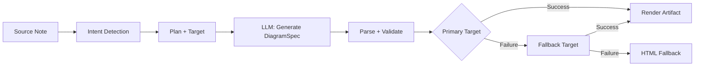

import TLDR from '@site/src/components/TLDR';

# Diagrams

<TLDR>
**Notemd generates diagrams from your notes through a spec-first pipeline.** The LLM produces a renderer-agnostic `DiagramSpec` JSON, then dedicated adapters translate it into Mermaid, JSON Canvas, Vega-Lite, or HTML output. Supports 8 intent types, automatic fallback chains, live preview with SVG/PNG export, and local-knowledge-augmented generation.
</TLDR>

This is part of the [Obsidian AI Knowledge Management Guide](/docs/pillar-ai-knowledge).

## Architecture: Spec-First Pipeline

Notemd never asks the LLM to produce Mermaid/Vega/Canvas syntax directly. Instead:

**Why spec-first?** LLMs produce invalid renderer syntax frequently (Mermaid in particular). A structured `DiagramSpec` can be validated before rendering, and the same spec can feed multiple renderers as fallbacks.

## Supported Diagram Types

| Intent | Primary Renderer | Fallbacks | Use Case |
|--------|-----------------|-----------|----------|
| `mindmap` | Mermaid | HTML | Hierarchical topic breakdown |
| `flowchart` | Mermaid | HTML | Process flows, decision trees |
| `sequence` | Mermaid | HTML | Client-server interactions, protocols |
| `classDiagram` | Mermaid | HTML | OOP class relationships |
| `erDiagram` | Mermaid | HTML | Database schemas, entity relationships |
| `stateDiagram` | Mermaid | HTML | State machines, lifecycle models |
| `canvasMap` | JSON Canvas | Mermaid → HTML | Concept maps, knowledge graphs |
| `dataChart` | Vega-Lite | Mermaid → HTML | Bar, line, area, scatter, pie, tables |

## Intent Detection

Notemd infers the best diagram type from your note's content using keyword scoring:

| Intent | Triggers | Confidence |
|--------|----------|------------|
| `dataChart` | Tables, numeric cells, metric/trend keywords, percentages | 0.88 |
| `sequence` | Request/response vocab (4+ matches) or `->`/`=>` markers | 0.82 |
| `erDiagram` | Primary key, foreign key, entity, schema (2+ matches) | 0.80 |
| `stateDiagram` | State, transition, pending, running, failed (3+ matches) | 0.76 |
| `flowchart` | Numbered steps (2+) or if/then/else/workflow vocab | 0.74 |
| `canvasMap` | Concept map, knowledge graph, spatial, cluster | 0.72 |
| `mindmap` | Default fallback | 0.55 |

Override with `preferredDiagramIntent` setting or the explicit command palette option.

## Usage

### Generate a Diagram

1. Open a note
2. Run **"Notemd: Generate diagram"** from command palette
3. Notemd detects intent, generates spec, renders, and saves the artifact

**Output files by target:**

| Target | Extension | Filename Pattern |
|--------|-----------|------------------|
| Mermaid | `.md` | `{note}_summ.md` |
| JSON Canvas | `.canvas` | `{note}_diagram.canvas` |
| Vega-Lite | `.json` | `{note}_diagram.json` |
| HTML | `.html` | `{note}_diagram.html` |

### Preview a Diagram

1. Run **"Notemd: Preview diagram"**
2. A modal opens with the rendered diagram
3. Export as SVG or PNG using the toolbar buttons

**Auto-open preview** is available in settings — after generation, the preview modal launches automatically.

### Legacy Mermaid Mode

When `enableExperimentalDiagramPipeline` is off, Notemd sends a direct Mermaid prompt to the LLM. This bypasses the spec pipeline entirely. If the experimental pipeline fails, it falls back to this mode.

## Rendering Backends

### Mermaid

6 adapters (mindmap, flowchart, sequence, ER, class, state) translate `DiagramSpec` into Mermaid syntax. After generation, `mermaid.parse()` validates the output. If validation fails:

1. **LLM retry** — one attempt with the Mermaid error message as context
2. **Minimal fallback** — a bare-bones Mermaid diagram from spec node IDs

**Legacy Mermaid Fixer** automatically repairs common LLM syntax errors: note directive normalization, pipe-label escaping, semicolon repositioning, smart quotes, double-dash arrows, shape mismatches, and more.

### JSON Canvas

Produces Obsidian JSON Canvas format with spatial layout:
- Nodes positioned by depth (x = depth × 420) and index (y = index × 170)
- Width estimated from label length
- Edges with `fromSide: 'right'`, `toSide: 'left'`, `toEnd: 'arrow'`

### Vega-Lite

Builds complete Vega-Lite v5 JSON specs with automatic encoding:
- **Cartesian charts** (bar/line/area/point/scatter): x + y channels + color for multi-series
- **Pie**: theta = y (quantitative), color = x (nominal)
- **Table**: row = x, text = y + column = series

Dark and light theme patches are deep-merged before compilation.

### HTML

Universal fallback. Self-contained HTML document with:
- CSP meta headers
- Light/dark mode via `prefers-color-scheme`
- Localized UI labels for 20 locales
- Sections: hero, structure (node tree), relationships, callouts, data series tables

## Configuration

| Setting | Default | Effect |
|---------|---------|--------|
| `enableExperimentalDiagramPipeline` | `false` | Toggle between spec-first and legacy Mermaid |
| `experimentalDiagramCompatibilityMode` | `'legacy-mermaid'` | `'legacy-mermaid'` = Mermaid only; `'best-fit'` = native targets + fallbacks |
| `preferredDiagramIntent` | `undefined` (auto) | Override automatic intent detection |
| `summarizeToMermaidLanguage` | `'en'` | Target language for diagram labels |
| `summarizeToMermaidProvider` / `Model` | DeepSeek | Per-task LLM for diagram generation |
| `autoMermaidFixAfterGenerate` | (from constants) | Auto-run legacy fixer on Mermaid output |
| `enableLocalKnowledgeForDiagramGeneration` | `false` | Augment source with local vault knowledge |

### Local Knowledge Augmentation

When enabled, Notemd retrieves relevant context snippets from your vault's local knowledge base (MiniSearch-based) and prepends them to the source markdown. The augmentation prompt notes: "supporting reference only; keep the primary structure faithful to the source note."

### Compatibility Modes

- **`legacy-mermaid`**: All intents route to Mermaid. Non-Mermaid intents (canvasMap, dataChart) are forced to `flowchart` or `mindmap`. No fallback chain.
- **`best-fit`**: Each intent routes to its native target. If primary fails, traverses the fallback chain (e.g., Vega-Lite → Mermaid → HTML).

## Preview & Export

| Action | Method |
|--------|--------|
| SVG export | `mermaid.render()` / `vega.View.toSVG()` / SVG builder for Canvas |
| PNG export | SVG → Image → Canvas (device pixel ratio 1x-3x) → PNG ArrayBuffer |
| Source save | Raw artifact content saved with target-specific extension |

**Caching**: RenderCache uses deterministic JSON key of `{spec, target, theme}`. In-flight deduplication prevents duplicate renders.

## Tips

- **Start with `best-fit` mode** — it produces the best visual output for each intent type
- **Use powerful models for complex diagrams** — flowcharts and ER diagrams benefit from GPT-4o or Claude
- **Enable local knowledge** for domain-specific diagrams — relevant vault context improves accuracy
- **Set `autoMermaidFixAfterGenerate`** — Mermaid syntax errors are common without it
- **The legacy fixer is comprehensive** — if Mermaid preview fails, running the fixer command manually often resolves it

---

## Next Steps

- 🔗 [Wiki-Links](./wiki-links) — How concepts get linked inline
- 📝 [Concept Notes](./concept-notes) — Extract concepts for diagram source material
- 🔍 [Research](./research) — Augment diagrams with web-sourced data
