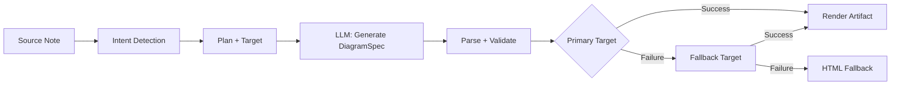
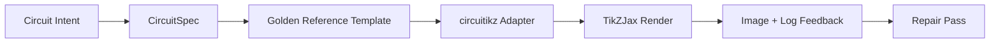

import TLDR from '@site/src/components/TLDR';

# Diagrams

<TLDR>
**Notemd generates diagrams from your notes through a spec-first pipeline.** The LLM produces a renderer-agnostic `DiagramSpec` JSON, then dedicated adapters translate it into Mermaid, JSON Canvas, Vega-Lite, HTML, or editable HTML/SVG output. Supports 8 intent types, automatic fallback chains, live preview with SVG/PNG export, semantic verification, and local-knowledge-augmented generation.
</TLDR>

This is part of the [Obsidian AI Knowledge Management Guide](/docs/pillar-ai-knowledge).

## Architecture: Spec-First Pipeline

Notemd never asks the LLM to produce Mermaid/Vega/Canvas syntax directly. Instead:



**Why spec-first?** LLMs produce invalid renderer syntax frequently (Mermaid in particular). A structured `DiagramSpec` can be validated before rendering, and the same spec can feed multiple renderers as fallbacks.

## Supported Diagram Types

| Intent | Primary Renderer | Fallbacks | Use Case |
|--------|-----------------|-----------|----------|
| `mindmap` | Mermaid | HTML | Hierarchical topic breakdown |
| `flowchart` | Mermaid | HTML | Process flows, decision trees |
| `sequence` | Mermaid | HTML | Client-server interactions, protocols |
| `classDiagram` | Mermaid | HTML | OOP class relationships |
| `erDiagram` | Mermaid | HTML | Database schemas, entity relationships |
| `stateDiagram` | Mermaid | HTML | State machines, lifecycle models |
| `canvasMap` | JSON Canvas | Mermaid → HTML | Concept maps, knowledge graphs |
| `dataChart` | Vega-Lite | Mermaid → HTML | Bar, line, area, scatter, pie, tables |

## Intent Detection

Notemd infers the best diagram type from your note's content using keyword scoring:

| Intent | Triggers | Confidence |
|--------|----------|------------|
| `dataChart` | Tables, numeric cells, metric/trend keywords, percentages | 0.88 |
| `sequence` | Request/response vocab (4+ matches) or `->`/`=>` markers | 0.82 |
| `erDiagram` | Primary key, foreign key, entity, schema (2+ matches) | 0.80 |
| `stateDiagram` | State, transition, pending, running, failed (3+ matches) | 0.76 |
| `flowchart` | Numbered steps (2+) or if/then/else/workflow vocab | 0.74 |
| `canvasMap` | Concept map, knowledge graph, spatial, cluster | 0.72 |
| `mindmap` | Default fallback | 0.55 |

Override with the **Preferred diagram type** setting, the sidebar selector, or an explicit command palette option.

## Render Target Selection

The experimental spec-first pipeline now has two independent controls:

| Control | Setting | Effect |
|---------|---------|--------|
| Preferred diagram type | `preferredDiagramIntent` | Guides the semantic shape of the generated `DiagramSpec` |
| Preferred render target | `preferredDiagramRenderTarget` | Chooses the artifact renderer for **Generate diagram** and **Preview diagram** |

Set **Preferred render target** to **Auto** for the planner default, or choose Mermaid, JSON Canvas, Vega-Lite, HTML, or Editable HTML/SVG explicitly. The override applies only to artifact and preview commands. The standard **Summarise as Mermaid diagram** command remains pinned to Mermaid-compatible output so existing Markdown workflows do not silently switch formats.

This separation matters because a `flowchart` intent can now be rendered as Mermaid for Markdown notes, HTML for robust fallback, or Editable HTML/SVG for downstream editing. Draw.io and Drawnix remain CLI artifact exporters rather than in-plugin render targets.

## Usage

### Generate a Diagram

1. Open a note
2. Run **"Notemd: Generate diagram"** from command palette
3. Notemd detects intent, generates spec, renders, and saves the artifact

**Output files by target:**

| Target | Extension | Filename Pattern |
|--------|-----------|------------------|
| Mermaid | `.md` | `{note}_summ.md` |
| JSON Canvas | `.canvas` | `{note}_diagram.canvas` |
| Vega-Lite | `.json` | `{note}_diagram.json` |
| HTML | `.html` | `{note}_diagram.html` |
| Editable HTML/SVG | `.html` | `{note}_diagram.html` |

### Preview a Diagram

1. Run **"Notemd: Preview diagram"**
2. A modal opens with the rendered diagram
3. Export as SVG or PNG using the toolbar buttons

**Auto-open preview** is available in settings — after generation, the preview modal launches automatically.

The preview modal also has an artifact diagnostics panel. Renderers and smoke checks can attach `RenderArtifact.diagnostics`; the modal shows a diagnostic summary with error/warning/info counts, then severity, diagnostic kind, message, and repair advice next to the preview. The same summary is shown in preview history entries, so repeated circuitikz smoke attempts can be compared without opening every entry. For artifacts that have source content but cannot be rendered inline or through the HTML iframe path, the modal now falls back to a source-only preview instead of forcing an empty iframe. This gives circuitikz compile/render smoke, SVG text-token checks, PNG blank-screenshot checks, and future overlap reports a visible UI surface without making TikZJax or LaTeX a hard plugin runtime dependency or pretending source text is a verified visual render.

### Legacy Mermaid Mode

When `enableExperimentalDiagramPipeline` is off, Notemd sends a direct Mermaid prompt to the LLM. This bypasses the spec pipeline entirely. If the experimental pipeline fails, it falls back to this mode.

## Rendering Backends

### Mermaid

6 adapters (mindmap, flowchart, sequence, ER, class, state) translate `DiagramSpec` into Mermaid syntax. After generation, `mermaid.parse()` validates the output. If validation fails:

1. **LLM retry** — one attempt with the Mermaid error message as context
2. **Minimal fallback** — a bare-bones Mermaid diagram from spec node IDs

**Legacy Mermaid Fixer** automatically repairs common LLM syntax errors: note directive normalization, pipe-label escaping, semicolon repositioning, smart quotes, double-dash arrows, shape mismatches, and more.

### JSON Canvas

Produces Obsidian JSON Canvas format with spatial layout:
- Nodes positioned by depth (x = depth × 420) and index (y = index × 170)
- Width estimated from label length
- Edges with `fromSide: 'right'`, `toSide: 'left'`, `toEnd: 'arrow'`

### Vega-Lite

Builds complete Vega-Lite v5 JSON specs with automatic encoding:
- **Cartesian charts** (bar/line/area/point/scatter): x + y channels + color for multi-series
- **Pie**: theta = y (quantitative), color = x (nominal)
- **Table**: row = x, text = y + column = series

Dark and light theme patches are deep-merged before compilation.

### HTML

Universal fallback. Self-contained HTML document with:
- CSP meta headers
- Light/dark mode via `prefers-color-scheme`
- Localized UI labels for 20 locales
- Sections: hero, structure (node tree), relationships, callouts, data series tables

### Editable HTML/SVG

Explicit figure target for editable export workflows. It projects `DiagramSpec` into a deterministic `SemanticFigureModel`, then renders a self-contained HTML document with inline SVG groups that carry Draw.io-style annotations:

- `data-drawio-type`, `data-drawio-id`, and `data-drawio-role` on semantic nodes
- `data-drawio-source` and `data-drawio-target` on semantic edges
- stable node/edge identifiers after whitespace normalization and collision handling
- no scripts, no external fonts, and no remote assets

This target is intentionally not the default planner route yet. It is available as an explicit render target while the product path proves editing behavior across real tools.

### Draw.io and Drawnix Export Boundaries

The current implementation keeps third-party editor support at the artifact boundary:

| Target | Contract | Runtime Dependency |
|--------|----------|--------------------|
| Draw.io | deterministic uncompressed `mxfile` XML from `SemanticFigureModel` | none in plugin runtime or CI |
| Drawnix | minimal `.drawnix` JSON subset using `geometry` and `arrow-line` elements | none in plugin runtime or CI |

The tradeoff is deliberate: Notemd can verify visible labels, stable IDs, and supported primitive coverage without embedding diagrams.net Desktop, Drawnix, Plait, or browser-only editor state into the plugin.

### circuitikz / TikZJax Direction

Circuit diagrams are not the same problem as generic flowcharts. The correct syntax target for electrical circuits is usually **circuitikz**, rendered in Obsidian through plugins such as TikZJax. TikZJax can load packages such as `circuitikz`, `pgfplots`, `tikz-cd`, and `chemfig`, which makes it attractive for physics, circuits, chemistry, and mathematics notes.

The risk is that raw LLM-generated TikZ is brittle:

- complex circuit topology can be electrically correct but visually unreadable;
- overlapping wires and labels can make a correct netlist unusable for study notes;
- missing package preambles, wrong anchors, or invalid component names can prevent rendering;
- feedback from the renderer is usually image-level, while the LLM generated text-level geometry.

The better architecture is to treat circuitikz as a constrained diagram target, not as a free-form prompt:



The first-class model should describe circuit topology and layout separately:

| Layer | Responsibility | Example |
|-------|----------------|---------|
| Topology | electrical nodes and component connections | `VDD -> RD -> drain(M1)`, `source(M1) -> GND` |
| Layout | grid placement, orientation, routing lanes | `M1 at (3,2.2)`, input left, output right |
| Style | package, voltage convention, labels, anchors | `\begin{circuitikz}[american voltages]` |
| Validation | compile log, missing anchors, overlap/screenshot checks | TikZJax/LaTeX diagnostics plus visual review |

### Current circuitikz Prototype

Notemd now includes the first constrained repository prototype for this direction. It is intentionally offline and template-bound:

```bash
npm run diagram:export-circuitikz -- --input cmos-inverter.json --output cmos-inverter.tex
```

The prototype adds a separate `CircuitSpec` boundary and deterministic exporter for six golden-reference families:

| Circuit kind | Golden reference | Current guarantee |
|--------------|------------------|-------------------|
| `common-source-amplifier` | `common-source-nmos-v1` | validates `VDD -> R_D -> M1.D`, `vin -> M1.G`, `M1.S -> GND`, and `M1.D -> vout` before writing LaTeX |
| `cmos-inverter` | `cmos-inverter-v1` | validates PMOS-over-NMOS topology, shared gate input, shared drain output, `VDD -> MP.S`, and `MN.S -> GND` before writing LaTeX |
| `cmos-buffer` | `cmos-buffer-v1` | validates two cascaded inverter stages, intermediate node `vmid`, restored `vout`, and shared VDD/GND rails before writing LaTeX |
| `cmos-transmission-gate` | `cmos-transmission-gate-v1` | validates parallel PMOS/NMOS pass devices between `vin` and `vout` with complementary `phib` / `phi` controls before writing LaTeX |
| `cmos-nand2` | `cmos-nand2-v1` | validates parallel PMOS pull-up, series NMOS pull-down, dual inputs `va` / `vb`, and `vout` before writing LaTeX |
| `cmos-nor2` | `cmos-nor2-v1` | validates series PMOS pull-up, parallel NMOS pull-down, dual inputs `va` / `vb`, and `vout` before writing LaTeX |

This is not a general TikZ generator yet. It does not compile LaTeX, call TikZJax, inspect screenshots, or run automated image-feedback repair. Those remain later gates.

For topology-preserving repair, pass the pre-repair spec as a reference before accepting a repaired candidate:

```bash
npm run diagram:export-circuitikz -- --input repaired-cmos-inverter.json --topology-reference cmos-inverter.json --output cmos-inverter.tex
```

The repair guard uses `createCircuitTopologySignature` and `assertCircuitTopologyUnchanged` to compare `circuitKind`, `goldenReferenceId`, nets, component ids/types/terminals, and undirected connection endpoints before output. Labels, title text, layout hints, connection order, and connection labels are intentionally ignored. A candidate that adds a short or rewires a terminal fails with `Circuit topology drift detected` before the `.tex` file is written.

The CLI can now parse an existing LaTeX/TikZJax compile log without executing a compiler:

```bash
npm run diagram:export-circuitikz -- --input cmos-inverter.json --output cmos-inverter.tex --compile-log cmos-inverter.log --diagnostics-output cmos-inverter.diagnostics.json
```

This diagnostic path reports missing packages such as `circuitikz.sty`, unknown TikZ/circuitikz keys, undefined control sequences, generic LaTeX errors, emergency stops, and advisory overfull `\hbox` warnings. It remains log-driven: local LaTeX/TikZJax execution and screenshot-quality gates are still separate future work.

For maintainer smoke checks, the same CLI can optionally run an explicitly configured renderer without shell command parsing:

```bash
npm run diagram:export-circuitikz -- --input cmos-inverter.json --output cmos-inverter.tex --compile-executable pdflatex --compile-arg -interaction=nonstopmode --compile-arg -halt-on-error --compile-arg -output-directory={outputDir} --compile-arg {tex} --expected-artifact {outputDir}/{jobName}.pdf
```

The compile runner uses `shell: false`, expands `{tex}`, `{outputDir}`, and `{jobName}` placeholders into argument-array values, reads the generated `{jobName}.log`, and returns `compileExecution` plus `compileDiagnostics` in the CLI JSON output. `--compile-executable` is the renderer binary or wrapper path only; renderer flags belong in repeated `--compile-arg` values. Empty executables fail as `compile-executable-invalid`, missing binaries fail as `compile-executable-not-found`, and shell-command-shaped executable strings receive advice to split arguments so Windows, Linux, and macOS follow the same direct-exec contract. With `--expected-artifact`, it also reports `compileExecution.renderSmoke` and fails the CLI if the renderer does not create a non-empty artifact. It still does not bundle LaTeX, make TikZJax a plugin runtime dependency, or perform screenshot-level visual repair.

If the expected artifact is `.svg`, the smoke check goes one layer deeper:

```bash
npm run diagram:export-circuitikz -- --input cmos-inverter.json --output cmos-inverter.tex --compile-executable dvisvgm --compile-arg ... --expected-artifact {outputDir}/{jobName}.svg --expected-svg-text v_{in} --expected-svg-text v_{out}
```

SVG smoke verifies the `<svg>` root, positive dimensions or `viewBox`, at least one visible drawing element after hidden/transparent element exclusion, any requested text tokens, obvious elements outside the `viewBox`, obvious overlapping positioned `<text>` / `<tspan>` labels, and obvious text labels overlapping drawing elements through `render-svg-label-overlap`. Expected text is searched in visible text and decoded accessibility metadata such as `aria-label`, `<title>`, and `<desc>`, so renderers that preserve semantic labels outside visible `<text>` can still satisfy text-token smoke without requiring OCR. The geometry pass is now transform-aware geometry for common group and element `transform` attributes, so translated, scaled, rotated, skewed, or matrix-transformed SVG boxes are checked after transform composition. It covers exact arc bounds for A/a arc extrema, exact Bezier curve bounds for C/S/Q/T curve extrema, stroke-width-aware SVG bounds and label overlap checks, `polyline` / `polygon` drawing geometry, and also resolves path-only glyph placement from `<use href="#...">` references so labels converted to reusable glyph paths can still fail bounded-canvas checks when the placed glyph geometry escapes the `viewBox`. Multiple positioned `tspan` labels under one `<text>` parent are compared as separate label boxes, which catches LaTeX-style SVG output that would otherwise collapse distinct labels into one text node. Positioned SVG `text` and `tspan` boxes respect `text-anchor` values `start`, `middle`, and `end`, so centered and right-aligned labels can trigger text/text and label-vs-drawing overlap diagnostics without claiming browser-grade text layout. Definition-only glyph paths inside `<defs>` are not counted as visible drawing elements, but their own definition-local `transform` attributes are applied before `<use>` placement so scaled or mirrored glyph definitions are not under-counted. The label-vs-drawing check uses a small drawing-box tolerance and the declared `stroke-width`, so thin wires, thick wires, and polygonal component outlines can all be treated as potential label-legibility failures when their visible stroke reaches a label. Path-only glyph labels resolved from `<use href="#...">` are also compared against drawing boxes and fail with `render-svg-path-glyph-overlap` when reusable glyph geometry overlaps wires or components. If a renderer converts labels into reusable path glyphs instead of searchable `<text>` and does not preserve accessibility metadata, the smoke report records `pathOnlyGlyphUseCount` and fails the requested text token through `render-svg-text-path-only` instead of pretending the label is simply absent. Other failures are reported through `render-svg-invalid`, `render-svg-dimension-missing`, `render-svg-no-visible-elements`, `render-svg-text-missing`, `render-svg-out-of-bounds`, `render-svg-text-overlap`, `render-svg-label-overlap`, or `render-svg-path-glyph-overlap`. Text-token and overlap checks should only be treated as structural smoke for renderers that preserve labels as searchable SVG text or accessibility metadata; path-only SVG output still needs the later screenshot/OCR gate to prove visual label legibility, and this smoke pass still does not claim full SVG path coverage.

Hidden SVG groups and elements are skipped consistently during visible-element counting and geometry collection. Attribute or inline-style `display:none`, `visibility:hidden`, `visibility:collapse`, and overall `opacity:0` cannot make an otherwise blank render artifact pass visible-output smoke.

Path-only glyph definitions can be direct paths or grouped/symbol containers inside `<defs>`. The smoke pass resolves child path geometry from `<g id="...">` and `<symbol id="...">` before `<use>` placement, so wrapped glyph output still feeds `pathOnlyGlyphUseCount`, bounded-canvas checks, and `render-svg-path-glyph-overlap`.

The path parser also tracks subpath starts and resets the current point on `Z/z`, so relative commands after a closed subpath continue from the correct SVG point instead of creating false `render-svg-out-of-bounds` diagnostics.

The same geometry pass follows SVG number grammar for leading-dot decimals and explicit plus signs, so compact dvisvgm coordinates such as `.5`, `-.5`, or `+.5` stay fractional during bounds checks instead of becoming false out-of-bounds geometry or being skipped.

If the renderer emits `.png`, the same expected-artifact path becomes a first screenshot smoke: Notemd decodes non-interlaced 1/2/4/8-bit indexed-color PNG files, 1/2/4/8/16-bit grayscale PNG files, and 8/16-bit grayscale-alpha/RGB/RGBA PNG files. Indexed-color and sub-byte grayscale images support packed samples; indexed-color images also support PLTE and optional tRNS data; grayscale/RGB images support tRNS transparent samples. 16-bit direct samples are normalized into the same 8-bit RGBA comparison space used by the smoke checks. The smoke check verifies positive dimensions, records foreground bounds as `foregroundBounds`, records foreground density inside that box as `foregroundDensity`, fails with `render-png-blank` when every visible pixel matches the top-left background color, fails with `render-png-content-clipped` when foreground content touches the image boundary, and fails with `render-png-foreground-dense` when foreground pixels are unusually dense inside a non-trivial bounding box. Unsupported PNG formats fail with `render-png-unsupported` and format-specific guidance for Adam7 interlaced PNGs or unsupported indexed-color bit depths. This catches blank screenshots, obvious canvas clipping, first pixel-level crowding failures, and wrong renderer PNG export settings without adding a platform-specific shell dependency. It is not yet OCR-level label recognition, precise text-overlap detection, or topology-preserving image repair.

When diagnostics show a failed compile or render-smoke run, the CLI can also write a topology-preserving repair brief:

```bash
npm run diagram:export-circuitikz -- --input cmos-inverter.json --topology-reference cmos-inverter.json --output cmos-inverter.tex --compile-log cmos-inverter.log --repair-brief-output cmos-inverter.repair-brief.json
```

The repair brief uses schema `notemd.circuitikz.repair-brief.v1` and carries the source `CircuitSpec`, topology signature, compile/render diagnostics, allowed edits, prohibited topology edits, next verification steps, and a structured `repairPrompt`. The prompt role is `topology-preserving-circuitikz-repair`; its `diagnosticFocus` list is derived from the compile/render diagnostics, and its `acceptanceCriteria` require candidate validation plus fresh compile and render-smoke checks. It is the handoff format for a later repair loop, not a claim that Notemd already runs autonomous visual repair.

After a repair candidate is produced, the same CLI can validate it against the brief before writing output:

```bash
npm run diagram:export-circuitikz -- --input repaired-cmos-inverter.json --repair-brief cmos-inverter.repair-brief.json --output repaired-cmos-inverter.tex
```

`--repair-brief` checks the candidate topology signature from the brief and is mutually exclusive with `--topology-reference`. Passing this gate proves topology preservation only; the candidate still needs compile diagnostics and render-smoke checks.

The `--repair-brief` result also includes `repairAcceptance` evidence with schema `notemd.circuitikz.repair-acceptance.v1`. It reports `topology-signature`, `compile-diagnostics`, and `render-smoke` gates as `passed`, `failed`, or `missing`; exposes `remainingChecks`; and keeps `readyForVisualAcceptance` false until the candidate run includes all required evidence.

Use `--repair-acceptance-output` with `--repair-brief` when CI or release evidence needs a durable JSON file:

```bash
npm run diagram:export-circuitikz -- --input repaired-cmos-inverter.json --repair-brief cmos-inverter.repair-brief.json --output repaired-cmos-inverter.tex --repair-acceptance-output repaired-cmos-inverter.repair-acceptance.json
```

For release or maintainer evidence, run every supported golden family through the aggregate fixture runner:

```bash
npm run diagram:smoke-circuitikz -- --output-dir docs/export/circuitikz-smoke --compile-executable pdflatex --compile-arg -interaction=nonstopmode --compile-arg -halt-on-error --compile-arg -output-directory={outputDir} --compile-arg {tex} --expected-artifact {outputDir}/{jobName}.pdf
```

The runner uses `docs/maintainer/fixtures/circuitikz/common-source-nmos-v1.json`, `docs/maintainer/fixtures/circuitikz/cmos-inverter-v1.json`, `docs/maintainer/fixtures/circuitikz/cmos-buffer-v1.json`, `docs/maintainer/fixtures/circuitikz/cmos-transmission-gate-v1.json`, `docs/maintainer/fixtures/circuitikz/cmos-nand2-v1.json`, and `docs/maintainer/fixtures/circuitikz/cmos-nor2-v1.json`, calls the same shell-free exporter path for each fixture, and returns an aggregate JSON report with per-fixture `compileExecution` and `compileDiagnostics`. It is still a maintainer command, not a plugin runtime dependency.

When a maintainer machine has no renderer configured yet, run the same fixture command without `--compile-executable` and persist the environment gate explicitly:

```bash
npm run diagram:smoke-circuitikz -- --output-dir docs/export/circuitikz-smoke --report-output docs/export/circuitikz-smoke/renderer-availability.json
```

That path still writes the deterministic fixture `.tex` artifacts, but returns `ok: false` with `rendererAvailability.status` set to `missing-configuration` and a `compile-executable-invalid` diagnostic. Treat it as renderer availability evidence only; it is not compile, render-smoke, or visual acceptance.

### Golden Reference Prompt Shape

For near-term usage, provide a renderable golden reference before asking for a circuit variant. A constrained prompt should preserve the preamble, coordinate scale, anchor style, and routing conventions:

```latex
\usepackage{circuitikz}
\begin{document}
\begin{circuitikz}[american voltages]
\draw
  (3,5) node[vcc]{$V_{DD}$}
  to [R, l=$R_D$] (3,3)
  to [short, *-o] (5,3) node[right]{$v_{out}$}
  (3,3) to [short] (3,2.2)
  node[nmos, anchor=D] (M1) {$M_1$}
  (M1.S) to [short] (3,0.5)
  node[ground]{}
  (M1.G) to [short, -o] (0.8,2.2)
  node[left]{$v_{in}$};
\draw
  (3,0.5) node[below right]{$S$};
\end{circuitikz}
\end{document}
```

For a CMOS inverter, the prompt should request an explicit topology plus layout constraints, not just "draw a CMOS inverter":

- keep `VDD` at the top, `GND` at the bottom, input on the left, output on the right;
- use `pmos` above `nmos`, with shared gates and shared drains;
- keep the output node at the drain junction and mark it with `*-o`;
- use named anchors (`PM1.G`, `NM1.G`, `PM1.D`, `NM1.D`) instead of visually inferred coordinates;
- avoid diagonal or crossing wires unless electrically required.

### Current Progress And Next Phases

| Area | Current status | Next move |
|------|----------------|-----------|
| General diagrams | Spec-first pipeline implemented for Mermaid, JSON Canvas, Vega-Lite, HTML | Keep expanding semantic verification coverage |
| Editable figures | `editable-html-svg`, Draw.io XML, and Drawnix JSON artifact boundaries implemented | Add richer primitives only after tests prove editability |
| CLI support | `npm run diagram:export-artifact` exports editable HTML/SVG, Draw.io, and Drawnix from one `DiagramSpec` | Add target-specific smoke fixtures when new targets ship |
| circuitikz | `CircuitSpec -> circuitikz` prototype exports common-source, CMOS inverter, `cmos-buffer` / `cmos-buffer-v1`, `cmos-transmission-gate` / `cmos-transmission-gate-v1`, `cmos-nand2` / `cmos-nand2-v1`, and `cmos-nor2` / `cmos-nor2-v1` golden templates, projects `layoutHints.inputSide` and `layoutHints.outputSide` into deterministic input/output port placement without changing topology, rejects repair topology drift through `--topology-reference`, emits topology-preserving repair briefs through `--repair-brief-output` and schema `notemd.circuitikz.repair-brief.v1`, includes structured `repairPrompt` handoff content with `diagnosticFocus`, `acceptanceCriteria`, and role `topology-preserving-circuitikz-repair`, validates repair candidates through `--repair-brief`, returns `repairAcceptance` gate evidence through schema `notemd.circuitikz.repair-acceptance.v1` with `readyForVisualAcceptance` and `remainingChecks`, persists that evidence through `--repair-acceptance-output`, parses compile logs, can run explicit local renderers plus `--expected-artifact`, SVG `--expected-svg-text`, accessibility metadata checks through `aria-label`, `<title>`, and `<desc>`, hidden/transparent SVG element exclusion, `render-svg-text-path-only` / `pathOnlyGlyphUseCount` classification for path-only labels, path-only glyph placement checks for `<use href="#...">`, path-only glyph overlap diagnostics through `render-svg-path-glyph-overlap`, close-path current-point handling for `Z/z`, exact arc bounds for A/a arc extrema, exact Bezier curve bounds for C/S/Q/T curve extrema, stroke-width-aware SVG bounds and label overlap checks, `polyline` / `polygon` drawing geometry checks, positioned `tspan` label geometry, `text-anchor`-aware positioned text geometry, transform-aware geometry for SVG bounded-canvas/text-overlap and label-vs-drawing smoke through `render-svg-label-overlap`, and PNG nonblank / clipped / dense-foreground screenshot smoke checks, including indexed-color palette alpha, grayscale/RGB tRNS transparent samples, and format-specific `render-png-unsupported` guidance for Adam7 interlaced PNGs and indexed bit-depth failures, through `foregroundBounds`, `foregroundDensity`, `render-png-content-clipped`, and `render-png-foreground-dense` without shell parsing, includes aggregate maintainer smoke fixtures through `npm run diagram:smoke-circuitikz`, records missing renderer configuration through `rendererAvailability.status: "missing-configuration"` and `compile-executable-invalid`, and has generic preview diagnostics, diagnostic summary counts, diagnostics-aware history entries, and source-only fallback through `RenderArtifact.diagnostics` and the preview modal | Add OCR-level label recognition for path-only visual text, precise pixel-level overlap checks, broader SVG path coverage where needed, automatic renderer installation/discovery only if it can remain optional, and automated topology-preserving repair execution |
| TikZJax integration | Candidate render host for Obsidian-side display | Keep it optional; do not make TikZJax a hard plugin runtime dependency |

## Configuration

| Setting | Default | Effect |
|---------|---------|--------|
| `enableExperimentalDiagramPipeline` | `false` | Toggle between spec-first and legacy Mermaid |
| `experimentalDiagramCompatibilityMode` | `'legacy-mermaid'` | `'legacy-mermaid'` = Mermaid only; `'best-fit'` = native targets + fallbacks |
| `preferredDiagramIntent` | `undefined` (auto) | Override automatic intent detection |
| `summarizeToMermaidLanguage` | `'en'` | Target language for diagram labels |
| `summarizeToMermaidProvider` / `Model` | DeepSeek | Per-task LLM for diagram generation |
| `autoMermaidFixAfterGenerate` | (from constants) | Auto-run legacy fixer on Mermaid output |
| `enableLocalKnowledgeForDiagramGeneration` | `false` | Augment source with local vault knowledge |

### Local Knowledge Augmentation

When enabled, Notemd retrieves relevant context snippets from your vault's local knowledge base (MiniSearch-based) and prepends them to the source markdown. The augmentation prompt notes: "supporting reference only; keep the primary structure faithful to the source note."

### Compatibility Modes

- **`legacy-mermaid`**: All intents route to Mermaid. Non-Mermaid intents (canvasMap, dataChart) are forced to `flowchart` or `mindmap`. No fallback chain.
- **`best-fit`**: Each intent routes to its native target. If primary fails, traverses the fallback chain (e.g., Vega-Lite → Mermaid → HTML).

## Preview & Export

| Action | Method |
|--------|--------|
| SVG export | `mermaid.render()` / `vega.View.toSVG()` / SVG builder for Canvas |
| PNG export | SVG → Image → Canvas (device pixel ratio 1x-3x) → PNG ArrayBuffer |
| Source save | Raw artifact content saved with target-specific extension |
| Source-only preview | Non-inline artifacts with source content shown as code plus diagnostics, without iframe rendering |
| Semantic audit | Mermaid, JSON Canvas, Vega-Lite, and editable HTML/SVG checked by `scripts/diagram-semantic-verification.js` |

**Caching**: RenderCache uses deterministic JSON key of `{spec, target, theme}`. In-flight deduplication prevents duplicate renders.

## Tips

- **Start with `best-fit` mode** — it produces the best visual output for each intent type
- **Use powerful models for complex diagrams** — flowcharts and ER diagrams benefit from GPT-4o or Claude
- **Enable local knowledge** for domain-specific diagrams — relevant vault context improves accuracy
- **Set `autoMermaidFixAfterGenerate`** — Mermaid syntax errors are common without it
- **The legacy fixer is comprehensive** — if Mermaid preview fails, running the fixer command manually often resolves it

---

## Next Steps

- 🔗 [Wiki-Links](./wiki-links) — How concepts get linked inline
- 📝 [Concept Notes](./concept-notes) — Extract concepts for diagram source material
- 🔍 [Research](./research) — Augment diagrams with web-sourced data
