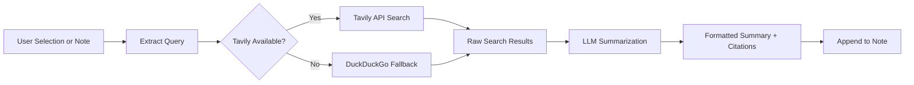

import TLDR from '@site/src/components/TLDR';

# Research & Web Search

<TLDR>
**Notemd queries the web and injects LLM-summarized results directly into your notes.** Tavily API is the primary search backend; DuckDuckGo serves as a zero-config fallback. Results are summarized with source citations and appended under a `## Research` heading. Supports single-note research, batch folder research, and per-task model selection for the summarization step.

This is part of the [Obsidian AI Knowledge Management Guide](/docs/pillar-ai-knowledge).
</TLDR>

## Overview

Research is one of Notemd's most powerful integrations: it closes the loop between reading, searching, and writing. Instead of switching to a browser to look up an unfamiliar term, you highlight it and let Notemd search, summarize, and append the findings -- all within your vault.

The process is fully configurable. You choose the search provider, the LLM that writes the summary, and whether results are appended to the active note or written to separate files. Batch mode lets you research every note in a folder in one click.

## How It Works

### Search-then-Summarize Pipeline



1. **Query extraction** -- Notemd extracts search terms from your selection or the note title.
2. **Web search** -- Tavily is attempted first. If no API key is configured, DuckDuckGo is used automatically (no key required).
3. **LLM summarization** -- Raw search results are sent to the configured LLM, which produces a concise summary with inline source citations.
4. **Append** -- The formatted summary is appended under a `## Research` heading in the active note.

### Tavily vs. DuckDuckGo

| Aspect | Tavily | DuckDuckGo |
|--------|--------|------------|
| API key | Required (free tier available) | Not required |
| Result quality | Higher (purpose-built for AI) | Adequate for general queries |
| Rate limits | Generous free tier | Subject to throttling |
| Configuration | `tavilyApiKey` in settings | Zero config -- auto-fallback |

### Batch Folder Research

Right-click a folder and select **"Notemd: Research folder"**. Every `.md` file in the folder is processed sequentially (or in parallel up to the configured concurrency). Each note receives its own research summary.

## Configuration

| Setting | Default | Effect |
|---------|---------|--------|
| `tavilyApiKey` | `''` | Tavily API key. When empty, DuckDuckGo is used exclusively. |
| `researchProvider` / `researchModel` | DeepSeek | Per-task LLM for summarizing search results |
| `maxResearchContentTokens` | `4000` | Token budget for content sent to the LLM. Excess is truncated. |
| `researchAppendToNote` | `true` | Append summary to the source note. If false, creates a separate file. |
| `researchLanguage` | `'en'` | Output language for the summarized research |

### Per-Task Model Recommendation

Research benefits from a model that handles multilingual content and produces well-structured prose. Consider:

- **DeepSeek** -- default, affordable, good quality
- **GPT-4o** -- higher quality summarization, higher cost
- **Gemini Flash** -- fast and inexpensive, solid for straightforward queries

## Example

You are reading a paper on *transformer attention mechanisms* and encounter an unfamiliar term: *relative positional encoding*. Rather than leaving Obsidian:

1. Highlight **"relative positional encoding"**
2. Right-click --> **"Notemd: Research and summarize"**
3. Notemd searches the web, summarizes the top results, and appends:

```markdown
## Research

### Relative Positional Encoding

Relative positional encoding is a method used in transformer models
where positional information is expressed as relative distances between
tokens rather than absolute positions. Introduced by Shaw et al. (2018),
it improves generalization to unseen sequence lengths compared to
absolute encodings (Vaswani et al., 2017).

Sources:
- [Shaw et al., Self-Attention with Relative Position Representations (2018)](https://arxiv.org/abs/1803.02155)
- [Transformer Positional Encoding Overview](https://example.com/transformer-pos-enc)
```

The summary is now part of your vault, searchable, linkable, and offline-accessible.

## Tips

- **Set a Tavily key for best results** -- even the free tier provides better relevance than raw DuckDuckGo.
- **Use a capable summarization model** -- cheap models may flatten nuanced technical content.
- **Batch research** after an initial read-through to fill gaps across many notes at once.
- **Review appended summaries** -- LLMs can hallucinate source details. Verify key claims.

---

## Next Steps

- [Concept Notes](./concept-notes) -- Extract and persist key terms from research results
- [Wiki-Links](./wiki-links) -- Link research-derived concepts across your vault
- [Translation](./translation) -- Translate research summaries into another language
- [LLM Providers](/docs/providers/overview) -- Configure the model used for summarization
