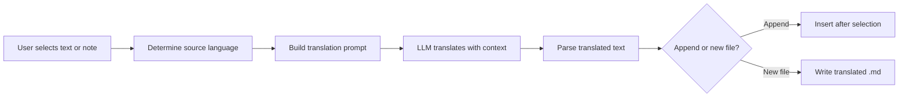

import TLDR from '@site/src/components/TLDR';

# Translation

<TLDR>
**Notemd translates text between 21+ languages using LLM-powered translation.** Supports single-selection translation, full-note translation, and batch folder translation. Each translation task can use a dedicated provider and model via per-task settings. Output language is independently configurable from the UI language. Results are appended or written to a new file depending on your preference.

This is part of the [Obsidian AI Knowledge Management Guide](/docs/pillar-ai-knowledge).
</TLDR>

## Overview

Translation in Notemd is not a dictionary lookup -- it is LLM-powered, context-aware translation. The model sees the full paragraph or note, preserving tone, domain terminology, and sentence structure. This produces higher-quality results than phrase-by-phrase services, especially for technical, academic, and creative writing.

The feature supports three scopes: selection, active note, and entire folder. Combined with per-task model selection, you can use a fast model (Gemini Flash) for casual translation and a powerful model (Claude Sonnet) for nuance-sensitive content -- without changing your global provider.

## How It Works

### The Translate Command



1. **Source detection** -- The LLM infers the source language from the content. You do not need to specify it manually.
2. **Prompt construction** -- Notemd builds a prompt that includes the target language, optional domain hint, and the content to translate.
3. **LLM translation** -- The configured `translateProvider` / `translateModel` processes the request. The model preserves markdown formatting, wiki-links, and code blocks.
4. **Output** -- The translated text is either appended below the original or written to a new file in the vault.

### Language Pairs

Notemd supports any language pair that the underlying LLM supports. Common pairs include:

| Source | Target | Typical Quality |
|--------|--------|----------------|
| English | Chinese (Simplified) | Excellent |
| Chinese | English | Excellent |
| English | Japanese | Very good |
| English | German / French / Spanish | Very good |
| Any supported | Any supported | Model-dependent |

The `translateLanguage` setting controls the **output language**. The source language is auto-detected.

### Per-Task Model Selection

Translation quality varies significantly by model. Notemd lets you assign a dedicated model just for translation:

| Model | Speed | Quality | Cost | Best For |
|-------|-------|--------|------|----------|
| `gemini-2.0-flash-exp` | Fast | Good | Low | Casual, high-volume |
| `gpt-4o-mini` | Fast | Good | Low | Quick lookups |
| `deepseek-chat` | Medium | Good | Very low | Budget multilingual |
| `claude-3-5-sonnet` | Medium | Excellent | Medium | Technical / academic |
| `gpt-4o` | Medium | Excellent | Medium | Nuance-sensitive prose |

### Batch Folder Translation

Right-click a folder and select **"Notemd: Translate folder"** to translate every note in that folder. Each file is processed independently. The concurrency setting controls how many files translate in parallel.

## Configuration

| Setting | Default | Effect |
|---------|---------|--------|
| `translateProvider` / `translateModel` | DeepSeek | Dedicated provider for translation tasks |
| `translateLanguage` | `'en'` | Target output language |
| `translationAppendToNote` | `true` | Append translated text below the original. If false, creates a new file. |
| `batchConcurrency` | `3` | Number of files processed in parallel during batch translation |

## Example

You are reading a Chinese research note and want an English version:

1. Open the note
2. Right-click --> **"Notemd: Translate current file"**
3. Notemd detects Chinese, translates to your configured target language (English), and appends:

```markdown
## Translation (English)

The experimental results show that the proposed method achieves
a 12% improvement in F1 score compared to the baseline, primarily
due to the enhanced feature extraction module described in Section 3.
```

The original Chinese text is untouched above the translation. The `## Translation` heading keeps both versions in the same file for easy reference.

## Tips

- **Use Gemini Flash for volume** -- it is the fastest and cheapest option for batch translation of large folders.
- **Preserve wiki-links** -- Notemd's prompt instructs the LLM to keep `[[wiki-links]]` intact in the translation. Verify after translation, as some models occasionally unwrap them.
- **Set output language explicitly** -- auto-detection works for source, but always configure `translateLanguage` to avoid ambiguity about the target.
- **Batch-translate concept notes** -- if your concept folder is in one language and you need it in another, folder-level translation handles it in one step.

---

## Next Steps

- [Research](./research) -- Search and summarize in any language, then translate results
- [Workflows](./workflows) -- Chain translation with wiki-linking or concept extraction
- [Batch Processing](/docs/advanced/batch-processing) -- Concurrency and overwrite behavior for folder operations
- [LLM Providers](/docs/providers/overview) -- Choose the best model for your language pair
