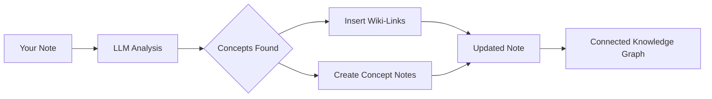

import TLDR from '@site/src/components/TLDR';

# Wiki-Links

<TLDR>
**Notemd automatically adds `[[wiki-links]]` to key concepts in your notes.** The LLM reads your content, identifies important terms in context, and inserts Obsidian-style wiki-links at each occurrence. Optionally creates concept note files with backlinks. Supports synonym suppression, link integrity on rename/delete, and pure extraction mode (no file modification). Unlike Auto Link which only matches existing note titles, Notemd uses AI to identify new concepts and creates corresponding notes. This is part of the [Obsidian AI Knowledge Management Guide](/docs/pillar-ai-knowledge).
</TLDR>

## Overview

Wiki-linking is Notemd's core feature. It transforms plain text into a connected knowledge graph by:

1. **Analyzing your note** with an LLM
2. **Identifying key concepts** (terms, people, methods, theories)
3. **Inserting `[[wiki-links]]`** at each occurrence
4. **Creating concept notes** (optional) with backlinks

## How It Works

### Process



### Example

**Before:**
```markdown
Machine learning models use neural networks to learn patterns from data.
The transformer architecture revolutionized natural language processing.
```

**After:**
```markdown
[[Machine learning]] models use [[neural networks]] to learn patterns from data.
The [[transformer architecture]] revolutionized [[natural language processing]].
```

## Usage

### Basic: Add Links to Current Note

1. Open a note
2. Right-click in editor → **"Process file (add links)"**
3. Wait a few seconds
4. Concepts are now linked!

### Batch: Process Multiple Notes

1. Right-click a folder in file explorer
2. Select **"Notemd: Process folder (add links)"**
3. Configure:
   - Concurrency (how many files in parallel)
   - Overwrite existing links (yes/no)
4. Click **Process**

### Selective: Link Specific Text

1. Highlight text to process
2. Right-click → **"Process selection (add links)"**
3. Only highlighted portion is analyzed

## Notemd vs Auto Link

Obsidian has two approaches to automatic wiki-linking:

| | **Auto Link** | **Notemd** |
|--|---------------|-------------|
| Link source | Existing note titles in vault | LLM-identified concepts in content |
| Can link new concepts | No — title must already exist | Yes — AI identifies concepts and creates notes |
| Synonym handling | No | Yes — synonym suppression |
| Concept note creation | No | Yes — with backlinks and dedup |
| Batch processing | No (single file) | Yes (folder-level) |
| Per-task model routing | No | Yes |

**Auto Link** is title-matching: if a note named "Machine Learning" exists, it wraps occurrences in `[[Machine Learning]]`. If the note doesn't exist, nothing happens.

**Notemd** is AI-driven: the LLM reads your content, understands context, identifies concepts that *should* be linked — even if no note exists yet — and creates both the link and the concept note.

## Features

### Synonym Suppression

**Problem:** "transformer", "transformers", "Transformer architecture" → 3 separate concepts

**Solution:** Notemd detects near-duplicates and uses canonical form.

**Configuration:**
```
Settings → Advanced → Synonym Suppression
Threshold: 0.8 (0 = off, 1 = aggressive)
```

### Link Integrity

**When you rename a concept note:**
- All wiki-links automatically update (Obsidian core feature)
- Backlinks remain intact

**When you delete a concept note:**
- Links remain but show as "unlinked mentions"
- You can recreate from any occurrence

### Pure Extraction Mode

**Extract concepts without modifying the original:**

1. Right-click → **"Extract concepts (no linking)"**
2. Concept notes are created
3. Original file untouched

Use case: Processing read-only content or final drafts.

## Concept Note Generation

### Automatic Creation

**When enabled (default), Notemd creates:**

```markdown
---
tags: [concept, auto-generated]
created: 2026-06-13
source: [[Original Note Name]]
---

# Machine Learning

A branch of artificial intelligence that enables computers
to learn from data without explicit programming.

## Occurrences in Your Vault

- [[Original Note Name#Section]]
- [[Another Note#Header]]

## Related Concepts

- [[Neural Networks]]
- [[Deep Learning]]
- [[Supervised Learning]]
```

### Configuration

**Output folder:**
```
Settings → Output → Concept Folder
Default: concepts/
```

**Hierarchical structure:**
```
Settings → Output → Use Hierarchical Folders
If enabled:
  papers/my-paper.md → papers/concepts/Concept.md
If disabled:
  → concepts/Concept.md
```

**Template:**
```
Settings → Output → Concept Template
Customize with variables:
  {{concept}} — Concept name
  {{description}} — LLM-generated description
  {{backlinks}} — List of source notes
  {{date}} — Creation date
```

## Advanced Options

### Context Window

**How much surrounding text to send:**

```
Settings → Linking → Context Window
Options: Sentence | Paragraph | Full Note
Default: Paragraph
```

Larger = better accuracy, higher cost.

### Minimum Occurrences

**Only link concepts that appear multiple times:**

```
Settings → Linking → Min Occurrences
Default: 1 (link all)
```

Set to 2 or 3 to focus on recurring themes.

### Exclude Patterns

**Skip certain words:**

```
Settings → Linking → Exclude List
Example: note, idea, example, thing
```

Prevents over-linking generic terms.

### Custom Prompts

**Override default LLM instructions:**

```
Settings → Advanced → Custom Linking Prompt
Default:
  "Identify key concepts, theories, methods, and technical
   terms in the following text. Return as a list..."
```

Modify for domain-specific needs (e.g., "Focus on medical terminology").

## Tips & Best Practices

### ✅ DO

- **Process notes with >100 words** — Short notes yield few concepts
- **Use powerful models** for better concept identification (GPT-4o, Claude)
- **Review before accepting** — Check suggested links make sense
- **Build iteratively** — Process 5-10 notes, review graph, adjust settings

### ❌ DON'T

- **Over-link** — Not every noun needs a link
- **Process drafts repeatedly** — Concepts may shift, wait until stable
- **Ignore synonyms** — Enable suppression to avoid "ML" vs "Machine Learning"

## Performance

### Speed

| Note Size | GPT-4o-mini | Claude Sonnet | Ollama (local) |
|-----------|-------------|---------------|----------------|
| 500 words | 2-3 sec | 3-5 sec | 5-10 sec |
| 2000 words | 5-8 sec | 10-15 sec | 20-40 sec |
| 5000+ words | Chunked (multiple calls) | Chunked | Chunked |

### Cost Estimation

**Example: 1000-word note with GPT-4o-mini**
- Input: ~1500 tokens
- Output: ~200 tokens
- Cost: ~$0.001

**Batch processing 100 notes:** ~$0.10

## Troubleshooting

### No Links Added

**Check:**
1. LLM call succeeded (Settings → Diagnostics)
2. Note has enough content (>50 words)
3. Concepts are technical/specific (not just pronouns)

**Try:**
- Use a more powerful model
- Increase context window
- Check API key validity

### Too Many Links

**Solutions:**
1. Increase minimum occurrences (2 or 3)
2. Add common words to exclude list
3. Use a less aggressive model

### Wrong Concepts Linked

**Fixes:**
1. Use custom prompt for domain specificity
2. Enable synonym suppression
3. Manually review and unlink

### Links Break After Rename

**This is normal Obsidian behavior.**

To update all links:
1. Rename the concept note
2. Obsidian automatically updates `[[old]]` → `[[new]]`

---

## Next Steps

- 📖 [Concept Notes](./concept-notes) — Deep dive into concept note generation
- 🔍 [Research Integration](./research) — Combine linking with web research
- 🎨 [Diagrams](./diagrams) — Visualize your knowledge graph
