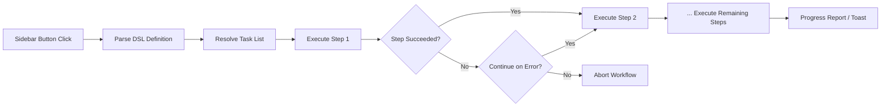

import TLDR from '@site/src/components/TLDR';

# Workflows

<TLDR>
**Notemd workflows chain multiple tasks into a single one-click action.** Define sequences like `add-links > extract-concepts > research > diagram` using a simple DSL. Workflows appear as sidebar buttons that run the full chain on the current note or folder. Ships with predefined workflows; create custom ones in settings. Each step uses its own per-task model configuration.

This is part of the [Obsidian AI Knowledge Management Guide](/docs/pillar-ai-knowledge).
</TLDR>

## Overview

A workflow eliminates the friction of running tasks one at a time. Instead of right-clicking four times to add links, extract concepts, research unfamiliar terms, and generate a diagram, you press one sidebar button and the entire chain executes. Notemd handles the sequencing, error propagation, and progress reporting.

Workflows are defined in a lightweight DSL (domain-specific language). They live in settings, appear as clickable buttons in the Obsidian sidebar, and can be applied to either the current note or an entire folder.

## How It Works

### Workflow Execution Pipeline



1. **Parse** -- The DSL string is split on `>` (or `>`) into an ordered list of task identifiers.
2. **Resolve** -- Each identifier maps to an internal command (add-links, extract-concepts, research, translate, diagram, etc.).
3. **Execute** -- Steps run sequentially. Each step uses its configured per-task provider and model.
4. **Error handling** -- If a step fails, the workflow either aborts or continues to the next step, depending on your error policy.
5. **Done** -- A toast notification reports success or lists any failed steps.

### DSL Format

Workflows are defined as a `>`-separated sequence of task identifiers:

```
process-current-add-links>extract-concepts-current>research-and-summarize
```

**Available task identifiers:**

| Identifier | Action |
|------------|--------|
| `process-current-add-links` | Add wiki-links to the active note |
| `extract-concepts-current` | Extract concepts from the active note |
| `research-and-summarize` | Research the selected text or note title |
| `process-current-translate` | Translate the active note |
| `summarize-to-mermaid` | Generate a diagram from the active note |
| `generate-from-title` | Generate content from the note title |
| `extract-original-text` | Extract original text (for OCR / scanned content) |

**Folder-level variants** replace `current` with `folder` in the identifier name.

### Predefined vs. Custom Workflows

Notemd ships with ready-made workflows for common patterns:

| Workflow | Chain | Use Case |
|----------|-------|----------|
| **One-Click Extract** | add-links > extract-concepts > research | Process a research paper in one pass |
| **Full Pipeline** | add-links > extract-concepts > research > diagram | Complete knowledge extraction with visualization |
| **Translate + Link** | translate > add-links | Translate then link concepts in the target language |

**Custom workflows** are created in settings:

1. Open **Settings** --> **Notemd** --> **Workflows**
2. Click **"Add Workflow"**
3. Enter the DSL chain (e.g., `process-current-add-links>extract-concepts-current`)
4. Give it a display name (e.g., "Quick Link + Extract")
5. The new button appears in the sidebar immediately

## Configuration

| Setting | Default | Effect |
|---------|---------|--------|
| `workflows` | Predefined set | Array of workflow definitions (name + DSL) |
| `workflowContinueOnError` | `true` | Continue to next step if the current step fails |
| `workflowShowProgress` | `true` | Show a progress toast after each step completes |

### Per-Task Models in Workflows

Each step in a workflow uses its **own** per-task model configuration. You do not need to specify models in the DSL itself. The resolution order is:

1. Per-task provider/model if `useMultiModelSettings` is on
2. Global `activeProvider` otherwise

This means `add-links` can run on DeepSeek while `research` runs on GPT-4o -- all within the same workflow click.

## Example

You just imported a PDF of a machine learning paper into your vault and want full knowledge extraction:

1. Open the imported note
2. Click the **"Full Pipeline"** sidebar button
3. Notemd executes:
   - **Step 1**: Add wiki-links -- `[[attention mechanism]]`, `[[transformer]]`, etc.
   - **Step 2**: Extract concepts -- creates concept notes in your concept folder
   - **Step 3**: Research -- summarizes web sources for key terms
   - **Step 4**: Diagram -- generates a Mermaid mindmap of the paper's structure
4. After ~30 seconds, your note has links, concept notes exist, research is appended, and a diagram file is saved

All from a single click.

## Tips

- **Start with predefined workflows** -- they cover the most common patterns. Customize only when you need a different sequence.
- **Enable `workflowContinueOnError`** -- a failed diagram step should not abort the entire pipeline.
- **Use folder workflows** for bulk processing -- right-click a folder, pick a workflow, and every note gets processed.
- **Name workflows clearly** -- sidebar space is limited. Use short, action-oriented names like "Quick Extract" or "Translate + Link".

---

## Next Steps

- [Research](./research) -- Understand what the research step does before adding it to workflows
- [Wiki-Links](./wiki-links) -- Core linking feature used in most workflows
- [Concept Notes](./concept-notes) -- Concept extraction as a workflow step
- [Batch Processing](/docs/advanced/batch-processing) -- Concurrency and progress reporting for folder workflows
