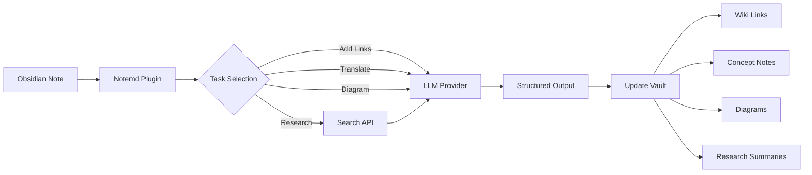

import TLDR from '@site/src/components/TLDR';

# Introduction to Notemd

<TLDR>
**Notemd** (Note + EMD — Enhanced Markdown Documents) is an open-source Obsidian plugin that transforms LLM-powered reading into persistent knowledge. Unlike chat-based AI where insights vanish after the session, Notemd writes results **directly into your vault** as wiki-links, concept notes, research summaries, translations, and diagrams. Built for researchers, students, and knowledge workers who want their reading to accumulate into a structured, evolving knowledge graph.
</TLDR>

## What is Notemd?

Notemd integrates **30+ Large Language Models** (OpenAI, Anthropic, Google, DeepSeek, Qwen, Ollama, and more) into your Obsidian workflow to automate knowledge extraction and organization.

### Key Difference: Ephemeral vs. Persistent Knowledge

| Aspect | Chat-based AI (ChatGPT, etc.) | Notemd |
|--------|-------------------------------|--------|
| **Where results go** | Chat history (disappears) | Your Obsidian vault (persists) |
| **Format** | Plain text answers | Structured files: `[[wiki-links]]`, concept notes, diagrams |
| **Long-term value** | Must re-ask each time | Accumulates into a knowledge graph |
| **Offline access** | Requires internet | Works fully offline with Ollama |

## Core Capabilities

### 1. **Automatic Wiki-Linking**
- LLM identifies key concepts in your notes
- Inserts `[[wiki-links]]` at each occurrence
- Optionally creates linked concept notes
- Synonym suppression to avoid duplicates

### 2. **Concept Note Generation**
- Extracts core concepts from papers, articles, notes
- Generates dedicated concept files with backlinks
- Customizable output paths and templates

### 3. **Web Research Integration**
- Query Tavily or DuckDuckGo from within Obsidian
- LLM summarizes results with source citations
- Appends research findings to current note

### 4. **Multilingual Translation**
- Translate selections or entire notes
- Supports 21+ UI languages
- Independent output language configuration
- Batch translation support

### 5. **Diagram Generation**
- **Mermaid**: Flowcharts, sequence, class, state, ER, Gantt
- **JSON Canvas**: Obsidian native layouts
- **Vega-Lite**: Data charts, time series, scatter plots
- Syntax auto-fix for Mermaid errors

### 6. **One-Click Workflows**
- Chain multiple actions into sidebar buttons
- DSL-based workflow definition
- Example: `add-links > extract-concepts > research > diagram`

## Who Should Use Notemd?

✅ **Researchers** reading papers and building literature reviews  
✅ **Students** organizing study notes and creating concept maps  
✅ **Knowledge workers** who want reading insights to persist  
✅ **Bilingual professionals** needing translation + wiki-linking  
✅ **Privacy-conscious users** wanting local LLM support (Ollama)  
✅ **Power users** who customize prompts and workflows

## Why Notemd + Obsidian?

**Obsidian** is a local-first, markdown-based knowledge base. **Notemd** adds AI superpowers:
- Your data stays in your vault (not a cloud service)
- Works offline with local models
- Free and open source (MIT license)
- Integrates with existing Obsidian plugins
- Scales to tens of thousands of notes

## Getting Started

1. **Install**: Settings → Community Plugins → Browse → "Notemd"
2. **Configure**: Add your LLM provider API key (or use local Ollama)
3. **Try it**: Open a note → Right-click → "Process file (add links)"
4. **Explore**: Check the sidebar for one-click workflows

👉 [Installation Guide](./getting-started/installation) | [Quick Start Tutorial](./getting-started/quick-start)

## Architecture

## Philosophy

**Notemd believes that AI should augment human knowledge work, not replace it.** The plugin:
- Keeps you in control (review before applying changes)
- Preserves context (all results link back to source)
- Respects privacy (local LLM support, no telemetry)
- Stays extensible (open APIs, custom workflows)

## Open Source

- **License**: MIT
- **Source**: [github.com/Jacobinwwey/obsidian-NotEMD](https://github.com/Jacobinwwey/obsidian-NotEMD)
- **Community**: [Discord](https://discord.gg/qnGgsQ9W) | [GitHub Discussions](https://github.com/Jacobinwwey/obsidian-NotEMD/discussions)
- **Contribute**: PRs welcome, see [CONTRIBUTING.md](https://github.com/Jacobinwwey/obsidian-NotEMD/blob/main/CONTRIBUTING.md)

---

**Next**: [Installation →](./getting-started/installation)
