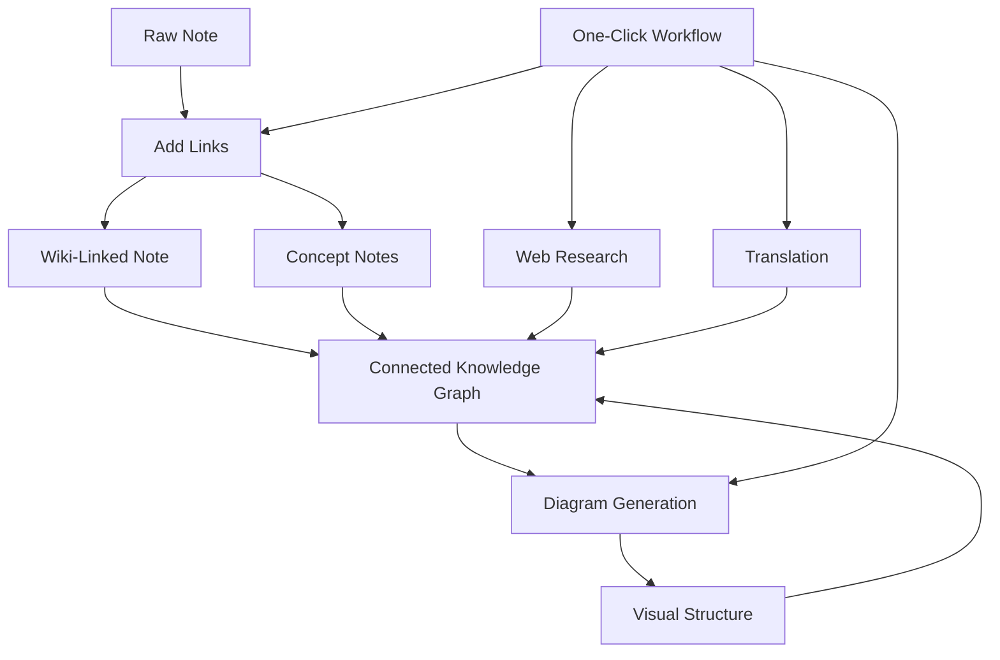

import TLDR from '@site/src/components/TLDR';

# Obsidian AI Knowledge Management Guide

<TLDR>
**Notemd turns LLM-powered reading into persistent knowledge: wiki-links connect concepts, concept notes create a retrievable graph, research brings the web into your vault, translation breaks language barriers, diagrams make structure visible, and workflows chain it all into one click.** This guide covers the full pipeline — from raw notes to a connected, visual, multilingual knowledge base.
</TLDR>

## Why AI Knowledge Management?

Traditional note-taking produces flat files. Even with manual wiki-links, most notes stay disconnected. Notemd uses LLMs to automate the connection layer:

- **LLMs read your content** and identify what matters — terms, methods, people, theories
- **Links are inserted automatically** at each concept occurrence, not buried in "see also"
- **Concept notes are generated** as standalone retrievable files
- **Research enriches notes** with web-sourced context
- **Diagrams make structure visible** — mind maps, flowcharts, data charts from same content

The result: a knowledge graph that grows with every note you process, not just when you remember to add links.

## The Full Pipeline



Each step is independent. Use one or all. The most impactful sequence: **Add Links → Concept Notes → Diagrams**.

---

## 1. Wiki-Links: Making Connections Explicit

Wiki-links are the backbone of a knowledge graph. Notemd uses an LLM to:

1. Read your note content (split into chunks for long documents)
2. Identify core concepts — prioritizing specific, technical terms over generic nouns
3. Insert `[[wiki-links]]` at each occurrence
4. Suppress synonyms so "ML" and "Machine Learning" don't create separate nodes

### When to Use

- **Every note >100 words** — shorter notes yield few concepts
- **Research papers, technical docs, meeting notes** — rich in domain-specific terms
- **After content is stable** — don't repeatedly process drafts

### Key Settings

| Setting | Recommended | Why |
|---------|-----------|-----|
| `addLinksProvider` | DeepSeek or GPT-4o-mini | Good accuracy at low cost |
| Synonym suppression | On | Prevents duplicate nodes |
| Context window | Paragraph | Balance of accuracy and cost |

→ [Wiki-Links deep dive](/docs/features/wiki-links)

---

## 2. Concept Notes: Retrievable Knowledge Nodes

Wiki-links connect ideas inline, but concept notes make each idea independently retrievable. Each concept gets its own `.md` file:

```markdown
# Machine Learning

## Linked From
- [[My Research Notes]]
- [[Neural Networks Explained]]
```

### The Extraction Process

The LLM prompt is highly structured:
- Normalize to singular form
- Prefer multi-word concepts over single words ("Dielectric Relaxation" not "Relaxation")
- Skip references/bibliography sections
- Output as `CONCEPT:` lines for deterministic parsing

Concepts are deduplicated across chunks via `Set<string>`. LLM errors on individual chunks don't abort the operation.

### Backlinks

When enabled, each concept note tracks which source notes mention it. Obsidian's native backlink panel also shows reverse connections.

### Deduplication

Notemd's 4-step dedup engine catches:
1. **Exact matches** — case-insensitive filename comparison
2. **Plural forms** — "Models.md" vs "Model.md"
3. **Symbol normalization** — "A-B.md" vs "A B.md"
4. **Single-word containment** — "ML.md" flagged when "Machine Learning.md" exists

### Key Settings

| Setting | Recommended | Why |
|---------|-----------|-----|
| `conceptNoteFolder` | `concepts/` or `🧠 concepts/` | Keeps vault organized |
| `extractConceptsAddBacklink` | On | Enables reverse lookup |
| `extractConceptsMinimalTemplate` | Off | Full template with Linked From |
| Per-task model | DeepSeek | Concept extraction doesn't need expensive models |
| Synonym suppression | On | Same setting affects both linking and extraction |

→ [Concept Notes deep dive](/docs/features/concept-notes)

---

## 3. Research: Bringing the Web In

Notemd integrates web search into your note-taking workflow:

1. **Query construction** — your note title or selection becomes a search query
2. **Web search** — Tavily (recommended, API key required) or DuckDuckGo (free, no key)
3. **LLM summarization** — search results are condensed into a relevant summary
4. **Append to note** — summary added at cursor position or as a new section

### When to Use

- Before processing a new topic — get web context first
- When a concept note needs enrichment — research then add links
- For literature reviews — batch-research a folder of notes

### Key Settings

| Setting | Recommended | Why |
|---------|-----------|-----|
| `researchProvider` | GPT-4o or Claude | Research needs higher quality summarization |
| Search service | Tavily | Better relevance, configurable depth |
| `maxResearchContentTokens` | 4000 | Balance between depth and cost |

→ [Research deep dive](/docs/features/research)

---

## 4. Translation: Breaking Language Barriers

Notemd translates notes using your configured LLM — not a dedicated translation API. This means:

- **Context-aware translations** — the LLM understands the full document, not sentence-by-sentence
- **Technical term handling** — "gradient descent" stays as "梯度下降" not "坡度向下"
- **Batch support** — translate an entire folder of notes in one operation
- **Per-task model** — use Gemini Flash for translation (fast, cheap, multilingual)

### Language Support

Notemd itself supports 21 UI languages. The translation target language is configurable per-task. Common pairs: EN↔ZH, EN↔JA, EN↔KO, EN↔DE, EN↔FR, EN↔ES.

→ [Translation deep dive](/docs/features/translation)

---

## 5. Diagrams: Making Structure Visible

Notemd's diagram pipeline is spec-first: the LLM produces a structured `DiagramSpec` JSON, then adapters translate it into the target format. This produces more reliable output than asking the LLM for raw Mermaid syntax.

### Intent Detection

Notemd infers the best diagram type from content:

- **Tables with numbers** → data chart (Vega-Lite)
- **Client/server vocabulary** → sequence diagram (Mermaid)
- **Entity/primary key** → ER diagram (Mermaid)
- **Step/process flow** → flowchart (Mermaid)
- **Concept map keywords** → JSON Canvas (Obsidian native)
- **Default** → mind map (Mermaid)

### Rendering Chain

Primary target → fallback → fallback → HTML. If Mermaid syntax fails, it retries once with error context to the LLM, then falls back to a minimal diagram.

### Key Settings

| Setting | Recommended | Why |
|---------|-----------|-----|
| `enableExperimentalDiagramPipeline` | On | Better quality via spec-first |
| `experimentalDiagramCompatibilityMode` | `best-fit` | Native target per intent |
| `summarizeToMermaidProvider` | GPT-4o or Claude | Diagram specs need spatial reasoning |
| `autoMermaidFixAfterGenerate` | On | Catches LLM syntax errors automatically |
| Local knowledge augmentation | On for domain-specific | Improves accuracy with vault context |

→ [Diagrams deep dive](/docs/features/diagrams)

---

## 6. Workflows: One-Click Automation

Workflows chain multiple tasks into a single sidebar button. The DSL format is:

```
task1 | task2 | task3
```

Example: `addLinks | extractConcepts | generateDiagram` — process a note from raw text to a fully connected, visual knowledge node in one click.

### Recommended Workflows

| Workflow | Chain | Use Case |
|----------|-------|----------|
| Full Process | `addLinks \| extractConcepts \| generateDiagram` | New notes |
| Research First | `research \| addLinks` | Unfamiliar topics |
| Polyglot | `translate \| addLinks` | Multilingual notes |
| Diagram Only | `generateDiagram` | Quick visualization |

→ [Workflows deep dive](/docs/features/workflows)

---

## 7. LLM Providers: 36 Options from Cloud to Local

Notemd supports 36 providers across 4 transport types. Key groups:

- **International cloud**: OpenAI, Anthropic, Google, Mistral, xAI
- **China cloud**: DeepSeek, Qwen, Doubao, Moonshot, GLM, Baidu, SiliconFlow
- **Gateways**: OpenRouter, GitHub Models, Hugging Face, Vercel
- **Local**: Ollama, LMStudio, OVMS — no API key, no data leaves your machine

### Per-Task Model Strategy

The most cost-effective setup uses cheap models for simple tasks and powerful models for complex ones:

```
extractConcepts  → DeepSeek (fast, cheap, accurate enough)
addLinks          → DeepSeek or GPT-4o-mini
research          → GPT-4o or Claude (needs quality)
generateDiagram   → GPT-4o or Claude (needs spatial reasoning)
translate         → Gemini Flash (fast, multilingual)
```

→ [LLM Providers overview](/docs/providers/overview)

---

## Getting Started Checklist

1. **Install Notemd** — [Community Plugins](/docs/getting-started/installation) (recommended) or manual
2. **Configure a provider** — DeepSeek (easiest), OpenAI, or Ollama (free)
3. **Process your first note** — right-click → "Process file (add links)"
4. **Set concept folder** — Settings → Notemd → Output → Concept Folder
5. **Extract concepts** — run "Extract concepts" on the same note
6. **Generate a diagram** — run "Generate diagram" to visualize the connections
7. **Create a workflow** — chain the above into a one-click button

## Recommended Configurations

### Student (Budget)

```
Provider: DeepSeek (free tier available)
Concept extraction: DeepSeek
Research: DuckDuckGo (free) + DeepSeek
Diagrams: Off (or legacy Mermaid)
Workflows: addLinks | extractConcepts
```

### Researcher (Quality)

```
Provider: GPT-4o (primary)
Concept extraction: DeepSeek (cost savings)
Research: GPT-4o + Tavily
Diagrams: best-fit mode, GPT-4o
Workflows: research | addLinks | extractConcepts | generateDiagram
```

### Privacy-First (Local Only)

```
Provider: Ollama (llama3 or qwen2.5:7b)
All tasks: Ollama
Research: DuckDuckGo (free, no API key)
Diagrams: legacy Mermaid mode
```

### Bilingual (ZH + EN)

```
Primary: DeepSeek (Chinese queries)
Translation: Google Gemini Flash
Research: Tavily + DeepSeek (Chinese search context)
Language output: per-task (extractConceptsLanguage: zh-CN)
```

---

## Common Patterns

### Pattern: Process a Research Paper

1. Import PDF content (or paste)
2. **Research** — get web context on the topic
3. **Add Links** — identify and link key concepts
4. **Extract Concepts** — create standalone notes
5. **Generate Diagram** — visualize the paper's structure

### Pattern: Daily Note Enrichment

1. Write daily note
2. **Add Links** — connects today's ideas to existing concepts
3. Concept notes auto-update with backlinks

### Pattern: Literature Review

1. Create folder with papers/notes
2. **Batch Add Links** — process entire folder
3. **Deduplicate Concepts** — clean up near-duplicate notes
4. **Generate Diagram** — mind map of the entire literature

---

*Notemd is open source (MIT) and works with Obsidian 0.15.0+ on all platforms. [Install now](/docs/getting-started/installation) or [view on GitHub](https://github.com/Jacobinwwey/obsidian-NotEMD).*
