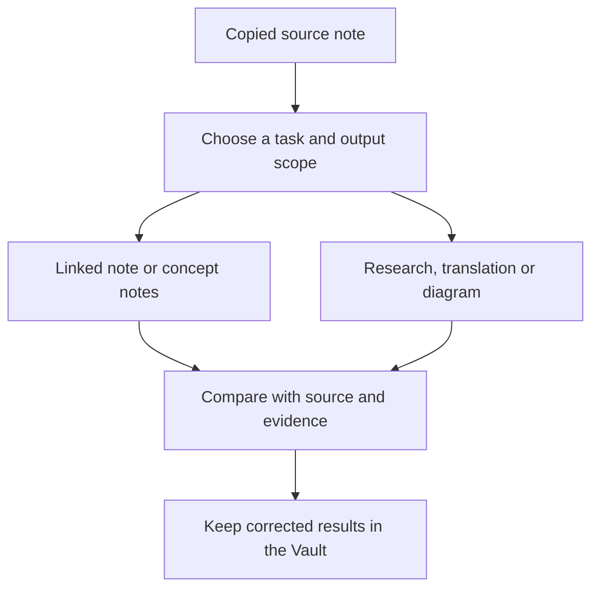

import TLDR from '@site/src/components/TLDR';

# Obsidian AI Knowledge Management Guide

<TLDR>
A useful knowledge workflow keeps source material, model-generated output and your corrections distinguishable. Notemd provides linking, extraction, research, translation and diagram tasks that write reviewable files. Start with one source, verify the result, then automate a bounded folder.
</TLDR>

## Define The Outcome

Choose an artifact you need: a linked reading note, a set of concept notes, a sourced research summary, a translation or a diagram. More generated files and links do not automatically improve understanding or retrieval. Decide how you will check correctness and find the material later.

## The Full Pipeline


```mermaid
flowchart TD
    A[Copied source note] --> B[Choose a task and output scope]
    B --> C[Linked note or concept notes]
    B --> D[Research, translation or diagram]
    C --> E[Compare with source and evidence]
    D --> E
    E --> F[Keep corrected results in the Vault]
```

These are available tasks, not a claim that one default button performs every step. Preserve the source and inspect each task's output destination before composing a workflow.

## 1. Wiki-Links: Making Connections Explicit

Run **Process file (add links)** on a test note. By default, inspect its `_processed.md` sibling. Review whether the proposed terms are useful navigation targets and whether quotations, code and equations remain faithful.

Focused-learning and synonym-suppression instructions can guide the model. They do not enforce exact concept equivalence or a numerical similarity threshold. Use deterministic title matching instead when reproducibility against existing note names is your primary requirement.

[Wiki-link guide](./features/wiki-links)

## 2. Concept Notes: Separating Terms From Explanations

Choose a concept folder before extracting. Standalone extraction creates title-only notes by default and leaves the source unchanged. Enable backlinks and disable the minimal template when you want `Linked From` in newly created standalone notes.

Extraction and explanation generation are separate operations. **Batch generate from titles** can fill eligible notes already in the selected concept folder as well as newly created ones. Keep a dedicated folder while testing, and inspect the reported complete-folder move behavior.

Duplicate review uses filename heuristics. Confirm candidates before removal; similar names can represent different technical concepts.

[Concept-note guide](./features/concept-notes)

## 3. Research: Retaining An Evidence Trail

Select a topic or use the active note title, choose Tavily or DuckDuckGo in settings, and run **Research & summarize**. A missing Tavily key does not automatically select DuckDuckGo. Open the source URLs and verify key claims in the appended summary.

Optional local retrieval can contribute scoped excerpts. Its current index is lexical, and retrieved local text is sent to the task's selected LLM. Local indexing therefore does not imply that the whole research path is offline or private to the device.

[Research guide](./features/research)

## 4. Translation: Reviewing Meaning And Structure

Choose an output language and run file translation. Default output uses a `_<language>.md` suffix; an existing destination can be overwritten. To translate only a passage, copy it into a temporary note first.

Check terminology, numbers, code, links and mathematical notation against the source. Long notes are chunked, so a model may miss context across boundaries. The 21 UI locales and 34 website routes do not establish translation quality for any language pair.

[Translation guide](./features/translation)

## 5. Diagrams: Choosing An Editable Artifact

Select several chart types in one run and choose multiple output formats independently for each type. Unchecking a type retains its format preferences; leaving every type unchecked uses automatic analysis. Use the checkbox to include a type. Click its name to select it and edit its formats. Hover or keyboard focus changes the preview without saving. Escape closes the menu and returns focus.

Use the selector's supported catalog choices. CircuitikZ output is constrained and native compilation has its own environment check. Drawnix static cross-branch arrows do not guarantee attachment after rearrangement. PowerPoint table fixes improve native output, while Mermaid/SVG content can still use image fallback.

[Diagram guide](./features/diagrams)

## 6. Workflows: Automating A Verified Sequence

A workflow uses a name, `::`, and `>`-separated action IDs. The default is:

```text
One-Click Extract::process-current-add-links>batch-generate-from-titles>batch-mermaid-fix
```

It performs linking, folder title generation and Mermaid repair. It does not add a general research or diagram-generation step. Actions retain their prerequisites and output behavior; this is not an arbitrary text pipe.

The default error policy stops on a reported failure. Continuing after errors is appropriate only when later steps can use the remaining inputs. Cancellation retains completed output and is not a rollback.

[Workflow guide](./features/workflows)

## 7. LLM Providers: Match Protocol And Workload

The 36 presets cover five protocol families. Select a provider whose endpoint, model access, data policy and measured task output meet your needs. Test with the same source and prompt before comparing speed or cost.

Task-specific provider/model routing is disabled by default. Enable it only when you intend different tasks to use different profiles, and inspect every enabled task before treating a workflow as local.

[Provider overview](./providers/overview)

## Getting Started Checklist

1. Install Notemd and back up the source material.
2. Configure and test the exact provider/model.
3. Choose a concept folder and distinct output destinations.
4. Run one task on a copied note.
5. Compare output with the source, then retain corrections.
6. Expand to a small folder and inspect partial completion before creating a longer workflow.

## Common Patterns

### Process A Research Paper

Convert the paper to readable Markdown using an appropriate external tool, and review conversion errors in formulas, figures and tables first. Extract concepts or original passages, research selected questions, and produce a diagram only when it clarifies a relationship you can verify. Keep links to the original paper and your corrections.

### Maintain A Concept Collection

Use a dedicated concept folder, review terminology after extraction, and generate explanations for a deliberately selected subset. Back up before duplicate cleanup. More concepts are not a substitute for accurate definitions and useful navigation.

### Work With Private Material

Use a local model server with models and dependencies already installed, inspect task-specific routing, and avoid network-dependent research when offline operation is required. Review diagnostic reports before sharing. A loopback default does not prevent a profile from being configured to use a remote server.

### Recover From An Interrupted Batch

Wait for cancellation or failure to settle. Read the report, inspect completed and recovery outputs, compare conflicts, and rerun only the intended work. Do not infer an empty result from a cancelled status or delete companion files without checking their references.

## Next Steps

- [Quick start](./getting-started/quick-start): complete a first task.
- [Batch processing](./advanced/batch-processing): selection and output ownership.
- [Developer guide](./developers/overview): extend and verify the implementation.
- [Agent guide](./agents/overview): discover the actual public contract.
