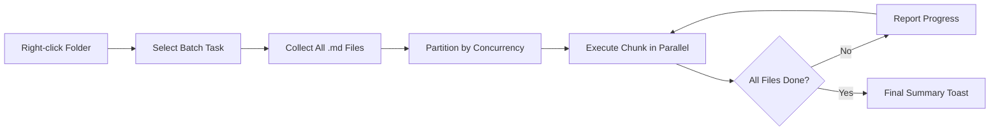

import TLDR from '@site/src/components/TLDR';

# معالجة دفعات

<TLDR>
**Notemd يقوم بمعالجة المجلدات بأكملها في عملية واحدة مع إمكانية ضبط التزامن والتحكم في الكتابة فوق الملفات.** انقر بزر الماوس الأيمن على مجلد لإضافة روابط ويكي جماعيًا، أو استخراج المفاهيم، أو إجراء بحث، أو ترجمة جميع الملاحظات الموجودة فيه. تحدد قيود التزامن من حدوث أخطاء تقييد المعدل API. يتم الإبلاغ عن التقدم لكل ملف على حدة. يمكن ضبط سلوك الكتابة فوق الملفات: تجاهل الملفات الموجودة، أو إضافتها، أو استبدالها. يتم تسجيل الملفات التي فشلت دون إيقاف معالجة الدفعة.

هذا جزء من [Obsidian دليل إدارة المعرفة الذكية](/docs/pillar-ai-knowledge).
</TLDR>

## نظرة عامة

تحول معالجة الدفعات مجلد الملاحظات إلى عملية واحدة. بدلاً من فتح كل ملاحظة وتشغيل الأوامر بشكل منفصل، يكفي النقر بزر الماوس الأيمن على المجلد واختيار المهمة. يقوم Notemd بالتكرار عبر كل ملف `.md`، وتطبيق الإجراء المختار، ويعرض التقدم في الوقت الفعلي.

هذه الميزة ضرورية لاستخراج المعرفة على مستوى الخزنة بأكملها. بعد استيراد عشرات الملفات PDF، على سبيل المثال، يؤدي إضافة الروابط جماعيًا ثم استخراج المفاهيم جماعيًا إلى بناء رسم المعرفة الخاص بك في دقائق بدلاً من ساعات.

## كيف يعمل

### نموذج التنفيذ الدفعي

1. **جمع الملفات** -- Notemd يقوم بمسح المجلد المستهدف بشكل تراكبي (أو فقط على المستوى العلوي حسب الإعدادات) ويجمع جميع ملفات `.md`.
2. **تقسيم التزامن** -- يتم تقسيم الملفات إلى مجموعات بناءً على إعدادات `batchConcurrency`. تُنفذ كل مجموعة بشكل متوازي؛ أما المجموعات الأخرى فتُنفذ بشكل تسلسلي.
3. **التنفيذ** -- يتم معالجة كل ملف باستخدام نفس المنطق المستخدم في أوامر الملف الفردي. يتم احترام إعدادات مزود المهمة والنموذج لكل مهمة.
4. **الإبلاغ عن التقدم** -- تظهر إشعارات تلقائية بعد اكتمال كل ملف، مع عرض نسبة التقدم `N / Total`.
5. **معالجة الأخطاء** -- إذا فشل ملف ما (خطأ API، توقف شبكي، إلخ)، يتم تسجيل الخطأ وتستمر معالجة الدفعة. يُعرض ملخص نهائي يتضمن قائمة بالملفات التي فشلت.
6. **الانتهاء** -- يُظهر إشعار ملخص تقريرًا عن العدد الإجمالي للملفات التي تم معالجتها، وعدد النجاحات، وعدد الفشلات.

### سلوك الكتابة فوق

عند معالجة ملف يحتوي بالفعل على روابط ويكي أو ملاحظات مفاهيمية أو ترجمات، يعتمد سلوك Notemd على إعداد الكتابة فوق:

| الوضع | السلوك |
|------|----------|
| **تخطي** | يتم ترك المحتوى الحالي كما هو. يتم معالجة الملفات غير المعدلة فقط. |
| **إضافة** (القيمة الافتراضية) | يتم إضافة المحتوى الجديد. يتم الحفاظ على روابط الويكي والمفاهيم والترجمات القائمة. |
| **استبدال** | يتم معالجة الملف بالكامل مرة أخرى. يتم كتابة جميع تعديلات Notemd السابقة فوقها. |

بالنسبة لروابط الويكي تحديدًا: إذا كانت الملاحظة تحتوي بالفعل على `[[wiki-links]]`، فإن وضع **تخطي** يتركها كما هي، بينما يقوم وضع **استبدال** بإرسال الملاحظة بأكملها إلى LLM لإدخال روابط جديدة. استخدم **تخطي** للمعالجة التدريجية و**استبدال** لإعادة المعالجة بعد تحديث النموذج.

### التحكم في التزامن

يحدد إعداد `batchConcurrency` عدد الطلبات المتزامنة API. هذا يمنع أخطاء الحد الأقصى للمعدلات (HTTP 429) أثناء معالجة مجلدات كبيرة مع مزودين لديهم حصص صارمة.

| التزامن | الموصى به لـ | تأثير الحد الأقصى للمعدلات المعتاد |
|-------------|----------------|---------------------------|
| `1` | المستويات المجانية، مزودون صارمون | لا شيء (تسلسلي) |
| `3` (افتراضي) | معظم مزودي السحابة | منخفض |
| `5` | Ollama (محلي)، مستويات سخية | لا شيء / منخفض |
| `10` | نماذج محلية بتقدير سريع | لا شيء |

إذا واجهت أخطاء 429 أثناء المعالجة الدفعية، قلل من التزامن إلى 1 أو 2.

## التكوين

| الإعداد | افتراضي | التأثير |
|---------|---------|--------|
| `batchConcurrency` | `3` | أقصى عدد من المكالمات المتوازية API أثناء عمليات المجلدات |
| `batchOverwriteExisting` | `false` | كتابة محتوى Notemd الحالي بالكامل. `false` تعني وضع الإضافة. |
| `batchSkipProcessed` | `false` | تخطي الملفات التي تحتوي بالفعل على علامات Notemd (مثل روابط ويكي) |
| `batchRecursive` | `true` | تضمين الدلائل الفرعية أثناء مسح المجلد |
| `enableStableApiCall` | `false` | تفعيل منطق إعادة المحاولة (حتى 4 محاولات) لكل ملف أثناء المعالجة الجماعية |

### النماذج حسب المهمة في المعالجة الجماعية

تستخدم كل عملية في المجموعة النموذج المقابل للمهمة. يستخدم batch-add-links `addLinksProvider`، وbatch-research يستخدم `researchProvider`، وهكذا. وهذا يعني أنه يمكنك تخصيص نماذج رخيصة للعمليات ذات الحجم الكبير واحتفاظ النماذج المكلفة للمهام التي تتطلب دقة عالية.

## مثال

لديك مجلد `papers/` يحتوي على 40 ملاحظة بحثية مستوردة. تريد إضافة روابط ويكي واستخراج المفاهيم من جميعها:

1. انقر بزر الماوس الأيمن على مجلد `papers/`
2. اختر **"Notemd: معالجة المجلد (إضافة روابط)"**
3. يقوم Notemd بفحص المجلد ويجد 40 ملفًا من نوع `.md`، ثم يعالج 3 ملفات في كل مرة (التزامن الافتراضي)
4. تظهر رسالة تقدم تقول: `12/40 files processed...`
5. بعد حوالي 3 دقائق، تُعرض رسالة ملخص تقول: `39 succeeded, 1 failed (API timeout on paper-37.md)`
6. كرر العملية باستخدام **"Notemd: معالجة المجلد (استخراج المفاهيم)"** لإنشاء ملاحظات المفاهيم لجميع الملفات الـ40

يتم تسجيل الملف الذي فشل. يمكنك إعادة تشغيله على ذلك الملف فقط لاحقًا.

## نصائح

- **ابدأ بتزامن منخفض** -- إذا كنت غير متأكد من حدود السرعة لدى مزودك، ابدأ بقيمة `1` وزد التزامن تدريجيًا.
- **استخدم وضع التخطي للتحديثات التدريجية** -- بعد الدفعة الكاملة الأولى، انتقل إلى `batchSkipProcessed: true` حتى يتم معالجة الملاحظات الجديدة فقط في التشغيلات اللاحقة.
- **قم بتفعيل استدعاءات API المستقرة** -- يضيف `enableStableApiCall: true` منطق إعادة المحاولة الذي يتعافى من أخطاء الشبكة المؤقتة أثناء الدفعات الطويلة.
- **أعد التشغيل بعد ترقية النموذج** -- إذا انتقلت إلى نموذج أفضل، ضع `batchOverwriteExisting: true` وأعد التشغيل للحصول على روابط ومفاهيم محسّنة.

---

## الخطوات التالية

- [Workflows](/docs/features/workflows) -- ربط المهام الجماعية في أزرار جانبية بنقرة واحدة
- [Custom Prompts](/docs/advanced/custom-prompts) -- تخصيص النصوص التوجيهية للاستخراج الجماعي
- [Troubleshooting](/docs/advanced/troubleshooting) -- إصلاح أخطاء حدود السرعة وفشل الاتصال أثناء التشغيلات الجماعية
- [مزودو LLM](/docs/providers/overview) -- مرجع تكوين النموذج لكل مهمة
