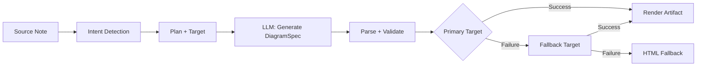
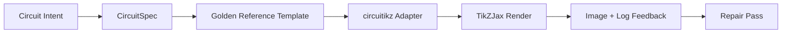

import TLDR from '@site/src/components/TLDR';

# رسومات تخطيطية

<TLDR>
**Notemd يقوم بإنشاء الرسومات من ملاحظاتك عبر سلسلة عمليات تعتمد على المواصفات أولاً.** ينتج النموذج اللغوي الكبير ملف JSON من نوع `DiagramSpec` غير مرتبط بأي محرك عرض، ثم تقوم محولات متخصصة بتحويله إلى صيغ Mermaid، JSON Canvas، Vega-Lite، HTML، HTML/SVG قابل للتعديل، Draw.io، Drawnix، أو رسومات circuitikz المقيدة. يدعم التطبيق 9 أنواع من النوايا، وسلاسل انتقال تلقائية كبديل، وعرض تجريبي مباشر مع إمكانية تصدير بصيغ SVG/PNG/PDF، والتحقق الدلالي، بالإضافة إلى عملية إنشاء معززة بالمعرفة المحلية.
</TLDR>

هذا جزء من [Obsidian دليل إدارة المعرفة الذكية](/docs/pillar-ai-knowledge).

## البنية: خط أنابيب مبني على المواصفات أولاً

Notemd لا يطلب أبداً من LLM إنتاج صيغ Mermaid/Vega/Canvas مباشرة. بدلاً من ذلك:



**لماذا المواصفات أولاً؟** تُنتج LLM صيغاً غير صالحة لمحركات العرض بشكل متكرر (خاصة Mermaid). يمكن التحقق من صحة المواصفات المُنظمة قبل العرض، ويمكن لنفس المواصفات تغذية عدة محركات عرض كبدائل.

## أنواع الرسومات التخطيطية المدعومة

| النية | محرك العرض الرئيسي | البدائل | حالة الاستخدام |
|--------|-----------------|-----------|----------|
| `mindmap` | Mermaid | HTML | تقسيم المواضيع الهرمية |
| `flowchart` | Mermaid | HTML | تدفقات العمليات، أشجار القرارات |
| `sequence` | Mermaid | HTML | تفاعلات العميل مع الخادم، البروتوكولات |
| `classDiagram` | Mermaid | HTML | علاقات فئات OOP |
| `erDiagram` | Mermaid | HTML | مخططات قواعد البيانات، علاقات الكيانات |
| `stateDiagram` | Mermaid | HTML | آلات الحالة، نماذج دورة الحياة |
| `canvasMap` | JSON Canvas | Mermaid → HTML | خرائط المفاهيم، رسومات المعرفة |
| `dataChart` | Vega-Lite | Mermaid → HTML | الرسوم البيانية من نوع البار، الخط، المساحة، التشتت، الدائرة، الجداول |
| `circuit` | circuitikz | none | رسومات دوائر مقيدة مستخلصة من حمولات `CircuitSpec` المُصدَّقة |

## اكتشاف النية

Notemd يحدد أفضل نوع رسم بياني من محتوى الملاحظة باستخدام تقييم الكلمات المفتاحية:

| النية | المحفزات | مستوى الثقة |
|--------|----------|------------|
| `dataChart` | الجداول، الخلايا العددية، كلمات مفتاحية للمقاييس/الاتجاهات، النسب المئوية | 0.88 |
| `sequence` | مفردات الطلب/الاستجابة (4 مطابقات أو أكثر) أو علامات `->`/`=>` | 0.82 |
| `erDiagram` | المفتاح الأساسي، المفتاح الخارجي، الكيان، المخطط (2 مطابقات أو أكثر) | 0.80 |
| `stateDiagram` | الحالة، التحول، المعلق، الجاري، الفاشل (3 مطابقات أو أكثر) | 0.76 |
| `flowchart` | الخطوات المرقمة (2 خطوات أو أكثر) أو مفردات if/then/else/workflow | 0.74 |
| `canvasMap` | خريطة مفاهيم، رسم بياني للمعرفة، مكاني، مجموعات | 0.72 |
| `circuit` | circuitikz, TikZJax, circuit, schematic, CMOS, NMOS, PMOS, MOSFET, VDD/GND, `vin`/`vout` | 0.78 |
| `mindmap` | الخيار الافتراضي للتعويض | 0.55 |

قم بالتغلب على ذلك باستخدام إعداد **نوع الرسم المفضل**، أو محدد الشريط الجانبي، أو خيار واضح في لوحة الأوامر.

## اختيار هدف الترجمة

يحتوي مسار العمل التجريبي القائم على المواصفات الآن على تحكمين مستقلين:

| التحكم | الإعداد | التأثير |
|---------|---------|--------|
| نوع الرسم التخطيطي المفضل | `preferredDiagramIntent` | يوجه الشكل الدلالي لـ `DiagramSpec` المولد |
| الهدف المفضل للعرض | `preferredDiagramRenderTarget` | يختار مُحوّل الكائنات لـ **إنشاء مخطط** و **عرض مسبق للمخطط** |

قم بتحديد **الهدف المفضل للعرض** إلى **Auto** كإعداد افتراضي للمخطط، أو اختر صيغة Mermaid، JSON Canvas، Vega-Lite، HTML، HTML/SVG قابل للتعديل، Draw.io، Drawnix، أو Circuitikz بشكل صريح. ينطبق هذا التعديل فقط على أوامر إنشاء الملفات والعرض التجريبي. تظل الأمر القياسي **Summarise as Mermaid diagram** مرتبطًا بالإخراج المتوافق مع Mermaid حتى لا تتغير أنماط Markdown الحالية دون إشعار.

يُعد هذا الفصل مهمًا لأن نية `flowchart` يمكن الآن عرضها كرسومات Mermaid لملاحظات Markdown، أو كـ HTML كبديل موثوق، أو كـ HTML/SVG قابل للتعديل للتحرير لاحقًا، أو كملفات مصدر Draw.io/Drawnix مع ملفات مراجعة بصيغة SVG. أما نية `circuit` فهي توجه العملية إلى Circuitikz وتتطلب ملف `CircuitSpec` مُصدَّق؛ فهي ليست طلبًا لنصوص TikZ عشوائية.
## الاستخدام

### أنشئ رسمًا تخطيطيًا

1. افتح ملاحظة
2. أرسل **"Notemd: Generate diagram"** من لوحة الأوامر
3. يكتشف Notemd النية، ويولد المواصفات، ويقوم بالعرض، ويحفظ النتيجة النهائية.

**ملفات الإخراج حسب الهدف:**

| الهدف | الامتداد | نمط اسم الملف |
|--------|-----------|------------------|
| Mermaid | `.md` | `{note}_summ.md` |
| JSON Canvas | `.canvas` | `{note}_diagram.canvas` |
| Vega-Lite | `.json` | `{note}_diagram.json` |
| HTML | `.html` | `{note}_diagram.html` |
| قابل للتعديل HTML/SVG | `.html` | `{note}_diagram.html` |
| Draw.io | `.drawio` + `.drawio.svg` + `.drawio.md` | `{note}_diagram.drawio` بالإضافة إلى ملفات المراجعة المصاحبة |
| Drawnix | `.drawnix` + `.drawnix.svg` + `.drawnix.md` | `{note}_diagram.drawnix` بالإضافة إلى ملفات المراجعة المصاحبة |
| Circuitikz | `.tex` + `.tex.svg` + `.tex.md` | `{note}_diagram.tex` بالإضافة إلى ملفات المراجعة المصاحبة |

### عرض مخطط تجريبي

1. تشغيل **"Notemd: عرض مخطط تجريبي"**
2. يظهر نافذة منبثقة تحتوي على المخطط المُعرض
3. قم بتصدير الملف كصيغة SVG، PNG، أو PDF باستخدام أزرار شريط الأدوات

يتوفر خيار **فتح العرض التجريبي تلقائياً** في الإعدادات — بعد الإنشاء، تُفتح نافذة العرض التجريبي تلقائياً.

يستخدم تصدير عرض التجريبي بصيغ PNG وPDF دقة النقاط المحددة مسبقًا. القيمة الافتراضية هي 300 نقطة في البوصة، وتُقيَّد القيم التي تزيد عن 600 نقطة في البوصة لتصبح 600. أما صيغة SVG فتظل بحجمها الناظمي. يمكن للملفات المصدرية مثل `.drawio`، `.drawnix`، و`.tex` توفير ملف مرافق باسم `previewSvg` حتى يتمكن Obsidian من عرض الصور القابلة للمراجعة وتصديرها دون تضمين محتويات من diagram.net، Drawnix، LaTeX، أو TikZJax أثناء تشغيل الإضافة.

يحتوي نموذج المعاينة أيضًا على لوحة تشخيص الكائنات. يمكن لأدوات التوليد وفحوصات الاختبار الأولية ربط بيانات `RenderArtifact.diagnostics`؛ حيث تعرض النافذة المنبثقة ملخصًا للتشخيص يوضح أعداد الأخطاء والتحذيرات والمعلومات، ثم درجة الخطورة ونوع التشخيص والرسالة ونصائح إصلاح المشكلة بجانب المعاينة. يتم عرض نفس الملخص في سجلات التاريخ التي تدعم التشخيص، مما يسمح بمقارنة محاولات فحص circuitikz المتكررة دون الحاجة إلى فتح كل سجل على حدة. بالنسبة للملفات التي تحتوي على محتوى أصلي ولكن لا يمكن عرضها داخل النص أو عبر مسار iframe HTML، فإن النافذة المنبثقة الآن تلجأ إلى عرض تجريبي يعتمد فقط على المحتوى الأصلي بدلاً من إجبار استخدام iframe فارغ. وهذا يوفر واجهة مستخدم واضحة لعمليات التجميع/العرض الخاصة بـ circuitikz، وفحوصات رموز النص في SVG، وفحوصات لقطات الشاشة الفارغة في PNG، وتقارير تداخل الرموز القائمة فقط على المسارات، بالإضافة إلى تقارير التداخل المستقبلية، دون جعل TikZJax أو LaTeX متطلبًا إلزاميًا لوقت التشغيل للإضافات، أو الادعاء بأن النص الأصلي هو عرض بصري مؤكد الصحة.

### وضع Mermaid القديم

عند إيقاف `enableExperimentalDiagramPipeline`، يرسل Notemd طلباً مباشراً Mermaid إلى LLM. هذا يتجاوز خطوات المعالجة المحددة بالكامل. إذا فشل الخط التجريبي، يتم العودة إلى هذا الوضع.

## خوادم التحويل

### Mermaid

6 محولات (خريطة ذهنية، مخطط تدفق، تسلسلي، ER، فئة، حالة) تحول `DiagramSpec` إلى صيغة Mermaid. بعد الإنشاء، يقوم `mermaid.parse()` بالتحقق من الناتج. إذا فشل التحقق:

1. **إعادة المحاولة LLM** — محاولة واحدة مع رسالة خطأ Mermaid كسياق
2. **البديل الأدنى** — مخطط Mermaid بسيط مستمد من معرفات عقد المواصفات

**مُصلح الإرث Mermaid** يقوم تلقائيًا بإصلاح الأخطاء الشائعة في صيغة LLM مثل: تنظيم توجيهات note، تفادي مشكلات pipe-label، إعادة ترتيب علامات الفاصلة المنقوطة، الاقتباسات الذكية، أسهم الخط المزدوج، عدم تطابق الأشكال، وغيرها.

### JSON Canvas

يُنتج تنسيق Obsidian JSON Canvas مع تخطيط مكاني:
- تُحدد مواقع العقد حسب العمق (x = عمق × 420) والرقم التسلسلي (y = رقم التسلسل × 170)
- يتم تقدير العرض بناءً على طول العلامة
- الحواف تحتوي على `fromSide: 'right'`، `toSide: 'left'`، `toEnd: 'arrow'`

### Vega-Lite

يُنشئ مواصفات Vega-Lite v5 JSON كاملة مع ترميز تلقائي:
- **الرسوم البيانية الديكارتية** (العمودية/الخطية/المساحية/النقطية/التشتت): قنوات x + y بالإضافة إلى اللون لعدة سلاسل
- **الدائري**: theta = y (كمي)، اللون = x (اسمي)
- **الجدول**: الصف = x، النص = y + العمود = السلسلة

تُدمج بشكل عميق قوالب الثيم الداكن والفاتح قبل التجميع.

### HTML

حل احتياطي عالمي. مستند HTML مستقل يحتوي على:
- رؤوس meta CSP
- وضع فاتح/داكن عبر `prefers-color-scheme`
- علامات UI مُحلية لـ 20 لغة
- الأقسام: الصفحة الرئيسية، الهيكل (شجرة العقد)، العلاقات، الملاحظات، جداول سلاسل البيانات

### HTML/SVG قابل للتعديل

هدف رقمي واضح لسير العمل التصديرية القابلة للتعديل. يقوم بتحويل `DiagramSpec` إلى `SemanticFigureModel` محدد، ثم يُنتج مستندًا مستقلاً HTML يحتوي على مجموعات SVG داخلية تحمل تعليقات على طراز Draw.io:

- `data-drawio-type`، `data-drawio-id`، و `data-drawio-role` على العقد الدلالية
- `data-drawio-source` و `data-drawio-target` على الحواف الدلالية
- معرفات مستقرة للعقد والحواف بعد تنظيم المسافات البيضاء ومعالجة التصادمات
- لا يوجد سكريبتات، ولا خطوط خارجية، ولا موارد بعيدة

هذا الهدف ليس الطريق الافتراضي للمخطط حاليًا. يتوفر كهدف تصدير واضح طالما أن مسار المنتج يثبت سلوك التعديل في الأدوات الفعلية.

### حدود التصدير Draw.io و Drawnix

تحافظ التنفيذية الحالية على دعم المحررات من جهات خارجية ضمن حدود الملف الناتج، مع الاحتفاظ في الوقت نفسه بأهداف توليد واضحة:

| الهدف | العقد | اعتمادية وقت التشغيل |
|--------|----------|--------------------|
| Draw.io | ملف XML `mxfile` غير مضغوط ومحدد المعالم مستخرج من `SemanticFigureModel`، بالإضافة إلى ملفات SVG/PNG/PDF للمراجعة | لا يوجد شيء في وقت تشغيل الإضافة أو في عمليات CI |
| Drawnix | مجموعة صغيرة من بيانات JSON من نوع `.drawnix` تستخدم عناصر `geometry` و `arrow-line`، بالإضافة إلى ملفات SVG/PNG/PDF للمراجعة | لا يوجد شيء في وقت تشغيل الإضافة أو في عمليات CI |

التضحية مقصودة: يمكن لـ Notemd التحقق من العلامات المرئية، والمعرفات المستقرة، وتغطية العناصر الأولية المدعومة دون تضمين Diagrams.net Desktop أو Drawnix أو Plait أو حالة المحرر الخاص بالمتصفح داخل الإضافة.

### circuitikz / TikZJax الاتجاه

رسومات الدوائر ليست نفس مشكلة المخططات التدفقية العامة. الصيغة الصحيحة المستهدفة للدوائر الكهربائية عادةً ما تكون **circuitikz**، وتُعرض بواسطة Obsidian من خلال إضافات مثل TikZJax. يمكن لـ TikZJax تحميل حزم مثل `circuitikz`، `pgfplots`، `tikz-cd`، و`chemfig`، مما يجعلها مناسبة لملاحظات الفيزياء والدوائر والكيمياء والرياضيات.

الخطر هو أن التيكز المولد مباشرةً من LLM يكون هشًا:

- يمكن أن تكون توبولوجيا الدائرة المعقدة صحيحة كهربائيًا لكنها غير قابلة للقراءة بصريًا؛
- يمكن أن تجعل الأسلاك والعلامات المتداخلة قائمة الشبكة الصحيحة غير صالحة للاستخدام في ملاحظات الدراسة؛
- يمكن أن يمنع غياب مقدمات الحزم أو الأركان الخاطئة أو أسماء المكونات غير الصحيحة عملية العرض؛
- التغذية الراجعة من مولد الرسوم عادةً ما تكون على مستوى الصورة، بينما يتم إنشاء الهندسة على مستوى النص بواسطة LLM.

التصميم الأفضل هو اعتبار circuitikz كهدف رسم مقيد، وليس كطلب حر الشكل:



يجب أن يصف النموذج من الدرجة الأولى توبولوجيا الدائرة وتخطيطها بشكل منفصل:

| الطبقة | المسؤولية | مثال |
|-------|----------------|---------|
| التوبولوجيا | عقد الكهرباء واتصالات المكونات | `VDD -> RD -> drain(M1)`، `source(M1) -> GND` |
| التخطيط | تحديد موقع الشبكة، التوجيه، مسارات التوصيل | `M1 at (3,2.2)`، المدخل على اليسار، المخرج على اليمين |
| التصميم | الحزمة، اتفاقية الجهد، الملصقات، الأرصفة | `\begin{circuitikz}[american voltages]` |
| التحقق | سجل التجميع، الأرصفة المفقودة، فحوصات التداخل/لقطات الشاشة | TikZJax/تشخيصات LaTeX بالإضافة إلى مراجعة بصرية |

### النموذج التجريبي الحالي circuitikz

Notemd يتضمن الآن أول نموذج تجريبي للمستودع المقيد لهذا الاتجاه. إنه معطل عمدًا ومقيد بقالب:

```bash
npm run diagram:export-circuitikz -- --input cmos-inverter.json --output cmos-inverter.tex
```

يضيف النموذج الأولي حدودًا مقيدة من نوع `CircuitSpec` بالإضافة إلى مُصدر تصدير محدد المعالم لست عائلات مرجعية ذهبية:

في خط أنابيب الرسوم التخطيطية التجريبي، أصبح من الممكن الوصول إلى هذا الخيار الآن أيضًا عبر `intent: "circuit"` وهدف التوليد `circuitikz`. قد يتضمن ملف `DiagramSpec` المُولد معلومات من نوع `circuitSpec` فقط في حالة استخدام النية المتعلقة بالدوائر. يقوم `CircuitikzRenderer` بكتابة مصدر نصي من نوع `.tex` محدد المعالم ويضيف ملف مراجعة من نوع SVG مستخلص من تلك البنية الهندسية للدائرة المُصدقة، مما يتيح عرضًا تجريبيًا في Obsidian بالإضافة إلى تصدير الملفات بصيغ SVG/PNG/PDF. هذا الملف المرافق ليس نتيجة تجميع باستخدام LaTeX/TikZJax؛ فالأدلة الحقيقية لعملية التجميع تظل موجودة في أوامر الاختبار المحددة أدناه.

بالنسبة للقوالب الذهبية المدعومة، تظل خصائص `layoutHints.inputSide` و `layoutHints.outputSide` مجرد أدوات للعرض فقط. يمكنها تغيير مواقع منافذ الإدخال/الإخراج بشكل محدد المعالم، لكنها لا تغير خصائص البنية الهندسية ولا تسمح بإجراء عملية إصلاح لإعادة توصيل الدوائر.

| نوع الدائرة | المرجع الذهبي | ضمان التيار |
|--------------|------------------|-------------------|
| `common-source-amplifier` | `common-source-nmos-v1` | يقوم بالتحقق من `VDD -> R_D -> M1.D`، `vin -> M1.G`، `M1.S -> GND`، و `M1.D -> vout` قبل كتابة LaTeX |
| `cmos-inverter` | `cmos-inverter-v1` | يقوم بالتحقق من توبولوجيا PMOS-over-NMOS، المدخل المشترك للبوابة، المخرج المشترك للتصريف، `VDD -> MP.S`، و `MN.S -> GND` قبل كتابة LaTeX |
| `cmos-buffer` | `cmos-buffer-v1` | يقوم بالتحقق من مرحلتين متسلسلتين من المعاكسات، العقدة الوسطى `vmid`، القيمة المستعادة `vout`، وخطوط VDD/GND المشتركة قبل كتابة LaTeX |
| `cmos-transmission-gate` | `cmos-transmission-gate-v1` | يقوم بالتحقق من أجهزة المرور المتوازية PMOS/NMOS بين `vin` و `vout` مع تحكمات متكاملة `phib` / `phi` قبل كتابة LaTeX |
| `cmos-nand2` | `cmos-nand2-v1` | يتحقق من تفعيل الرفع الموازي لـ PMOS والخفض التسلسلي لـ NMOS، مع مدخلات مزدوجة `va` / `vb` و `vout` قبل كتابة LaTeX |
| `cmos-nor2` | `cmos-nor2-v1` | يتحقق من تفعيل الرفع التسلسلي لـ PMOS والخفض الموازي لـ NMOS، مع مدخلات مزدوجة `va` / `vb` و `vout` قبل كتابة LaTeX |

هذا الأداة ليست مولدًا عامًا للرسومات باستخدام TikZ. فهي لا تقبل كود TikZ تعسفيًا، ولا تقوم بتجميع ملفات LaTeX، ولا تستدعي أداة TikZJax، ولا تفحص لقطات الشاشة أثناء وقت تشغيل الإضافة، ولا تنفذ عمليات إصلاح تلقائية للصور. تظل هذه الميزات جزءًا من مراحل لاحقة في العملية.

يمكن لأمر الرسم التخطيطي المسبق أن يعيد فتح ملفات المصدر circuitikz المحفوظة مباشرةً عندما يكون امتداد الملف `.tex` أو `.tikz` ويحتوي المصدر على `\usepackage{circuitikz}` أو `\begin{circuitikz}`. هذا الطريق هو عرض مسبق للمصدر فقط circuitikz: يعرض النافذة المنبثقة المصدر والتشخيصات وأدوات النسخ/الحفظ وبيانات التاريخ، لكنه لا يقوم بتجميع LaTeX أو يستدعي TikZJax أثناء تشغيل الإضافة.

يغطي حد العرض المسبق للمصدر نفسه الآن ملفات Draw.io و Drawnix المحفوظة. يتم قبول ملفات `.drawio` عندما تبدو كـ Draw.io XML (`mxfile` أو `mxGraphModel`)، ويتم قبول ملفات `.drawnix` عندما تكون Drawnix JSON مع `type: "drawnix"` ومصفوفة `elements`. لا تزال الإضافة لا تدمج diagrams.net أو مضيف السبورة البيضاء Drawnix؛ فهذه العروض المسبقة تكشف عن المصدر والتشخيصات وتاريخ الملفات دون الادعاء بوجود محرر بصري داخل الإضافة.

لإجراء إصلاح يحافظ على التركيب، أرسل مواصفات ما قبل الإصلاح كمرجع قبل قبول مرشح مصلح:\n

```bash
npm run diagram:export-circuitikz -- --input repaired-cmos-inverter.json --topology-reference cmos-inverter.json --output cmos-inverter.tex
```

يستخدم حارس الإصلاح `createCircuitTopologySignature` و `assertCircuitTopologyUnchanged` لمقارنة `circuitKind`، `goldenReferenceId`، الشبكات، معرفات/أنواع/طرفيات المكونات، ونقاط نهاية الاتصالات غير الموجهة قبل الإخراج. يتم تجاهل العلامات ونص العنوان وإرشادات التخطيط وترتيب الاتصالات وعلامات الاتصال عمدًا. المرشح الذي يضيف طرفًا قصيرًا أو يعيد توصيل طرف يفشل بسبب `Circuit topology drift detected` قبل كتابة ملف `.tex`.

يمكن لـ CLI الآن تحليل سجل التجميع الحالي لـ LaTeX/TikZJax دون تشغيل مترجم:\n

```bash
npm run diagram:export-circuitikz -- --input cmos-inverter.json --output cmos-inverter.tex --compile-log cmos-inverter.log --diagnostics-output cmos-inverter.diagnostics.json
```

يُبلغ هذا المسار التشخيصي عن حزم مفقودة مثل `circuitikz.sty`، مفاتيح TikZ/circuitikz غير معروفة، أخطاء في صيغة مسار TikZ مثل غياب الفواصل، وجود حجج زائدة من أقواس غير متوازنة أو علامات غير مغلقة، تسلسلات تحكم غير معرّفة، أخطاء LaTeX عامة، توقفات طارئة، وتحذيرات من امتلاء `\hbox`. يظل الأمر معتمدًا على السجل: التنفيذ المحلي لـ LaTeX/TikZJax ومراحل جودة اللقطات لا تزال أعمالًا مستقبلية منفصلة.

لإجراء فحوصات سريعة للمُحافظين، يمكن لنفس CLI تشغيل محرر مُعدّ مسبقًا اختياريًا دون تحليل أوامر السطر:\n

```bash
npm run diagram:export-circuitikz -- --input cmos-inverter.json --output cmos-inverter.tex --compile-executable pdflatex --compile-arg -interaction=nonstopmode --compile-arg -halt-on-error --compile-arg -output-directory={outputDir} --compile-arg {tex} --expected-artifact {outputDir}/{jobName}.pdf
```

يستخدم مشغّل التجميع `shell: false`، ويوسع `{tex}`، `{outputDir}`، و `{jobName}` لتحويل القيم المحلية إلى قيم مصفوفة الوسائط، ويقرأ `{jobName}.log` المُولد، ثم يُرجع `compileExecution` مع `compileDiagnostics` في ناتج CLI JSON. `--compile-executable` هو مسار ملف المحرر أو ملف الغلاف فقط؛ أما علامات المحرر فتكون ضمن قيم متكررة في `--compile-arg`. تفشل الملفات الفارغة كـ `compile-executable-invalid`، وتفشل الملفات المفقودة كـ `compile-executable-not-found`، وتُعطى السلاسل التنفيذية على شكل أوامر سطر توجيهات لتقسيم الوسائط بحيث يتبع Windows و Linux و macOS نفس عقد التنفيذ المباشر. مع `--expected-artifact`، يُبلغ أيضًا عن `compileExecution.renderSmoke` ويفشل في CLI إذا لم يُنشئ المحرر ملفًا غير فارغ. لا تزال الإضافة لا تدمج LaTeX، ولا تجعل TikZJax اعتمادًا لتشغيل الإضافة، ولا تقوم بإصلاحات بصرية على مستوى اللقطات.

إذا كان الملف المتوقع هو `.svg`، فإن فحص الدخان يذهب إلى طبقة أعمق:\n

```bash
npm run diagram:export-circuitikz -- --input cmos-inverter.json --output cmos-inverter.tex --compile-executable dvisvgm --compile-arg ... --expected-artifact {outputDir}/{jobName}.svg --expected-svg-text v_{in} --expected-svg-text v_{out}
```

يتحقق SVG من جذر `<svg>`، والأبعاد الإيجابية أو `viewBox`، ووجود على الأقل عنصر رسم مرئي بعد استبعاد العناصر المخفية/الشفافة، وأي رموز نصية مطلوبة، والعناصر الواضحة خارج `viewBox`، وعلامات `<text>` / `<tspan>` المتداخلة الموضوعة بشكل واضح، وعلامات النص الواضحة التي تتداخل مع عناصر الرسم عبر `render-svg-label-overlap`. يتم البحث عن النص المتوقع في النص المرئي وفك تشفير بيانات الوصولية مثل `aria-label`، `<title>`، و `<desc>`، بحيث يمكن للمحررات التي تحافظ على العلامات الدلالية خارج `<text>` المرئي أن تلبي فحص رموز النص دون الحاجة إلى OCR. مرحلة الهندسة الآن هي هندسة مدركة للتحويلات لخصائص المجموعات والعناصر الشائعة `transform`، بحيث يتم فحص المستطيلات SVG المترجمة أو المقياسة أو المدورة أو المائلة أو المتحولة بالمصفوفة بعد تركيب التحويلات. يغطي ذلك حدود القوس الدقيقة لأقصى نقاط القوس A/a، وحدود منحنيات Bezier الدقيقة لأقصى نقاط المنحنيات C/S/Q/T، وحدود SVG المدركة لعرض الخط وفحوصات تداخل العلامات، وهندسة الرسم `polyline` / `polygon`، كما يحل أيضًا مواقع الرموز المبنية على المسار فقط من مراجع `<use href="#...">` بحيث يمكن للعلامات المحولة إلى مسارات رموز قابلة لإعادة الاستخدام أن تفشل في فحوصات القماش المحدود عندما تخرج هندسة الرمز الموضوع من `viewBox`. يتم مقارنة عدة علامات `tspan` الموضوعة تحت والد واحد `<text>` كصناديق علامات منفصلة، مما يكشف عن نتائج LaTeX النمطية SVG التي كانت ستدمج العلامات المختلفة في عقدة نص واحدة. تحترم الصناديق SVG `text` و `tspan` `text-anchor` و `start` و `middle` و `end`، بحيث يمكن للعلامات المركزة والموضوعة على اليمين أن تُسبب تشخيصات تداخل النص/العلامة مع الرسم دون الادعاء بتخطيط نص على مستوى المتصفح. مسارات الرموز الموجودة فقط في `<defs>` لا تُحتسب كعناصر رسم مرئية، لكن يتم تطبيق خصائص `transform` المحلية الخاصة بها قبل وضع `<use>` بحيث لا تُقلل من تعداد تعريفات الرموز المقياسة أو المنعكسة. تستخدم فحص العلامة مقابل الرسم تسامحًا صغيرًا لصندوق الرسم والقيم المعلنة `stroke-width`، بحيث يمكن اعتبار الأسلاك الرفيعة والأسلاك السميكة ومحيطات المكونات المضلعة كفشل محتمل في قابلية قراءة العلامات عندما يصل خطها المرئي إلى العلامة. تُقارن أيضًا علامات الرموز المبنية على المسار فقط من `<use href="#...">` مع صناديق الرسم وتفشل بسبب `render-svg-path-glyph-overlap` عندما تتداخل هندسة الرموز القابلة لإعادة الاستخدام مع الأسلاك أو المكونات. إذا قام المحرر بتحويل العلامات إلى رموز مسار قابلة لإعادة الاستخدام بدلًا من `<text>` القابلة للبحث ولم يحافظ على بيانات الوصولية، فإن تقرير الدخان يسجل `pathOnlyGlyphUseCount` ويفشل في الرمز النصي المطلوب عبر `render-svg-text-path-only` بدلًا من التظاهر بأن العلامة غير موجودة. تُبلغ الفشلات الأخرى عبر `render-svg-invalid` و `render-svg-dimension-missing` و `render-svg-no-visible-elements` و `render-svg-text-missing` و `render-svg-out-of-bounds` و `render-svg-text-overlap` و `render-svg-label-overlap` و `render-svg-path-glyph-overlap`. يجب اعتبار فحوصات رموز النص والتداخل كفحوصات هيكلية فقط للمحررات التي تحافظ على العلامات كنص SVG قابل للبحث أو بيانات وصولية؛ لا يزال الإخراج المبني فقط على المسار SVG يحتاج إلى مرحلة اللقطة/OCR اللاحقة لإثبات قابلية قراءة العلامات بصريًا، ولا يزال هذا المرور الدخاني لا يدعي تغطية كاملة للمسار SVG.

تُتجاهل المجموعات والعناصر المخفية SVG بشكل متسق أثناء عد العناصر المرئية وجمع الهندسة. لا يمكن للخصائص أو أنماط النص المباشر `display:none`، `visibility:hidden`، `visibility:collapse`، والخصائص العامة `opacity:0` أن تجعل ملف الرسم الفارغ ينجح في فحص الإخراج المرئي.

يمكن أن تكون تعريفات الرموز المبنية فقط على المسار مسارات مباشرة أو حاويات مجموعة/رمز داخل `<defs>`. يحل مرور الدخان هندسة المسارات الفرعية من `<g id="...">` و `<symbol id="...">` قبل وضع `<use>`، بحيث يظل إخراج الرموز المغلفة يُغذي `pathOnlyGlyphUseCount` وفحوصات القماش المحدود و `render-svg-path-glyph-overlap`.

يتتبع محلل المسار أيضًا بدايات المسارات الفرعية ويعيد تعيين النقطة الحالية على `Z/z`، بحيث تستمر الأوامر النسبية بعد مسار فرعي مغلق من النقطة SVG الصحيحة بدلًا من إنشاء تشخيصات خاطئة `render-svg-out-of-bounds`.

يتبع نفس مرحلة الهندسة قواعد SVG للأرقام العشرية ذات النقطة الأمامية وعلامات الجمع الصريحة، لذا تظل إحداثيات dvisvgm المضغوطة مثل `.5` و `-.5` و `+.5` كسورًا أثناء فحوصات الحدود بدلاً من أن تصبح هندسة خارج الحدود غير صحيحة أو يتم تجاهلها.

إذا أصدر المُعالج `.png`، فإن مسار النتيجة المتوقعة نفسه يصبح لقطة شاشة أولى للتدخين: يقوم Notemd بفك ترميز ملفات PNG ذات الألوان المُرجعة بعمق 1/2/4/8 بت غير متتالية، وملفات PNG بالأبيض والأسود بعمق 1/2/4/8/16 بت، وملفات PNG بالأبيض والأسود مع ألفا/RGB/RGBA بعمق 8/16 بت. تدعم الصور ذات الألوان المُرجعة والأبيض والأسود دون بتات فرعية عينات مضغوطة؛ كما تدعم الصور ذات الألوان المُرجعة أيضًا بيانات PLTE وبيانات tRNS اختيارية؛ وتدعم الصور بالأبيض والأسود/RGB عينات شفافة tRNS. تُعيّن العينات المباشرة بعمق 16 بت إلى نفس مساحة المقارنة RGBA بعمق 8 بت المستخدمة في فحوصات التدخين. تتحقق فحص التدخين من الأبعاد الإيجابية، وتسجل حدود الخلفية ك `foregroundBounds`، وتسجل كثافة الخلفية داخل تلك المربع ك `foregroundDensity`، وتفشل بواسطة `render-png-blank` عندما يتطابق كل بكسل مرئي مع لون الخلفية في الزاوية العلوية اليسرى، وتفشل بواسطة `render-png-content-clipped` عندما يلامس محتوى الخلفية حدود الصورة، وتفشل بواسطة `render-png-foreground-too-small` عندما تحتوي لقطة الشاشة الكبيرة على أقل من أربعة بكسلات خلفية، وتفشل بواسطة `render-png-foreground-dense` عندما تكون بكسلات الخلفية كثيفة بشكل غير طبيعي داخل مربع حدود غير بسيط. تفشل صيغ PNG غير المدعومة بواسطة `render-png-unsupported` مع إرشادات خاصة بالصيغة لملفات PNG المتتالية Adam7 أو أعماق الألوان المُرجعة غير المدعومة. يكتشف هذا النظام لقطات الشاشة الفارغة، وقص اللوحة الواضح، وآثار الخلفية غير المُعالجة بشكل كافٍ، وفشل الازدحام على مستوى البكسل الأول، وإعدادات تصدير PNG الخاطئة للمُعالج دون إضافة اعتماد على واجهة سطر أوامر خاصة بالمنصة. إنه ليس تعرفًا بمستوى OCR، ولا كشفًا دقيقًا لتداخل النصوص، ولا إصلاحًا للصور مع الحفاظ على التوبولوجيا.

عندما تُظهر التشخيصات فشل في التجميع أو تشغيل فحص التدخين، يمكن لـ CLI أيضًا كتابة ملخص إصلاح يحافظ على التوبولوجيا:

```bash
npm run diagram:export-circuitikz -- --input cmos-inverter.json --topology-reference cmos-inverter.json --output cmos-inverter.tex --compile-log cmos-inverter.log --repair-brief-output cmos-inverter.repair-brief.json
```

يستخدم ملخص الإصلاح مخطط `notemd.circuitikz.repair-brief.v1` ويحمل المصدر `CircuitSpec`، وتوقيع التوبولوجيا، وتشخيصات التجميع/التشغيل، والتعديلات المسموح بها، والتعديلات الممنوعة على التوبولوجيا، وخطوات التحقق التالية، بالإضافة إلى `repairPrompt` مُنظم. دور الطلب هو `topology-preserving-circuitikz-repair`؛ قائمته `diagnosticFocus` مستمدة من تشخيصات التجميع/التشغيل، ومتطلباته `acceptanceCriteria` تتطلب التحقق من المرشحين بالإضافة إلى تجميع وتشغيل فحص التدخين مرة أخرى. إنه تنسيق لتمرير الإصلاح في دورة لاحقة، وليس ادعاءً بأن Notemd يقوم بالفعل بإصلاح بصري ذاتي.

بعد إنتاج مرشح للإصلاح، يمكن لنفس CLI التحقق منه مقابل الملخص قبل كتابة النتيجة:

```bash
npm run diagram:export-circuitikz -- --input repaired-cmos-inverter.json --repair-brief cmos-inverter.repair-brief.json --output repaired-cmos-inverter.tex
```

يتحقق `--repair-brief` من توقيع التوبولوجيا للمرشح المأخوذ من الملخص وهو متعارض مع `--topology-reference`. اجتياز هذا الفحص يثبت فقط الحفاظ على التوبولوجيا؛ لا يزال المرشح بحاجة إلى تشخيصات التجميع وفحوصات التدخين.

يتضمن نتيجة `--repair-brief` أيضًا أدلة `repairAcceptance` مع مخطط `notemd.circuitikz.repair-acceptance.v1`. يُبلغ عن الفحوصات `topology-signature` و `compile-diagnostics` و `render-smoke` ك `passed` و `failed` و `missing`؛ ويكشف عن `remainingChecks`؛ ويبقي `readyForVisualAcceptance` غير صحيح حتى يتضمن تشغيل المرشح جميع الأدلة المطلوبة.

استخدم `--repair-acceptance-output` مع `--repair-brief` عندما تحتاج أدلة CI أو الإصدار إلى ملف JSON دائم:

```bash
npm run diagram:export-circuitikz -- --input repaired-cmos-inverter.json --repair-brief cmos-inverter.repair-brief.json --output repaired-cmos-inverter.tex --repair-acceptance-output repaired-cmos-inverter.repair-acceptance.json
```

لأدلة الإصدار أو المُحافظ، قم بتشغيل كل عائلة ذهبية مدعومة من خلال مشغل الاختبارات الجماعية:

```bash
npm run diagram:smoke-circuitikz -- --output-dir docs/export/circuitikz-smoke --compile-executable pdflatex --compile-arg -interaction=nonstopmode --compile-arg -halt-on-error --compile-arg -output-directory={outputDir} --compile-arg {tex} --expected-artifact {outputDir}/{jobName}.pdf
```

يستخدم المشغل `docs/maintainer/fixtures/circuitikz/common-source-nmos-v1.json` و `docs/maintainer/fixtures/circuitikz/cmos-inverter-v1.json` و `docs/maintainer/fixtures/circuitikz/cmos-buffer-v1.json` و `docs/maintainer/fixtures/circuitikz/cmos-transmission-gate-v1.json` و `docs/maintainer/fixtures/circuitikz/cmos-nand2-v1.json` و `docs/maintainer/fixtures/circuitikz/cmos-nor2-v1.json`، ويستدعي نفس مسار المُصدر بدون واجهة سطر أوامر لكل اختبار، ويُرجع تقريرًا جماعيًا JSON مع `compileExecution` و `compileDiagnostics` لكل اختبار. إنه لا يزال أمرًا للمُحافظ، وليس اعتمادًا في وقت تشغيل الإضافات.

عندما لا يكون لدى جهاز المُحافظ مُعالج مُعد بعد، قم بتشغيل نفس أمر الاختبار دون `--compile-executable` واحفظ بوضوح بوابة البيئة:

```bash
npm run diagram:smoke-circuitikz -- --output-dir docs/export/circuitikz-smoke --report-output docs/export/circuitikz-smoke/renderer-availability.json
```

يكتب ذلك المسار لا يزال الآثار المحددة للاختبار `.tex`، ولكنه يُرجع `ok: false` مع `rendererAvailability.status` مُضبوطًا على `missing-configuration` وتشخيص `compile-executable-invalid`. اعتبره دليلاً فقط على توفر المُعالج؛ إنه ليس تجميعًا، أو فحص تدخين، أو قبولًا بصريًا.

### شكل الطلب المرجعي الذهبي

للاستخدام في المدى القريب، قدم مرجعًا ذهبيًا قابلًا للتصوير قبل طلب متغير دائري. يجب أن يحافظ الطلب المقيد على المقدمة، ومقياس الإحداثيات، وأسلوب الربط، واتفاقيات التوجيه:

```latex
\usepackage{circuitikz}
\begin{document}
\begin{circuitikz}[american voltages]
\draw
  (3,5) node[vcc]{$V_{DD}$}
  to [R, l=$R_D$] (3,3)
  to [short, *-o] (5,3) node[right]{$v_{out}$}
  (3,3) to [short] (3,2.2)
  node[nmos, anchor=D] (M1) {$M_1$}
  (M1.S) to [short] (3,0.5)
  node[ground]{}
  (M1.G) to [short, -o] (0.8,2.2)
  node[left]{$v_{in}$};
\draw
  (3,0.5) node[below right]{$S$};
\end{circuitikz}
\end{document}
```

بالنسبة لمُعكس CMOS، يجب أن يطلب الطلب توبولوجيا صريحة بالإضافة إلى قيود التخطيط، وليس فقط "رسم مُعكس CMOS":

- احتفظ بـ `VDD` في الأعلى، و `GND` في الأسفل، والمدخلات على اليسار، والمخرجات على اليمين؛
- استخدم `pmos` فوق `nmos`، مع بوابات مشتركة ومصارف مشتركة؛
- أبقِ عقدة الإخراج عند نقطة التقاء المصرف ووسّمها بـ `*-o`؛
- استخدم روابط مسماة (`PM1.G`، `NM1.G`، `PM1.D`، `NM1.D`) بدلاً من الإحداثيات المستنتجة بصرياً؛
- تجنب الأسلاك المائلة أو المتقاطعة ما لم يكن ذلك ضرورياً من الناحية الكهربائية.

### التقدم الحالي والمراحل القادمة

| المساحة | الحالة الحالية | الخطوة التالية |
|------|----------------|-----------|
| الرسومات العامة | تم تنفيذ خط أنابيب يعتمد على المواصفات أولاً لـ Mermaid، JSON Canvas، Vega-Lite، HTML | استمر في توسيع نطاق التحقق الدلالي |
| الرسومات القابلة للتعديل | تم تنفيذ حدود الكائنات `editable-html-svg`، Draw.io XML، و Drawnix JSON | أضف عناصر أولية أكثر ثراءً فقط بعد أن تثبت الاختبارات إمكانية التعديل |
| دعم CLI | يقوم الأمر `npm run diagram:export-artifact` بتصدير ملفات HTML/SVG قابلة للتعديل، بالإضافة إلى أدلة مراجعة من صيغ Draw.io و Drawnix و Circuitikz و SVG/PNG/PDF، وذلك انطلاقًا من ملف `DiagramSpec` مُصدَّق | يتم إضافة اختبارات أساسية مخصصة لكل هدف عند إصدار أهداف جديدة |
| circuitikz | `DiagramSpec(intent: "circuit", circuitSpec) -> CircuitikzRenderer -> circuitikz` يقوم بتصدير قوالب ذهبية للدوائر مثل common-source و CMOS inverter و `cmos-buffer` / `cmos-buffer-v1` و `cmos-transmission-gate` / `cmos-transmission-gate-v1` و `cmos-nand2` / `cmos-nand2-v1` و `cmos-nor2` / `cmos-nor2-v1`، كما يكشف عن خيارات نية الواجهة والهدف المراد عرضه، ويكتب ملفات TeX مع ملفات معاينة من صيغ SVG/PNG/PDF، ويقوم بالتحقق من التركيب الهيكلي قبل إنتاج المخرجات، ويقوم بتحليل سجلات التجميع، ويمكنه تشغيل محررات محلية محددة مع استخدام الخيار `--expected-artifact`، بالإضافة إلى الاحتفاظ بخيار الاسترجاع القائم فقط على المصدر وعرض تشخيصات المعاينة عبر `RenderArtifact.diagnostics` ونافذة المعاينة | إضافة قدرة على التعرف على العلامات على مستوى OCR للنصوص البصرية التي تحتوي فقط على مسارات، وإجراء فحوصات دقيقة للتداخل على مستوى البكسل، وتوسيع نطاق تغطية مسارات SVG حسب الحاجة، وتنفيذ تثبيت أو اكتشاف المحررات تلقائيًا فقط إذا كان ذلك ممكنًا كخيار اختياري، بالإضافة إلى تنفيذ عمليات إصلاح تلقائية للحفاظ على التركيب الهيكلي |
| تكامل TikZJax | المضيف المقترح لعرض Obsidian-side | اجعلها اختيارية؛ لا تجعل TikZJax متطلبًا إلزاميًا أثناء تشغيل الإضافة. |

## التكوين

| الإعداد | افتراضي | التأثير |
|---------|---------|--------|
| `enableExperimentalDiagramPipeline` | `false` | التبديل بين النمط القائم على المواصفات والنمط التقليدي Mermaid |
| `experimentalDiagramCompatibilityMode` | `'legacy-mermaid'` | `'legacy-mermaid'` = Mermaid فقط؛ `'best-fit'` = الأهداف الأصلية + خيارات الاحتياط |
| `preferredDiagramIntent` | `undefined` (تلقائي) | تجاوز الكشف التلقائي عن النية |
| `preferredDiagramRenderTarget` | `undefined` (تلقائي) | تعديل محرك توليد الملفات، بما في ذلك Draw.io و Drawnix و Circuitikz |
| `summarizeToMermaidLanguage` | `'en'` | اللغة المستهدفة لتسميات الرسوم التخطيطية |
| `summarizeToMermaidProvider` / `Model` | DeepSeek | LLM لكل مهمة لإنشاء الرسوم التخطيطية |
| `autoMermaidFixAfterGenerate` | (من الثوابت) | تشغيل أداة إصلاح الإصدارات القديمة تلقائيًا على نتيجة Mermaid |
| `enableLocalKnowledgeForDiagramGeneration` | `false` | تعزيز المصدر بمعرفة خزنة الملفات المحلية |

### تعزيز المعرفة المحلية

عند تفعيله، Notemd يسترجع مقتطفات سياقية ذات صلة من قاعدة المعرفة المحلية لخزنتك (المبنية على MiniSearch) ويضيفها في بداية المستند الماركدوف الأصلي. تنص إرشادات التعزيز على: "مجرد مرجع داعم؛ يجب الحفاظ على الهيكل الأساسي مطابقًا لملاحظة المصدر."

### أوضاع التوافق

- **`legacy-mermaid`**: تُوجّه جميع النوايا إلى Mermaid. النوايا غير Mermaid (canvasMap، dataChart) تُجبر على الانتقال إلى `flowchart` أو `mindmap`. لا يوجد سلسلة بديلة.
- **`best-fit`**: تُوجّه كل نية إلى الهدف الأصلي الخاص بها. إذا فشل الهدف الأساسي، يتم المرور عبر سلسلة البديل (مثلاً Vega-Lite → Mermaid → HTML).

## عرض مسبق وتصدير

| الإجراء | الطريقة |
|--------|--------|
| تصدير SVG | مولد `mermaid.render()` / `vega.View.toSVG()` / SVG للوحة الرسم |
| تصدير إلى PNG | SVG → صورة → Canvas / محول راسم النقاط للعرض عند دقة النقاط المحددة → مصفوفة بيانات PNG |
| تصدير إلى PDF | SVG → صورة راسمة عند دقة النقاط المحددة → ملف PDF صف واحد |
| حفظ المصدر | يتم حفظ محتوى القطعة الخام مع امتداد محدد للهدف |
| عرض مسبق للمصدر فقط | القطع غير المدمجة التي تحتوي على محتوى المصدر تُعرض ككود مع تشخيصات، دون عرضها داخل إطار iframe |
| التدقيق الدلالي | يتم فحص Mermaid و JSON Canvas و Vega-Lite و HTML/SVG القابلة للتعديل و Draw.io و Drawnix و circuitikz المقيد بواسطة `scripts/diagram-semantic-verification.js` بالإضافة إلى اختبارات المحرك والواجهة السطرية |

**التخزين المؤقت**: يستخدم RenderCache مفتاح JSON محددًا لـ `{spec, target, theme}`. يمنع الإزالة المتزامنة إعادة توليد الرسومات المكررة.

## نصائح

- **ابدأ بوضع `best-fit`** — فهو يُنتج أفضل نتيجة مرئية لكل نوع من أنواع النوايا
- **استخدم نماذج قوية للرسوم التخطيطية المعقدة** — تستفيد الرسوم التخطيطية التدفقية ورسومات ER من GPT-4o أو Claude
- **قم بتفعيل المعرفة المحلية** للرسوم التخطيطية المتخصصة — يحسّن سياق الخزانة ذو الصلة الدقة
- **ضبط `autoMermaidFixAfterGenerate`** — تكون أخطاء صياغة Mermaid شائعة بدونه
- **أداة إصلاح الإصدارات القديمة شاملة** — إذا فشل عرض التجربة مع Mermaid، فغالبًا ما يُحل المشكلة عن طريق تشغيل أمر الإصلاح يدويًا

---

## الخطوات التالية

- 🔗 [روابط ويكي](./wiki-links) — كيفية ربط المفاهيم داخل النص
- 📝 [ملاحظات المفاهيم](./concept-notes) — استخراج المفاهيم لمواد مصدر الرسوم التخطيطية
- 🔍 [البحث](./research) — تعزيز الرسوم التخطيطية ببيانات من الويب
