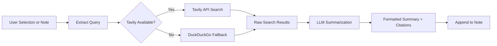

import TLDR from '@site/src/components/TLDR';

# البحث والبحث على الويب

<TLDR>
**Notemd يبحث على الويب ويُدخل نتائج ملخصة بواسطة LLM مباشرةً في ملاحظاتك.** Tavily API هو خادم البحث الأساسي؛ DuckDuckGo يعمل كخيار احتياطي بدون إعدادات. تُلخَّص النتائج مع اقتباسات المصادر وتُضاف تحت عنوان `## Research`. يدعم البحث في ملاحظة واحدة، والبحث في مجلدات جماعية، واختيار نموذج لخطوة التلخيص حسب المهمة.

هذا جزء من [Obsidian دليل إدارة المعرفة الذكية](/docs/pillar-ai-knowledge).
</TLDR>

## نظرة عامة

البحث هو أحد أقوى التكاملات في Notemd: فهو يربط بين القراءة والبحث والكتابة. بدلاً من الانتقال إلى المتصفح للبحث عن مصطلح غير مألوف، ما عليك سوى تمييزه وترك Notemd يقوم بالبحث والتلخيص وإضافة النتائج -- كل ذلك داخل خزانتك.

العملية قابلة للتكوين بالكامل. يمكنك اختيار مزود البحث، و LLM الذي يكتب الملخص، وما إذا كانت النتائج ستُضاف إلى الملاحظة النشطة أو تُكتب في ملفات منفصلة. يتيح الوضع الجماعي البحث في كل الملاحظات داخل مجلد بنقرة واحدة.

## كيف يعمل

### أنبوب البحث ثم التلخيص



1. **استخراج الاستعلامات** -- Notemd يستخرج مصطلحات البحث من اختيارك أو عنوان الملاحظة.
2. **البحث على الويب** -- يتم تجربة Tavily أولاً. إذا لم يتم تكوين مفتاح API، يتم استخدام DuckDuckGo تلقائياً (لا يُطلب مفتاح).
3. **تلخيص LLM** -- تُرسل نتائج البحث الخام إلى LLM المُعدّ، الذي ينتج ملخصاً موجزاً مع اقتباسات المصادر داخل النص.
4. **الإضافة** -- يتم إضافة الملخص المُنسق تحت عنوان `## Research` في الملاحظة النشطة.

### Tavily مقابل DuckDuckGo

| الجانب | Tavily | DuckDuckGo |
|--------|--------|------------|
| مفتاح API | مطلوب (هناك خطة مجانية متاحة) | غير مطلوب |
| جودة النتيجة | أعلى (مصمم خصيصًا للذكاء الاصطناعي) | كافية للاستعلامات العامة |
| قيود المعدل | طبقة مجانية وفيرة | خاضعة للتحكم في السرعة |
| التكوين | `tavilyApiKey` في الإعدادات | لا يوجد إعداد -- الانتقال التلقائي |

### أبحاث مجلد المجموعات

انقر بزر الماوس الأيمن على مجلد واختر **"Notemd: مجلد الأبحاث"**. يتم معالجة كل ملف `.md` في المجلد بشكل تسلسلي (أو بشكل متوازي حسب القدرة المحددة). تحصل كل ملاحظة على ملخص أبحاث خاص بها.

## التكوين

| الإعداد | افتراضي | التأثير |
|---------|---------|--------|
| `tavilyApiKey` | `''` | مفتاح Tavily API. عندما يكون فارغًا، يتم استخدام DuckDuckGo حصريًا. |
| `researchProvider` / `researchModel` | DeepSeek | LLM لكل مهمة لتلخيص نتائج البحث |
| `maxResearchContentTokens` | `4000` | ميزانية الرموز للمحتوى المرسل إلى LLM. يتم قطع الجزء الزائد. |
| `researchAppendToNote` | `true` | إضافة ملخص إلى الملاحظة الأصلية. إذا كان القيمة false، يتم إنشاء ملف منفصل. |
| `researchLanguage` | `'en'` | لغة الإخراج للأبحاث الملخصة |

### توصية النموذج لكل مهمة

تستفيد الأبحاث من نموذج يتعامل مع المحتوى متعدد اللغات ويُنتج نصوصًا مُنظّمة بشكل جيد. فكر فيما يلي:

- **DeepSeek** -- افتراضي، بسعر معقول، جودة عالية
- **GPT-4o** -- تلخيص ذو جودة أعلى، تكلفة أعلى
- **Gemini Flash** -- سريع ورخيص، مناسب للاستفسارات البسيطة

## مثال

أنت تقرأ ورقة بحثية حول *آليات انتباه الترانسفورمر* وتصادف مصطلحًا غير مألوف: *relative positional encoding*. بدلاً من ترك Obsidian:

1. قم بتمييز **"relative positional encoding"**
2. اضغط بزر الماوس الأيمن --> **"Notemd: Research and summarize"**
3. يقوم Notemd بالبحث على الويب، ويُلخّص أفضل النتائج، ثم يضيف:

```markdown
## Research

### Relative Positional Encoding

Relative positional encoding is a method used in transformer models
where positional information is expressed as relative distances between
tokens rather than absolute positions. Introduced by Shaw et al. (2018),
it improves generalization to unseen sequence lengths compared to
absolute encodings (Vaswani et al., 2017).

Sources:
- [Shaw et al., Self-Attention with Relative Position Representations (2018)](https://arxiv.org/abs/1803.02155)
- [Transformer Positional Encoding Overview](https://example.com/transformer-pos-enc)
```

أصبح الملخص الآن جزءًا من خزانتك، قابلاً للبحث، والربط، والوصول إليه دون اتصال بالإنترنت.

## نصائح

- **حدد مفتاح Tavily للحصول على أفضل نتائج** -- حتى النسخة المجانية توفر درجة أعلى من الدقة مقارنةً بـ DuckDuckGo الخام.
- **استخدم نموذج تلخيص قوي** -- قد تؤدي النماذج الرخيصة إلى تبسيط المحتوى التقني المعقّد.
- **قم بالبحث الجماعي** بعد القراءة الأولية لسد الفجوات في العديد من الملاحظات دفعة واحدة.
- **راجع الملخصات المضافة** -- قد تُختلق LLM تفاصيل المصادر. تحقق من الادعاءات الرئيسية.

---

## الخطوات التالية

- [Concept Notes](./concept-notes) -- استخراج وحفظ المصطلحات الرئيسية من نتائج البحث
- [Wiki-Links](./wiki-links) -- ربط المفاهيم المستمدة من البحث داخل خزانتك
- [Translation](./translation) -- ترجمة ملخصات البحث إلى لغة أخرى
- [مزودو LLM](/docs/providers/overview) -- تكوين النموذج المستخدم للتلخيص
