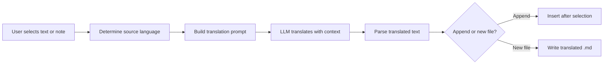

import TLDR from '@site/src/components/TLDR';

# الترجمة

<TLDR>
**Notemd يقوم بترجمة النصوص بين 21 لغةً أو أكثر باستخدام تقنية الترجمة المدعومة بـ LLM.** يدعم الترجمة لمقتطف واحد، وترجمة الملاحظة بأكملها، وترجمة مجلدات كاملة. يمكن لكل مهمة ترجمة استخدام مزود ونموذج مخصص من خلال إعدادات المهمة نفسها. يمكن ضبط لغة الإخراج بشكل منفصل عن لغة UI. تُضاف النتائج أو تُكتب في ملف جديد حسب تفضيلاتك.

هذا جزء من [Obsidian دليل إدارة المعرفة الذكية](/docs/pillar-ai-knowledge).
</TLDR>

## نظرة عامة

الترجمة في Notemd ليست بحثًا في قاموس — بل هي ترجمة مدعومة بـ LLM وتأخذ السياق في الاعتبار. يرى النموذج الفقرة أو الملاحظة بأكملها، مما يحافظ على النبرة ومصطلحات المجال وبنية الجمل. هذا يُنتج نتائج ذات جودة أعلى من خدمات الترجمة كلمة بكلمة، خاصةً في المحتوى التقني والأكاديمي والإبداعي.

تدعم الميزة ثلاثة نطاقات: المقتطف، الملاحظة النشطة، والمجلد بأكمله. مع إمكانية اختيار النموذج لكل مهمة، يمكنك استخدام نموذج سريع (Gemini Flash) للترجمات العادية ونموذج قوي (Claude Sonnet) للمحتوى الذي يتطلب دقة عالية — دون الحاجة إلى تغيير المزود العام.

## كيف يعمل

### أمر الترجمة



1. **اكتشاف المصدر** -- يستنتج LLM لغة المصدر من المحتوى. لا حاجة لتحديدها يدويًا.
2. **بناء الطلب** -- يُنشئ Notemd طلبًا يتضمن اللغة المستهدفة وإشارة اختيارية للمجال والمحتوى المراد ترجمته.
3. **ترجمة LLM** -- يقوم `translateProvider` / `translateModel` المُعدّان بمعالجة الطلب. يحافظ النموذج على تنسيق Markdown وروابط Wiki وكتل الكود.
4. **الإخراج** -- يتم إضافة النص المترجم أسفل النص الأصلي أو كتابته في ملف جديد داخل الخزانة.

### أزواج اللغات

يدعم Notemd أي زوج لغات يدعمه النموذج الأساسي LLM. من الأزواج الشائعة:

| المصدر | الهدف | الجودة المتوقعة |
|--------|--------|----------------|
| الإنجليزية | الصينية (مبسطة) | ممتازة |
| الصينية | الإنجليزية | ممتاز |
| الإنجليزية | اليابانية | جيد جدًا |
| الإنجليزية | الألمانية / الفرنسية / الإسبانية | جيد جدًا |
| أي لغة مدعومة | أي لغة مدعومة | يعتمد على النموذج |

إعداد `translateLanguage` يتحكم في **لغة الإخراج**. يتم اكتشاف اللغة المصدرية تلقائيًا.

### اختيار النموذج حسب المهمة

تختلف جودة الترجمة بشكل كبير حسب النموذج. Notemd يتيح لك تعيين نموذج مخصص للترجمة فقط:

| النموذج | السرعة | الجودة | التكلفة | الأنسب لـ |
|-------|-------|--------|------|----------|
| `gemini-2.0-flash-exp` | سريع | جيد | منخفض | استخدام عفوي بكميات كبيرة |
| `gpt-4o-mini` | سريع | جيد | منخفض | عمليات بحث سريعة |
| `deepseek-chat` | متوسط | جيد | منخفض جدًا | متعدد اللغات بميزانية محدودة |
| `claude-3-5-sonnet` | متوسط | ممتاز | متوسط | تقني / أكاديمي |
| `gpt-4o` | متوسط | ممتاز | متوسط | نص حساس للدقة اللغوية |

### ترجمة مجلدات الدفعات

انقر بزر الماوس الأيمن على مجلد واختر **"Notemd: Translate folder"** لترجمة كل ملاحظة داخل ذلك المجلد. يتم معالجة كل ملف بشكل منفصل. تتحكم إعدادات التزامن في عدد الملفات التي يتم ترجمتها في نفس الوقت.

## التكوين

| الإعداد | افتراضي | التأثير |
|---------|---------|--------|
| `translateProvider` / `translateModel` | DeepSeek | مزود متخصص لمهام الترجمة |
| `translateLanguage` | `'en'` | لغة الإخراج المستهدفة |
| `translationAppendToNote` | `true` | أضف النص المترجم أسفل النص الأصلي. إذا كان القيمة false، يتم إنشاء ملف جديد. |
| `batchConcurrency` | `3` | عدد الملفات التي يتم معالجتها في نفس الوقت أثناء الترجمة الجماعية |

## مثال

أنت تقرأ ملاحظة بحثية باللغة الصينية وتريد نسخة باللغة الإنجليزية:

1. افتح الملاحظة
2. انقر بزر الماوس الأيمن --> **"Notemd: Translate current file"**
3. يكتشف Notemd اللغة الصينية، ويقوم بترجمتها إلى اللغة المستهدفة التي حددتها (الإنجليزية)، ثم يضيف:

```markdown
## Translation (English)

The experimental results show that the proposed method achieves
a 12% improvement in F1 score compared to the baseline, primarily
due to the enhanced feature extraction module described in Section 3.
```

يظل النص الصيني الأصلي كما هو فوق الترجمة. يحافظ عنوان `## Translation` على كلا النسختين في نفس الملف لسهولة الرجوع إليهما.

## نصائح

- **استخدم Gemini Flash للكميات الكبيرة** -- إنه الخيار الأسرع والأرخص لترجمة مجلدات كبيرة بشكل جماعي.
- **الحفاظ على روابط الويكي** -- يوجه طلب Notemd LLM للحفاظ على `[[wiki-links]]` كما هو في الترجمة. تحقق بعد الترجمة، لأن بعض النماذج قد تفككها أحيانًا.
- **تحديد لغة الإخراج صراحةً** -- يعمل التعرف التلقائي على المصدر، لكن يجب دائمًا تكوين `translateLanguage` لتجنب أي غموض بشأن الهدف.
- **ترجمة ملاحظات المفاهيم جماعيًا** -- إذا كانت مجلدات المفاهيم الخاصة بك بلغة معينة وتحتاجها بلغة أخرى، فإن الترجمة على مستوى المجلد تتولى ذلك في خطوة واحدة.

---

## الخطوات التالية

- [البحث](./research) -- البحث والتلخيص بأي لغة، ثم ترجمة النتائج
- [سلاسل العمل](./workflows) -- ربط الترجمات مع روابط الويكي أو استخراج المفاهيم
- [المعالجة الجماعية](/docs/advanced/batch-processing) -- سلوك التزامن والكتابة فوق الملفات في عمليات المجلدات
- [مزودو LLM](/docs/providers/overview) -- اختر أفضل نموذج لزوج اللغات الخاص بك
