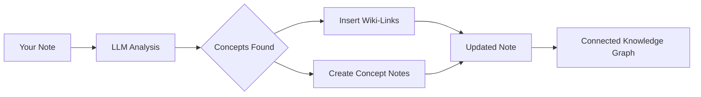

import TLDR from '@site/src/components/TLDR';

# روابط ويكي

<TLDR>
**Notemd يضيف تلقائيًا `[[wiki-links]]` إلى المفاهيم الرئيسية في ملاحظاتك.** يقوم LLM بقراءة محتواك وتحديد المصطلحات المهمة في السياق، ثم يدخل روابط ويكي على طراز Obsidian في كل مرة تظهر فيها. يمكنه أيضًا إنشاء ملفات ملاحظات المفاهيم مع روابط مرجعية. يدعم كبح الكلمات المترادفة، والحفاظ على سلامة الروابط عند إعادة التسمية أو الحذف، بالإضافة إلى وضع الاستخراج النقي (بدون تعديل الملفات). على عكس Auto Link الذي يطابق فقط عناوين الملاحظات القائمة، يستخدم Notemd الذكاء الاصطناعي لتحديد المفاهيم الجديدة وإنشاء ملاحظات مقابلة. هذا جزء من [Obsidian دليل إدارة المعرفة بالذكاء الاصطناعي](/docs/pillar-ai-knowledge).
</TLDR>

## نظرة عامة

إن ربط الويكي هو الميزة الأساسية لـ Notemd. فهو يحول النص العادي إلى رسم بياني معرفي مترابط من خلال:

1. **تحليل ملاحظاتك** باستخدام LLM
2. **تحديد المفاهيم الرئيسية** (المصطلحات، الأشخاص، الأساليب، النظريات)
3. **إدخال `[[wiki-links]]`** في كل مرة تظهر فيها
4. **إنشاء ملاحظات المفاهيم** (اختياري) مع روابط مرجعية

## كيف يعمل

### العملية



### مثال

**قبل:**
```markdown
Machine learning models use neural networks to learn patterns from data.
The transformer architecture revolutionized natural language processing.
```

**بعد:**
```markdown
[[Machine learning]] models use [[neural networks]] to learn patterns from data.
The [[transformer architecture]] revolutionized [[natural language processing]].
```

## الاستخدام

### أساسي: إضافة روابط إلى الملاحظة الحالية

1. افتح ملاحظة
2. انقر بزر الماوس الأيمن في المحرر → **"معالجة الملف (إضافة روابط)"**
3. انتظر بضع ثوانٍ
4. المفاهيم مرتبطة الآن!

### دفعة: معالجة عدة ملاحظات

1. النقر بزر الماوس الأيمن على مجلد في مستكشف الملفات
2. اختر **"Notemd: معالجة المجلد (إضافة روابط)"**
3. التكوين:
   - التزامن (عدد الملفات المعالجة في نفس الوقت)
   - تغطية الروابط الحالية (نعم/لا)
4. النقر على **معالجة**

### انتقائي: ربط نص محدد

1. تمييز النص المراد معالجته
2. النقر بزر الماوس الأيمن → **"معالجة الاختيار (إضافة روابط)"**
3. يتم تحليل الجزء المميز فقط

## Notemd مقابل الربط التلقائي

Obsidian لديها طريقتان للربط التلقائي بويكي:

| | **الربط التلقائي** | **Notemd** |
|--|---------------|-------------|
| مصدر الرابط | عناوين الملاحظات الحالية في الخزنة | المفاهيم التي حددها LLM في المحتوى |
| يمكن ربط المفاهيم الجديدة | لا — يجب أن يكون العنوان موجودًا بالفعل | نعم — يقوم الذكاء الاصطناعي بتحديد المفاهيم وإنشاء ملاحظات |
| معالجة المرادفات | لا | نعم — قمع المرادفات |
| إنشاء ملاحظة المفهوم | لا | نعم — مع روابط عكسية وإزالة التكرار |
| المعالجة الدفعية | لا (ملف واحد) | نعم (على مستوى المجلد) |
| توجيه النموذج حسب المهمة | لا | نعم |

**Auto Link** يعتمد على مطابقة العنوان: إذا كانت هناك ملاحظة باسم "Machine Learning" موجودة، فإنه يغلف الحالات في `[[Machine Learning]]`. إذا لم تكن الملاحظة موجودة، فلا يحدث شيء.

**Notemd** يعتمد على الذكاء الاصطناعي: يقرأ LLM محتواك ويفهم السياق ويحدد المفاهيم التي *يجب* ربطها — حتى لو لم تكن هناك ملاحظة موجودة بعد — وينشئ كلًا من الرابط وملاحظة المفهوم.

## الميزات

### قمع المرادفات

**المشكلة:** "transformer"، "transformers"، "Transformer architecture" → 3 مفاهيم منفصلة

**الحل:** Notemd يكتشف التكرارات الشبه المتطابقة ويستخدم الشكل القياسي.

**التكوين:**
```
Settings → Advanced → Synonym Suppression
Threshold: 0.8 (0 = off, 1 = aggressive)
```

### سلامة الروابط

**عند تغيير اسم ملاحظة المفهوم:**
- تتم تحديث جميع روابط ويكي تلقائيًا (Obsidian ميزة أساسية)
- تظل الروابط الخلفية كما هي

**عند حذف ملاحظة المفهوم:**
- تظل الروابط موجودة لكنها تظهر كـ "إشارات غير مرتبطة"
- يمكن إعادة إنشائها من أي ظهور لها

### وضع الاستخراج النقي

**استخراج المفاهيم دون تعديل الملف الأصلي:**

1. النقر بزر الماوس الأيمن → **"استخراج المفاهيم (بدون روابط)"**
2. يتم إنشاء ملاحظات المفاهيم
3. لا يتم التأثير على الملف الأصلي

حالة استخدام: معالجة المحتوى غير القابل للتعديل أو المسودات النهائية.

## توليد ملاحظات المفاهيم

### الإنشاء التلقائي

**عند تفعيلها (القيمة الافتراضية)، Notemd تُنشئ:**

```markdown
---
tags: [concept, auto-generated]
created: 2026-06-13
source: [[Original Note Name]]
---

# Machine Learning

A branch of artificial intelligence that enables computers
to learn from data without explicit programming.

## Occurrences in Your Vault

- [[Original Note Name#Section]]
- [[Another Note#Header]]

## Related Concepts

- [[Neural Networks]]
- [[Deep Learning]]
- [[Supervised Learning]]
```

### التكوين

**مجلد الإخراج:**
```
Settings → Output → Concept Folder
Default: concepts/
```

**الهيكل الهرمي:**
```
Settings → Output → Use Hierarchical Folders
If enabled:
  papers/my-paper.md → papers/concepts/Concept.md
If disabled:
  → concepts/Concept.md
```

**القالب:**
```
Settings → Output → Concept Template
Customize with variables:
  {{concept}} — Concept name
  {{description}} — LLM-generated description
  {{backlinks}} — List of source notes
  {{date}} — Creation date
```

## خيارات متقدمة

### نافذة السياق

**كمية النص المحيط الذي يجب إرساله:**

```
Settings → Linking → Context Window
Options: Sentence | Paragraph | Full Note
Default: Paragraph
```

كلما كان أكبر، كانت الدقة أفضل والتكلفة أعلى.

### عدد المرات الدنيا للظهور

**توصيل المفاهيم التي تظهر عدة مرات فقط:**

```
Settings → Linking → Min Occurrences
Default: 1 (link all)
```

ضع القيمة على 2 أو 3 للتركيز على المواضيع المتكررة.

### أنماط للإستبعاد

**تخطي كلمات معينة:**

```
Settings → Linking → Exclude List
Example: note, idea, example, thing
```

يمنع الربط المفرط بالمصطلحات العامة.

### تعليمات مخصصة

**تجاوز تعليمات LLM الافتراضية:**

```
Settings → Advanced → Custom Linking Prompt
Default:
  "Identify key concepts, theories, methods, and technical
   terms in the following text. Return as a list..."
```

قم بتعديلها لتلبية احتياجات محددة لمجال معين (مثلاً، "التركيز على المصطلحات الطبية").

## نصائح وأفضل الممارسات

### ✅ افعل

- **تعالج الملاحظات التي تزيد كلماتها عن 100 كلمة** — الملاحظات القصيرة تُنتج مفاهيم قليلة
- **استخدم نماذج قوية** لتحسين تحديد المفاهيم (GPT-4o، Claude)
- **راجع قبل القبول** — تأكد من أن الروابط المقترحة منطقية
- **ابنِ بشكل تدريجي** — تعالج 5-10 ملاحظات، راجع الرسم البياني، عدّل الإعدادات

### ❌ لا تفعل

- **الربط المفرط** — ليس كل اسم يحتاج إلى رابط
- **معالجة المسودات مرارًا وتكرارًا** — قد تتغير المفاهيم، انتظر حتى تصبح ثابتة
- **تجاهل المرادفات** — قم بتفعيل القمع لتجنب "ML" مقابل "Machine Learning"

## الأداء

### السرعة

| حجم الملاحظة | GPT-4o-mini | Claude Sonnet | Ollama (محلي) |
|-----------|-------------|---------------|----------------|
| 500 كلمة | ٢-٣ ثانية | ٣-٥ ثانية | ٥-١٠ ثانية |
| ٢٠٠٠ كلمة | ٥-٨ ثانية | ١٠-١٥ ثانية | ٢٠-٤٠ ثانية |
| ٥٠٠٠+ كلمة | مقسّم إلى أجزاء (عدة استدعاءات) | مقسّم | مقسّم |

### تقدير التكلفة

**مثال: ملاحظة مكوّنة من ١٠٠٠ كلمة باستخدام GPT-4o-mini**
- المدخلات: ~١٥٠٠ رمز
- المخرجات: ~٢٠٠ رمز
- التكلفة: ~٠.٠٠١ دولار

**معالجة دفعة من 100 ملاحظة:** ~

## حل المشكلات

### لم يتم إضافة أي روابط

**التحقق:**
1. نجح الاتصال LLM (الإعدادات → التشخيص)
2. الملاحظة تحتوي على محتوى كافٍ (>50 كلمة)
3. المفاهيم هي تقنية/محددة (وليست مجرد ضمائر)

**جرب:**
- استخدم نموذجًا أقوى
- زيادة نافذة السياق
- تحقق من صحة مفتاح API

### عدد كبير جدًا من الروابط

**الحلول:**
1. زيادة الحد الأدنى لعدد المرات (2 أو 3)
2. أضف كلمات شائعة إلى قائمة الاستثناءات
3. استخدم نموذجًا أقل عدوانية

### مفاهيم خاطئة مرتبطة

**التصحيحات:**
1. استخدام نموذج طلب مخصص لتحديد المجال
2. تفعيل قمع المرادفات
3. مراجعة يدوية وفك الارتباط

### انقطاع الروابط بعد إعادة التسمية

**هذا سلوك طبيعي Obsidian.**

لتحديث جميع الروابط:
1. أعد تسمية ملاحظة المفهوم
2. Obsidian يقوم تلقائيًا بتحديث `[[old]]` إلى `[[new]]`

---

## الخطوات التالية

- 📖 [ملاحظات المفهوم](./concept-notes) — نظرة عميقة في إنشاء ملاحظات المفهوم
- 🔍 [التكامل البحثي](./research) — دمج الروابط مع البحث على الويب
- 🎨 [الرسوم البيانية](./diagrams) — تصور رسم بياني لرسم خريطة المعرفة الخاصة بك
