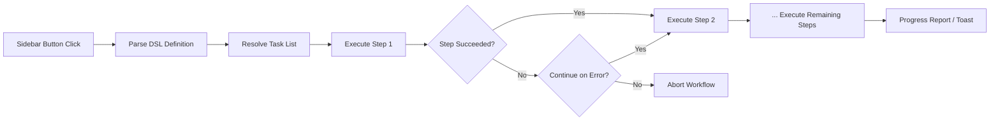

import TLDR from '@site/src/components/TLDR';

# سلاسل العمل

<TLDR>
**Notemd سلاسل العمل تربط المهام المتعددة في عملية نقرة واحدة.** يمكن تعريف التسلسلات مثل `add-links > extract-concepts > research > diagram` باستخدام لغة برمجة بسيطة خاصة بالمجال. تظهر سلاسل العمل كأزرار في الشريط الجانبي التي تنفذ السلسلة الكاملة على الملاحظة أو المجلد الحالي. يأتي البرنامج مع سلاسل عمل جاهزة؛ يمكن إنشاء سلاسل عمل مخصصة في الإعدادات. كل خطوة تستخدم إعدادات نموذج خاصة بها لكل مهمة.

هذا جزء من [Obsidian دليل إدارة المعرفة الذكية](/docs/pillar-ai-knowledge).
</TLDR>

## نظرة عامة

تُزيل سلاسل العمل الصعوبات المرتبطة بتنفيذ المهام واحدة تلو الأخرى. بدلاً من النقر بزر الماوس الأيمن أربع مرات لإضافة روابط، واستخراج المفاهيم، والبحث عن مصطلحات غير مألوفة، وإنشاء رسم تخطيطي، يكفي الضغط على زر في الشريط الجانبي وتنفذ السلسلة بأكملها. Notemd يتولى التحكم في التسلسل، وانتقال الأخطاء، وإعداد تقارير التقدم.

تُعرّف سلاسل العمل باستخدام لغة برمجة خفيفة خاصة بالمجال. توجد في الإعدادات، وتظهر كأزرار قابلة للنقر في شريط Obsidian الجانبي، ويمكن تطبيقها على الملاحظة الحالية أو على مجلد بأكمله.

## كيف يعمل

### خط أنابيب تنفيذ سلاسل العمل



1. **تحليل** -- يتم تقسيم سلسلة لغة البرمجة هذه على `>` (أو `>`) للحصول على قائمة مرتبة من معرفات المهام.
2. **حل** -- يتم تخصيص كل معرف لأمر داخلي (إضافة روابط، استخراج المفاهيم، البحث، الترجمة، رسم تخطيطي، إلخ.).
3. **تنفيذ** -- تُنفّذ الخطوات بشكل متتابع. كل خطوة تستخدم مزود ونموذج مُعدّ لها.
4. **معالجة الأخطاء** -- إذا فشلت خطوة ما، فإن سلسلة العمل إما تتوقف أو تستمر إلى الخطوة التالية، حسب سياسة المعالجة المحددة لديك.
5. **الانتهاء** -- تُظهر رسالة تنبيه نجاح التنفيذ أو تُسرد الخطوات التي فشلت.

### تنسيق لغة البرمجة

تُعرّف سلاسل العمل كتسلسل من معرفات المهام مفصولة بـ `>`:

```
process-current-add-links>extract-concepts-current>research-and-summarize
```

**معرفات المهام المتاحة:**

| المعرف | الإجراء |
|------------|--------|
| `process-current-add-links` | إضافة روابط ويكي إلى الملاحظة النشطة |
| `extract-concepts-current` | استخراج المفاهيم من الملاحظة النشطة |
| `research-and-summarize` | البحث في النص المختار أو عنوان الملاحظة |
| `process-current-translate` | ترجمة الملاحظة النشطة |
| `summarize-to-mermaid` | إنشاء رسم تخطيطي من الملاحظة النشطة |
| `generate-from-title` | إنشاء محتوى من عنوان الملاحظة |
| `extract-original-text` | استخراج النص الأصلي (لأغراض OCR / المحتوى الممسوح ضوئيًا) |

**المتغيرات على مستوى المجلد**: استبدل `current` بـ `folder` في اسم المعرف.

### سلاسل العمل المحددة مسبقًا مقابل السلاسل المخصصة

يأتي Notemd مع سلاسل عمل جاهزة للأنماط الشائعة:

| سلسلة العمل | سلسلة متتابعة | حالة الاستخدام |
|----------|-------|----------|
| **الاستخراج بنقرة واحدة** | إضافة الروابط > استخراج المفاهيم > البحث | معالجة ورقة بحثية في مرحلة واحدة |
| **الأنبوب الكامل** | إضافة الروابط > استخراج المفاهيم > البحث > الرسم التخطيطي | استخراج المعرفة الكاملة مع التصور البصري |
| **ترجمة + ربط** | ترجمة > إضافة الروابط | ترجمة المفاهيم ثم ربطها باللغة المستهدفة |

يتم إنشاء **سير العمل المخصصة** في الإعدادات:

1. افتح **الإعدادات** --> **Notemd** --> **سير العمل**
2. انقر على **"إضافة سير عمل"**
3. أدخل سلسلة DSL (مثلاً `process-current-add-links>extract-concepts-current`)
4. أعطها اسمًا للعرض (مثلاً "رابط سريع + استخراج")
5. يظهر الزر الجديد فورًا في الشريط الجانبي

## التكوين

| الإعداد | افتراضي | التأثير |
|---------|---------|--------|
| `workflows` | مجموعة محددة مسبقًا | مصفوفة من تعريفات سير العمل (الاسم + DSL) |
| `workflowContinueOnError` | `true` | استمر إلى الخطوة التالية إذا فشلت الخطوة الحالية |
| `workflowShowProgress` | `true` | عرض رسالة تقدم بعد اكتمال كل خطوة |

### نماذج لكل مهمة في سير العمل

كل خطوة في سير العمل تستخدم إعدادات نموذج خاص بها لكل مهمة. لا حاجة لتحديد النماذج داخل لغة التوصيف نفسها. ترتيب التنفيذ هو:

1. مزود/نموذج كل مهمة إذا كان `useMultiModelSettings` موجودًا
2. `activeProvider` العالمي في حالة عدم وجود `activeProvider`

وهذا يعني أن `add-links` يمكن أن يعمل على DeepSeek بينما يعمل `research` على GPT-4o -- كل ذلك ضمن نفس سير العمل.

## مثال

لقد قمت للتو باستيراد PDF من ورقة بحثية في التعلم الآلي إلى خزانتك وتريد استخراج المعرفة بالكامل:

1. افتح الملاحظة المستوردة
2. انقر على زر شريط الجانب **"Full Pipeline"**
3. يتم تنفيذ Notemd كالتالي:
   - **الخطوة 1**: إضافة روابط ويكي -- `[[attention mechanism]]`، `[[transformer]]`، إلخ.
   - **الخطوة 2**: استخراج المفاهيم -- إنشاء ملاحظات مفاهيمية في مجلد المفاهيم الخاص بك
   - **الخطوة 3**: البحث -- تلخيص المصادر على الويب للمصطلحات الرئيسية
   - **الخطوة 4**: رسم مخطط -- إنشاء خريطة ذهنية Mermaid لهيكل الورقة البحثية
4. بعد حوالي 30 ثانية، تحتوي ملاحظتك على روابط وملاحظات مفاهيمية وملخصات بحثية وملف مخطط محفوظ

كل ذلك من خلال نقرة واحدة.

## نصائح

- **ابدأ باستخدام سير العمل المحددة مسبقًا** -- فهي تغطي أكثر الأنماط شيوعًا. قم بالتخصيص فقط عندما تحتاج إلى تسلسل مختلف.
- **قم بتفعيل `workflowContinueOnError`** -- يجب ألا يؤدي فشل خطوة رسم المخطط إلى إيقاف السلسلة بأكملها.
- **استخدم سير العمل للمجلدات** للمعالجة الجماعية -- انقر بزر الماوس الأيمن على مجلد، اختر سير عمل، وسيتم معالجة كل ملاحظة.
- **أطلق أسماءً واضحةً على سير العمل** -- مساحة الشريط الجانبي محدودة. استخدم أسماءً قصيرةً تركز على الإجراء مثل "استخراج سريع" أو "ترجمة + رابط".

---

## الخطوات التالية

- [Research](./research) -- فهم ما يفعله خطوة البحث قبل إضافتها إلى سير العمل
- [Wiki-Links](./wiki-links) -- الميزة الأساسية للربط المستخدمة في معظم سير العمل
- [Concept Notes](./concept-notes) -- استخراج المفاهيم كخطوة في سير العمل
- [Batch Processing](/docs/advanced/batch-processing) -- التزامن وتقارير التقدم لسير العمل للمجلدات
