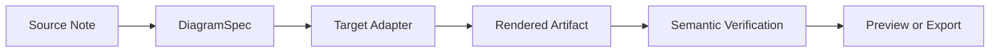
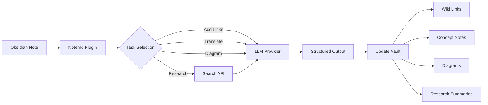

import TLDR from '@site/src/components/TLDR';

# مقدمة عن Notemd

<TLDR>
**Notemd** (ملاحظة + EMD — وثائق Markdown المحسّنة) هو إضافة مفتوحة المصدر لـ Obsidian تقوم بتحويل القراءة المدعومة بـ LLM إلى معرفة دائمة. على عكس الذكاء الاصطناعي القائم على الدردشة حيث تختفي الرؤى بعد انتهاء الجلسة، يقوم Notemd بكتابة النتائج **مباشرةً في خزانتك** كروابط ويكي وملاحظات مفاهيمية وملخصات بحثية وترجمات وسير عمل ورسوم تخطيطية. تم بناؤه للباحثين والطلاب والعاملين في مجال المعرفة الذين يرغبون في تراكم القراءة والبحث والشرح البصري في رسم بياني للمعرفة منظم ومتطور.
</TLDR>

## ما هو Notemd؟

يدمج Notemd **أكثر من 30 نموذج لغة كبير** (OpenAI، Anthropic، Google، DeepSeek، Qwen، Ollama وغيرها) في سير عمل Obsidian الخاص بك لأتمتة استخراج المعرفة وتنظيمها وترجمتها والبحث فيها وإنشاء الرسوم التخطيطية.

### الفرق الرئيسي: المعرفة المؤقتة مقابل المعرفة الدائمة

| الجانب | الذكاء الاصطناعي القائم على الدردشة (ChatGPT، إلخ.) | Notemd |
|--------|-------------------------------|--------|
| **إلى أين تذهب النتائج** | تاريخ الدردشة (يختفي) | خزانة Obsidian الخاصة بك (تظل دائمة) |
| **التنسيق** | إجابات نصية عادية | ملفات منظمة: `[[wiki-links]]`، ملاحظات مفاهيمية، رسوم تخطيطية |
| **القيمة على المدى الطويل** | يجب طرح السؤال مرة أخرى في كل مرة | يتراكم في رسم بياني للمعرفة |
| **الوصول دون اتصال بالإنترنت** | يتطلب اتصالاً بالإنترنت | يعمل بشكل كامل دون اتصال مع Ollama |

## القدرات الأساسية

### 1. **الربط التلقائي بالويكي**
- LLM يحدد المفاهيم الرئيسية في ملاحظاتك
- يدخل `[[wiki-links]]` في كل مرة تظهر فيها
- ينشئ اختيارياً ملاحظات للمفاهيم المرتبطة
- كبح الترادفات لتجنب الازدواجية

### 2. **إنشاء ملاحظات المفاهيم**
- يستخلص المفاهيم الأساسية من الأوراق والمقالات والملاحظات
- يولد ملفات مفاهيم مخصصة مع روابط عكسية
- مسارات وقوالب إخراج قابلة للتخصيص

### 3. **دمج البحث على الويب**
- استعلم Tavily أو DuckDuckGo من داخل Obsidian
- LLM يلخص النتائج مع اقتباسات المصادر
- يضيف نتائج البحث إلى الملاحظة الحالية

### 4. **الترجمة متعددة اللغات**
- ترجمة الاختيارات أو الملاحظات بأكملها
- يدعم أكثر من 21 لغة UI
- إعداد لغة الإخراج المستقلة
- دعم الترجمة الجماعية

### 5. **إنشاء الرسوم البيانية**
- **Mermaid**: مخططات التدفق، التسلسل، الفئات، الحالات، ER، Gantt
- **JSON Canvas**: تخطيطات أصلية Obsidian
- **Vega-Lite**: رسوم بيانات البيانات، سلاسل الزمن، رسوم النقاط المتناثرة
- **HTML / HTML قابل للتعديل / SVG**: عناصر رسومية مستقلة مع تعليقات دلالية
- **Draw.io / حدود عنصر Drawnix**: مسارات التصدير المخصصة للمحافظين من نفس نموذج الرسم الدلالي
- **خريطة طريق الرسوم الكهربائية**: يتم تصميم الدعم circuitikz/TikZJax حول المراجع الذهبية، النصوص المقيدة، تغذية راجعة التصدير، والتحقق من التوبولوجيا/التخطيط بدلاً من استخدام TikZ غير المقيد مباشرةً
- **تشخيص المعاينة**: يمكن للعناصر المُصدرة أن تكشف عن تشخيصات التجميع/التصدير، ويمكن فحص المصادر غير المدمجة دون الحاجة إلى بيئة تشغيل LaTeX جانبية للإضافات
- تصحيح تلقائي للصيغة لأخطاء Mermaid

### 6. **سير عمل بنقرة واحدة**
- ربط عدة إجراءات في أزرار جانبية
- تعريف سير العمل المبني على DSL
- مثال: `add-links > extract-concepts > research > diagram`

## من يجب أن يستخدم Notemd؟

✅ **الباحثون** الذين يقرأون الأوراق العلمية ويُعدّون مراجعات أدبية
✅ **الطلاب** الذين ينظمون ملاحظات الدراسة ويُنشئون خرائط المفاهيم
✅ **العاملون في مجال المعرفة** الذين يرغبون في الاحتفاظ برؤى القراءة
✅ **المحترفون ثنائوو اللغة** الذين يحتاجون إلى الترجمة + روابط ويكي
✅ **المستخدمون المهتمون بالخصوصية** الذين يرغبون في دعم محلي LLM (Ollama)
✅ **المستخدمون المتقدمون** الذين يقومون بتخصيص النصوص التلقائية وسير العمل

## لماذا Notemd + Obsidian؟

**Obsidian** هو قاعدة معرفية تعتمد على ماركدوف وتُركز على الاستخدام المحلي. **Notemd** يضيف قدرات ذكاء اصطناعي قوية:
- تبقى بياناتك في خزنتك (وليس في خدمة سحابية)
- يعمل دون اتصال بالإنترنت باستخدام النماذج المحلية
- مجاني ومفتوح المصدر (ترخيص MIT)
- يتكامل مع إضافات Obsidian الحالية
- يمكنه التوسع لعشرات الآلاف من الملاحظات

## البدء

1. **التثبيت**: الإعدادات → الإضافات المجتمعية → التصفح → "Notemd"
2. **التكوين**: أضف مفتاح مزود LLM API الخاص بك (أو استخدم Ollama المحلي)
3. **جربه**: افتح ملاحظة → انقر بزر الماوس الأيمن → "معالجة الملف (إضافة روابط)"
4. **استكشف**: تحقق من الشريط الجانبي للحصول على سير عمل بنقرة واحدة

👉 [دليل التثبيت](./getting-started/installation) | [دليل البدء السريع](./getting-started/quick-start)

## اتجاه قدرات الرسوم البيانية

تتجه أدوات الرسوم البيانية لدى Notemd بعيدًا عن "طلب كتابة سلسلة بنية واحدة من النموذج" نحو خط أنابيب متعدد الطبقات:

تدعم التنفيذ الحالي بالفعل Mermaid، JSON Canvas، Vega-Lite، HTML كبديل، HTML/SVG قابلة للتعديل، ملفات Draw.io XML، مجموعة مختصرة من Drawnix JSON، تشخيص المعاينة/البديل القائم على المصدر فقط، بالإضافة إلى نموذج تجريبي خارج الشبكة `CircuitSpec -> circuitikz` للقوالب الذهبية للمصادر الشائعة ومفاتيح الـ CMOS. الرسوم البيانية للدوائر أكثر تعقيدًا: يمكن لـ circuitikz التعبير عن التوبولوجيا الكهربائية بدقة، لكن الإخراج غير المقيد من LLM غالبًا ما ينتج توجيهات غير قابلة للقراءة أو نصوص LaTeX غير قابلة للعرض. الاتجاه التالي هو الحفاظ على circuitikz مقيدًا باستخدام قوالب المرجع الذهبي، وقواعد تخطيط الشبكة، وتشخيص العرض، وحلقات التغذية الراجعة عبر لقطات الشاشة.

اقرأ التفاصيل في [الرسوم البيانية](./features/diagrams).

## البنية

## Notemd مقابل باقي إضافات Obsidian الذكية

معظم إضافات Obsidian الذكية تعتمد على المحادثة أولاً (أنت تسأل، الذكاء الاصطناعي يجيب، وتظل الرؤى داخل الدردشة). أما Notemd فهو **الكتابة أولاً**: يقوم الذكاء الاصطناعي بمعالجة ملاحظاتك وكتابة النتائج المنظمة مباشرة في خزانتك.

| القدرات | Notemd | Copilot | Smart Connections | Text Generator |
|-----------|--------|---------|-------------------|-----------------|
| إدخال روابط ويكي تلقائيًا | نعم | لا | لا | لا |
| توليد مذكرة المفهوم | نعم (مع روابط عكسية + إزالة التكرار) | لا | لا | لا |
| توليد الرسوم البيانية | نعم (Mermaid, Canvas, Vega-Lite, HTML, ملفات قابلة للتعديل) | لا | لا | لا |
| دمج البحث على الويب | نعم (Tavily + DuckDuckGo) | لا | لا | لا |
| معالجة المجلدات بالدفعات | نعم | محدود | لا | محدود |
| توجيه النموذج حسب المهمة | نعم (7 مهام، نماذج مستقلة) | لا | لا | لا |
| سلاسل سير العمل بنقرة واحدة | نعم (DSL) | لا | لا | لا |
| الترجمة (بالدفعات) | نعم | لا | لا | لا |
| الدردشة مع الخزنة | لا | نعم | لا | لا |
| بحث عن التشابه الدلالي | لا | لا | نعم | لا |
| التوليد القائم على القوالب | لا | لا | لا | نعم |
| مزودو LLM | 36 (سحابة + بوابة + محلي) | 3-5 | 2-3 | 3-5 |
| خارج الشبكة بالكامل | نعم (Ollama) | جزئي | جزئي | جزئي |

**متى تختار Notemd**: إذا كنت تريد من الذكاء الاصطناعي بناء رسم بياني للمعرفة دائم — وليس فقط التحدث عن ملاحظاتك.

**متى تختار Copilot**: إذا كنت تريد مساعد ذكاء اصطناعي تفاعلي داخل Obsidian.

**متى تختار Smart Connections**: إذا كنت تريد اكتشاف العلاقات الموجودة بين الملاحظات عبر البحث الدلالي.

## الفلسفة

**Notemd يعتقد أن الذكاء الاصطناعي يجب أن يعزز العمل المعرفي للإنسان، وليس أن يحل محله.** الإضافة:
- تحافظ على سيطرتك (مراجعة قبل تطبيق التغييرات)
- تحافظ على السياق (جميع النتائج ترتبط بالمصدر)
- تحترم الخصوصية (دعم LLM محلي، بدون تتبع)
- يظل قابلاً للتوسعة (مفتوح APIs، سير عمل مخصص)

<!-- notemd-acknowledgments -->
## شكر ومشروعات مرجعية

يُصان Notemd بصورة مستقلة. نتقدم بالشكر إلى المشروعات والمجتمعات مفتوحة المصدر التي ألهمت قراراته التصميمية الموثقة أو تشكل أساس تكاملاته. يوضح الإدراج هنا التأثير أو قابلية التشغيل البيني فقط، ولا يعني تأييدًا أو تبعية أو تضمين شفرة أو ادعاء إعادة استخدام شفرة.

- **المشروعات المرجعية:** [cloudy-tech-diagrams-skill](https://github.com/cloudy-liu/cloudy-tech-diagrams-skill), [Drawnix](https://github.com/plait-board/drawnix), [diagrams.net / draw.io](https://www.diagrams.net/), [repo-saga](https://github.com/teee32/repo-saga).
- **أسس مفتوحة المصدر:** [Mermaid](https://github.com/mermaid-js/mermaid), [Vega-Lite](https://vega.github.io/vega-lite/), [Slidev](https://github.com/slidevjs/slidev), [CircuitikZ](https://github.com/circuitikz/circuitikz), [Tectonic](https://github.com/tectonic-typesetting/tectonic), [Docusaurus](https://docusaurus.io).
- يحتفظ كل مشروع بترخيصه وشروطه الخاصة؛ ويتاح Notemd بموجب [ترخيص MIT](https://github.com/Jacobinwwey/obsidian-NotEMD/blob/main/LICENSE).

## مصدر مفتوح

- **الرخصة**: MIT
- **المصدر**: [github.com/Jacobinwwey/obsidian-NotEMD](https://github.com/Jacobinwwey/obsidian-NotEMD)
- **المجتمع**: [Discord](https://discord.gg/qnGgsQ9W) | [GitHub Discussions](https://github.com/Jacobinwwey/obsidian-NotEMD/discussions)
- **المساهمة**: مرحباً بالطلبات، راجع [CONTRIBUTING.md](https://github.com/Jacobinwwey/obsidian-NotEMD/blob/main/CONTRIBUTING.md)

---

**الخطوة التالية**: [Installation →](./getting-started/installation)
