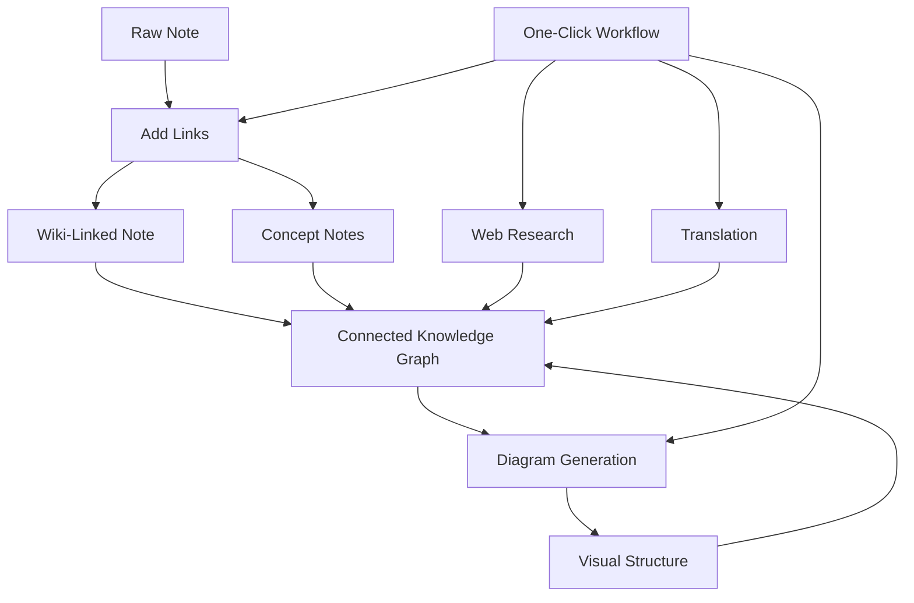

import TLDR from '@site/src/components/TLDR';

# دليل إدارة المعرفة بالذكاء الاصطناعي Obsidian

<TLDR>
**Notemd يحول القراءة المدعومة بـ LLM إلى معرفة دائمة: روابط الويكي تربط المفاهيم، وملاحظات المفاهيم تُنشئ رسمًا بيانيًا قابلًا للاسترجاع، والبحث يجلب محتوى الويب إلى خزانتك، والترجمة تُزيل حواجز اللغة، والرسوم البيانية تجعل الهيكل واضحًا، وسلاسل العمل تربط كل ذلك بنقرة واحدة.** يغطي هذا الدليل الخطوات الكاملة — من الملاحظات الخام إلى قاعدة معرفية مترابطة وبصرية ومتعددة اللغات.
</TLDR>

## لماذا إدارة المعرفة بالذكاء الاصطناعي؟

تُنتج أساليب التدوين التقليدية ملفات مسطحة. حتى مع روابط الويكي اليدوية، تظل معظم الملاحظات غير مترابطة. يستخدم Notemd خوارزميات LLM لأتمتة طبقة الربط:

- **تقوم LLMs بقراءة محتواك** وتحديد ما هو مهم — المصطلحات، الأساليب، الأشخاص، النظريات
- **تُدخل الروابط تلقائيًا** في كل ظهور للمفهوم، ولا تُخفى في قسم "انظر أيضًا"
- **تُنشأ ملاحظات المفاهيم** كملفات قابلة للاسترجاع مستقلة
- **يُثري البحث الملاحظات** بسياقات من مصادر الويب
- **تجعل الرسوم البيانية الهيكل واضحًا** — خرائط العقل، مخططات التدفق، رسوم بيانية البيانات من نفس المحتوى

النتيجة: رسم بياني للمعرفة ينمو مع كل ملاحظة تقوم بمعالجتها، وليس فقط عندما تتذكر إضافة روابط.

## الخطوات الكاملة



كل خطوة مستقلة. يمكن استخدام واحدة أو جميعها. التسلسل الأكثر تأثيرًا: **إضافة الروابط → ملاحظات المفاهيم → الرسوم البيانية**.

---

## 1. روابط الويكي: جعل الروابط واضحة

تُعد روابط الويكي العمود الفقري لرسم بياني المعرفة. يستخدم Notemd خوارزمية LLM لـ:

1. اقرأ محتوى ملاحظتك (قم بتقسيمها إلى أجزاء للوثائق الطويلة)
2. حدد المفاهيم الأساسية — مع إعطاء الأولوية للمصطلحات التقنية المحددة على الأسماء العامة
3. أدخل `[[wiki-links]]` في كل ظهور لها
4. قم بكبح المرادفات حتى لا يؤدي "ML" و"Machine Learning" إلى إنشاء عقد منفصلة

### متى يجب الاستخدام

- **كل ملاحظة تزيد عن 100 كلمة** — الملاحظات الأقصر تنتج عددًا قليلًا من المفاهيم
- **أوراق البحث، المستندات التقنية، ملاحظات الاجتماعات** — غنية بالمصطلحات الخاصة بالمجال
- **بعد أن يصبح المحتوى ثابتًا** — لا تقم بمعالجة المسودات مرارًا وتكرارًا

### الإعدادات الرئيسية

| الإعداد | الموصى به | السبب |
|---------|-----------|-----|
| `addLinksProvider` | DeepSeek أو GPT-4o-mini | دقة جيدة بتكلفة منخفضة |
| كبح المرادفات | مفعّل | يمنع إنشاء عقد مكررة |
| نافذة السياق | فقرة | توازن الدقة والتكلفة |

→ [Wiki-Links deep dive](/docs/features/wiki-links)

---

## 2. ملاحظات المفاهيم: عقد المعرفة القابلة للاسترجاع

تربط روابط ويكي الأفكار داخل النص، لكن ملاحظات المفاهيم تجعل كل فكرة قابلة للاسترجاع بشكل مستقل. يحصل كل مفهوم على ملف `.md` خاص به:

```markdown
# Machine Learning

## Linked From
- [[My Research Notes]]
- [[Neural Networks Explained]]
```

### عملية الاستخراج

الطلب LLM مُنظّم بشكل كبير:
- تحويل الاسم إلى صيغة المفرد
- تفضيل المفاهيم المكونة من كلمات متعددة على الكلمات الفردية ("Dielectric Relaxation" بدلاً من "Relaxation")
- تجاهل أقسام المراجع/الببليوغرافيا
- إخراج النتائج كأسطر `CONCEPT:` لضمان تحليل محدد

يتم إزالة التكرار في المفاهيم عبر الكتل باستخدام `Set<string>`. أخطاء LLM في كتلة واحدة لا توقف العملية.

### الروابط الخلفية

عند تفعيلها، تسجل كل ملاحظة مفهومية المصادر التي ذكرتها. يعرض لوحة الروابط الخلفية الأصلية لـ Obsidian أيضًا الاتصالات العكسية.

### التكرار

يكتشف محرك إزالة التكرار ذو الخطوات الأربع في Notemd ما يلي:
1. **المطابقات الدقيقة** — مقارنة أسماء الملفات بشكل غير حساس للحروف الكبيرة والصغيرة
2. **أشكال الجمع** — "Models.md" مقابل "Model.md"
3. **تنظيم الرموز** — "A-B.md" مقابل "A B.md"
4. **احتواء كلمة واحدة** — يتم تمييز "ML.md" عند وجود "Machine Learning.md"

### إعدادات المفتاح

| الإعداد | موصى به | السبب |
|---------|-----------|-----|
| `conceptNoteFolder` | `concepts/` أو `🧠 concepts/` | يحافظ على تنظيم الخزنة |
| `extractConceptsAddBacklink` | قيد التشغيل | يتيح البحث العكسي |
| `extractConceptsMinimalTemplate` | مغلق | قالب كامل مع Linked From |
| نموذج لكل مهمة | DeepSeek | لا يحتاج استخراج المفاهيم إلى نماذج باهظة التكلفة |
| كبح المرادفات | قيد التشغيل | نفس الإعداد يؤثر على الربط والاستخراج |

→ [ملاحظات المفاهيم: تحليل معمق](/docs/features/concept-notes)

---

## 3. البحث: دمج الويب في العملية

Notemd يدمج البحث على الويب في سير عمل تدوين الملاحظات لديك:

1. **إنشاء الاستعلام** — عنوان الملاحظة أو المحتوى المختار يصبح استعلام بحث
2. **البحث على الويب** — Tavily (موصى به، مطلوب مفتاح API) أو DuckDuckGo (مجاني، بدون مفتاح)
3. ****LLM التلخيص** — نتائج البحث تُختصر إلى ملخص ذي صلة
4. **إضافة إلى الملاحظة** — يتم إضافة الملخص في موقع المؤشر أو كقسم جديد

### متى يجب استخدامه

- قبل معالجة موضوع جديد — حصل أولاً على السياق من الويب
- عندما تحتاج ملاحظة المفهوم إلى توسيع — قم بالبحث ثم أضف الروابط
- لمراجعات الأدبيات — قم بالبحث الجماعي عن مجلد من الملاحظات

### الإعدادات الرئيسية

| الإعداد | موصى به | السبب |
|---------|-----------|-----|
| `researchProvider` | GPT-4o أو Claude | يتطلب البحث تلخيصاً ذا جودة أعلى |
| خدمة البحث | Tavily | تحسين الارتباطية مع إمكانية ضبط العمق |
| `maxResearchContentTokens` | 4000 | التوازن بين العمق والتكلفة |

→ [دراسة معمقة حول البحث](/docs/features/research)

---

## 4. الترجمة: كسر حواجز اللغات

Notemd يقوم بترجمة الملاحظات باستخدام LLM المُعدّل لديك — وليس تطبيق ترجمة مخصص API. وهذا يعني:

- **ترجمات مدركة للسياق** — LLM يفهم الوثيقة بأكملها وليس جملة بجملة
- **التعامل مع المصطلحات التقنية** — "gradient descent" تظل كـ "梯度下降" وليس "坡度向下"
- **دعم المجموعات** — ترجمة مجلد كامل من الملاحظات في عملية واحدة
- **نموذج لكل مهمة** — استخدام Gemini Flash للترجمة (سريع، رخيص، متعدد اللغات)

### دعم اللغات

Notemd نفسه يدعم 21 لغة UI. يمكن ضبط لغة الهدف لكل مهمة. الأزواج الشائعة: EN↔ZH، EN↔JA، EN↔KO، EN↔DE، EN↔FR، EN↔ES.

→ [دراسة معمقة حول الترجمة](/docs/features/translation)

---

## 5. الرسوم البيانية: جعل الهيكل واضحًا

خط أنابيب الرسوم البيانية لدى Notemd يعتمد على المواصفات أولاً: LLM ينتج `DiagramSpec` JSON مُنظمًا، ثم تقوم المحولات بترجمته إلى التنسيق المطلوب. وهذا ينتج نتائج أكثر موثوقية من طلب LLM لصيغة Mermaid الخام.

### اكتشاف النية

Notemd يستنتج أفضل نوع رسم بياني من المحتوى:

- **الجداول التي تحتوي على أرقام** → رسم بيانات (Vega-Lite)
- **مفردات العميل/الخادم** → رسم تسلسلي (Mermaid)
- **الكيان/المفتاح الأساسي** → رسم ER (Mermaid)
- **خطوة/تدفق العمليات** → مخطط تدفق (Mermaid)
- **كلمات مفتاحية خريطة المفاهيم** → JSON Canvas (Obsidian أصلي)
- **القيمة الافتراضية** → خريطة عقلية (Mermaid)

### سلسلة التصدير

الهدف الأساسي → بديل → بديل → HTML. إذا فشل تركيب Mermaid، يتم إعادة المحاولة مرة واحدة مع سياق الخطأ إلى LLM، ثم الانتقال إلى رسم بياني أدنى.

### إعدادات رئيسية

| الإعداد | موصى به | السبب |
|---------|-----------|-----|
| `enableExperimentalDiagramPipeline` | مفعّل | جودة أفضل عبر التركيز على المواصفات أولاً |
| `experimentalDiagramCompatibilityMode` | `best-fit` | الهدف الأصلي حسب النية |
| `summarizeToMermaidProvider` | GPT-4o أو Claude | تحتاج مواصفات الرسوم البيانية إلى التفكير المكاني |
| `autoMermaidFixAfterGenerate` | مفعّل | يكتشف أخطاء تركيب LLM تلقائيًا |
| تعزيز المعرفة المحلية | في وضع التشغيل للمجالات المحددة | يحسّن الدقة باستخدام سياق الخزنة |

→ [تحليل معمق للرسومات](/docs/features/diagrams)

---

## 6. سلاسل العمل: الأتمتة بنقرة واحدة

تربط سلاسل العمل مهامًا متعددة في زر جانبي واحد. صيغة DSL هي:

```
task1 | task2 | task3
```

مثال: `addLinks | extractConcepts | generateDiagram` — معالجة ملاحظة من نص خام إلى عقدة معرفية مرئية متصلة بالكامل في نقرة واحدة.

### سلاسل العمل الموصى بها

| سلسلة العمل | سلسلة متتابعة | حالة الاستخدام |
|----------|-------|----------|
| العملية الكاملة | `addLinks \| extractConcepts \| generateDiagram` | ملاحظات جديدة |
| البحث أولاً | `research \| addLinks` | المواضيع غير المألوفة |
| متعدد اللغات | `translate \| addLinks` | ملاحظات متعددة اللغات |
| مخطط فقط | `generateDiagram` | تصور سريع |

→ [التعمق في سلاسل العمل](/docs/features/workflows)

---

## 7. LLM مزودون: 36 خيارًا من السحابة إلى المحلية

Notemd يدعم 36 مزودًا عبر 4 أنواع نقل. المجموعات الرئيسية:

- **السحابة الدولية**: OpenAI, Anthropic, Google, Mistral, xAI
- **السحابة الصينية**: DeepSeek, Qwen, Doubao, Moonshot, GLM, Baidu, SiliconFlow
- **البوابات**: OpenRouter, GitHub Models, Hugging Face, Vercel
- **المحلية**: Ollama, LMStudio, OVMS — لا يوجد مفتاح API، ولا تغادر البيانات جهازك

### استراتيجية نموذج كل مهمة

أكثر إعدادات فعالية من حيث التكلفة تستخدم نماذج رخيصة للمهام البسيطة ونماذج قوية للمهام المعقدة:

```
extractConcepts  → DeepSeek (fast, cheap, accurate enough)
addLinks          → DeepSeek or GPT-4o-mini
research          → GPT-4o or Claude (needs quality)
generateDiagram   → GPT-4o or Claude (needs spatial reasoning)
translate         → Gemini Flash (fast, multilingual)
```

→ [نظرة عامة على مزودي LLM](/docs/providers/overview)

---

## قائمة التحقق قبل البدء

1. **تثبيت Notemd** — [الإضافات المجتمعية](/docs/getting-started/installation) (موصى به) أو يدويًا
2. **تكوين مزود** — DeepSeek (الأسهل)، OpenAI، أو Ollama (مجاني)
3. **معالجة أول ملاحظة لديك** — انقر بزر الماوس الأيمن → "معالجة الملف (إضافة روابط)"
4. **تعيين مجلد المفاهيم** — الإعدادات → Notemd → الإخراج → مجلد المفاهيم
5. **استخراج المفاهيم** — تشغيل أمر "Extract concepts" على نفس الملاحظة
6. **إنشاء رسم تخطيطي** — تشغيل أمر "Generate diagram" لعرض الروابط بصورة مرئية
7. **إنشاء سير عمل** — ربط الخطوات السابقة في زر واحد بالنقرة

## الإعدادات الموصى بها

### طالب (ميزانية)

```
Provider: DeepSeek (free tier available)
Concept extraction: DeepSeek
Research: DuckDuckGo (free) + DeepSeek
Diagrams: Off (or legacy Mermaid)
Workflows: addLinks | extractConcepts
```

### باحث (جودة)

```
Provider: GPT-4o (primary)
Concept extraction: DeepSeek (cost savings)
Research: GPT-4o + Tavily
Diagrams: best-fit mode, GPT-4o
Workflows: research | addLinks | extractConcepts | generateDiagram
```

### الخصوصية أولاً (محلي فقط)

```
Provider: Ollama (llama3 or qwen2.5:7b)
All tasks: Ollama
Research: DuckDuckGo (free, no API key)
Diagrams: legacy Mermaid mode
```

### ثنائي اللغة (ZH + EN)

```
Primary: DeepSeek (Chinese queries)
Translation: Google Gemini Flash
Research: Tavily + DeepSeek (Chinese search context)
Language output: per-task (extractConceptsLanguage: zh-CN)
```

---

## أنماط شائعة

### النمط: معالجة ورقة بحثية

1. استيراد محتوى PDF (أو لصقه)
2. **البحث** — الحصول على سياق ويب حول الموضوع
3. **إضافة روابط** — تحديد المفاهيم الرئيسية وربطها
4. **استخراج المفاهيم** — إنشاء ملاحظات منفصلة
5. **إنشاء رسم تخطيطي** — عرض هيكل الورقة البحثية بصورة مرئية

### النمط: تحسين الملاحظة اليومية

1. كتابة ملاحظة يومية
2. **إضافة روابط** — يربط الأفكار اليومية بالمفاهيم الموجودة
3. تُحدّث ملاحظات المفاهيم تلقائيًا مع الروابط الخلفية

### نمط: مراجعة أدبية

1. إنشاء مجلد يحتوي على الأوراق والملاحظات
2. **إضافة الروابط دفعة واحدة** — معالجة المجلد بأكمله
3. **إزالة التكرار في المفاهيم** — تنقية الملاحظات شبه المتشابهة
4. **إنشاء رسم تخطيطي** — خريطة ذهنية للأدبيات بأكملها

---

*Notemd مفتوح المصدر (MIT) ويعمل مع Obsidian 0.15.0+ على جميع المنصات. [قم بالتثبيت الآن](/docs/getting-started/installation) أو [شاهده على GitHub](https://github.com/Jacobinwwey/obsidian-NotEMD).*
