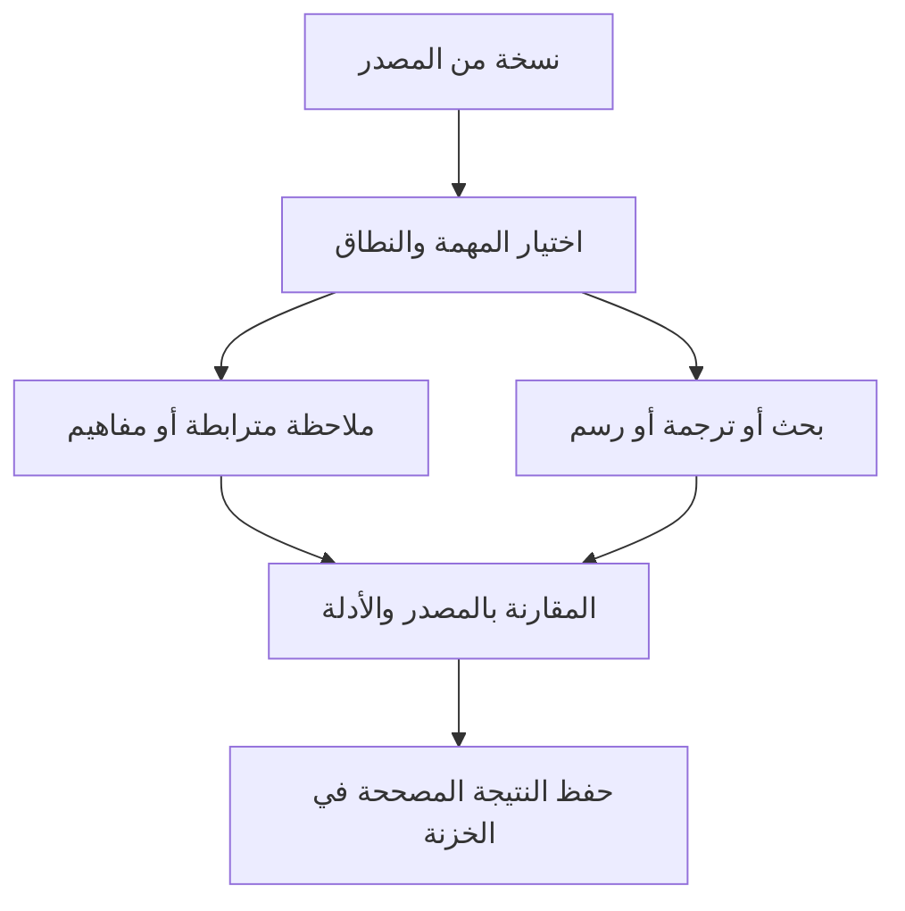

import TLDR from '@site/src/components/TLDR';

# دليل إدارة المعرفة بالذكاء الاصطناعي في Obsidian

<TLDR>
يميّز سير المعرفة المفيد بين المصدر وناتج النموذج وتصحيحاتك. يقدم Notemd ربطًا واستخراجًا وبحثًا وترجمة ورسومًا في ملفات قابلة للفحص. تحقق من مصدر واحد ثم أتمت مجلدًا محدود النطاق.
</TLDR>

## حدد النتيجة

اختر ما تحتاجه: ملاحظة قراءة مترابطة أو مجموعة مفاهيم أو خلاصة بمصادر أو ترجمة أو رسم. زيادة الملفات والروابط لا تحسن الفهم أو الاسترجاع تلقائيًا. حدد كيف ستفحص الصحة وتعثر على المادة لاحقًا.

## المسار الكامل


```mermaid
flowchart TD
    A[نسخة من المصدر] --> B[اختيار المهمة والنطاق]
    B --> C[ملاحظة مترابطة أو مفاهيم]
    B --> D[بحث أو ترجمة أو رسم]
    C --> E[المقارنة بالمصدر والأدلة]
    D --> E
    E --> F[حفظ النتيجة المصححة في الخزنة]
```

هذه مهام متاحة وليست وعدًا بأن زرًا افتراضيًا ينفذها كلها. احفظ الأصل وتحقق من وجهة كل مهمة قبل تركيب سلسلة.

## 1. روابط الويكي: إظهار العلاقات

جرّب **معالجة الملف (إضافة روابط)** وافحص `_processed.md` المجاور. راجع فائدة الأسماء كوجهات تنقل وأمانة الاقتباسات والشيفرة والمعادلات.

توجه تعليمات المجال والمرادفات النموذج ولا تفرض تكافؤ المفاهيم أو عتبة رقمية. اختر مطابقة العنوان الحتمية عندما تهمك النتائج القابلة للتكرار على أسماء موجودة.

[دليل الروابط](./features/wiki-links)

## 2. المفاهيم: فصل الاسم عن الشرح

حدد المجلد أولًا. ينشئ الاستخراج المستقل عناوين فقط ويبقي المصدر. للحصول على `Linked From` في ملفات جديدة، فعّل الروابط الخلفية وعطّل القالب الأدنى.

الاستخراج والتوليد عمليتان. قد يشمل **إنشاء جماعي من العناوين** ملفات مؤهلة سابقة وجديدة. جرّب مجلدًا مخصصًا وراجع انتقال complete.

مراجعة التكرار قرائن أسماء وليست تكافؤًا دلاليًا؛ تحقق قبل الحذف.

[دليل المفاهيم](./features/concept-notes)

## 3. البحث: الاحتفاظ بمسار الأدلة

حدد موضوعًا أو استخدم العنوان، واختر Tavily أو DuckDuckGo ثم **بحث وتلخيص**. غياب مفتاح Tavily لا يبدّل الخدمة. افتح URLs وراجع الادعاءات في الخلاصة الملحقة.

يمكن للاسترجاع المحلي تقديم مقاطع محددة. فهرسه لفظي وتُرسل المقاطع إلى LLM المختار؛ لذلك لا يعني الفهرس المحلي أن البحث بلا شبكة أو محصور بالجهاز.

[دليل البحث](./features/research)

## 4. الترجمة: مراجعة المعنى والبنية

اختر لغة الإخراج وترجم الملف. اللاحقة الافتراضية `_<language>.md` وقد تستبدل ملفًا موجودًا. للفقرة فقط أنشئ ملاحظة مؤقتة.

طابق المصطلحات والأرقام والشيفرة والروابط والرياضيات بالمصدر. التجزئة قد تفقد سياقًا؛ وجود 21 لغة للواجهة و34 مسارًا للموقع لا يثبت جودة زوج لغوي.

[دليل الترجمة](./features/translation)

## 5. الرسوم: اختيار منتج قابل للتحرير

اختر عدة أنواع من الرسوم في تشغيل واحد، وعدة صيغ إخراج لكل نوع بصورة مستقلة. إلغاء تحديد النوع يحفظ صيغه؛ وإذا لم تحدد أي نوع يُحلّل المحتوى تلقائيًا. مربع الاختيار يضم النوع إلى التوليد. انقر اسمه لتحديده وتعديل صيغه. المرور بالمؤشر أو تركيز لوحة المفاتيح يغيّر المعاينة دون حفظ الإعدادات. يغلق Escape القائمة ويعيد التركيز.

استخدم الخيارات المدعومة. CircuitikZ مقيد وله فحص تجميع مستقل. أسهم Drawnix الثابتة لا تضمن التصاقها بعد الترتيب. تتحسن جداول PowerPoint مع بقاء Mermaid وSVG عرضة للتصدير كصور.

[دليل الرسوم](./features/diagrams)

## 6. سير العمل: أتمتة ترتيب متحقق

يتكون من اسم و`::` ومعرّفات مفصولة بـ`>`. الافتراضي:

```text
One-Click Extract::process-current-add-links>batch-generate-from-titles>batch-mermaid-fix
```

ينفذ الربط والتوليد للمجلد وإصلاح Mermaid، ولا يضيف بحثًا عامًا أو توليد رسم. تحافظ الأفعال على متطلباتها وآثارها؛ ليست أنبوب نص اعتباطيًا.

السياسة الافتراضية التوقف عند فشل مُبلّغ عنه. تابع فقط إذا أمكن للخطوات المتبقية العمل على المتاح. يحفظ الإلغاء الناتج المكتمل ولا يتراجع عنه.

[دليل سير العمل](./features/workflows)

## 7. المزوّدون: مطابقة البروتوكول والعمل

تغطي الإعدادات الـ36 خمس عائلات. اختر بحسب العنوان المتاح وصلاحيات النموذج وسياسة البيانات والناتج المقاس. استخدم المصدر والمطالبة نفسيهما لمقارنة الوقت والتكلفة.

توجيه النماذج لكل مهمة معطل افتراضيًا؛ فعّله عند قصد استخدام ملفات مختلفة وافحص جميع المهام قبل اعتبار السلسلة محلية.

[دليل المزوّدين](./providers/overview)

## قائمة بداية عملية

1. ثبّت الإضافة وانسخ المصدر احتياطيًا.
2. اضبط النموذج والمزوّد الدقيقين واختبرهما.
3. اختر مجلد مفاهيم ووجهات مستقلة.
4. شغّل مهمة على نسخة.
5. قارن واحتفظ بالتصحيحات.
6. انتقل لمجلد صغير وافحص النتائج الجزئية قبل سلسلة أطول.

## أنماط استخدام

### معالجة ورقة علمية

حوّلها خارجيًا إلى Markdown وافحص أخطاء المعادلات والجداول والصور أولًا. استخرج مفاهيم أو نصوصًا، وابحث عن أسئلة محددة، ولا تولد رسمًا إلا لتوضيح علاقة يمكن التحقق منها. احتفظ بالرابط الأصلي والتصحيحات.

### صيانة مجموعة مفاهيم

استخدم مجلدًا خاصًا وراجع المصطلحات ثم ولد شرحًا لمجموعة مختارة. انسخ قبل التنظيف؛ كثرة المفاهيم لا تعوض التعريف الدقيق والتنقل المفيد.

### مواد خاصة

جهّز خادمًا محليًا ونماذجه واعتماداته، وافحص توجيه المهام وتجنب البحث الشبكي عند طلب التشغيل المنفصل. راجع التشخيص قبل المشاركة. عنوان loopback الافتراضي لا يمنع ضبط خادم بعيد.

### استرداد دفعة منقطعة

انتظر استقرار الإلغاء أو الفشل، واقرأ التقرير وافحص المكتمل ونسخ الاسترداد وقارن التعارضات ثم كرر المقصود فقط. لا تستنتج غياب الإخراج من الإلغاء أو تحذف مرافقات دون فحص مراجعها.

## الخطوات التالية

- [البداية السريعة](./getting-started/quick-start): مهمة كاملة.
- [الدفعات](./advanced/batch-processing): الاختيار وملكية الناتج.
- [المطوّر](./developers/overview): التنفيذ والتحقق.
- [الوكلاء](./agents/overview): العقد العام الحقيقي.
