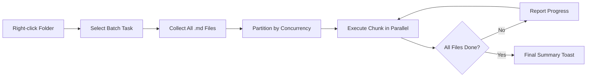

import TLDR from '@site/src/components/TLDR';

# ব্যাচ প্রক্রিয়াকরণ

<TLDR>
**Notemd কনফিগার করা যায় এমন কনকারেন্সি ও ওভাররাইট নিয়ন্ত্রণের মাধ্যমে একই অপারেশনে পুরো ফোল্ডারগুলো প্রক্রিয়াকরণ করে।** একটি ফোল্ডারে রাইট-ক্লিক করে উইকি-লিঙ্ক ব্যাচ-অ্যাড, ধারণা বের করা, গবেষণা করা অথবা সেখানে থাকা সমস্ত নোট অনুবাদ করা যায়। কনকারেন্সি সীমাবদ্ধতাগুলো API রেট-লিমিট ত্রুটি রোধ করে। প্রতিটি ফাইলের জন্য অগ্রগতি রিপোর্ট করা হয়। ওভাররাইট আচরণ কনফিগার করা যায়: বিদ্যমানগুলো এড়িয়ে যাওয়া, যোগ করা অথবা প্রতিস্থাপন করা। ব্যর্থ হওয়া ফাইলগুলো লগ করা হয় এবং ব্যাচটি বন্ধ হয় না.

এটি [Obsidian AI Knowledge Management Guide](/docs/pillar-ai-knowledge)-এর অংশ।
</TLDR>

## সংক্ষিপ্ত বিবরণ

ব্যাচ প্রক্রিয়াকরণ নোটগুলোর একটি ফোল্ডারকে একটি একক অপারেশনে রূপান্তরিত করে। প্রতিটি নোট খুলে আলাদাভাবে কমান্ড চালানোর পরিবর্তে, আপনি ফোল্ডারে রাইট-ক্লিক করে কাজটি নির্বাচন করেন। Notemd প্রতিটি `.md` ফাইল ঘুরে দেখে, নির্বাচিত অ্যাকশনটি প্রয়োগ করে এবং রিয়েল-টাইমে অগ্রগতি রিপোর্ট করে.

ভল্ট-ওয়াইড জ্ঞান বের করার জন্য এই ফিচারটি অপরিহার্য। উদাহরণস্বরূপ, ডজনখানেক PDF ইম্পোর্ট করার পর, ব্যাচ-অ্যাড-লিঙ্ক এবং তারপর ব্যাচ-এক্সট্রাক্ট-কনসেপ্ট ব্যবহার করে কয়েক মিনিটের মধ্যেই আপনার জ্ঞান গ্রাফ তৈরি হয়, ঘণ্টার পর নয়.

## এটি কীভাবে কাজ করে

### ব্যাচ এক্সিকিউশন মডেল

1. **ফাইল সংগ্রহ** -- Notemd লক্ষ্য ফোল্ডারটি রিকার্সিভভাবে (অথবা সেটিংস অনুযায়ী শুধুমাত্র টপ-লেভেলে) স্ক্যান করে এবং সমস্ত `.md` ফাইল সংগ্রহ করে.
2. **কনকারেন্সি পার্টিশনিং** -- `batchConcurrency` সেটিংস অনুযায়ী ফাইলগুলোকে চাঙ্কে ভাগ করা হয়। প্রতিটি চাঙ্ক সমান্তরালভাবে চলে; চাঙ্কগুলো ধারাবাহিকভাবে চলে.
3. **এক্সিকিউশন** -- প্রতিটি ফাইল একক-ফাইল কমান্ডের মতোই একই লজিক ব্যবহার করে প্রক্রিয়াকরণ করা হয়। প্রতি-টাস্ক প্রোভাইডার ও মডেল সেটিংস মেনে চলা হয়.
4. **অগ্রগতি রিপোর্টিং** -- প্রতিটি ফাইল শেষ হওয়ার পর একটি টোস্ট নোটিফিকেশন আপডেট হয়, যেখানে `N / Total` অগ্রগতি দেখানো হয়.
5. **ত্রুটি হ্যান্ডলিং** -- যদি কোনো ফাইল ব্যর্থ হয় (API ত্রুটি, নেটওয়ার্ক টাইমআউট ইত্যাদি), তবে ত্রুটিটি লগ করা হয় এবং ব্যাচটি চালিয়ে যাওয়া হয়। চূড়ান্ত সারসংক্ষেপে কোনো ব্যর্থ ফাইল তালিকাভুক্ত থাকে.
6. **সমাপ্তি** -- একটি সারসংক্ষেপ টোস্ট মোট প্রক্রিয়াকৃত, সফল ও ব্যর্থ ফাইলের সংখ্যা জানায়।

### ওভাররাইট বিহেভিয়ার

যখন এমন কোনো ফাইল প্রক্রিয়াকরণ করা হয় যেখানে ইতিমধ্যেই উইকি-লিঙ্ক, কনসেপ্ট নোট বা অনুবাদ রয়েছে, Notemd-এর আচরণ ওভাররাইট সেটিংয়ের উপর নির্ভর করে:

| মোড | বিহেভিয়ার |
|------|----------|
| **Skip** | বিদ্যমান কন্টেন্ট অপরিবর্তিত থাকে। শুধুমাত্র অপরিবর্তিত ফাইলগুলোই প্রক্রিয়াকৃত হয়. |
| **Append** (ডিফল্ট) | নতুন কন্টেন্ট যোগ করা হয়। বিদ্যমান উইকি-লিঙ্ক, কনসেপ্ট বা অনুবাদগুলো সংরক্ষিত থাকে. |
| **Replace** | ফাইলটি সম্পূর্ণরূপে পুনরায় প্রক্রিয়াকৃত হয়। পূর্ববর্তী সমস্ত Notemd পরিবর্তনগুলো ওভাররাইট হয়ে যায়. |

উইকি-লিঙ্কিংয়ের জন্য বিশেষভাবে: যদি কোনো নোটে ইতিমধ্যে `[[wiki-links]]` থাকে, তবে **skip** মোডটি সেটিকে অপরিবর্তিত রাখে, অন্যদিকে **replace** মোডটি সম্পূর্ণ নোটটিকে LLM-এ পাঠিয়ে নতুন লিঙ্ক যোগ করে। ধাপে ধাপে প্রক্রিয়াকরণের জন্য **skip** এবং মডেল আপগ্রেডের পর পুনরায় প্রক্রিয়াকরণের জন্য **replace** ব্যবহার করুন.

### কনকারেন্সি কন্ট্রোল

`batchConcurrency` সেটিংটি সমান্তরাল API কলগুলোকে সীমিত করে। এটি কঠোর কোটা সহ প্রদানকারীদের বিরুদ্ধে বড় ফোল্ডারগুলো প্রক্রিয়াকরণ করার সময় রেট-লিমিট ত্রুটি (HTTP 429) এড়ায়.

| কনকারেন্সি | সুপারিশকৃত জন্য | সাধারণ রেট-লিমিট প্রভাব |
|-------------|----------------|---------------------------|
| `1` | বিনামূল্যের টিয়ার, কঠোর প্রদানকারী | কিছুই নয় (সিরিয়াল) |
| `3` (ডিফল্ট) | বেশিরভাগ ক্লাউড প্রদানকারী | নিম্ন |
| `5` | Ollama (লোকাল), উদার টিয়ার | কিছুই নয় / নিম্ন |
| `10` | দ্রুত ইনফারেন্স সহ লোকাল মডেল | কিছুই নয় |

ব্যাচ প্রক্রিয়াকরণের সময় যদি 429 ত্রুটি দেখা দেয়, তবে কনকারেন্সি 1 বা 2-এ কমিয়ে দিন.

## কনফিগারেশন

| সেটিং | ডিফল্ট | প্রভাব |
|---------|---------|--------|
| `batchConcurrency` | `3` | ফোল্ডার অপারেশনের সময় সর্বোচ্চ সমান্তরাল API কল |
| `batchOverwriteExisting` | `false` | বিদ্যমান Notemd কন্টেন্টকে ওভাররাইট করুন। `false` = অ্যাপেন্ড মোড। |
| `batchSkipProcessed` | `false` | যেসব ফাইলে ইতিমধ্যে Notemd মার্কার রয়েছে সেগুলো বাদ দিন (যেমন, wiki-লিঙ্কস) |
| `batchRecursive` | `true` | ফোল্ডার স্ক্যান করার সময় সাবডিরেক্টরিগুলো অন্তর্ভুক্ত করুন |
| `enableStableApiCall` | `false` | ব্যাচ প্রক্রিয়াকরণের সময় প্রতিটি ফাইলের জন্য রিট্রাই লজিক সক্রিয় করুন (সর্বোচ্চ ৪টি চেষ্টা) |

### ব্যাচে পার-টাস্ক মডেলসমূহ

প্রতিটি ব্যাচ অপারেশন সংশ্লিষ্ট পার-টাস্ক মডেল ব্যবহার করে। batch-add-links এ `addLinksProvider` ব্যবহৃত হয়, batch-research এ `researchProvider` ব্যবহৃত হয়, ইত্যাদি। এর অর্থ হলো আপনি বিপুল পরিমাণের অপারেশনের জন্য সস্তা মডেল ব্যবহার করতে পারেন এবং গুণমান-সংবেদনশীল কাজের জন্য ব্যয়বহুল মডেল সংরক্ষণ করতে পারেন.

## উদাহরণ

আপনার কাছে `papers/` নামে একটি ফোল্ডার রয়েছে যেখানে ৪০টি ইম্পোর্ট করা গবেষণা নোট রয়েছে। আপনি সেগুলোর সবগুলোতে wiki-লিঙ্ক যোগ করতে এবং ধারণাগুলো বের করতে চান:

1. ডান-ক্লিক করুন `papers/` ফোল্ডারে
2. **"Notemd: Process folder (add links)"** নির্বাচন করুন
3. Notemd ফোল্ডারটি স্ক্যান করে, 40টি `.md` ফাইল খুঁজে পায় এবং ডিফল্ট কনকারেন্সি অনুযায়ী প্রতি বার 3টি করে প্রক্রিয়া করে
4. একটি প্রগ্রেস টোস্ট দেখায়: `12/40 files processed...`
5. প্রায় 3 মিনিট পর, একটি সারসংক্ষেপ টোস্ট রিপোর্ট করে: `39 succeeded, 1 failed (API timeout on paper-37.md)`
6. সমস্ত 40টির জন্য কনসেপ্ট নোট তৈরি করতে **"Notemd: Process folder (extract concepts)"** ব্যবহার করে পুনরাবৃত্তি করুন

যে ফাইলটি ব্যর্থ হয়েছে সেটি লগ করা হয়। পরে আপনি শুধুমাত্র সেই ফাইলটির জন্যই পুনরায় চালাতে পারেন.

## টিপস

- **কম কনকারেন্সি দিয়ে শুরু করুন** -- যদি আপনি আপনার প্রোভাইডারের রেট-লিমিট সম্পর্কে নিশ্চিত না হন, তবে `1` দিয়ে শুরু করুন এবং ধীরে ধীরে বাড়ান.
- **ইনক্রিমেন্টাল আপডেটের জন্য স্কিপ মোড ব্যবহার করুন** -- প্রথম পূর্ণ ব্যাচের পর, `batchSkipProcessed: true`-এ সুইচ করুন যাতে পরবর্তী রানগুলিতে শুধুমাত্র নতুন নোটগুলি প্রক্রিয়া করা হয়.
- **স্থিতিশীল API কল সক্রিয় করুন** -- `enableStableApiCall: true` দীর্ঘ ব্যাচের সময় অস্থায়ী নেটওয়ার্ক ত্রুটি থেকে পুনরুদ্ধার করার জন্য রিট্রাই লজিক যোগ করে.
- **মডেল আপগ্রেডের পর পুনরায় চালান** -- যদি আপনি একটি ভালো মডেলে সুইচ করেন, তবে `batchOverwriteExisting: true` সেট করুন এবং উন্নত লিঙ্ক ও কনসেপ্ট পাওয়ার জন্য পুনরায় চালান.

---

## পরবর্তী ধাপসমূহ

- [Workflows](/docs/features/workflows) -- এক-ক্লিক সাইডবার বাটনে ব্যাচ টাস্কগুলোকে চেইন করুন
- [Custom Prompts](/docs/advanced/custom-prompts) -- ব্যাচ এক্সট্রাকশনের জন্য প্রম্পটগুলো কাস্টমাইজ করুন
- [Troubleshooting](/docs/advanced/troubleshooting) -- ব্যাচ রানের সময় রেট-লিমিট এরর ও কানেকশন ফেইলিউর সংশোধন করুন
- [LLM প্রদানকারীগণ](/docs/providers/overview) -- প্রতি-টাস্ক মডেল কনফিগারেশন রেফারেন্স
