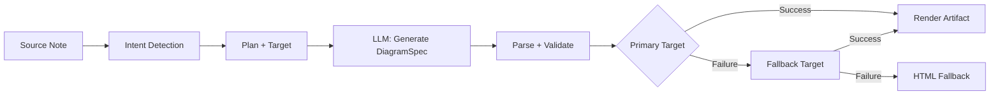
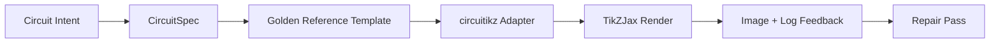

import TLDR from '@site/src/components/TLDR';

# ডায়াগ্রাম

<TLDR>
**Notemd একটি স্পেসিফিকেশন-প্রথম পাইপলাইনের মাধ্যমে আপনার নোটগুলি থেকে ডায়াগ্রাম তৈরি করে।** LLM একটি রেন্ডারার-নিরপেক্ষ `DiagramSpec` JSON তৈরি করে, এরপর বিশেষায়িত অ্যাডাপ্টারগুলি এটিকে Mermaid, JSON Canvas, Vega-Lite, HTML, সম্পাদনযোগ্য HTML/SVG, Draw.io, Drawnix, অথবা সীমিত circuitikz আউটপুটে রূপান্তর করে। এটি ৯টি ইন্টেন্ট টাইপ, স্বয়ংক্রিয় ফলব্যাক চেইন, SVG/PNG/PDF এক্সপোর্টসহ লাইভ প্রিভিউ, সেমান্টিক ভেরিফিকেশন, এবং লোকাল-নলেজ-অগমেন্টেড জেনারেশন সমর্থন করে।
</TLDR>

এটি [Obsidian AI Knowledge Management Guide](/docs/pillar-ai-knowledge)-এর অংশ।

## আর্কিটেকচার: নির্দেশনা-প্রথম পাইপলাইন

Notemd কখনোই LLM কে সরাসরি Mermaid/Vega/Canvas সিনট্যাক্স তৈরি করতে বলে না। বরং:



**নির্দেশনা-প্রথম কেন?** LLM গুলি প্রায়ই অকার্যকর রেন্ডারার সিনট্যাক্স তৈরি করে (Mermaid বিশেষভাবে)। একটি কাঠামোগত `DiagramSpec` রেন্ডারিংয়ের আগে যাচাই করা যায়, এবং একই নির্দেশনা ফলব্যাক হিসেবে একাধিক রেন্ডারারকে সরবরাহ করতে পারে.

## সমর্থিত ডায়াগ্রাম টাইপ

| ইন্টেন্ট | প্রাথমিক রেন্ডারার | ফলব্যাকসমূহ | ব্যবহারের ক্ষেত্র |
|--------|-----------------|-----------|----------|
| `mindmap` | Mermaid | HTML | হায়ারার্কিক্যাল টপিক ব্রেকডাউন |
| `flowchart` | Mermaid | HTML | প্রক্রিয়া ফ্লো, ডিসিশন ট্রি |
| `sequence` | Mermaid | HTML | ক্লায়েন্ট-সার্ভার ইন্টারঅ্যাকশন, প্রোটোকল |
| `classDiagram` | Mermaid | HTML | OOP ক্লাস সম্পর্কসমূহ |
| `erDiagram` | Mermaid | HTML | ডেটাবেস স্কিমা, এন্টিটি রিলেশনশিপ |
| `stateDiagram` | Mermaid | HTML | স্টেট মেশিন, লাইফসাইকেল মডেল |
| `canvasMap` | JSON Canvas | Mermaid → HTML | কনসেপ্ট ম্যাপ, নলেজ গ্রাফ |
| `dataChart` | Vega-Lite | Mermaid → HTML | বার, লাইন, এরিয়া, স্ক্যাটার, পাই, টেবিল |
| `circuit` | circuitikz | none | যাচাইকৃত `CircuitSpec` পেলোড থেকে সীমিত circuitikz ডায়াগ্রাম |

## ইন্টেন্ট ডিটেকশন

Notemd কীওয়ার্ড স্কোরিং ব্যবহার করে আপনার নোটের বিষয়বস্তু থেকে সর্বোত্তম ডায়াগ্রাম ধরণ নির্ধারণ করে:

| ইন্টেন্ট | ট্রিগার | কনফিডেন্স |
|--------|----------|------------|
| `dataChart` | টেবিল, সংখ্যাসূচক সেল, মেট্রিক/ট্রেন্ড কীওয়ার্ড, শতাংশ | 0.88 |
| `sequence` | রিকোয়েস্ট/রেসপন্স ভোকাবুলারি (৪+ ম্যাচ) অথবা `->`/`=>` মার্কার | 0.82 |
| `erDiagram` | প্রাইমারি কী, ফরেন কী, এন্টিটি, স্কিমা (২+ ম্যাচ) | 0.80 |
| `stateDiagram` | স্টেট, ট্রানজিশন, পেন্ডিং, রানিং, ফেইলড (৩+ ম্যাচ) | 0.76 |
| `flowchart` | নম্বরযুক্ত ধাপ (২+) অথবা if/then/else/workflow ভোকাবুলারি | 0.74 |
| `canvasMap` | কনসেপ্ট ম্যাপ, নলেজ গ্রাফ, স্পেশিয়াল, ক্লাস্টার | 0.72 |
| `circuit` | circuitikz, TikZJax, circuit, schematic, CMOS, NMOS, PMOS, MOSFET, VDD/GND, `vin`/`vout` | 0.78 |
| `mindmap` | ডিফল্ট ফলব্যাক | 0.55 |

**Preferred diagram type** সেটিং, সাইডবার সিলেক্টর, অথবা একটি স্পষ্ট কমান্ড প্যালেট অপশন দিয়ে ওভাররাইড করুন.

## Render Target Selection

পরীক্ষামূলক spec-first পাইপলাইনে এখন দুটি স্বাধীন কন্ট্রোল রয়েছে:

প্ল্যানারের ডিফল্ট হিসেবে **Preferred render target**-কে **Auto** এ সেট করুন, অথবা সরাসরি Mermaid, JSON Canvas, Vega-Lite, HTML, Editable HTML/SVG, Draw.io, Drawnix, অথবা Circuitikz নির্বাচন করুন। এই ওভাররাইডটি শুধুমাত্র আর্টিফ্যাক্ট ও প্রিভিউ কমান্ডগুলির জন্যই প্রযোজ্য। স্ট্যান্ডার্ড **Summarise as Mermaid diagram** কমান্ডটি Mermaid-সামঞ্জস্যপূর্ণ আউটপুটের জন্য স্থির থাকে, যাতে বিদ্যমান Markdown ওয়ার্কফ্লোগুলি নীরবে ফরম্যাট পরিবর্তন না করে।

এই পৃথকীকরণটি গুরুত্বপূর্ণ, কারণ এখন `flowchart` ইন্টেন্টকে Markdown নোটের জন্য Mermaid হিসেবে, শক্তিশালী ফলব্যাকের জন্য HTML হিসেবে, পরবর্তী সম্পাদনার জন্য Editable HTML/SVG হিসেবে, অথবা SVG রিভিউ সহ Draw.io/Drawnix সোর্স আর্টিফ্যাক্ট হিসেবে রেন্ডার করা যায়। `circuit` ইন্টেন্টটি Circuitikz-এ পাঠানো হয় এবং এর জন্য একটি যাচাইকৃত `CircuitSpec` প্রয়োজন; এটি যেকোনো ধরনের TikZ টেক্সটের অনুরোধ নয়।
## ব্যবহার

### Generate a Diagram

1. একটি নোট খুলুন
2. কমান্ড প্যালেট থেকে **"Notemd: Generate diagram"** চালান
3. Notemd ইন্টেন্ট সনাক্ত করে, স্পেক জেনারেট করে, রেন্ডার করে এবং আর্টিফ্যাক্ট সংরক্ষণ করে

**Output files by target:**

| লক্ষ্য | এক্সটেনশন | ফাইলনাম প্যাটার্ন |
|--------|-----------|------------------|
| Mermaid | `.md` | `{note}_summ.md` |
| JSON Canvas | `.canvas` | `{note}_diagram.canvas` |
| Vega-Lite | `.json` | `{note}_diagram.json` |
| HTML | `.html` | `{note}_diagram.html` |
| Editable HTML/SVG | `.html` | `{note}_diagram.html` |
| Draw.io | `.drawio` + `.drawio.svg` + `.drawio.md` | `{note}_diagram.drawio` এবং পর্যালোচনা-সংক্রান্ত ফাইলসমূহ |
| Drawnix | `.drawnix` + `.drawnix.svg` + `.drawnix.md` | `{note}_diagram.drawnix` এবং পর্যালোচনা-সংক্রান্ত ফাইলসমূহ |
| Circuitikz | `.tex` + `.tex.svg` + `.tex.md` | `{note}_diagram.tex` এবং পর্যালোচনা-সংক্রান্ত ফাইলসমূহ |

### ডায়াগ্রাম প্রিভিউ করুন

1. Run **"Notemd: Preview diagram"**
2. রেন্ডার করা ডায়াগ্রামসহ একটি মডাল খুলবে
3. টুলবারের বাটনগুলি ব্যবহার করে SVG, PNG, অথবা PDF আকারে এটি এক্সপোর্ট করুন

**Auto-open preview** সেটিংসে উপলব্ধ — জেনারেশনের পর, প্রিভিউ মডালটি স্বয়ংক্রিয়ভাবে চালু হয়.

PNG এবং PDF প্রিভিউ এক্সপোর্টের জন্য কনফিগার করা প্রিভিউ PPI ব্যবহৃত হয়। ডিফল্টভাবে এটি 300 PPI এবং 600 PPI-এর বেশি মানগুলো 600-এ সীমাবদ্ধ করা হয়। SVG-এর আকার ভেক্টর অবস্থায়ই থাকে। `.drawio`, `.drawnix`, এবং `.tex` এর মতো সোর্স আর্টিফ্যাক্টগুলো একটি `previewSvg` ফাইল সরবরাহ করতে পারে, যাতে Obsidian ডায়াগ্রাম.net, Drawnix, LaTeX, অথবা TikZJax-কে প্লাগইনের রানটাইমে এম্বেড না করেই পর্যালোচনার জন্য উপযোগী ছবিগুলো দেখাতে ও এক্সপোর্ট করতে পারে।

প্রিভিউ মডালেও একটি ‘artifact diagnostics’ প্যানেল রয়েছে। রেন্ডারার এবং স্মোক চেকগুলি `RenderArtifact.diagnostics` যুক্ত করতে পারে; মডালটি প্রিভিউটির পাশে ত্রুটি/সতর্কতা/তথ্যের সংখ্যা, এরপর গুরুত্বের মাত্রা, ডায়াগনস্টিকের ধরণ, বার্তা এবং মেরামতের পরামর্শসহ একটি ডায়াগনস্টিক সারসংক্ষেপ দেখায়। ডায়াগনস্টিক-সচেতন হিস্ট্রি এন্ট্রিগুলিতেও একই সারসংক্ষেপ দেখানো হয়, ফলে প্রতিটি এন্ট্রি খোলা ছাড়াই বারবার করা circuitikz স্মোক চেষ্টাগুলি তুলনা করা যায়। যেসব আর্টিফ্যাক্টের সোর্স কন্টেন্ট রয়েছে কিন্তু সেগুলি ইনলাইনে বা HTML iframe পথের মাধ্যমে রেন্ডার করা যায় না, সেক্ষেত্রে মডালটি এখন খালি iframe বাধ্য করার পরিবর্তে শুধুমাত্র সোর্স-ভিত্তিক প্রিভিউ ব্যবহার করে। এর ফলে circuitikz কম্পাইল/রেন্ডার স্মোক, SVG টেক্সট-টোকেন চেক, PNG খালি-স্ক্রিনশট চেক, শুধুমাত্র পাথ-ভিত্তিক গ্লিফ ওভারল্যাপ রিপোর্ট এবং ভবিষ্যতের ওভারল্যাপ রিপোর্টগুলির জন্য একটি দৃশ্যমান UI সুবিধা পাওয়া যায়; আর এতে TikZJax বা LaTeX-কে কঠোরভাবে প্লাগইন রানটাইম ডিপেন্ডেন্সি হিসেবে ব্যবহার করা হয় না, অথবা সোর্স টেক্সটকে যাচাইকৃত ভিজ্যুয়াল রেন্ডার হিসেবে ধরে নেওয়া হয় না।

### লেগাসি Mermaid মোড

যখন `enableExperimentalDiagramPipeline` বন্ধ থাকে, Notemd সরাসরি Mermaid প্রম্পটটি LLM-এ পাঠায়। এটি স্পেসিফিকেশন পাইপলাইনকে সম্পূর্ণভাবে এড়িয়ে যায়। যদি পরীক্ষামূলক পাইপলাইন ব্যর্থ হয়, তবে এই মোডে ফিরে যাওয়া হয়.

## রেন্ডারিং ব্যাকএন্ডস

### Mermaid

6টি অ্যাডাপ্টার (মাইন্ডম্যাপ, ফ্লোচার্ট, সিকোয়েন্স, ER, ক্লাস, স্টেট) `DiagramSpec` কে Mermaid সিনট্যাক্সে রূপান্তর করে। জেনারেশনের পর, `mermaid.parse()` আউটপুটটি ভ্যালিডেট করে। যদি ভ্যালিডেশন ব্যর্থ হয়:

1. **LLM retry** — Mermaid এর ত্রুটি বার্তাকে কনটেক্সট হিসেবে ব্যবহার করে একটি চেষ্টা
2. **Minimal fallback** — স্পেসিফিকেশন নোড ID থেকে একটি সাধারণ Mermaid ডায়াগ্রাম

**Legacy Mermaid Fixer** স্বয়ংক্রিয়ভাবে সাধারণ LLM সিনট্যাক্স ত্রুটিগুলো মেরামত করে: note directive normalization, pipe-label escaping, semicolon repositioning, smart quotes, double-dash arrows, shape mismatches, এবং আরও অনেক কিছু.

### JSON Canvas

Obsidian JSON Canvas ফরম্যাটে স্পেশিয়াল লেআউট তৈরি করে:
- Nodes positioned by depth (x = depth × 420) and index (y = index × 170)
- Width estimated from label length
- Edges with `fromSide: 'right'`, `toSide: 'left'`, `toEnd: 'arrow'`

### Vega-Lite

স্বয়ংক্রিয় এনকোডিংসহ সম্পূর্ণ Vega-Lite v5 JSON specs তৈরি করে:
- **Cartesian charts** (bar/line/area/point/scatter): x + y channels + color for multi-series
- **Pie**: theta = y (quantitative), color = x (nominal)
- **Table**: row = x, text = y + column = series

কম্পাইল করার আগে Dark and light theme patches গভীরভাবে মার্জ করা হয়.

### HTML

Universal fallback. Self-contained HTML document with:
- CSP meta headers
- Light/dark mode via `prefers-color-scheme`
- 20টি লোকেলের জন্য Localized UI labels
- Sections: hero, structure (node tree), relationships, callouts, data series tables

### Editable HTML/SVG

সম্পাদনযোগ্য এক্সপোর্ট ওয়ার্কফ্লোর জন্য স্পষ্ট ফিগার লক্ষ্য। এটি `DiagramSpec` কে একটি নির্ধারিত `SemanticFigureModel` এ রূপান্তরিত করে, তারপর অন্তর্নির্মিত HTML ডকুমেন্ট তৈরি করে যেখানে ইনলাইন SVG গ্রুপগুলো Draw.io-স্টাইলের অ্যানোটেশন বহন করে:

- `data-drawio-type`, `data-drawio-id`, এবং `data-drawio-role` সেমান্টিক নোডগুলোতে
- `data-drawio-source` এবং `data-drawio-target` সেমান্টিক এডজগুলোতে
- হোয়াইটস্পেস নরমালাইজেশন ও কলিজন হ্যান্ডলিংয়ের পর স্থিতিশীল নোড/এডজ আইডেন্টিফায়ার
- কোনো স্ক্রিপ্ট, কোনো বাহ্যিক ফন্ট, এবং কোনো রিমোট অ্যাসেট নেই

এই লক্ষ্যটি ইচ্ছাকৃতভাবে এখনও ডিফল্ট প্ল্যানার রুট নয়। পণ্যের পথটি বাস্তব টুলগুলোতে সম্পাদনা আচরণ প্রমাণ করার সময় এটি একটি স্পষ্ট রেন্ডার লক্ষ্য হিসেবে উপলব্ধ থাকে.

### Draw.io এবং Drawnix এক্সপোর্ট বাউন্ডারিজ

বর্তমান বাস্তবায়নটি আর্টিফ্যাক্টের সীমানায় থার্ড-পার্টি এডিটরগুলোর সমর্থন বজায় রাখে, তবুও স্পষ্ট রেন্ডার টার্গেটগুলো প্রদান করে:

| লক্ষ্য | চুক্তি | রানটাইম নির্ভরতা |
|--------|----------|--------------------|
| Draw.io | `SemanticFigureModel` থেকে পাওয়া ডিটারমিনিস্টিক, আনকম্প্রেসড `mxfile` XML, পাশাপাশি SVG/PNG/PDF রিভিউ ফাইলগুলো | প্লাগইন রানটাইম বা CI-তে কিছুই নেই |
| Drawnix | `geometry` এবং `arrow-line` এলিমেন্ট ব্যবহার করে তৈরি ন্যূনতম `.drawnix` JSON সাবসেট, পাশাপাশি SVG/PNG/PDF রিভিউ ফাইলগুলো | প্লাগইন রানটাইম বা CI-তে কিছুই নেই |

এই সমঝোতাটি ইচ্ছাকৃত: Notemd ডায়াগ্রাম.net Desktop, Drawnix, Plait, অথবা শুধুমাত্র ব্রাউজার-ভিত্তিক এডিটর স্টেটকে প্লাগইনে অন্তর্ভুক্ত না করেও দৃশ্যমান লেবেল, স্থিতিশীল ID, এবং সমর্থিত প্রিমিটিভ কভারেজ যাচাই করতে পারে।

### circuitikz / TikZJax দিক

সার্কিট ডায়াগ্রামগুলি সাধারণ ফ্লোচার্টের মতো একই সমস্যা নয়। বৈদ্যুতিক সার্কিটের জন্য সঠিক সিনট্যাক্স লক্ষ্য সাধারণত **circuitikz** হয়, যা Obsidian-এ TikZJax এর মতো প্লাগইনগুলির মাধ্যমে রেন্ডার করা হয়। TikZJax `circuitikz`, `pgfplots`, `tikz-cd` এবং `chemfig` এর মতো প্যাকেজগুলি লোড করতে পারে, যা পদার্থবিজ্ঞান, সার্কিট, রসায়ন এবং গণিতের নোটগুলির জন্য এটিকে আকর্ষণীয় করে তোলে.

ঝুঁকিটি হল যে খাঁটি LLM-দ্বারা তৈরি TikZ খুবই ভঙ্গুর হয়:

- জটিল সার্কিট টোপোলজি বৈদ্যুতিকভাবে সঠিক হলেও দৃশ্যতভাবে অপঠনীয় হতে পারে;
- ওভারল্যাপিং ওয়্যার এবং লেবেলগুলি একটি সঠিক নেটলিস্টকে অধ্যয়নের নোটের জন্য ব্যবহার করা অসম্ভব করে তুলতে পারে;
- প্যাকেজ প্রিয়াম্বলগুলি না থাকা, ভুল অ্যাঙ্কর বা অবৈধ কম্পোনেন্ট নামগুলি রেন্ডারিংকে বাধা দিতে পারে;
- রেন্ডারার থেকে ফিডব্যাক সাধারণত ছবি-স্তরে থাকে, অন্যদিকে LLM দ্বারা তৈরি টেক্সট-স্তরের জ্যামিতি থাকে.

আরও ভাল আর্কিটেকচার হল circuitikz কে একটি সীমিত ডায়াগ্রাম লক্ষ্য হিসেবে বিবেচনা করা, ফ্রি-ফর্ম প্রম্পট হিসেবে নয়:



প্রথম-শ্রেণীর মডেলটি সার্কিট টোপোলজি এবং লেআউটকে আলাদাভাবে বর্ণনা করা উচিত:

| স্তর | দায়িত্ব | উদাহরণ |
|-------|----------------|---------|
| টোপোলজি | বৈদ্যুতিক নোড এবং কম্পোনেন্ট সংযোগ | `VDD -> RD -> drain(M1)`, `source(M1) -> GND` |
| লেআউট | গ্রিড স্থাপন, অরিয়েন্টেশন, রাউটিং লেন | `M1 at (3,2.2)`, ইনপুট বামে, আউটপুট ডানে |
| স্টাইল | প্যাকেজ, ভোল্টেজ কনভেনশন, লেবেল, অ্যাঙ্কর | `\begin{circuitikz}[american voltages]` |
| বৈধতা যাচাই | কম্পাইল লগ, অনুপস্থিত অ্যাঙ্কর, ওভারল্যাপ/স্ক্রিনশট চেকস | TikZJax/LaTeX ডায়াগনস্টিক্স প্লাস ভিজ্যুয়াল রিভিউ |

### বর্তমান circuitikz প্রোটোটাইপ

Notemd-এ এখন এই দিকের জন্য প্রথম সীমাবদ্ধ রিপোজিটরি প্রোটোটাইপ অন্তর্ভুক্ত রয়েছে। এটি ইচ্ছাকৃতভাবে অফলাইন এবং টেমপ্লেট-সীমাবদ্ধ:

```bash
npm run diagram:export-circuitikz -- --input cmos-inverter.json --output cmos-inverter.tex
```

এই প্রোটোটাইপটি ছয়টি ‘গোল্ডেন-রেফারেন্স’ ফ্যামিলির জন্য একটি সীমাবদ্ধ `CircuitSpec` সীমানা এবং ডিটারমিনিস্টিক এক্সপোর্টার যোগ করে:

পরীক্ষামূলক ডায়াগ্রাম পাইপলাইনে, `intent: "circuit"` এবং রেন্ডার টার্গেট `circuitikz` এর মাধ্যমেও এটি এখন অ্যাক্সেসযোগ্য। তৈরি হওয়া `DiagramSpec` শুধুমাত্র ‘circuit’ ইন্টেন্টের জন্যই `circuitSpec` অন্তর্ভুক্ত করতে পারে। `CircuitikzRenderer` একই ডিটারমিনিস্টিক `.tex` সোর্স লেখে এবং ঐ যাচাইকৃত সার্কিট টোপোলজি থেকে তৈরি একটি SVG প্রিভিউ ফাইল যুক্ত করে, যা Obsidian প্রিভিউ এবং SVG/PNG/PDF এক্সপোর্ট উভয়ই সম্ভব করে। এই প্রিভিউ ফাইলটি LaTeX/TikZJax কম্পাইলের ফলাফল নয়; প্রকৃত রেন্ডারারের প্রমাণগুলো এখনও নিচে উল্লিখিত স্পষ্ট ‘স্মোক’ কমান্ডগুলোর মধ্যেই থাকে।

যেসব সমর্থিত ‘গোল্ডেন’ টেমপ্লেট রয়েছে, সেগুলোর জন্য `layoutHints.inputSide` এবং `layoutHints.outputSide` শুধুমাত্র প্রেজেন্টেশন-সংক্রান্ত নিয়ন্ত্রণ হিসেবেই থাকে। এগুলো ডিটারমিনিস্টিকভাবে ইনপুট/আউটপুট পোর্টের অবস্থান পরিবর্তন করতে পারে, কিন্তু এগুলো টোপোলজির সিগনেচার পরিবর্তন করে না এবং সার্কিটটিকে পুনর্সংযোগ করার জন্য কোনো ‘রিপেয়ার পাস’ অনুমতি দেয় না।

| সার্কিটের ধরন | গোল্ডেন রেফারেন্স | বর্তমান ওয়ারেন্টি |
|--------------|------------------|-------------------|
| `common-source-amplifier` | `common-source-nmos-v1` | LaTeX লেখার আগে `VDD -> R_D -> M1.D`, `vin -> M1.G`, `M1.S -> GND`, এবং `M1.D -> vout` যাচাই করা হয়। |
| `cmos-inverter` | `cmos-inverter-v1` | LaTeX লেখার আগে PMOS-over-NMOS topology, shared gate input, shared drain output, `VDD -> MP.S`, এবং `MN.S -> GND` এর বৈধতা যাচাই করা হয়। |
| `cmos-buffer` | `cmos-buffer-v1` | LaTeX লেখার আগে দুটি ক্যাসকেডেড ইনভার্টার স্টেজ, মধ্যবর্তী নোড `vmid`, পুনরুদ্ধারকৃত `vout`, এবং শেয়ার্ড VDD/GND রেলগুলো যাচাই করা হয়। |
| `cmos-transmission-gate` | `cmos-transmission-gate-v1` | LaTeX লেখার আগে `vin` এবং `vout`-এর মধ্যে থাকা সমান্তরাল PMOS/NMOS পাস ডিভাইসগুলোকে পরস্পর পরিপূরক `phib` / `phi` নিয়ন্ত্রণের মাধ্যমে যাচাই করা হয়। |
| `cmos-nand2` | `cmos-nand2-v1` | LaTeX লেখার আগে প্যারালাল PMOS পুল-আপ, সিরিজ NMOS পুল-ডাউন, ডুয়াল ইনপুট `va` / `vb`, এবং `vout` এর বৈধতা যাচাই করা হয়। |
| `cmos-nor2` | `cmos-nor2-v1` | LaTeX লেখার আগে series PMOS pull-up, parallel NMOS pull-down, dual inputs `va` / `vb`, এবং `vout` এর বৈধতা যাচাই করা হয়। |

এটি কোনো সাধারণ TikZ জেনারেটর নয়। এটি যেকোনো ধরনের TikZ ফাইল গ্রহণ করে না, LaTeX কম্পাইল করে না, TikZJax ব্যবহার করে না, প্লাগইন রানটাইমে স্ক্রিনশট পরীক্ষা করে না, অথবা স্বয়ংক্রিয়ভাবে ছবি-ফিডব্যাক ব্যবহার করে সার্কিটটি মেরামত করে না। এসব কাজ পরবর্তী ধাপগুলোতে সম্পন্ন হয়।

Preview diagram কমান্ডটি ফাইলের এক্সটেনশন `.tex` বা `.tikz` হলে এবং সোর্সে `\usepackage{circuitikz}` বা `\begin{circuitikz}` থাকলে সংরক্ষিত circuitikz সোর্স আর্টিফ্যাক্টগুলোকে সরাসরি পুনরায় খুলতে পারে। এই পদ্ধতিটি হলো একটি circuitikz শুধুমাত্র-সোর্স ভিত্তিক প্রিভিউ: মডালটি সোর্স, ডায়াগনস্টিক্স, কপি/সেভ নিয়ন্ত্রণ এবং হিস্ট্রি মেটাডেটা দেখায়, কিন্তু প্লাগইন রানটাইমের মধ্যে LaTeX কম্পাইল করে না বা TikZJax কল করে না।

একই সোর্স-ওনলি প্রিভিউ সীমানা এখন সংরক্ষিত Draw.io এবং Drawnix আর্টিফ্যাক্টগুলোকেও অন্তর্ভুক্ত করে। `.drawio` ফাইলগুলো Draw.io XML (`mxfile` বা `mxGraphModel`) এর মতো দেখালে গ্রহণযোগ্য, আর `.drawnix` ফাইলগুলো Drawnix JSON এর সাথে `type: "drawnix"` এবং একটি `elements` অ্যারে থাকলে গ্রহণযোগ্য। প্লাগইনটি এখনও diagrams.net বা Drawnix হোয়াইটবোর্ড হোস্টকে অন্তর্ভুক্ত করে না; এই প্রিভিউগুলো কোনো ইন-প্লাগইন ভিজ্যুয়াল এডিটর দাবি না করেই সোর্স, ডায়াগনস্টিক্স এবং আর্টিফ্যাক্টের ইতিহাস প্রদর্শন করে।

টোপোলজি-সংরক্ষণকারী মেরামতের জন্য, মেরামতকৃত প্রার্থীকে গ্রহণ করার আগে রেফারেন্স হিসেবে প্রি-রিপেয়ার স্পেসিফিকেশনটি পাঠান:

```bash
npm run diagram:export-circuitikz -- --input repaired-cmos-inverter.json --topology-reference cmos-inverter.json --output cmos-inverter.tex
```

রিপেয়ার গার্ড আউটপুট দেওয়ার আগে `circuitKind`, `goldenReferenceId`, নেটগুলি, কম্পোনেন্টের আইডি/টাইপ/টার্মিনালস, এবং অনির্দেশিত কানেকশন এন্ডপয়েন্টগুলি তুলনা করার জন্য `createCircuitTopologySignature` এবং `assertCircuitTopologyUnchanged` ব্যবহার করে। লেবেল, শিরোনাম টেক্সট, লেআউট হিন্টস, কানেকশন অর্ডার, এবং কানেকশন লেবেলগুলি ইচ্ছাকৃতভাবে উপেক্ষা করা হয়। যেসব ক্যান্ডিডেট সংক্ষিপ্ত কিছু যোগ করে বা কোনো টার্মিনালের ওয়্যারিং পরিবর্তন করে, `.tex` ফাইলটি লেখা হওয়ার আগেই `Circuit topology drift detected` এর কারণে ব্যর্থ হয়।

CLI এখন কোনো কম্পাইলার চালানো ছাড়াই বিদ্যমান LaTeX/TikZJax কম্পাইল লগগুলো পার্স করতে পারে:

```bash
npm run diagram:export-circuitikz -- --input cmos-inverter.json --output cmos-inverter.tex --compile-log cmos-inverter.log --diagnostics-output cmos-inverter.diagnostics.json
```

এই ডায়াগনস্টিক পাথটি `circuitikz.sty`-এর মতো অনুপস্থিত প্যাকেজ, অজানা TikZ/circuitikz কী, সেমিকোলন অনুপস্থিতির মতো TikZ পাথ সিনট্যাক্স ত্রুটি, অসমতুল্য ব্রেসেস বা অসমাপ্ত লেবেল থেকে উদ্ভূত আর্গুমেন্ট, অপরিভাষিত কন্ট্রোল সিকোয়েন্স, সাধারণ LaTeX ত্রুটি, জরুরি স্টপ, এবং `\hbox`-এর ওভারফুল হওয়া সংক্রান্ত সতর্কতাগুলি সম্পর্কে রিপোর্ট করে। এটি এখনও লগ-ভিত্তিক: লোকাল LaTeX/TikZJax এক্সিকিউশন এবং স্ক্রিনশট-গুণমানের গেটগুলি এখনও আলাদা ভবিষ্যতের কাজ।

মেইনটেইনার স্মোক চেকগুলির জন্য, একই CLI ঐচ্ছিকভাবে শেল কমান্ড পার্সিং ছাড়াই স্পষ্টভাবে কনফিগার করা একটি রেন্ডারার চালাতে পারে:

```bash
npm run diagram:export-circuitikz -- --input cmos-inverter.json --output cmos-inverter.tex --compile-executable pdflatex --compile-arg -interaction=nonstopmode --compile-arg -halt-on-error --compile-arg -output-directory={outputDir} --compile-arg {tex} --expected-artifact {outputDir}/{jobName}.pdf
```

কম্পাইল রানারটি `shell: false` ব্যবহার করে, `{tex}`, `{outputDir}`, এবং `{jobName}` প্লেসহোল্ডারগুলোকে আর্গুমেন্ট-অ্যারে মানে রূপান্তরিত করে, তৈরি হওয়া `{jobName}.log` পড়ে, এবং CLI JSON আউটপুটে `compileExecution` এবং `compileDiagnostics` সহ ফলাফল প্রদান করে। `--compile-executable` হলো শুধুমাত্র রেন্ডারার বাইনারি বা র্যাপার পাথ; রেন্ডারার ফ্ল্যাগগুলো পুনরাবৃত্তিমূলক `--compile-arg` মানগুলোর মধ্যে থাকে। খালি এক্সিকিউটেবলগুলো `compile-executable-invalid` হিসেবে ব্যর্থ হয়, অনুপস্থিত বাইনারিগুলো `compile-executable-not-found` হিসেবে ব্যর্থ হয়, এবং শেল-কমান্ড-আকৃতির এক্সিকিউটেবল স্ট্রিংগুলোর জন্য আর্গুমেন্টগুলো বিভক্ত করার পরামর্শ দেওয়া হয় যাতে Windows, Linux, এবং macOS একই ডাইরেক্ট-এক্সিকিউট নিয়ম অনুসরণ করতে পারে। `--expected-artifact` এর সাহায্যে এটি `compileExecution.renderSmoke` সম্পর্কেও রিপোর্ট করে এবং যদি রেন্ডারার কোনো অ-খালি আর্টিফ্যাক্ট তৈরি না করে তবে CLI ব্যর্থ হয়। এটি এখনও LaTeX বান্ডল করে না, TikZJax কে প্লাগইন রানটাইম ডিপেন্ডেন্সি হিসেবে ব্যবহার করে না, অথবা স্ক্রিনশট-স্তরের ভিজ্যুয়াল মেরামত করে না।

যদি প্রত্যাশিত আর্টিফ্যাক্টটি হয় `.svg`, তাহলে স্মোক চেকটি আরও এক স্তর গভীরে যায়:

```bash
npm run diagram:export-circuitikz -- --input cmos-inverter.json --output cmos-inverter.tex --compile-executable dvisvgm --compile-arg ... --expected-artifact {outputDir}/{jobName}.svg --expected-svg-text v_{in} --expected-svg-text v_{out}
```

SVG smoke হলো `<svg>` root-এর, ইতিবাচক মাত্রাগুলো অথবা `viewBox`-এর, লুকানো/স্বচ্ছ উপাদানগুলো বাদ দেওয়ার পর অন্তত একটি দৃশ্যমান ড্রয়িং উপাদান, অনুরোধকৃত যেকোনো টেক্সট টোকেন, `viewBox`-এর বাইরে থাকা স্পষ্ট উপাদানগুলো, `<text>` / `<tspan>` লেবেলগুলোর স্পষ্ট ওভারল্যাপিং অবস্থান, এবং `render-svg-label-overlap`-এর মাধ্যমে ড্রয়িং উপাদানগুলোর ওপর ওভারল্যাপ হওয়া স্পষ্ট টেক্সট লেবেলগুলোর যাচাই। প্রত্যাশিত টেক্সটটি দৃশ্যমান টেক্সট এবং `aria-label`, `<title>`, `<desc>`-এর মতো ডিকোড করা অ্যাক্সেসিবিলিটি মেটাডেটায় অনুসন্ধান করা হয়; ফলে দৃশ্যমান `<text>`-এর বাইরে সেমান্টিক লেবেলগুলো সংরক্ষণকারী রেন্ডারারগুলোও OCR ছাড়াই টেক্সট-টোকেন smoke পূরণ করতে পারে। জিওমেট্রি পাসটি এখন সাধারণ গ্রুপ ও উপাদান `transform` অ্যাট্রিবিউটগুলোর জন্য ট্রান্সফর্ম-সচেতন জিওমেট্রি, ফলে অনুবাদিত, স্কেল করা, ঘোরানো, বিকৃত অথবা ম্যাট্রিক্স-ট্রান্সফর্ম করা SVG বক্সগুলো ট্রান্সফর্ম কম্পোজিশনের পর যাচাই করা হয়। এটি A/a আর্কের চূড়ান্ত সীমানা, C/S/Q/T কার্ভের চূড়ান্ত সীমানা, স্ট্রোক-ওয়াইডথ-সচেতন SVG সীমানা ও লেবেল ওভারল্যাপ চেক, `polyline` / `polygon` ড্রয়িং জিওমেট্রি, এবং `<use href="#...">` রেফারেন্স থেকে পাওয়া শুধুমাত্র পাথ-ভিত্তিক গ্লিফ প্লেসমেন্টকেও সমাধান করে; ফলে পুনর্ব্যবহারযোগ্য গ্লিফ পাথে রূপান্তরিত লেবেলগুলো `viewBox`-এর বাইরে চলে গেলেও বাউন্ডেড-ক্যানভাস চেকে ব্যর্থ হতে পারে। একটি `<text>` প্যারেন্টের অধীনে থাকা একাধিক `tspan` লেবেলকে আলাদা লেবেল বক্স হিসেবে তুলনা করা হয়, যা LaTeX-স্টাইলের SVG আউটপুটকে ধরে ফেলে—যা অন্যথায় আলাদা লেবেলগুলোকে একটি টেক্সট নোডে রূপান্তরিত করে দেয়। `text` ও `tspan` বক্সগুলো `text-anchor` মান `start`, `middle`, `end`-কে মেনে চলে; ফলে সেন্টারড ও রাইট-অ্যালাইনড লেবেলগুলো ব্রাউজার-গ্রেড টেক্সট লেআউটের দাবি না করেই টেক্সট/টেক্সট ও লেবেল-বনাম-ড্রয়িং ওভারল্যাপ ডায়াগনোস্টিকগুলো সক্রিয় করতে পারে। `<defs>`-এর ভিতরে শুধুমাত্র ডেফিনিশন-ভিত্তিক গ্লিফ পাথগুলোকে দৃশ্যমান ড্রয়িং উপাদান হিসেবে গণনা করা হয় না, কিন্তু `<use>` প্লেসমেন্টের আগে তাদের নিজস্ব ডেফিনিশন-লোকাল `transform` অ্যাট্রিবিউটগুলো প্রয়োগ করা হয়; ফলে স্কেল বা মিরর করা গ্লিফ ডেফিনিশনগুলো অল্প গণনা হয় না। লেবেল-বনাম-ড্রয়িং চেকটি একটি ছোট ড্রয়িং-বক্স টলারেন্স ও ঘোষিত `stroke-width` ব্যবহার করে; ফলে পাতলা ওয়্যার, মোটা ওয়্যার এবং পলিগনোমাল কম্পোনেন্ট আউটলাইনগুলোর দৃশ্যমান স্ট্রোক যখন কোনো লেবেলে পৌঁছায়, তখন সেগুলোকে সম্ভাব্য লেবেল-পাঠযোগ্যতা ব্যর্থতা হিসেবে বিবেচনা করা হয়। `<use href="#...">` থেকে রেজোল্ভ করা শুধুমাত্র পাথ-ভিত্তিক গ্লিফ লেবেলগুলোও ড্রয়িং বক্সগুলোর সাথে তুলনা করা হয়, এবং পুনর্ব্যবহারযোগ্য গ্লিফ জিওমেট্রি ওয়্যার বা কম্পোনেন্টগুলোর সাথে ওভারল্যাপ হলে `render-svg-path-glyph-overlap`-এর মাধ্যমে ব্যর্থ হয়। যদি কোনো রেন্ডারার লেবেলগুলোকে অনুসন্ধানযোগ্য `<text>`-এ রূপান্তর না করে পুনর্ব্যবহারযোগ্য পাথ গ্লিফে রূপান্তর করে এবং অ্যাক্সেসিবিলিটি মেটাডেটা সংরক্ষণ না করে, তবে smoke রিপোর্ট `pathOnlyGlyphUseCount` রেকর্ড করে এবং `render-svg-text-path-only`-এর মাধ্যমে অনুরোধকৃত টেক্সট টোকেনটি ব্যর্থ ঘোষণা করে—লেবেলটি সরলভাবে অনুপস্থিত বলে ধরে না। অন্যান্য ব্যর্থতাগুলো `render-svg-invalid`, `render-svg-dimension-missing`, `render-svg-no-visible-elements`, `render-svg-text-missing`, `render-svg-out-of-bounds`, `render-svg-text-overlap`, `render-svg-label-overlap`, অথবা `render-svg-path-glyph-overlap`-এর মাধ্যমে রিপোর্ট করা হয়। টেক্সট-টোকেন ও ওভারল্যাপ চেকগুলোকে শুধুমাত্র সেইসব রেন্ডারারের জন্য স্ট্রাকচারাল smoke হিসেবে বিবেচনা করা উচিত, যারা লেবেলগুলোকে অনুসন্ধানযোগ্য SVG টেক্সট বা অ্যাক্সেসিবিলিটি মেটাডেটা হিসেবে সংরক্ষণ করে; শুধুমাত্র পাথ-ভিত্তিক SVG আউটপুটের জন্য এখনও ভিজ্যুয়াল লেবেল পাঠযোগ্যতা প্রমাণের জন্য পরবর্তী স্ক্রিনশট/OCR গেট প্রয়োজন, এবং এই smoke পাসটি এখনও পূর্ণ SVG পাথ কভারেজের দাবি করে না।

দৃশ্যমান উপাদান গণনা এবং জ্যামিতি সংগ্রহের সময় লুকানো SVG গ্রুপ ও উপাদানগুলো ধারাবাহিকভাবে বাদ দেওয়া হয়। অ্যাট্রিবিউট বা ইনলাইন-স্টাইল `display:none`, `visibility:hidden`, `visibility:collapse`, এবং সামগ্রিকভাবে `opacity:0` অন্যথায় খালি থাকা রেন্ডার আর্টিফ্যাক্টকে দৃশ্যমান-আউটপুট স্মোক পরীক্ষায় পাস করতে সাহায্য করতে পারে না।

Path-only glyph definitions হতে পারে সরাসরি পাথ অথবা `<defs>`-এর ভিতরে গ্রুপড/সিম্বল কন্টেইনার। Smoke pass, `<use>` placement-এর আগে `<g id="...">` এবং `<symbol id="...">` থেকে child path geometry নির্ধারণ করে; ফলে wrapped glyph output-টি এখনও `pathOnlyGlyphUseCount`, bounded-canvas checks, এবং `render-svg-path-glyph-overlap`-এ ব্যবহৃত হয়।

পাথ পার্সারটি সাবপাথের শুরুগুলোও ট্র্যাক করে এবং `Z/z`-এ বর্তমান পয়েন্টটি রিসেট করে; ফলে একটি বন্ধ সাবপাথের পরের রিলেটিভ কমান্ডগুলো ভুল `render-svg-out-of-bounds` ডায়াগনস্টিক তৈরি না করে সঠিক SVG পয়েন্ট থেকেই চালিয়ে যায়।

লিডিং-ডট ডেসিমাল সংখ্যা এবং স্পষ্ট প্লাস চিহ্নের জন্য SVG নম্বর গ্রামার অনুসরণ করে একই জিওমেট্রি পাস চলে, ফলে `.5`, `-.5` বা `+.5` এর মতো কমপ্যাক্ট dvisvgm কোঅর্ডিনেটগুলো বাউন্ডস চেকের সময় ভগ্নাংশ হিসেবেই থাকে, যার ফলে এগুলো ফলস আউট-অফ-বাউন্ডস জিওমেট্রি হয়ে যায় না বা বাদ পড়ে না.

যদি রেন্ডারার `.png` নির্গত করে, তবে একই প্রত্যাশিত-আর্টিফ্যাক্ট পাথটি প্রথম স্ক্রিনশট স্মোক হয়ে ওঠে: Notemd নন-ইন্টারলেস্ড 1/2/4/8-বিট ইনডেক্সড-কালার PNG ফাইল, 1/2/4/8/16-বিট গ্রেস্কেল PNG ফাইল এবং 8/16-বিট গ্রেস্কেল-আলফা/RGB/RGBA PNG ফাইলগুলো ডিকোড করে। ইনডেক্সড-কালার এবং সাব-বাইট গ্রেস্কেল ছবিগুলো প্যাকড স্যাম্পল সমর্থন করে; ইনডেক্সড-কালার ছবিগুলো PLTE এবং ঐচ্ছিক tRNS ডেটা সমর্থন করে; গ্রেস্কেল/RGB ছবিগুলো tRNS ট্রান্সপারেন্ট স্যাম্পল সমর্থন করে। 16-বিট ডাইরেক্ট স্যাম্পলগুলোকে স্মোক চেকগুলো দ্বারা ব্যবহৃত একই 8-বিট RGBA তুলনা স্পেসে নরমালাইজ করা হয়। স্মোক চেকটি ইতিবাচক ডাইমেনশন যাচাই করে, ফরগ্রাউন্ড বাউন্ডসগুলোকে `foregroundBounds` হিসেবে রেকর্ড করে, সেই বক্সের ভিতরে ফরগ্রাউন্ড ঘনত্বকে `foregroundDensity` হিসেবে রেকর্ড করে, যখন প্রতিটি দৃশ্যমান পিক্সেল উপরের-বামের ব্যাকগ্রাউন্ড রঙের সাথে মিলে যায় তখন `render-png-blank` দিয়ে ব্যর্থ হয়, যখন ফরগ্রাউন্ড কন্টেন্ট ছবির সীমানা স্পর্শ করে তখন `render-png-content-clipped` দিয়ে ব্যর্থ হয়, যখন একটি বড় স্ক্রিনশটে চারটির কম ফরগ্রাউন্ড পিক্সেল থাকে তখন `render-png-foreground-too-small` দিয়ে ব্যর্থ হয়, এবং যখন একটি জটিল বাউন্ডিং বক্সের ভিতরে ফরগ্রাউন্ড পিক্সেলগুলো অস্বাভাবিকভাবে ঘন থাকে তখন `render-png-foreground-dense` দিয়ে ব্যর্থ হয়। যেসব PNG ফরম্যাট সমর্থিত নয় সেগুলো `render-png-unsupported` দিয়ে ব্যর্থ হয় এবং Adam7 ইন্টারলেস্ড PNG বা অসমর্থিত ইনডেক্সড-কালার বিট ডেপথের জন্য ফরম্যাট-নির্দিষ্ট নির্দেশনা দেওয়া হয়। এটি খালি স্ক্রিনশট, স্পষ্ট ক্যানভাস ক্লিপিং, অন্ডার-রেন্ডার্ড ফরগ্রাউন্ড ফুটপ্রিন্ট, প্রথম পিক্সেল-স্তরের ক্রাউডিং ব্যর্থতা এবং ভুল রেন্ডারার PNG এক্সপোর্ট সেটিংসকে কোনো প্ল্যাটফর্ম-নির্দিষ্ট শেল ডিপেন্ডেন্সি যোগ না করেই ধরতে পারে। এটি এখনও OCR-স্তরের লেবেল রিকগনিশন, নির্ভুল টেক্সট-ওভারল্যাপ ডিটেকশন বা টোপোলজি-সংরক্ষণকারী ছবি মেরামত নয়.

যখন ডায়াগনস্টিকগুলো একটি ব্যর্থ কম্পাইল বা রেন্ডার-স্মোক রান দেখায়, তখন CLI একটি টোপোলজি-সংরক্ষণকারী মেরামত ব্রিফও লিখতে পারে:

```bash
npm run diagram:export-circuitikz -- --input cmos-inverter.json --topology-reference cmos-inverter.json --output cmos-inverter.tex --compile-log cmos-inverter.log --repair-brief-output cmos-inverter.repair-brief.json
```

মেরামত ব্রিফটি schema `notemd.circuitikz.repair-brief.v1` ব্যবহার করে এবং সোর্স `CircuitSpec`, টোপোলজি সিগনেচার, কম্পাইল/রেন্ডার ডায়াগনস্টিক, অনুমোদিত এডিট, নিষিদ্ধ টোপোলজি এডিট, পরবর্তী ভেরিফিকেশন ধাপ এবং একটি স্ট্রাকচারড `repairPrompt` সহ থাকে। প্রম্পট রোলটি হল `topology-preserving-circuitikz-repair`; এর `diagnosticFocus` তালিকাটি কম্পাইল/রেন্ডার ডায়াগনস্টিক থেকে নেওয়া হয়, এবং এর `acceptanceCriteria` এর জন্য ক্যান্ডিডেট ভ্যালিডেশন এবং তাজা কম্পাইল ও রেন্ডার-স্মোক চেক প্রয়োজন। এটি পরবর্তী মেরামত লুপের জন্য হ্যান্ডঅফ ফরম্যাট, Notemd ইতিমধ্যে স্বায়ত্তশাসিত ভিজ্যুয়াল মেরামত চালাচ্ছে এমন দাবি নয়.

একটি মেরামত ক্যান্ডিডেট তৈরি হওয়ার পর, CLI আউটপুট লেখার আগে ব্রিফের সাথে এটি ভ্যালিডেট করতে পারে:

```bash
npm run diagram:export-circuitikz -- --input repaired-cmos-inverter.json --repair-brief cmos-inverter.repair-brief.json --output repaired-cmos-inverter.tex
```

`--repair-brief` ব্রিফ থেকে ক্যান্ডিডেট টোপোলজি সিগনেচার চেক করে এবং এটি `--topology-reference` এর সাথে পারস্পরিকভাবে বাদ দেয়। এই গেট পাস হলে শুধুমাত্র টোপোলজি সংরক্ষণ প্রমাণিত হয়; ক্যান্ডিডেটটির এখনও কম্পাইল ডায়াগনস্টিক এবং রেন্ডার-স্মোক চেক প্রয়োজন।

`--repair-brief` ফলাফলে schema `notemd.circuitikz.repair-acceptance.v1` সহ `repairAcceptance` প্রমাণও অন্তর্ভুক্ত থাকে। এটি `topology-signature`, `compile-diagnostics` এবং `render-smoke` গেটগুলোকে `passed`, `failed` বা `missing` হিসেবে রিপোর্ট করে; `remainingChecks` প্রকাশ করে; এবং যতক্ষণ না ক্যান্ডিডেট রানে সমস্ত প্রয়োজনীয় প্রমাণ থাকে ততক্ষণ `readyForVisualAcceptance` কে ফলস অবস্থায় রাখে.

CI বা রিলিজ প্রমাণের জন্য একটি টেকসই JSON ফাইল প্রয়োজন হলে `--repair-acceptance-output` এবং `--repair-brief` ব্যবহার করুন:

```bash
npm run diagram:export-circuitikz -- --input repaired-cmos-inverter.json --repair-brief cmos-inverter.repair-brief.json --output repaired-cmos-inverter.tex --repair-acceptance-output repaired-cmos-inverter.repair-acceptance.json
```

রিলিজ বা মেইনটেইনার প্রমাণের জন্য, প্রতিটি সমর্থিত গোল্ডেন ফ্যামিলিকে অ্যাগ্রিগেট ফিক্সচার রানারের মাধ্যমে চালান:

```bash
npm run diagram:smoke-circuitikz -- --output-dir docs/export/circuitikz-smoke --compile-executable pdflatex --compile-arg -interaction=nonstopmode --compile-arg -halt-on-error --compile-arg -output-directory={outputDir} --compile-arg {tex} --expected-artifact {outputDir}/{jobName}.pdf
```

রানারটি `docs/maintainer/fixtures/circuitikz/common-source-nmos-v1.json`, `docs/maintainer/fixtures/circuitikz/cmos-inverter-v1.json`, `docs/maintainer/fixtures/circuitikz/cmos-buffer-v1.json`, `docs/maintainer/fixtures/circuitikz/cmos-transmission-gate-v1.json`, `docs/maintainer/fixtures/circuitikz/cmos-nand2-v1.json` এবং `docs/maintainer/fixtures/circuitikz/cmos-nor2-v1.json` ব্যবহার করে, প্রতিটি ফিক্সচারের জন্য একই শেল-ফ্রি এক্সপোর্টার পাথ কল করে, এবং প্রতি-ফিক্সচার `compileExecution` ও `compileDiagnostics` সহ একটি অ্যাগ্রিগেট JSON রিপোর্ট ফেরত দেয়। এটি এখনও একটি মেইনটেইনার কমান্ড, প্লাগইন রানটাইম ডিপেন্ডেন্সি নয়.

যখন কোনো মেইনটেইনার মেশিনে এখনও কোনো রেন্ডারার কনফিগার করা হয়নি, তখন `--compile-executable` ছাড়াই একই ফিক্সচার কমান্ড চালান এবং এনভায়রনমেন্ট গেটটিকে স্পষ্টভাবে পারসিস্ট করুন:

```bash
npm run diagram:smoke-circuitikz -- --output-dir docs/export/circuitikz-smoke --report-output docs/export/circuitikz-smoke/renderer-availability.json
```

সেই পাথটি এখনও ডিটারমিনিস্টিক ফিক্সচার `.tex` আর্টিফ্যাক্টগুলো লেখে, কিন্তু `ok: false` এর সাথে `rendererAvailability.status` কে `missing-configuration` এবং একটি `compile-executable-invalid` ডায়াগনস্টিক হিসেবে ফেরত দেয়। এটিকে শুধুমাত্র রেন্ডারার উপলব্ধতা প্রমাণ হিসেবে বিবেচনা করুন; এটি কম্পাইল, রেন্ডার-স্মোক বা ভিজ্যুয়াল অ্যাকসেপ্ট্যান্স নয়.

### গোল্ডেন রেফারেন্স প্রম্পট শেপ

নিকট ভবিষ্যতের ব্যবহারের জন্য, কোনো সার্কিট ভ্যারিয়েন্ট চাওয়ার আগে একটি রেন্ডারযোগ্য গোল্ডেন রেফারেন্স প্রদান করুন। একটি সীমিত প্রম্পটের উচিত প্রিঅ্যাম্বল, কোঅর্ডিনেট স্কেল, অ্যাঙ্কর স্টাইল এবং রাউটিং কনভেনশনগুলো সংরক্ষণ করা:

```latex
\usepackage{circuitikz}
\begin{document}
\begin{circuitikz}[american voltages]
\draw
  (3,5) node[vcc]{$V_{DD}$}
  to [R, l=$R_D$] (3,3)
  to [short, *-o] (5,3) node[right]{$v_{out}$}
  (3,3) to [short] (3,2.2)
  node[nmos, anchor=D] (M1) {$M_1$}
  (M1.S) to [short] (3,0.5)
  node[ground]{}
  (M1.G) to [short, -o] (0.8,2.2)
  node[left]{$v_{in}$};
\draw
  (3,0.5) node[below right]{$S$};
\end{circuitikz}
\end{document}
```

একটি CMOS ইনভার্টারের জন্য, প্রম্পটটিতে শুধুমাত্র “CMOS ইনভার্টার আঁকুন” না বলে, একটি স্পষ্ট টোপোলজি এবং লেআউট সীমাবদ্ধতা অনুরোধ করা উচিত:

- `VDD` কে উপরে রাখুন, `GND` কে নিচে রাখুন, ইনপুট বাম দিকে, আউটপুট ডান দিকে;
- use `pmos` above `nmos`, with shared gates and shared drains;
- output nodeটিকে drain junction-এ রাখুন এবং এটিকে `*-o` দিয়ে চিহ্নিত করুন;
- visually inferred coordinates-এর পরিবর্তে named anchors (`PM1.G`, `NM1.G`, `PM1.D`, `NM1.D`) ব্যবহার করুন;
- electrically required না হলে diagonal বা crossing wires এড়িয়ে চলুন.

### Current Progress And Next Phases

| Area | Current status | Next move |
|------|----------------|-----------|
| General diagrams | Spec-first pipeline implemented for Mermaid, JSON Canvas, Vega-Lite, HTML | Keep expanding semantic verification coverage |
| Editable figures | `editable-html-svg`, Draw.io XML, and Drawnix JSON artifact boundaries implemented | Add richer primitives only after tests prove editability |
| CLI সমর্থন | `npm run diagram:export-artifact` একটি বৈধ `DiagramSpec` থেকে সম্পাদনযোগ্য HTML/SVG, Draw.io, Drawnix, Circuitikz, এবং SVG/PNG/PDF ফরম্যাটের পর্যালোচনা সাক্ষ্য রপ্তানি করে | নতুন টার্গেট আসার সাথে সাথে টার্গেট-নির্দিষ্ট স্মোক ফিক্সচারগুলো যোগ করা হবে |
| circuitikz | `DiagramSpec(intent: "circuit", circuitSpec) -> CircuitikzRenderer -> circuitikz` কমন-সোর্স, CMOS ইনভার্টার, `cmos-buffer` / `cmos-buffer-v1`, `cmos-transmission-gate` / `cmos-transmission-gate-v1`, `cmos-nand2` / `cmos-nand2-v1`, এবং `cmos-nor2` / `cmos-nor2-v1` ধরনের গোল্ডেন টেমপ্লেটগুলো রপ্তানি করে; UI intent/render-target অপশনগুলো প্রদর্শন করে; TeX-এর পাশাপাশি SVG/PNG/PDF ফরম্যাটের প্রিভিউ ফাইলও তৈরি করে; আউটপুট দেওয়ার আগে টোপোলজি যাচাই করে; কম্পাইল লগগুলো পার্স করে; নির্দিষ্ট লোকাল রেন্ডারারগুলো চালাতে পারে এবং `--expected-artifact` অপশনটি ব্যবহার করতে পারে; এছাড়াও শুধুমাত্র সোর্স ফাইল ব্যবহার করে ফলোআপ কাজ করে এবং `RenderArtifact.diagnostics` ও প্রিভিউ মডালের মাধ্যমে প্রিভিউ সংক্রান্ত ডায়াগনস্টিকগুলো দেখায় | শুধুমাত্র পাথ ভিত্তিক ভিজ্যুয়াল টেক্সটের জন্য OCR-স্তরের লেবেল শনাক্তকরণ, পিক্সেল-স্তরের নির্ভুল ওভারল্যাপ চেক, প্রয়োজনে SVG পাথের আরও ব্যাপক কভারেজ, শুধুমাত্র ঐচ্ছিক হিসেবে থাকলেই স্বয়ংক্রিয়ভাবে রেন্ডারার ইনস্টল/ডিসকভার করা, এবং টোপোলজি সংরক্ষণ করে স্বয়ংক্রিয়ভাবে মেরামত কাজ সম্পাদন করা হবে |
| TikZJax ইন্টিগ্রেশন | Obsidian-সাইড ডিসপ্লের জন্য ক্যান্ডিডেট রেন্ডার হোস্ট | এটিকে ঐচ্ছিক রাখুন; TikZJax কে হার্ড প্লাগইন রানটাইম ডিপেন্ডেন্সি করবেন না |

## কনফিগারেশন

| সেটিং | ডিফল্ট | প্রভাব |
|---------|---------|--------|
| `enableExperimentalDiagramPipeline` | `false` | স্পেক-ফার্স্ট ও লেগাসি Mermaid এর মধ্যে টোগল করুন |
| `experimentalDiagramCompatibilityMode` | `'legacy-mermaid'` | `'legacy-mermaid'` = Mermaid শুধুমাত্র; `'best-fit'` = নেটিভ টার্গেট + ফলব্যাক |
| `preferredDiagramIntent` | `undefined` (অটো) | অটোমেটিক ইন্টেন্ট ডিটেকশন ওভাররাইড করুন |
| `preferredDiagramRenderTarget` | `undefined` (স্বয়ংক্রিয়) | Draw.io, Drawnix, এবং Circuitikz-সহ আর্টিফ্যাক্ট রেন্ডারারগুলোকে ওভাররাইড করা |
| `summarizeToMermaidLanguage` | `'en'` | ডায়াগ্রাম লেবেলের জন্য লক্ষ্য ভাষা |
| `summarizeToMermaidProvider` / `Model` | DeepSeek | ডায়াগ্রাম জেনারেশনের জন্য পার-টাস্ক LLM |
| `autoMermaidFixAfterGenerate` | (কনস্ট্যান্ট থেকে) | Mermaid আউটপুটে লেগাসি ফিক্সার অটো-রান করুন |
| `enableLocalKnowledgeForDiagramGeneration` | `false` | লোকাল ভল্ট জ্ঞান দিয়ে সোর্সকে অগমেন্ট করুন |

### লোকাল নলেজ অগমেন্টেশন

যখন এটি সক্রিয় থাকে, Notemd আপনার ভল্টের লোকাল নলেজ বেস (MiniSearch-ভিত্তিক) থেকে প্রাসঙ্গিক কনটেক্সট স্নিপেটগুলি সংগ্রহ করে এবং সেগুলিকে সোর্স মার্কডাউনের শুরুতে যোগ করে। অগমেন্টেশন প্রম্পটে উল্লেখ আছে: "শুধুমাত্র সহায়ক রেফারেন্স; সোর্স নোটের প্রাথমিক কাঠামোকে অক্ষুণ্ণ রাখুন।"

### Compatibility Modes

- **`legacy-mermaid`**: সমস্ত ইন্টেন্ট Mermaid-এ রাউট হয়। Non-Mermaid ইন্টেন্টগুলি (canvasMap, dataChart) বাধ্যতামূলকভাবে `flowchart` অথবা `mindmap`-এ পাঠানো হয়। কোনো ফলব্যাক চেইন নেই.
- **`best-fit`**: প্রতিটি ইন্টেন্ট তার নেটিভ টার্গেটে রাউট হয়। যদি প্রাথমিক টার্গেট ব্যর্থ হয়, তবে ফলব্যাক চেইন অনুসরণ করা হয় (যেমন, Vega-Lite → Mermaid → HTML)।

## Preview & Export

| Action | Method |
|--------|--------|
| SVG export | `mermaid.render()` / `vega.View.toSVG()` / SVG builder for Canvas |
| PNG এক্সপোর্ট | SVG → Image → নির্ধারিত PPI-তে Canvas / preview rasterizer → PNG ArrayBuffer |
| PDF এক্সপোর্ট | SVG → নির্ধারিত PPI-তে raster image → একক-পৃষ্ঠার PDF |
| Source save | Raw artifact content saved with target-specific extension |
| Source-only preview | Non-inline artifacts with source content shown as code plus diagnostics, without iframe rendering |
| Semantic audit | `scripts/diagram-semantic-verification.js` এবং রেন্ডারার/CLI টেস্টগুলোর মাধ্যমে Mermaid, JSON Canvas, Vega-Lite, editable HTML/SVG, Draw.io, Drawnix, এবং সীমিত Circuitikz পরীক্ষা করা হয় |

**Caching**: RenderCache `{spec, target, theme}` এর deterministic JSON key ব্যবহার করে। In-flight deduplication ডুপ্লিকেট রেন্ডারিং রোধ করে.

## টিপস

- **`best-fit` mode দিয়ে শুরু করুন** — এটি প্রতিটি intent type এর জন্য সর্বোত্তম ভিজ্যুয়াল আউটপুট তৈরি করে
- **জটিল ডায়াগ্রামের জন্য শক্তিশালী মডেল ব্যবহার করুন** — ফ্লোচার্ট এবং ER ডায়াগ্রাম GPT-4o বা Claude থেকে উপকৃত হয়
- **ডোমেইন-নির্দিষ্ট ডায়াগ্রামের জন্য local knowledge সক্রিয় করুন** — সংশ্লিষ্ট vault context নির্ভুলতা বাড়ায়
- **`autoMermaidFixAfterGenerate` সেট করুন** — এটি ছাড়া Mermaid syntax error প্রায়ই দেখা যায়
- **লেগাসি ফিক্সারটি ব্যাপক** — যদি Mermaid preview ব্যর্থ হয়, তবে ম্যানুয়ালি fixer command চালালে প্রায়শই সমস্যার সমাধান হয়

---

## পরবর্তী ধাপসমূহ

- 🔗 [Wiki-Links](./wiki-links) — কনসেপ্টগুলো কীভাবে inline এ লিঙ্ক হয়
- 📝 [Concept Notes](./concept-notes) — ডায়াগ্রামের সোর্স ম্যাটেরিয়ালের জন্য কনসেপ্ট বের করুন
- 🔍 [Research](./research) — ওয়েব-থেকে পাওয়া ডেটা দিয়ে ডায়াগ্রামগুলোকে উন্নত করুন
