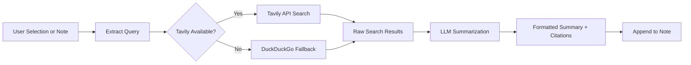

import TLDR from '@site/src/components/TLDR';

# গবেষণা ও ওয়েব সার্চ

<TLDR>
**Notemd ওয়েব অনুসন্ধান করে এবং LLM-সারাংশিত ফলাফলগুলি সরাসরি আপনার নোটগুলিতে যোগ করে।** Tavily API হলো প্রধান অনুসন্ধান ব্যাকএন্ড; DuckDuckGo শূন্য-কনফিগারেশনের ফলস্বরূপ ব্যবহৃত হয়। ফলাফলগুলি সূত্রের উদ্ধৃতি সহ সারাংশিত হয় এবং `## Research` শিরোনামের নিচে যুক্ত হয়। এটি একক-নোট গবেষণা, ব্যাচ ফোল্ডার গবেষণা এবং সারাংশিকরণ ধাপের জন্য প্রতি-টাস্ক মডেল নির্বাচনকে সমর্থন করে।

এটি [Obsidian AI Knowledge Management Guide](/docs/pillar-ai-knowledge)-এর অংশ।
</TLDR>

## সংক্ষিপ্ত বিবরণ

গবেষণা হলো Notemd-এর অন্যতম শক্তিশালী ইন্টিগ্রেশন: এটি পড়া, অনুসন্ধান ও লেখার মধ্যে একটি চক্র সম্পন্ন করে। অপরিচিত শব্দ খুঁজে বের করার জন্য ব্রাউজারে যাওয়ার পরিবর্তে, আপনি সেটিকে হাইলাইট করুন এবং Notemd-কে অনুসন্ধান, সারাংশ তৈরি ও ফলাফলগুলি যোগ করতে দিন -- সবকিছুই আপনার ভল্টের মধ্যেই।

এই প্রক্রিয়াটি সম্পূর্ণরূপে কনফিগারযোগ্য। আপনি অনুসন্ধান প্রদানকারী, সারাংশ লেখার LLM এবং ফলাফলগুলি সক্রিয় নোটে যোগ হবে নাকি আলাদা ফাইলে লেখা হবে তা নির্বাচন করতে পারেন। ব্যাচ মোড আপনাকে এক ক্লিকে ফোল্ডারের প্রতিটি নোট নিয়ে গবেষণা করার সুযোগ দেয়।

## এটি কীভাবে কাজ করে

### সার্চ-থেন-সামারাইজ পাইপলাইন



1. **কোয়েরি এক্সট্রাকশন** -- Notemd আপনার নির্বাচন বা নোটের শিরোনাম থেকে অনুসন্ধান শব্দগুলি বের করে।
2. **ওয়েব সার্চ** -- প্রথমে Tavily ব্যবহার করা হয়। যদি কোনো API কী কনফিগার না করা থাকে, তবে DuckDuckGo স্বয়ংক্রিয়ভাবে ব্যবহৃত হয় (কোনো কীর প্রয়োজন নেই)।
3. **LLM সামারাইজেশন** -- কাঁচা অনুসন্ধান ফলাফলগুলি কনফিগার করা LLM-এ পাঠানো হয়, যা ইনলাইন সূত্রের উদ্ধৃতি সহ একটি সংক্ষিপ্ত সারাংশ তৈরি করে।
4. **অ্যাপেন্ড** -- ফরম্যাট করা সারাংশটি সক্রিয় নোটের `## Research` শিরোনামের নিচে যুক্ত হয়।

### Tavily বনাম DuckDuckGo

| দিক | Tavily | DuckDuckGo |
|--------|--------|------------|
| API কী | প্রয়োজন (ফ্রি টিয়ার উপলব্ধ) | প্রয়োজন নয় |
| ফলাফলের গুণমান | উচ্চতর (AI-এর জন্য বিশেষভাবে তৈরি) | সাধারণ অনুরোধের জন্য যথেষ্ট |
| রেট লিমিট | উদার বিনামূল্যের স্তর | থ্রটলিংয়ের অধীনে |
| কনফিগারেশন | সেটিংসে `tavilyApiKey` | শূন্য কনফিগারেশন -- স্বয়ংক্রিয় ফলবতী |

### ব্যাচ ফোল্ডার রিসার্চ

একটি ফোল্ডারে রাইট-ক্লিক করুন এবং **"Notemd: Research folder"** নির্বাচন করুন। ফোল্ডারের প্রতিটি `.md` ফাইল ধারাবাহিকভাবে (অথবা কনফিগার করা কনকারেন্সি পর্যন্ত সমান্তরালভাবে) প্রক্রিয়াকৃত হয়। প্রতিটি নোট তার নিজস্ব গবেষণা সারসংক্ষেপ পায়.

## কনফিগারেশন

| সেটিং | ডিফল্ট | প্রভাব |
|---------|---------|--------|
| `tavilyApiKey` | `''` | Tavily API কী। খালি থাকলে, শুধুমাত্র DuckDuckGo ব্যবহৃত হয়. |
| `researchProvider` / `researchModel` | DeepSeek | অনুসন্ধান ফলাফল সারসংক্ষেপ করার জন্য প্রতি-টাস্ক LLM |
| `maxResearchContentTokens` | `4000` | LLM-এ পাঠানো বিষয়বস্তুর জন্য টোকেন বাজেট। অতিরিক্ত অংশ কাটা হয়. |
| `researchAppendToNote` | `true` | সূত্র নোটে সারসংক্ষেপ যোগ করুন। যদি false হয়, তবে আলাদা একটি ফাইল তৈরি হয়. |
| `researchLanguage` | `'en'` | সারসংক্ষেপিত গবেষণার জন্য আউটপুট ভাষা |

### প্রতি-টাস্ক মডেল সুপারিশ

বহুভাষিক বিষয়বস্তু পরিচালনা এবং ভালোভাবে গঠিত গদ্য উৎপাদন করতে সক্ষম একটি মডেল গবেষণার জন্য উপকারী। বিবেচনা করুন:

- **DeepSeek** -- ডিফল্ট, সাশ্রয়ী, ভালো মান
- **GPT-4o** -- উচ্চতর মানের সারসংক্ষেপ, উচ্চতর খরচ
- **Gemini Flash** -- দ্রুত ও সস্তা, সাধারণ প্রশ্নের জন্য উপযুক্ত

## উদাহরণ

আপনি *transformer attention mechanisms* বিষয়ক একটি গবেষণাপত্র পড়ছেন এবং *relative positional encoding* নামে একটি অপরিচিত শব্দ দেখতে পাচ্ছেন: Obsidian রেখে যাওয়ার পরিবর্তে.

1. **"relative positional encoding"** কে হাইলাইট করুন
2. রাইট-ক্লিক --> **"Notemd: Research and summarize"**
3. Notemd ওয়েব অনুসন্ধান করে, শীর্ষ ফলাফলগুলো সারসংক্ষেপ করে এবং যোগ করে:

```markdown
## Research

### Relative Positional Encoding

Relative positional encoding is a method used in transformer models
where positional information is expressed as relative distances between
tokens rather than absolute positions. Introduced by Shaw et al. (2018),
it improves generalization to unseen sequence lengths compared to
absolute encodings (Vaswani et al., 2017).

Sources:
- [Shaw et al., Self-Attention with Relative Position Representations (2018)](https://arxiv.org/abs/1803.02155)
- [Transformer Positional Encoding Overview](https://example.com/transformer-pos-enc)
```

এখন সারসংক্ষেপটি আপনার ভল্টের অংশ হয়ে গেছে, যা অনুসন্ধানযোগ্য, লিঙ্কযোগ্য এবং অফলাইনে অ্যাক্সেসযোগ্য।

## টিপস

- **সর্বোত্তম ফলাফলের জন্য একটি Tavily কী সেট করুন** -- এমনকি ফ্রি টিয়ারও খাঁটি DuckDuckGo-এর তুলনায় ভালো সামঞ্জস্য প্রদান করে.
- **একটি শক্তিশালী সারসংক্ষেপকারী মডেল ব্যবহার করুন** -- সস্তা মডেলগুলো সূক্ষ্ম প্রযুক্তিগত বিষয়বস্তুকে সরল করে দিতে পারে.
- **প্রাথমিক পঠনের পর ব্যাচ গবেষণা** করুন যাতে একসাথে অনেক নোটের মধ্যে ঘাটতিগুলো পূরণ করা যায়.
- **যোগ করা সারসংক্ষেপগুলো পর্যালোচনা করুন** -- LLM-এর ফলে উৎসের বিবরণ ভুল হতে পারে। গুরুত্বপূর্ণ দাবিগুলো যাচাই করুন.

---

## পরবর্তী ধাপসমূহ

- [Concept Notes](./concept-notes) -- গবেষণার ফলাফল থেকে গুরুত্বপূর্ণ শব্দগুলো বের করে সংরক্ষণ করুন
- [Wiki-Links](./wiki-links) -- আপনার ভল্টে গবেষণা থেকে প্রাপ্ত ধারণাগুলোকে একে অপরের সাথে লিঙ্ক করুন
- [Translation](./translation) -- গবেষণার সারসংক্ষেপগুলোকে অন্য ভাষায় অনুবাদ করুন
- [LLM প্রদানকারীগণ](/docs/providers/overview) -- সারসংক্ষেপণের জন্য ব্যবহৃত মডেলটি কনফিগার করুন
