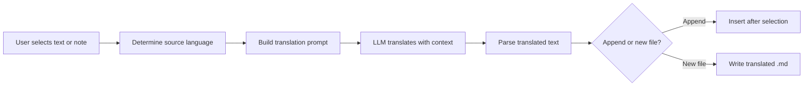

import TLDR from '@site/src/components/TLDR';

# অনুবাদ

<TLDR>
**Notemd LLM-চালিত অনুবাদ ব্যবস্থা ব্যবহার করে ২১টিরও বেশি ভাষার মধ্যে টেক্সট অনুবাদ করে।** এটি একক-নির্বাচন অনুবাদ, পূর্ণ-নোট অনুবাদ এবং ব্যাচ ফোল্ডার অনুবাদ সমর্থন করে। প্রতিটি অনুবাদ কাজের জন্য টাস্ক-ভিত্তিক সেটিংসের মাধ্যমে একটি নির্দিষ্ট প্রোভাইডার ও মডেল ব্যবহার করা যায়। আউটপুট ভাষা UI ভাষা থেকে স্বাধীনভাবে কনফিগার করা যায়। আপনার পছন্দ অনুযায়ী ফলাফলগুলো মূল টেক্সটের নিচে যোগ করা হয় অথবা একটি নতুন ফাইলে লেখা হয়.

এটি [Obsidian AI Knowledge Management Guide](/docs/pillar-ai-knowledge)-এর অংশ।
</TLDR>

## সংক্ষিপ্ত বিবরণ

Notemd-এ অনুবাদ কোনো ডিকশনারি অনুসন্ধান নয় -- এটি LLM-চালিত, কনটেক্সট-সচেতন অনুবাদ। মডেলটি পূর্ণ অনুচ্ছেদ বা নোটটি দেখে, সুর, ডোমেইন সংজ্ঞা ও বাক্য গঠন বজায় রাখে। এর ফলে ফ্রেজ-দ্বারা-ফ্রেজ সেবাগুলোর তুলনায়, বিশেষ করে প্রযুক্তিগত, একাডেমিক ও সৃজনশীল লেখার ক্ষেত্রে, উচ্চমানের ফলাফল পাওয়া যায়.

এই ফিচারটি তিনটি স্কোপ সমর্থন করে: নির্বাচন, সক্রিয় নোট এবং পুরো ফোল্ডার। টাস্ক-ভিত্তিক মডেল নির্বাচনের সাথে মিলিয়ে, আপনি সাধারণ অনুবাদের জন্য দ্রুত মডেল (Gemini Flash) এবং সূক্ষ্মতা-সংবেদনশীল কন্টেন্টের জন্য শক্তিশালী মডেল (Claude Sonnet) ব্যবহার করতে পারেন -- আপনার গ্লোবাল প্রোভাইডার পরিবর্তন না করেই.

## এটি কীভাবে কাজ করে

### অনুবাদ কমান্ড



1. **সোর্স সনাক্তকরণ** -- LLM কন্টেন্ট থেকে সোর্স ভাষা অনুমান করে। আপনাকে এটি ম্যানুয়ালি নির্দিষ্ট করার দরকার নেই.
2. **প্রম্পট গঠন** -- Notemd লক্ষ্য ভাষা, ঐচ্ছিক ডোমেইন ইঙ্গিত এবং অনুবাদ করার জন্য কন্টেন্ট সহ একটি প্রম্পট তৈরি করে.
3. **LLM অনুবাদ** -- কনফিগার করা `translateProvider` / `translateModel` অনুরোধটি প্রক্রিয়া করে। মডেলটি মার্কডাউন ফরম্যাটিং, উইকি-লিঙ্ক ও কোড ব্লকগুলো বজায় রাখে.
4. **আউটপুট** -- অনুবাদিত টেক্সটটি মূল টেক্সটের নিচে যোগ করা হয় অথবা ভল্টে একটি নতুন ফাইলে লেখা হয়.

### ভাষা জোড়া

Notemd অন্তর্নিহিত LLM যেসব ভাষা জোড়া সমর্থন করে, সেগুলো সবই সমর্থন করে। সাধারণ জোড়াগুলোর মধ্যে রয়েছে:

| সোর্স | লক্ষ্য | সাধারণ গুণমান |
|--------|--------|----------------|
| ইংরেজি | চীনা (সরলীকৃত) | অসাধারণ |
| চীনা | ইংরেজি | উৎকৃষ্ট |
| ইংরেজি | জাপানি | খুব ভালো |
| ইংরেজি | জার্মান / ফরাসি / স্প্যানিশ | খুব ভালো |
| যেকোনো সমর্থিত | যেকোনো সমর্থিত | মডেল-নির্ভর |

The `translateLanguage` setting controls the **output language**. The source language is auto-detected.

### টাস্ক-ভিত্তিক মডেল নির্বাচন

Translation quality varies significantly by model. Notemd lets you assign a dedicated model just for translation:

| মডেল | গতি | Quality | খরচ | সর্বোত্তম জন্য |
|-------|-------|--------|------|----------|
| `gemini-2.0-flash-exp` | দ্রুত | ভালো | নিম্ন | অনানুষ্ঠানিক, উচ্চ-পরিমাণ |
| `gpt-4o-mini` | দ্রুত | ভালো | নিম্ন | দ্রুত অনুসন্ধান |
| `deepseek-chat` | মাঝারি | ভালো | খুব কম | বাজেট বহুভাষিক |
| `claude-3-5-sonnet` | মাঝারি | চমৎকার | মাঝারি | প্রযুক্তিগত / একাডেমিক |
| `gpt-4o` | মাঝারি | চমৎকার | মাঝারি | নুয়ান্স-সংবেদনশীল গদ্য |

### ব্যাচ ফোল্ডার অনুবাদ

একটি ফোল্ডারে রাইট-ক্লিক করুন এবং **"Notemd: Translate folder"** নির্বাচন করুন যাতে সেই ফোল্ডারের প্রতিটি নোট অনুবাদ হয়। প্রতিটি ফাইল স্বাধীনভাবে প্রক্রিয়াকৃত হয়। কনকারেন্সি সেটিং নির্ধারণ করে কতগুলো ফাইল একসাথে অনুবাদ হবে.

## কনফিগারেশন

| সেটিং | ডিফল্ট | প্রভাব |
|---------|---------|--------|
| `translateProvider` / `translateModel` | DeepSeek | অনুবাদ কাজের জন্য বিশেষায়িত প্রদানকারী |
| `translateLanguage` | `'en'` | লক্ষ্য আউটপুট ভাষা |
| `translationAppendToNote` | `true` | মূল টেক্সটের নিচে অনুবাদিত টেক্সট যোগ করুন। যদি false হয়, তবে একটি নতুন ফাইল তৈরি হবে. |
| `batchConcurrency` | `3` | ব্যাচ অনুবাদের সময় একসাথে প্রক্রিয়াকৃত হওয়া ফাইলের সংখ্যা |

## উদাহরণ

আপনি একটি চীনা গবেষণা নোট পড়ছেন এবং ইংরেজি সংস্করণ চান:

1. নোটটি খুলুন
2. রাইট-ক্লিক --> **"Notemd: Translate current file"**
3. Notemd চীনা ভাষা সনাক্ত করে, আপনার কনফিগার করা লক্ষ্য ভাষা (ইংরেজি)তে অনুবাদ করে এবং নিচে যোগ করে:

```markdown
## Translation (English)

The experimental results show that the proposed method achieves
a 12% improvement in F1 score compared to the baseline, primarily
due to the enhanced feature extraction module described in Section 3.
```

অনুবাদের উপরে মূল চীনা টেক্সট অপরিবর্তিত থাকে। `## Translation` হেডিং একই ফাইলে উভয় সংস্করণ রাখে যাতে সহজে রেফারেন্স করা যায়.

## টিপস

- **বড় ফোল্ডারগুলোর ব্যাচ অনুবাদের জন্য Gemini Flash ব্যবহার করুন** -- এটি সবচেয়ে দ্রুত ও সস্তা বিকল্প।
- **উইকি-লিঙ্কগুলো সংরক্ষণ করুন** -- Notemd's prompt instructs the LLM to keep `[[wiki-links]]` intact in the translation. Verify after translation, as some models occasionally unwrap them.
- **আউটপুট ভাষা স্পষ্টভাবে নির্ধারণ করুন** -- auto-detection works for source, but always configure `translateLanguage` to avoid ambiguity about the target.
- **ব্যাচ-অনুবাদ কনসেপ্ট নোটগুলো** -- if your concept folder is in one language and you need it in another, folder-level translation handles it in one step.

---

## পরবর্তী ধাপসমূহ

- [Research](./research) -- Search and summarize in any language, then translate results
- [Workflows](./workflows) -- Chain translation with wiki-linking or concept extraction
- [Batch Processing](/docs/advanced/batch-processing) -- Concurrency and overwrite behavior for folder operations
- [LLM Providers](/docs/providers/overview) -- Choose the best model for your language pair
