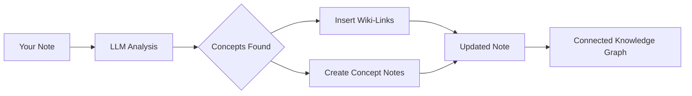

import TLDR from '@site/src/components/TLDR';

# Wiki-Links

<TLDR>
**Notemd আপনার নোটের কী ধারণাগুলিতে স্বয়ংক্রিয়ভাবে `[[wiki-links]]` যোগ করে।** LLM আপনার বিষয়বস্তু পড়ে, প্রেক্ষাপটে গুরুত্বপূর্ণ শব্দগুলি চিহ্নিত করে এবং প্রতিটি ঘটনায় Obsidian-স্টাইলের উইকি-লিঙ্ক যোগ করে। ঐচ্ছিকভাবে ব্যাকলিঙ্কসহ কনসেপ্ট নোট ফাইল তৈরি করা হয়। সিনোনিম দমন, নাম পরিবর্তন/মুছে ফেলার সময় লিঙ্কের অখণ্ডতা এবং শুধুমাত্র বের করার মোড (কোনো ফাইল পরিবর্তন নয়) সমর্থন করে। Auto Link-এর বিপরীতে, যা শুধুমাত্র বিদ্যমান নোটের শিরোনামের সাথে মিল খোঁজে, Notemd AI ব্যবহার করে নতুন ধারণাগুলি চিহ্নিত করে এবং সংশ্লিষ্ট নোট তৈরি করে। এটি [Obsidian AI Knowledge Management Guide](/docs/pillar-ai-knowledge)-এর অংশ।
</TLDR>

## সংক্ষিপ্ত বিবরণ

উইকি-লিঙ্কিং হল Notemd-এর মূল বৈশিষ্ট্য। এটি সাধারণ টেক্সটকে একটি সংযুক্ত জ্ঞান গ্রাফে রূপান্তরিত করে নিম্নলিখিতভাবে:

1. **LLM দিয়ে আপনার নোট বিশ্লেষণ করা**
2. **কী ধারণাগুলি চিহ্নিত করা** (শব্দ, ব্যক্তি, পদ্ধতি, তত্ত্ব)
3. **প্রতিটি ঘটনায় `[[wiki-links]]` যোগ করা**
4. **ঐচ্ছিকভাবে ব্যাকলিঙ্কসহ কনসেপ্ট নোট তৈরি করা**

## এটি কীভাবে কাজ করে

### প্রক্রিয়া



### উদাহরণ

**প্রক্রিয়ার আগে:**
```markdown
Machine learning models use neural networks to learn patterns from data.
The transformer architecture revolutionized natural language processing.
```

**প্রক্রিয়ার পরে:**
```markdown
[[Machine learning]] models use [[neural networks]] to learn patterns from data.
The [[transformer architecture]] revolutionized [[natural language processing]].
```

## ব্যবহার

### মৌলিক: বর্তমান নোটে লিঙ্ক যোগ করা

1. একটি নোট খুলুন
2. এডিটরে রাইট-ক্লিক করুন → **"Process file (add links)"**
3. কয়েক সেকেন্ড অপেক্ষা করুন
4. এখন ধারণাগুলি লিঙ্কযুক্ত হয়ে গেছে!

### ব্যাচ: একাধিক নোট প্রক্রিয়াকরণ

1. ফাইল এক্সপ্লোরারে একটি ফোল্ডারে রাইট-ক্লিক করুন
2. **"Notemd: Process folder (add links)"** নির্বাচন করুন
3. কনফিগার করুন:
   - সমসাময়িকতা (সমান্তরালে কতগুলো ফাইল)
   - বিদ্যমান লিঙ্কগুলো ওভাররাইট করুন (হ্যাঁ/না)
4. **প্রক্রিয়াকরণ**-এ ক্লিক করুন

### নির্বাচনী: নির্দিষ্ট টেক্সট লিঙ্ক করুন

1. প্রক্রিয়াকরণের জন্য টেক্সটকে হাইলাইট করুন
2. রাইট-ক্লিক → **"নির্বাচিত অংশ প্রক্রিয়াকরণ (লিঙ্ক যোগ করুন)"**
3. শুধুমাত্র হাইলাইট করা অংশটি বিশ্লেষণ করা হয়

## Notemd বনাম অটো লিঙ্ক

Obsidian-এ স্বয়ংক্রিয় উইকি-লিঙ্কিংয়ের জন্য দুটি পদ্ধতি রয়েছে:

| | **অটো লিঙ্ক** | **Notemd** |
|--|---------------|-------------|
| লিঙ্ক সোর্স | ভল্টে বিদ্যমান নোটের শিরোনামগুলো | কন্টেন্টে LLM-দ্বারা চিহ্নিত ধারণাগুলো |
| নতুন ধারণাগুলোকে লিঙ্ক করা যায় | না — শিরোনামটি ইতিমধ্যেই বিদ্যমান থাকতে হবে | হ্যাঁ — AI ধারণাগুলো চিহ্নিত করে এবং নোট তৈরি করে |
| সমার্থক শব্দ পরিচালনা | না | হ্যাঁ — সমার্থক শব্দ দমন |
| ধারণা নোট তৈরি | না | হ্যাঁ — ব্যাকলিঙ্ক ও ডুপ্লিকেট অপসারণসহ |
| ব্যাচ প্রক্রিয়াকরণ | না (একক ফাইল) | হ্যাঁ (ফোল্ডার-স্তরে) |
| প্রতি-টাস্ক মডেল রাউটিং | না | হ্যাঁ |

**Auto Link** হলো শিরোনাম-ম্যাচিং: যদি "Machine Learning" নামে কোনো নোট থাকে, তবে এটি `[[Machine Learning]]` দিয়ে সেগুলোকে ঘিরে ফেলে। যদি নোটটি না থাকে, তবে কিছুই ঘটে না.

**Notemd** হলো AI-চালিত: LLM আপনার বিষয়বস্তু পড়ে, প্রেক্ষাপট বুঝে, এমন ধারণাগুলো চিহ্নিত করে যেগুলোকে লিঙ্ক করা *উচিত* — এমনকি যদি এখনও কোনো নোট না থাকে — এবং লিঙ্ক ও ধারণা নোট উভয়ই তৈরি করে.

## বৈশিষ্ট্যসমূহ

### সমার্থক শব্দ দমন

**সমস্যা:** "transformer", "transformers", "Transformer architecture" → 3টি আলাদা ধারণা

**সমাধান:** Notemd কাছাকাছি ডুপ্লিকেটগুলো সনাক্ত করে এবং ক্যাননিক্যাল ফর্ম ব্যবহার করে।

**কনফিগারেশন:**
```
Settings → Advanced → Synonym Suppression
Threshold: 0.8 (0 = off, 1 = aggressive)
```

### লিঙ্ক ইন্টিগ্রিটি

**যখন আপনি একটি কনসেপ্ট নোটের নাম পরিবর্তন করেন:**
- সমস্ত উইকি-লিঙ্ক স্বয়ংক্রিয়ভাবে আপডেট হয় (Obsidian কোর ফিচার)
- ব্যাকলিঙ্কগুলি অক্ষত থাকে

**যখন আপনি একটি কনসেপ্ট নোট মুছে ফেলেন:**
- লিঙ্কগুলি থাকে কিন্তু "unlinked mentions" হিসেবে দেখায়
- আপনি যেকোনো উদাহরণ থেকে এটি পুনর্গঠন করতে পারেন

### Pure Extraction Mode

**মূল ফাইল পরিবর্তন না করে কনসেপ্ট বের করুন:**

1. রাইট-ক্লিক → **"Extract concepts (no linking)"**
2. কনসেপ্ট নোটগুলি তৈরি হয়
3. মূল ফাইল অক্ষত থাকে

ব্যবহারের ক্ষেত্র: শুধুমাত্র পড়ার জন্য থাকা কন্টেন্ট বা চূড়ান্ত খসড়া প্রক্রিয়াকরণ।

## Concept Note Generation

### Automatic Creation

**সক্রিয় করা হলে (ডিফল্ট), Notemd নিম্নলিখিত তৈরি করে:**

```markdown
---
tags: [concept, auto-generated]
created: 2026-06-13
source: [[Original Note Name]]
---

# Machine Learning

A branch of artificial intelligence that enables computers
to learn from data without explicit programming.

## Occurrences in Your Vault

- [[Original Note Name#Section]]
- [[Another Note#Header]]

## Related Concepts

- [[Neural Networks]]
- [[Deep Learning]]
- [[Supervised Learning]]
```

### কনফিগারেশন

**আউটপুট ফোল্ডার:**
```
Settings → Output → Concept Folder
Default: concepts/
```

**হায়ারার্কিক্যাল স্ট্রাকচার:**
```
Settings → Output → Use Hierarchical Folders
If enabled:
  papers/my-paper.md → papers/concepts/Concept.md
If disabled:
  → concepts/Concept.md
```

**টেমপ্লেট:**
```
Settings → Output → Concept Template
Customize with variables:
  {{concept}} — Concept name
  {{description}} — LLM-generated description
  {{backlinks}} — List of source notes
  {{date}} — Creation date
```

## উন্নত বিকল্পসমূহ

### কনটেক্সট উইন্ডো

**কতটুকু চারপাশের টেক্সট পাঠাতে হবে:**

```
Settings → Linking → Context Window
Options: Sentence | Paragraph | Full Note
Default: Paragraph
```

বড় = আরও ভালো নির্ভুলতা, উচ্চতর খরচ.

### ন্যূনতম ঘটনাসংখ্যা

**শুধুমাত্র বারবার আসা কনসেপ্টগুলোকে লিঙ্ক করুন:**

```
Settings → Linking → Min Occurrences
Default: 1 (link all)
```

পুনরাবৃত্তিমূলক থিমগুলোতে মনোযোগ দেওয়ার জন্য 2 বা 3 এ সেট করুন.

### বাদ দেওয়ার প্যাটার্নসমূহ

**নির্দিষ্ট কিছু শব্দ বাদ দিন:**

```
Settings → Linking → Exclude List
Example: note, idea, example, thing
```

সাধারণ শব্দগুলোর অতিরিক্ত লিঙ্কিং রোধ করে।

### কাস্টম প্রম্পট

**ডিফল্ট LLM নির্দেশাবলীকে ওভাররাইড করুন:**

```
Settings → Advanced → Custom Linking Prompt
Default:
  "Identify key concepts, theories, methods, and technical
   terms in the following text. Return as a list..."
```

ডোমেইন-নির্দিষ্ট প্রয়োজনে পরিবর্তন করুন (যেমন, "চিকিৎসা পরিভাষার উপর মনোযোগ দিন").

## টিপস ও সেরা অনুশীলন

### ✅ করুন

- **100 শব্দের বেশি থাকা নোটগুলো প্রক্রিয়া করুন** — সংক্ষিপ্ত নোটগুলো থেকে কম ধারণা পাওয়া যায়
- **আরও ভালো ধারণা চিহ্নিতকরণের জন্য শক্তিশালী মডেল ব্যবহার করুন** (GPT-4o, Claude)
- **গ্রহণ করার আগে পর্যালোচনা করুন** — প্রস্তাবিত লিঙ্কগুলো যুক্তিসঙ্গত কিনা দেখুন
- **ধাপে ধাপে তৈরি করুন** — 5-10টি নোট প্রক্রিয়া করুন, গ্রাফ পর্যালোচনা করুন, সেটিংস সামঞ্জস্য করুন

### ❌ করবেন না

- **অতিরিক্ত লিঙ্ক যোগ করবেন না** — প্রতিটি বিশেষ্যের জন্য লিঙ্কের দরকার নেই
- **ড্রাফটগুলো বারবার প্রক্রিয়া করবেন না** — ধারণাগুলো পরিবর্তিত হতে পারে, স্থিতিশীল হওয়া পর্যন্ত অপেক্ষা করুন
- **সমার্থক শব্দগুলো উপেক্ষা করবেন না** — "ML" ও "Machine Learning" এড়াতে সাপ্রেশন সক্রিয় করুন

## কর্মক্ষমতা

### গতি

| নোটের আকার | GPT-4o-mini | Claude Sonnet | Ollama (local) |
|-----------|-------------|---------------|----------------|
| 500 শব্দ | ২-৩ সেকেন্ড | ৩-৫ সেকেন্ড | ৫-১০ সেকেন্ড |
| ২০০০ শব্দ | ৫-৮ সেকেন্ড | ১০-১৫ সেকেন্ড | ২০-৪০ সেকেন্ড |
| 5000+ শব্দ | চাঙ্কড (একাধিক কল) | চাঙ্কড | চাঙ্কড |

### খরচ অনুমান

**উদাহরণ: GPT-4o-mini ব্যবহার করে ১০০০ শব্দের নোট**
- ইনপুট: ~1500 টোকেন
- আউটপুট: ~200 টোকেন
- খরচ: ~

**১০০টি নোট ব্যাচ প্রক্রিয়াকরণ:** ~

## সমস্যা সমাধান

### কোনো লিঙ্ক যোগ করা হয়নি।

**যাচাই করুন:**
1. LLM কল সফল হয়েছে (Settings → Diagnostics)
2. নোটটিতে যথেষ্ট বিষয়বস্তু রয়েছে (>50 শব্দ)
3. ধারণাগুলি হলো প্রযুক্তিগত/নির্দিষ্ট (শুধুমাত্র সর্বনাম নয়)

**চেষ্টা করুন:**
- আরও শক্তিশালী একটি মডেল ব্যবহার করুন।
- কনটেক্সট উইন্ডো বাড়ান
- API কীটির বৈধতা যাচাই করুন।

### খুব বেশি লিঙ্ক

**সমাধানসমূহ:**
1. ন্যূনতম ঘটনাসংখ্যা বাড়ান (২ বা ৩)
2. বাদ দেওয়ার তালিকায় সাধারণ শব্দগুলো যোগ করুন
3. একটি কম আক্রমণাত্মক মডেল ব্যবহার করুন।

### ভুল ধারণাগুলো সংযুক্ত হয়েছে

**সংশোধনসমূহ:**
1. ডোমেইন নির্দিষ্টতার জন্য কাস্টম প্রম্পট ব্যবহার করুন
2. সিনোনিম সাপ্রেশন সক্রিয় করুন
3. ম্যানুয়ালি পর্যালোচনা করুন এবং লিঙ্ক আলাদা করুন

### নাম পরিবর্তনের পর লিঙ্কগুলো ভেঙে যায়

**এটি স্বাভাবিক Obsidian আচরণ।**

সমস্ত লিঙ্ক আপডেট করতে:
1. কনসেপ্ট নোটের নাম পরিবর্তন করুন
2. Obsidian স্বয়ংক্রিয়ভাবে `[[old]]` কে `[[new]]` এ আপডেট করে

---

## পরবর্তী ধাপসমূহ

- 📖 [Concept Notes](./concept-notes) — কনসেপ্ট নোট তৈরির গভীর বিশ্লেষণ
- 🔍 [Research Integration](./research) — লিঙ্কিংকে ওয়েব রিসার্চের সাথে একীভূত করুন
- 🎨 [Diagrams](./diagrams) — আপনার নলেজ গ্রাফকে দৃশ্যমান করুন
