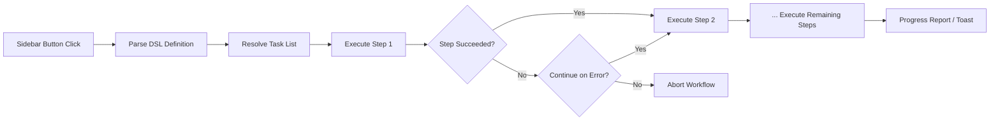

import TLDR from '@site/src/components/TLDR';

# ওয়ার্কফ্লো

<TLDR>
**Notemd ওয়ার্কফ্লোগুলি একাধিক টাস্ককে একটি এক-ক্লিক অ্যাকশনে চেইন করে।** `add-links > extract-concepts > research > diagram` এর মতো সিকোয়েন্সগুলি একটি সরল DSL ব্যবহার করে সংজ্ঞায়িত করা হয়। ওয়ার্কফ্লোগুলি সাইডবার বাটন হিসেবে দেখা যায় যা বর্তমান নোট বা ফোল্ডারে পুরো চেইনটি চালায়। এতে পূর্বনির্ধারিত ওয়ার্কফ্লো থাকে; সেটিংসে নিজস্ব ওয়ার্কফ্লো তৈরি করা যায়। প্রতিটি ধাপ নিজস্ব পার-টাস্ক মডেল কনফিগারেশন ব্যবহার করে।

এটি [Obsidian AI Knowledge Management Guide](/docs/pillar-ai-knowledge)-এর অংশ।
</TLDR>

## সংক্ষিপ্ত বিবরণ

একটি ওয়ার্কফ্লো টাস্কগুলি একে একে চালানোর ঝামেলা দূর করে। লিঙ্ক যোগ করতে, ধারণা বের করতে, অপরিচিত শব্দ সম্পর্কে গবেষণা করতে এবং একটি ডায়াগ্রাম তৈরি করতে চারবার রাইট-ক্লিক করার পরিবর্তে, আপনি শুধুমাত্র একটি সাইডবার বাটন চাপলেই পুরো চেইনটি কার্যকর হয়। Notemd সিকোয়েন্সিং, এরর প্রোপাগেশন এবং অগ্রগতি রিপোর্টিং সামলায়।

ওয়ার্কফ্লোগুলি একটি হালকা DSL (ডোমেইন-স্পেসিফিক ভাষা) এ সংজ্ঞায়িত হয়। এগুলি সেটিংসে থাকে, Obsidian সাইডবারে ক্লিকযোগ্য বাটন হিসেবে দেখা যায় এবং বর্তমান নোট বা পুরো ফোল্ডারে প্রয়োগ করা যায়।

## এটি কীভাবে কাজ করে

### ওয়ার্কফ্লো এক্সিকিউশন পাইপলাইন



1. **পার্স** -- DSL স্ট্রিংটি `>` (বা `>`) দিয়ে টাস্ক আইডেন্টিফায়ারগুলির একটি ক্রমবদ্ধ তালিকায় ভাগ করা হয়।
2. **রিজলভ** -- প্রতিটি আইডেন্টিফায়ার একটি অভ্যন্তরীণ কমান্ডের (add-links, extract-concepts, research, translate, diagram ইত্যাদি) সাথে ম্যাপ হয়।
3. **এক্সিকিউট** -- ধাপগুলি ক্রমানুসারে চালানো হয়। প্রতিটি ধাপ তার নির্ধারিত পার-টাস্ক প্রোভাইডার ও মডেল ব্যবহার করে।
4. **এরর হ্যান্ডলিং** -- যদি কোনো ধাপ ব্যর্থ হয়, ওয়ার্কফ্লো আপনার এরর পলিসি অনুযায়ী হয় বন্ধ হয়ে যায় অথবা পরবর্তী ধাপে চলে যায়।
5. **ডন** -- একটি টোস্ট নোটিফিকেশন সাফল্য জানায় অথবা ব্যর্থ হওয়া ধাপগুলির তালিকা দেয়।

### DSL ফরম্যাট

ওয়ার্কফ্লোগুলি `>` দিয়ে আলাদা করা টাস্ক আইডেন্টিফায়ারগুলির একটি সিকোয়েন্স হিসেবে সংজ্ঞায়িত হয়:

```
process-current-add-links>extract-concepts-current>research-and-summarize
```

**উপলব্ধ টাস্ক আইডেন্টিফায়ারগুলি:**

| আইডেন্টিফায়ার | Action |
|------------|--------|
| `process-current-add-links` | সক্রিয় নোটে উইকি-লিঙ্ক যোগ করুন |
| `extract-concepts-current` | সক্রিয় নোট থেকে ধারণাগুলো বের করুন |
| `research-and-summarize` | নির্বাচিত টেক্সট বা নোটের শিরোনাম নিয়ে গবেষণা করুন |
| `process-current-translate` | সক্রিয় নোটটি অনুবাদ করুন |
| `summarize-to-mermaid` | সক্রিয় নোট থেকে একটি ডায়াগ্রাম তৈরি করুন |
| `generate-from-title` | নোটের শিরোনাম থেকে কন্টেন্ট তৈরি করুন |
| `extract-original-text` | মূল টেক্সট বের করুন (OCR/স্ক্যান করা কন্টেন্টের জন্য) |

**ফোল্ডার-স্তরের ভ্যারিয়েন্টস** আইডেন্টিফায়ার নামে `current` এর জায়গায় `folder` বসানো হয়.

### পূর্বনির্ধারিত বনাম কাস্টম ওয়ার্কফ্লো

Notemd-এ সাধারণ প্যাটার্নগুলোর জন্য ইতিমধ্যে তৈরি ওয়ার্কফ্লো রয়েছে:

| ওয়ার্কফ্লো | চেইন | ব্যবহারের ক্ষেত্র |
|----------|-------|----------|
| **ওয়ান-ক্লিক এক্সট্রাক্ট** | add-links > extract-concepts > research | একবারের প্রক্রিয়ায় একটি গবেষণা পেপার প্রক্রিয়া করুন |
| **ফুল পাইপলাইন** | add-links > extract-concepts > research > diagram | ভিজ্যুয়ালাইজেশনসহ সম্পূর্ণ জ্ঞান বের করা |
| **Translate + Link** | translate > add-links | লক্ষ্য ভাষায় কনসেপ্টগুলো অনুবাদ করে তারপর লিঙ্ক করা |

**Custom workflows** সেটিংসে তৈরি করা হয়:

1. **Settings** খুলুন --> **Notemd** --> **Workflows**
2. **"Add Workflow"**-এ ক্লিক করুন
3. DSL চেইন লিখুন (যেমন, `process-current-add-links>extract-concepts-current`)
4. এটার জন্য একটি ডিসপ্লে নাম দিন (যেমন, "Quick Link + Extract")
5. নতুন বাটনটি তৎক্ষণাৎ সাইডবারে দেখা দেবে

## কনফিগারেশন

| সেটিং | ডিফল্ট | প্রভাব |
|---------|---------|--------|
| `workflows` | পূর্বনির্ধারিত সেট | ওয়ার্কফ্লো সংজ্ঞাগুলোর অ্যারে (নাম + DSL) |
| `workflowContinueOnError` | `true` | বর্তমান ধাপ ব্যর্থ হলে পরবর্তী ধাপে যান |
| `workflowShowProgress` | `true` | প্রতিটি ধাপ সম্পন্ন হওয়ার পর একটি প্রগ্রেস টোস্ট দেখানো হবে |

### ওয়ার্কফ্লোতে Per-Task Models

একটি ওয়ার্কফ্লোর প্রতিটি ধাপে তার নিজস্ব পার-টাস্ক মডেল কনফিগারেশন ব্যবহার করে। DSL-এর মধ্যে সরাসরি মডেলগুলো নির্দিষ্ট করার দরকার নেই। রেজোলিউশনের ক্রম হলো:

1. `useMultiModelSettings` থাকলে পার-টাস্ক প্রোভাইডার/মডেল
2. অন্যথায় গ্লোবাল `activeProvider`

এর মানে হলো `add-links` DeepSeek-এ চালানো যেতে পারে আর `research` GPT-4o-এ চালানো হয় -- সবকিছু একই ওয়ার্কফ্লো ক্লিকের মধ্যেই।

## উদাহরণ

আপনি আপনার ভল্টে একটি মেশিন লার্নিং পেপারের PDF ইম্পোর্ট করেছেন এবং সম্পূর্ণ জ্ঞান বের করতে চান:

1. ইম্পোর্ট করা নোটটি খুলুন
2. **"Full Pipeline"** সাইডবার বাটনে ক্লিক করুন
3. Notemd এগুলো চালায়:
   - **ধাপ ১**: wiki-লিঙ্ক যোগ করুন -- `[[attention mechanism]]`, `[[transformer]]` ইত্যাদি.
   - **ধাপ ২**: ধারণাগুলো বের করুন -- আপনার কনসেপ্ট ফোল্ডারে কনসেপ্ট নোট তৈরি করে
   - **ধাপ ৩**: গবেষণা -- মূল শব্দগুলোর জন্য ওয়েব সোর্সগুলো সারসংক্ষেপ করে
   - **ধাপ ৪**: ডায়াগ্রাম -- পেপারটির কাঠামোর একটি Mermaid মাইন্ডম্যাপ তৈরি করে
4. প্রায় ৩০ সেকেন্ড পর, আপনার নোটে লিঙ্ক থাকবে, কনসেপ্ট নোটগুলো থাকবে, গবেষণা যুক্ত হবে এবং একটি ডায়াগ্রাম ফাইল সংরক্ষিত হবে

সবকিছু একটি মাত্র ক্লিক দিয়েই।

## টিপস

- **পূর্বনির্ধারিত ওয়ার্কফ্লো দিয়ে শুরু করুন** -- এগুলো সবচেয়ে সাধারণ প্যাটার্নগুলো অন্তর্ভুক্ত করে। শুধুমাত্র ভিন্ন সিকোয়েন্স দরকার হলেই কাস্টমাইজ করুন.
- **`workflowContinueOnError` সক্রিয় করুন** -- একটি ব্যর্থ ডায়াগ্রাম ধাপ পুরো পাইপলাইনকে বন্ধ করা উচিত নয়।
- **বৃহৎ পরিমাণে প্রক্রিয়াকরণের জন্য ফোল্ডার ওয়ার্কফ্লো ব্যবহার করুন** -- একটি ফোল্ডারে রাইট-ক্লিক করুন, একটি ওয়ার্কফ্লো নির্বাচন করুন, এবং প্রতিটি নোট প্রক্রিয়াকৃত হবে.
- **ওয়ার্কফ্লোগুলোকে স্পষ্টভাবে নামকরণ করুন** -- সাইডবারের জায়গা সীমিত। "Quick Extract" বা "Translate + Link"-এর মতো সংক্ষিপ্ত, কার্যভিত্তিক নাম ব্যবহার করুন.

---

## পরবর্তী ধাপসমূহ

- [Research](./research) -- ওয়ার্কফ্লোতে যোগ করার আগে রিসার্চ ধাপটি কী করে তা বুঝুন
- [Wiki-Links](./wiki-links) -- বেশিরভাগ ওয়ার্কফ্লোতে ব্যবহৃত মূল লিঙ্কিং বৈশিষ্ট্য
- [Concept Notes](./concept-notes) -- ওয়ার্কফ্লো ধাপ হিসেবে কনসেপ্ট এক্সট্রাকশন
- [Batch Processing](/docs/advanced/batch-processing) -- ফোল্ডার ওয়ার্কফ্লোর জন্য সময়সামঞ্জস্য ও অগ্রগতি প্রতিবেদন
