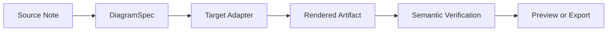
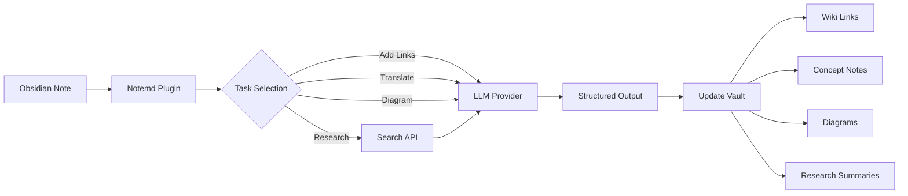

import TLDR from '@site/src/components/TLDR';

# Notemd-এর পরিচিতি

<TLDR>
**Notemd** (Note + EMD — Enhanced Markdown Documents) হলো একটি ওপেন-সোর্স Obsidian প্লাগইন, যা LLM-চালিত পঠনকে স্থায়ী জ্ঞানে রূপান্তর করে। চ্যাট-ভিত্তিক AI-এর বিপরীতে, যেখানে সেশন শেষ হলে অন্তর্দৃষ্টিগুলো অদৃশ্য হয়ে যায়, Notemd ফলাফলগুলোকে **সরাসরি আপনার vault-এ** wiki-লিঙ্ক, কনসেপ্ট নোট, গবেষণা সারসংক্ষেপ, অনুবাদ, ওয়ার্কফ্লো এবং ডায়াগ্রাম হিসেবে লিখে রাখে। এটি গবেষক, ছাত্র এবং জ্ঞান কর্মীদের জন্য তৈরি, যারা পঠন, গবেষণা এবং ভিজ্যুয়াল ব্যাখ্যাগুলোকে একটি কাঠামোবদ্ধ, বিকশিত হওয়া জ্ঞান গ্রাফে সংগ্রহ করতে চান.
</TLDR>

## Notemd কী?

Notemd **30+ Large Language Models** (OpenAI, Anthropic, Google, DeepSeek, Qwen, Ollama এবং আরও) কে আপনার Obsidian ওয়ার্কফ্লোতে একীভূত করে, যাতে জ্ঞান সংগ্রহ, সংগঠন, অনুবাদ, গবেষণা এবং ডায়াগ্রাম তৈরি স্বয়ংক্রিয়ভাবে হয়.

### প্রধান পার্থক্য: অস্থায়ী বনাম স্থায়ী জ্ঞান

| দিক | চ্যাট-ভিত্তিক AI (ChatGPT, ইত্যাদি) | Notemd |
|--------|-------------------------------|--------|
| **ফলাফলগুলো কোথায় যায়** | চ্যাট হিস্ট্রি (অদৃশ্য হয়ে যায়) | আপনার Obsidian vault (স্থায়ী থাকে) |
| **ফরম্যাট** | সাধারণ টেক্সট উত্তর | কাঠামোবদ্ধ ফাইল: `[[wiki-links]]`, কনসেপ্ট নোট, ডায়াগ্রাম |
| **দীর্ঘমেয়াদী মূল্য** | প্রতিবার আবার জিজ্ঞাসা করতে হয় | একটি জ্ঞান গ্রাফে সংগ্রহিত হয় |
| **অফলাইন অ্যাক্সেস** | ইন্টারনেট প্রয়োজন | Ollama ব্যবহার করে সম্পূর্ণভাবে অফলাইনে কাজ করে |

## মূল ক্ষমতাসমূহ

### 1. **স্বয়ংক্রিয় উইকি-লিঙ্কিং**
- LLM আপনার নোটের মূল ধারণাগুলো চিহ্নিত করে
- প্রতিটি ঘটনায় `[[wiki-links]]` যোগ করে
- ইচ্ছামতো লিঙ্কযুক্ত ধারণা নোট তৈরি করে
- ডুপ্লিকেট এড়াতে সমার্থক শব্দ দমন

### 2. **ধারণা নোট তৈরি**
- পেপার, নিবন্ধ, নোট থেকে মূল ধারণাগুলো বের করে
- ব্যাকলিঙ্কসহ আলাদা ধারণা ফাইল তৈরি করে
- কাস্টমাইজযোগ্য আউটপুট পথ ও টেমপ্লেট

### 3. **ওয়েব রিসার্চ ইন্টিগ্রেশন**
- Obsidian-এর ভিতর থেকে Tavily বা DuckDuckGo অনুসন্ধান করুন
- LLM উৎস উদ্ধৃতি সহ ফলাফলগুলো সারসংক্ষেপ করে
- বর্তমান নোটে গবেষণা ফলাফলগুলো যোগ করে

### 4. **বহুভাষিক অনুবাদ**
- নির্বাচিত অংশ বা সম্পূর্ণ নোটগুলো অনুবাদ করুন
- 21+ UI ভাষা সমর্থন করে
- স্বতন্ত্র আউটপুট ভাষা কনফিগারেশন
- ব্যাচ অনুবাদ সমর্থন

### 5. **ডায়াগ্রাম তৈরি**
- **Mermaid**: ফ্লোচার্ট, সিকোয়েন্স, ক্লাস, স্টেট, ER, Gantt
- **JSON Canvas**: Obsidian নেটিভ লেআউট
- **Vega-Lite**: ডেটা চার্ট, টাইম সিরিজ, স্ক্যাটার প্লট
- **HTML / Editable HTML/SVG**: সেমান্টিক অ্যানোটেশনসহ স্বয়ংসম্পূর্ণ ফিগার আর্টিফ্যাক্ট
- **Draw.io / Drawnix artifact boundaries**: একই সেমান্টিক ফিগার মডেল থেকে মেইনটেইনার-ফেসিং এক্সপোর্ট পাথ
- **Circuit diagrams roadmap**: circuitikz/TikZJax সমর্থনটি কাস্টম রেফারেন্স, সীমিত প্রম্পট, রেন্ডার ফিডব্যাক এবং টোপোলজি/লেআউট ভ্যালিডেশনের উপর ভিত্তি করে ডিজাইন করা হচ্ছে, খাঁটি অনাবধীন LLM TikZ-এর পরিবর্তে
- **Preview diagnostics**: রেন্ডার আর্টিফ্যাক্টগুলো কম্পাইল/রেন্ডার স্মোক ডায়াগনস্টিকস প্রদর্শন করতে পারে, এবং প্লাগইন-সাইড LaTeX রানটাইম ছাড়াই নন-ইন-লাইন সোর্সগুলো পরীক্ষা করা যায়
- Mermaid ত্রুটিগুলোর জন্য সিনট্যাক্স অটো-ফিক্স

### 6. **ওয়ান-ক্লিক ওয়ার্কফ্লো**
- সাইডবার বাটনগুলিতে একাধিক অ্যাকশন চেইন করুন
- DSL-ভিত্তিক ওয়ার্কফ্লো সংজ্ঞা
- উদাহরণ: `add-links > extract-concepts > research > diagram`

## Notemd কে ব্যবহার করা উচিত?

✅ **গবেষকরা** যারা পেপার পড়েন এবং লিটারেচার রিভিউ তৈরি করেন
✅ **শিক্ষার্থীরা** যারা স্টাডি নোট সাজান এবং কনসেপ্ট ম্যাপ তৈরি করেন
✅ **নলেজ ওয়ার্কাররা** যারা পড়ার অন্তর্দৃষ্টিগুলো স্থায়ী রাখতে চান
✅ **দ্বিভাষিক পেশাজীবীরা** যাদের অনুবাদ ও উইকি-লিঙ্কিংয়ের প্রয়োজন
✅ **গোপনীয়তা-সচেতন ব্যবহারকারীরা** যারা স্থানীয় LLM সহায়তা (Ollama) চান
✅ **পাওয়ার ইউজাররা** যারা প্রম্পট ও ওয়ার্কফ্লো কাস্টমাইজ করেন

## Notemd + Obsidian কেন?

**Obsidian** হলো একটি স্থানীয়-প্রথম, মার্কডাউন-ভিত্তিক নলেজ বেস। **Notemd** AI সুপারপাওয়ার যোগ করে:
- আপনার ডেটা আপনার ভল্টেই থাকে (কোনো ক্লাউড সার্ভিসে নয়)
- স্থানীয় মডেল দিয়ে অফলাইনে কাজ করে
- বিনামূল্যে এবং ওপেন সোর্স (MIT লাইসেন্স)
- বিদ্যমান Obsidian প্লাগইনগুলির সাথে একীভূত হয়
- হাজার হাজার নোট পর্যন্ত স্কেল করা যায়

## শুরু করা

1. **ইনস্টল করুন**: Settings → Community Plugins → Browse → "Notemd"
2. **কনফিগার করুন**: আপনার LLM প্রোভাইডারের API কী যোগ করুন (অথবা স্থানীয় Ollama ব্যবহার করুন)
3. **চেষ্টা করুন**: একটি নোট খুলুন → রাইট-ক্লিক করুন → "Process file (add links)"
4. **অন্বেষণ করুন**: ওয়ান-ক্লিক ওয়ার্কফ্লোর জন্য সাইডবার দেখুন

👉 [Installation Guide](./getting-started/installation) | [Quick Start Tutorial](./getting-started/quick-start)

## Diagram Capability Direction

Notemd-এর ডায়াগ্রাম কাজটি "মডেলকে একটি সিনট্যাক্স স্ট্রিং লিখতে বলা" থেকে স্তরবদ্ধ পাইপলাইনের দিকে এগিয়ে যাচ্ছে:

বর্তমান বাস্তবায়নটি ইতিমধ্যে Mermaid, JSON Canvas, Vega-Lite, HTML ফলব্যাক, এডিটেবল HTML/SVG, Draw.io XML আর্টিফ্যাক্ট, ন্যূনতম Drawnix JSON সাবসেট, প্রিভিউ ডায়াগনস্টিক্স/শুধুমাত্র সোর্স ফলব্যাক, এবং কমন-সোর্স ও CMOS ইনভার্টার গোল্ডেন টেমপ্লেটের জন্য অফলাইন `CircuitSpec -> circuitikz` প্রোটোটাইপ সমর্থন করে। সার্কিট ডায়াগ্রামগুলি আরও কঠিন ধরনের: circuitikz সঠিক বৈদ্যুতিক টোপোলজি প্রকাশ করতে পারে, কিন্তু অনিয়ন্ত্রিত LLM আউটপুট প্রায়শই অপঠনীয় রাউটিং বা রেন্ডার না হওয়া LaTeX তৈরি করে। পরবর্তী দিকটি হল গোল্ডেন-রেফারেন্স টেমপ্লেট, নোড-গ্রিড লেআউট নিয়ম, রেন্ডার ডায়াগনস্টিক্স, এবং স্ক্রিনশট ফিডব্যাক লুপের মাধ্যমে circuitikz-কে সীমাবদ্ধ রাখা.

[Diagrams](./features/diagrams)-এ বিস্তারিত পড়ুন.

## Architecture

## Notemd বনাম অন্যান্য Obsidian AI Plugins

বেশিরভাগ Obsidian AI প্লাগইনই কনভারসেশন-ফার্স্ট (আপনি জিজ্ঞাসা করেন, AI উত্তর দেয়, অন্তর্দৃষ্টি চ্যাটেই থাকে)। Notemd হল **রাইট-ফার্স্ট**: AI আপনার নোটগুলি প্রক্রিয়া করে এবং সরাসরি আপনার ভল্টে কাঠামোগত ফলাফল লিখে দেয়.

| Capability | Notemd | Copilot | Smart Connections | Text Generator |
|-----------|--------|---------|-------------------|-----------------|
| অটো উইকি-লিঙ্ক সন্নিবেশন | হ্যাঁ | না | না | না |
| কনসেপ্ট নোট তৈরি | হ্যাঁ (ব্যাকলিঙ্ক ও ডিডুপ সহ) | না | না | না |
| ডায়াগ্রাম তৈরি | হ্যাঁ (Mermaid, Canvas, Vega-Lite, HTML, সম্পাদনযোগ্য আর্টিফ্যাক্টস) | না | না | না |
| ওয়েব রিসার্চ ইন্টিগ্রেশন | হ্যাঁ (Tavily + DuckDuckGo) | না | না | না |
| ব্যাচ ফোল্ডার প্রক্রিয়াকরণ | হ্যাঁ | সীমিত | না | সীমিত |
| প্রতি-টাস্ক মডেল রাউটিং | হ্যাঁ (৭টি টাস্ক, স্বাধীন মডেল) | না | না | না |
| ওয়ান-ক্লিক ওয়ার্কফ্লো চেইন | হ্যাঁ (DSL) | না | না | না |
| অনুবাদ (ব্যাচ) | হ্যাঁ | না | না | না |
| ভল্টের সাথে চ্যাট | না | হ্যাঁ | না | না |
| সেমান্টিক সিমিলারিটি সার্চ | না | না | হ্যাঁ | না |
| টেমপ্লেট-ভিত্তিক জেনারেশন | না | না | না | হ্যাঁ |
| LLM প্রোভাইডারস | 36 (ক্লাউড + গেটওয়ে + লোকাল) | 3-5 | 2-3 | 3-5 |
| সম্পূর্ণ অফলাইন | হ্যাঁ (Ollama) | আংশিক | আংশিক | আংশিক |

**Notemd কখন বেছে নেওয়া উচিত**: আপনি চান AI একটি স্থায়ী নলেজ গ্রাফ তৈরি করুক — শুধুমাত্র আপনার নোটগুলো নিয়ে চ্যাট নয়.

**Copilot কখন বেছে নেওয়া উচিত**: আপনি Obsidian এর ভিতরে একটি কনভারসেশনাল AI অ্যাসিস্ট্যান্ট চান.

**Smart Connections কখন বেছে নেওয়া উচিত**: আপনি সেমান্টিক সার্চের মাধ্যমে নোটগুলোর মধ্যে বিদ্যমান সম্পর্কগুলো আবিষ্কার করতে চান.

## দর্শন

**Notemd বিশ্বাস করে যে AI মানবের জ্ঞান-ভিত্তিক কাজকে সহায়তা করা উচিত, তা প্রতিস্থাপন করা উচিত নয়.** প্লাগইনটি:
- আপনাকে নিয়ন্ত্রণে রাখে (পরিবর্তন প্রয়োগ করার আগে পর্যালোচনা করুন)
- কনটেক্সট সংরক্ষণ করে (সমস্ত ফলাফল সূত্রের দিকে লিঙ্ক করা থাকে)
- গোপনীয়তা সম্মান করে (লোকাল LLM সমর্থন, কোনো টেলিমেট্রি নেই)
- এটি সহজেই সম্প্রসারণযোগ্য (উন্মুক্ত APIs, কাস্টম ওয়ার্কফ্লো)

## ওপেন সোর্স

- **লাইসেন্স**: MIT
- **সোর্স**: [github.com/Jacobinwwey/obsidian-NotEMD](https://github.com/Jacobinwwey/obsidian-NotEMD)
- **কমিউনিটি**: [Discord](https://discord.gg/qnGgsQ9W) | [GitHub Discussions](https://github.com/Jacobinwwey/obsidian-NotEMD/discussions)
- **অবদান রাখুন**: PRs স্বাগত, [CONTRIBUTING.md](https://github.com/Jacobinwwey/obsidian-NotEMD/blob/main/CONTRIBUTING.md) দেখুন

---

**পরবর্তী**: [Installation →](./getting-started/installation)
