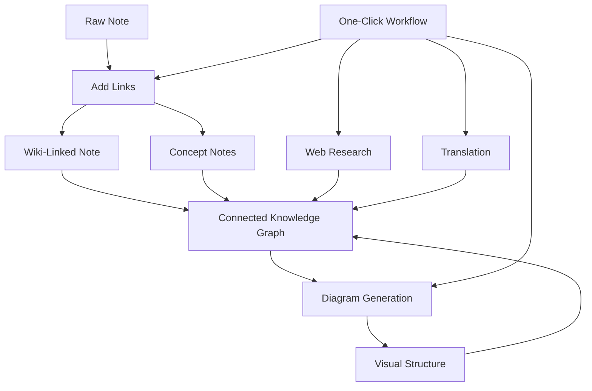

import TLDR from '@site/src/components/TLDR';

# Obsidian AI জ্ঞান ব্যবস্থাপনা গাইড

<TLDR>
**Notemd LLM-চালিত পঠনকে স্থায়ী জ্ঞানে রূপান্তরিত করে: wiki-লিঙ্কগুলো ধারণাগুলোকে সংযুক্ত করে, ধারণা নোটগুলো একটি পুনরুদ্ধারযোগ্য গ্রাফ তৈরি করে, গবেষণা ওয়েবকে আপনার ভল্টে নিয়ে আসে, অনুবাদ ভাষার বাধা দূর করে, ডায়াগ্রামগুলো কাঠামোকে দৃশ্যমান করে, এবং ওয়ার্কফ্লোগুলো সবকিছুকে এক ক্লিকে সংযুক্ত করে।** এই গাইডটি কাঁচা নোট থেকে শুরু করে একটি সংযুক্ত, ভিজ্যুয়াল, বহুভাষিক জ্ঞান ভিত্তি পর্যন্ত পুরো পাইপলাইনটি আবরণ করে.
</TLDR>

## কেন AI জ্ঞান ব্যবস্থাপনা?

ঐতিহ্যবাহী নোট-নেওয়ার পদ্ধতি ফ্ল্যাট ফাইল তৈরি করে। ম্যানুয়াল wiki-লিঙ্ক থাকলেও বেশিরভাগ নোটই আলাদা থেকে যায়। Notemd LLM ব্যবহার করে সংযোগ স্তরটিকে স্বয়ংক্রিয় করে:

- **LLMগুলো আপনার বিষয়বস্তু পড়ে** এবং কী গুরুত্বপূর্ণ তা চিহ্নিত করে — শব্দ, পদ্ধতি, ব্যক্তি, তত্ত্ব
- **প্রতিটি ধারণা উল্লেখের সময় স্বয়ংক্রিয়ভাবে লিঙ্ক যোগ হয়**, "see also"-এ লুকিয়ে না থেকে
- **ধারণা নোটগুলো** স্বতন্ত্র, পুনরুদ্ধারযোগ্য ফাইল হিসেবে তৈরি হয়
- **গবেষণা** ওয়েব থেকে প্রাপ্ত প্রেক্ষাপট দিয়ে নোটগুলোকে সমৃদ্ধ করে
- **ডায়াগ্রামগুলো** কাঠামোকে দৃশ্যমান করে — মাইন্ড ম্যাপ, ফ্লোচার্ট, একই বিষয়বস্তু থেকে ডেটা চার্ট

ফলাফল: এমন একটি জ্ঞান গ্রাফ যা আপনি যতগুলো নোট প্রক্রিয়া করেন ততটাই বৃদ্ধি পায়, শুধুমাত্র লিঙ্ক যোগ করার কথা মনে রাখলেই নয়.

## পূর্ণ পাইপলাইন



প্রতিটি ধাপ স্বাধীন। একটি বা সবগুলো ব্যবহার করুন। সবচেয়ে প্রভাবশালী ক্রম: **লিঙ্ক যোগ করুন → ধারণা নোট → ডায়াগ্রাম**.

---

## 1. Wiki-লিঙ্ক: সংযোগগুলোকে স্পষ্ট করা

Wiki-লিঙ্কগুলো একটি জ্ঞান গ্রাফের মূল ভিত্তি। Notemd একটি LLM ব্যবহার করে:

1. আপনার নোটের বিষয়বস্তু পড়ুন (দীর্ঘ ডকুমেন্টগুলোর জন্য এটিকে চাঙ্কগুলোতে ভাগ করুন)
2. মূল ধারণাগুলো চিহ্নিত করুন — সাধারণ বিশেষ্যের চেয়ে নির্দিষ্ট, প্রযুক্তিগত শব্দগুলোকে অগ্রাধিকার দিন
3. প্রতিটি ঘটনায় `[[wiki-links]]` যোগ করুন
4. সমার্থক শব্দগুলো দমন করুন যাতে "ML" এবং "Machine Learning" আলাদা নোড তৈরি না করে

### কখন ব্যবহার করবেন

- **১০০ শব্দের বেশি থাকা প্রতিটি নোট** — ছোট নোটগুলোতে কম ধারণা থাকে
- **গবেষণা পেপার, প্রযুক্তিগত ডকুমেন্ট, মিটিং নোট** — এগুলোতে ডোমেইন-নির্দিষ্ট শব্দ প্রচুর থাকে
- **বিষয়বস্তু স্থিতিশীল হওয়ার পর** — ড্রাফটগুলোকে বারবার প্রক্রিয়া করবেন না

### মূল সেটিংস

| সেটিং | সুপারিশকৃত | কারণ |
|---------|-----------|-----|
| `addLinksProvider` | DeepSeek অথবা GPT-4o-mini | কম খরচে ভালো নির্ভুলতা |
| সমার্থক শব্দ দমন | চালু | ডুপ্লিকেট নোড রোধ করে |
| কনটেক্সট উইন্ডো | অনুচ্ছেদ | নির্ভুলতা ও খরচের ভারসাম্য |

→ [Wiki-Links deep dive](/docs/features/wiki-links)

---

## 2. ধারণা নোটস: পুনরুদ্ধারযোগ্য জ্ঞান নোডস

Wiki-লিঙ্কগুলি ধারণাগুলিকে ইনলাইনে সংযুক্ত করে, কিন্তু ধারণা নোটসগুলি প্রতিটি ধারণাকে স্বাধীনভাবে পুনরুদ্ধারযোগ্য করে। প্রতিটি ধারণার জন্য নিজস্ব `.md` ফাইল থাকে:

```markdown
# Machine Learning

## Linked From
- [[My Research Notes]]
- [[Neural Networks Explained]]
```

### বের করার প্রক্রিয়া

LLM প্রম্পটটি অত্যন্ত কাঠামোবদ্ধ:
- একবচন রূপে স্বাভাবিকীকরণ করুন
- একক শব্দের চেয়ে বহু-শব্দের ধারণাগুলিকে অগ্রাধিকার দিন ("Dielectric Relaxation" নয়, "Relaxation")
- রেফারেন্স/বিবলিওগ্রাফি বিভাগগুলি বাদ দিন
- নির্ধারণমূলক পার্সিংয়ের জন্য `CONCEPT:` লাইন আকারে আউটপুট দিন

`Set<string>` এর মাধ্যমে বিভিন্ন চাঙ্কের মধ্যে ধারণাগুলি অনন্য করা হয়। প্রতিটি চাঙ্কে LLM ত্রুটি থাকলেও অপারেশনটি বন্ধ হয় না.

### ব্যাকলিঙ্ক

সক্রিয় করা হলে, প্রতিটি ধারণা নোট ট্র্যাক করে কোন সোর্স নোটগুলি এটিকে উল্লেখ করেছে। Obsidian এর নেটিভ ব্যাকলিঙ্ক প্যানেলটি রিভার্স কানেকশনগুলিও দেখায়.

### ডুপ্লিকেশন দূরীকরণ

Notemd এর 4-ধাপী অনন্যকরণ ইঞ্জিনটি নিম্নলিখিতগুলি শনাক্ত করে:
1. **সঠিক মিল** — কেস-ইনসেনসিটিভ ফাইলনাম তুলনা
2. **বহুবচন রূপ** — "Models.md" বনাম "Model.md"
3. **প্রতীকের স্বাভাবিকীকরণ** — "A-B.md" বনাম "A B.md"
4. **একক-শব্দ ধারণ** — "Machine Learning.md" থাকলে "ML.md" চিহ্নিত হয়

### Key Settings

| সেটিং | Recommended | কারণ |
|---------|-----------|-----|
| `conceptNoteFolder` | `concepts/` অথবা `🧠 concepts/` | Keeps vault organized |
| `extractConceptsAddBacklink` | On | Enables reverse lookup |
| `extractConceptsMinimalTemplate` | Off | Full template with Linked From |
| Per-task model | DeepSeek | Concept extraction doesn't need expensive models |
| Synonym suppression | On | Same setting affects both linking and extraction |

→ [Concept Notes deep dive](/docs/features/concept-notes)

---

## ৩. গবেষণা: ওয়েবকে অন্তর্ভুক্ত করা

Notemd আপনার নোট-নেওয়ার কাজের প্রক্রিয়ায় ওয়েব সার্চকে একীভূত করে:

1. **কোয়েরি গঠন** — আপনার নোটের শিরোনাম বা নির্বাচিত অংশটি একটি সার্চ কোয়েরি হয়ে ওঠে
2. **ওয়েব সার্চ** — Tavily (সুপারিশকৃত, API কী প্রয়োজন) অথবা DuckDuckGo (বিনামূল্যে, কোনো কী দরকার নেই)
3. **LLM সারসংক্ষেপ** — সার্চ ফলাফলগুলোকে একটি প্রাসঙ্গিক সারসংক্ষেপে রূপান্তরিত করা হয়
4. **নোটে যোগ করা** — সারসংক্ষেপটি কার্সরের অবস্থানে বা একটি নতুন বিভাগ হিসেবে যোগ করা হয়

### কখন ব্যবহার করবেন

- নতুন কোনো বিষয় প্রক্রিয়াকরণের আগে — প্রথমে ওয়েব থেকে প্রেক্ষাপট সংগ্রহ করুন
- যখন কোনো কনসেপ্ট নোটকে আরও সমৃদ্ধ করার প্রয়োজন হয় — গবেষণা করে তারপর লিঙ্ক যোগ করুন
- লিটারেচার রিভিউয়ের জন্য — নোটগুলোর একটি ফোল্ডার নিয়ে ব্যাচ-গবেষণা করুন

### প্রধান সেটিংস

| সেটিং | সুপারিশকৃত | কারণ |
|---------|-----------|-----|
| `researchProvider` | GPT-4o অথবা Claude | গবেষণার জন্য উচ্চমানের সারসংক্ষেপ প্রয়োজন |
| সার্চ সার্ভিস | Tavily | আরও ভালো সংশ্লিষ্টতা, কনফিগারযোগ্য গভীরতা |
| `maxResearchContentTokens` | 4000 | গভীরতা ও খরচের মধ্যে ভারসাম্য |

→ [Research deep dive](/docs/features/research)

---

## ৪. অনুবাদ: ভাষাগত বাধা দূর করা

Notemd আপনার কনফিগার করা LLM ব্যবহার করে নোটগুলো অনুবাদ করে — এটি কোনো বিশেষ অনুবাদ API নয়। এর অর্থ হলো:

- **প্রেক্ষাপট-সচেতন অনুবাদ** — LLM সম্পূর্ণ ডকুমেন্টটি বোঝে, শুধুমাত্র বাক্য দিয়ে দিয়ে নয়
- **প্রযুক্তিগত পরিভাষা পরিচালনা** — "gradient descent" এর অনুবাদ "梯度下降" হিসেবে থাকে, "坡度向下" নয়
- **ব্যাচ সমর্থন** — একই অপারেশনে নোটের পুরো ফোল্ডার অনুবাদ করা যায়
- **প্রতি-টাস্ক মডেল** — অনুবাদের জন্য Gemini Flash ব্যবহার করা হয় (দ্রুত, সস্তা, বহুভাষিক)

### ভাষা সমর্থন

Notemd নিজেই ২১টি UI ভাষা সমর্থন করে। অনুবাদের লক্ষ্য ভাষা প্রতি-টাস্ক অনুযায়ী কনফিগার করা যায়। সাধারণ জোড়া: EN↔ZH, EN↔JA, EN↔KO, EN↔DE, EN↔FR, EN↔ES.

→ [Translation deep dive](/docs/features/translation)

---

## ৫. ডায়াগ্রাম: কাঠামোকে দৃশ্যমান করা

Notemd-এর ডায়াগ্রাম পাইপলাইনটি স্পেসিফিকেশন-ভিত্তিক: LLM একটি কাঠামোবদ্ধ `DiagramSpec` JSON তৈরি করে, তারপর অ্যাডাপ্টারগুলো এটিকে লক্ষ্য ফরম্যাটে অনুবাদ করে। এটি LLM-কে খসড়া Mermaid সিনট্যাক্স চাওয়ার চেয়ে আরও নির্ভরযোগ্য আউটপুট দেয়.

### ইন্টেন্ট ডিটেকশন

Notemd কন্টেন্ট থেকে সর্বোত্তম ডায়াগ্রাম ধরণ অনুমান করে:

- **সংখ্যাসহ টেবিল** → data chart (Vega-Lite)
- **ক্লায়েন্ট/সার্ভার শব্দভাণ্ডার** → সিকোয়েন্স ডায়াগ্রাম (Mermaid)
- **এন্টিটি/প্রাইমারি কী** → ER ডায়াগ্রাম (Mermaid)
- **ধাপ/প্রক্রিয়া প্রবাহ** → ফ্লোচার্ট (Mermaid)
- **কনসেপ্ট ম্যাপ কীওয়ার্ড** → JSON Canvas (Obsidian নেটিভ)
- **ডিফল্ট** → মাইন্ড ম্যাপ (Mermaid)

### Rendering Chain

প্রাইমারি টার্গেট → ফলব্যাক → ফলব্যাক → HTML। যদি Mermaid সিনট্যাক্স ব্যর্থ হয়, তবে এটি ত্রুটি কনটেক্সটসহ LLM-এ একবার পুনরায় চেষ্টা করে, তারপর ন্যূনতম ডায়াগ্রামে ফিরে যায়.

### Key Settings

| সেটিং | Recommended | কারণ |
|---------|-----------|-----|
| `enableExperimentalDiagramPipeline` | On | spec-first এর মাধ্যমে আরও ভালো গুণমান |
| `experimentalDiagramCompatibilityMode` | `best-fit` | ইন্টেন্ট অনুযায়ী নেটিভ টার্গেট |
| `summarizeToMermaidProvider` | GPT-4o অথবা Claude | ডায়াগ্রাম স্পেসিফিকেশনগুলোর জন্য স্পেশিয়াল রিজনিং প্রয়োজন |
| `autoMermaidFixAfterGenerate` | On | LLM সিনট্যাক্স ত্রুটিগুলো স্বয়ংক্রিয়ভাবে শনাক্ত করে |
| স্থানীয় জ্ঞান বৃদ্ধি | ডোমেইন-নির্দিষ্ট অবস্থায় চালু | ভল্ট কনটেক্সটের সাহায্যে নির্ভুলতা উন্নত করে |

→ [Diagrams deep dive](/docs/features/diagrams)

---

## 6. ওয়ার্কফ্লো: ওয়ান-ক্লিক অটোমেশন

ওয়ার্কফ্লো একাধিক টাস্ককে একটি সিঙ্গেল সাইডবার বাটনে চেইন করে। DSL ফরম্যাটটি হলো:

```
task1 | task2 | task3
```

উদাহরণ: `addLinks | extractConcepts | generateDiagram` — এক ক্লিকে কাঁচা টেক্সট থেকে সম্পূর্ণভাবে সংযুক্ত, ভিজ্যুয়াল জ্ঞান নোডে প্রক্রিয়াকরণ করে.

### সুপারিশকৃত ওয়ার্কফ্লো

| ওয়ার্কফ্লো | চেইন | ব্যবহারের ক্ষেত্র |
|----------|-------|----------|
| পূর্ণ প্রক্রিয়া | `addLinks \| extractConcepts \| generateDiagram` | নতুন নোট |
| প্রথমে গবেষণা | `research \| addLinks` | অপরিচিত বিষয়সমূহ |
| পলিগ্লট | `translate \| addLinks` | বহুভাষিক নোট |
| শুধুমাত্র ডায়াগ্রাম | `generateDiagram` | দ্রুত ভিজ্যুয়ালাইজেশন |

→ [Workflows deep dive](/docs/features/workflows)

---

## 7. LLM প্রদানকারী: ক্লাউড থেকে লোকাল পর্যন্ত 36টি অপশন

Notemd 4টি ট্রান্সপোর্ট টাইপে 36টি প্রদানকারীকে সমর্থন করে। প্রধান গ্রুপসমূহ:

- **আন্তর্জাতিক ক্লাউড**: OpenAI, Anthropic, Google, Mistral, xAI
- **চীনা ক্লাউড**: DeepSeek, Qwen, Doubao, Moonshot, GLM, Baidu, SiliconFlow
- **গেটওয়েসমূহ**: OpenRouter, GitHub Models, Hugging Face, Vercel
- **লোকাল**: Ollama, LMStudio, OVMS — API কী নেই, আপনার মেশিন থেকে কোনো ডেটা বের হয় না

### পার-টাস্ক মডেল কৌশল

সবচেয়ে খরচ-সাশ্রয়ী সেটআপে সাধারণ কাজের জন্য সস্তা মডেল এবং জটিল কাজের জন্য শক্তিশালী মডেল ব্যবহার করা হয়:

```
extractConcepts  → DeepSeek (fast, cheap, accurate enough)
addLinks          → DeepSeek or GPT-4o-mini
research          → GPT-4o or Claude (needs quality)
generateDiagram   → GPT-4o or Claude (needs spatial reasoning)
translate         → Gemini Flash (fast, multilingual)
```

→ [LLM Providers overview](/docs/providers/overview)

---

## শুরু করার জন্য চেকলিস্ট

1. **Notemd ইনস্টল করুন** — [Community Plugins](/docs/getting-started/installation) (সুপারিশকৃত) অথবা ম্যানুয়ালি
2. **একটি প্রদানকারী কনফিগার করুন** — DeepSeek (সবচেয়ে সহজ), OpenAI, অথবা Ollama (বিনামূল্যে)
3. **আপনার প্রথম নোটটি প্রক্রিয়া করুন** — রাইট-ক্লিক → "Process file (add links)"
4. **কনসেপ্ট ফোল্ডার সেট করুন** — Settings → Notemd → Output → Concept Folder
5. **কনসেপ্টগুলো এক্সট্রাক্ট করুন** — একই নোটে “Extract concepts” চালান
6. **একটি ডায়াগ্রাম তৈরি করুন** — সংযোগগুলো দেখানোর জন্য “Generate diagram” চালান
7. **একটি ওয়ার্কফ্লো তৈরি করুন** — উপরেরগুলোকে এক-ক্লিক বাটনে চেইন করুন

## Recommended Configurations

### Student (Budget)

```
Provider: DeepSeek (free tier available)
Concept extraction: DeepSeek
Research: DuckDuckGo (free) + DeepSeek
Diagrams: Off (or legacy Mermaid)
Workflows: addLinks | extractConcepts
```

### Researcher (Quality)

```
Provider: GPT-4o (primary)
Concept extraction: DeepSeek (cost savings)
Research: GPT-4o + Tavily
Diagrams: best-fit mode, GPT-4o
Workflows: research | addLinks | extractConcepts | generateDiagram
```

### Privacy-First (Local Only)

```
Provider: Ollama (llama3 or qwen2.5:7b)
All tasks: Ollama
Research: DuckDuckGo (free, no API key)
Diagrams: legacy Mermaid mode
```

### Bilingual (ZH + EN)

```
Primary: DeepSeek (Chinese queries)
Translation: Google Gemini Flash
Research: Tavily + DeepSeek (Chinese search context)
Language output: per-task (extractConceptsLanguage: zh-CN)
```

---

## Common Patterns

### Pattern: Process a Research Paper

1. Import PDF content (or paste)
2. **Research** — বিষয়টি সম্পর্কে ওয়েব কনটেক্সট পান
3. **Add Links** — গুরুত্বপূর্ণ কনসেপ্টগুলো চিহ্নিত ও লিঙ্ক করুন
4. **Extract Concepts** — স্বতন্ত্র নোট তৈরি করুন
5. **Generate Diagram** — পেপারটির কাঠামো দেখানোর জন্য

### Pattern: Daily Note Enrichment

1. দৈনিক নোট লিখুন
2. **Add Links** — আজকের ধারণাগুলোকে বিদ্যমান ধারণাগুলোর সাথে সংযুক্ত করে
3. Concept notes auto-update with backlinks

### Pattern: Literature Review

1. papers/notes দিয়ে একটি ফোল্ডার তৈরি করুন
2. **Batch Add Links** — পুরো ফোল্ডারটি প্রক্রিয়াকরণ করুন
3. **Deduplicate Concepts** — প্রায় একই ধরনের নোটগুলো পরিষ্কার করুন
4. **Generate Diagram** — সমগ্র সাহিত্যের জন্য মাইন্ড ম্যাপ তৈরি করুন

---

*Notemd হলো ওপেন সোর্স (MIT) এবং সব প্ল্যাটফর্মে Obsidian 0.15.0+ এর সাথে কাজ করে। [Install now](/docs/getting-started/installation) অথবা [view on GitHub](https://github.com/Jacobinwwey/obsidian-NotEMD).*
