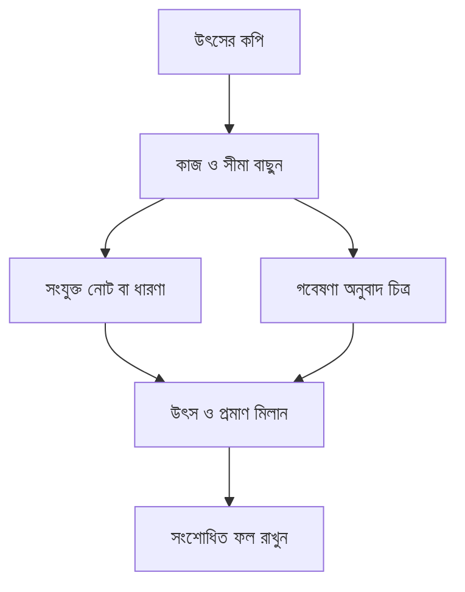

import TLDR from '@site/src/components/TLDR';

# Obsidian-এ AI দিয়ে জ্ঞান পরিচালনা

<TLDR>উপকারী পদ্ধতি source, model output ও নিজের corrections আলাদা রাখে। Notemd links, extraction, research, translation ও diagrams-কে যাচাইযোগ্য documents করে। এক source থেকে শুরু, review, তারপর সীমিত folder automate করুন।</TLDR>

## ফল ঠিক করুন

Linked note, concepts, cited summary, translation বা diagram বাছুন। Files/links বাড়লেই বোঝা বা retrieval উন্নত হয় না। কীভাবে যাচাই ও আবার খুঁজবেন তা নির্ধারণ করুন।

## সম্পূর্ণ পথ


```mermaid
flowchart TD
    A[উৎসের কপি] --> B[কাজ ও সীমা বাছুন]
    B --> C[সংযুক্ত নোট বা ধারণা]
    B --> D[গবেষণা অনুবাদ চিত্র]
    C --> E[উৎস ও প্রমাণ মিলান]
    D --> E
    E --> F[সংশোধিত ফল রাখুন]
```

এগুলো available tasks, default button-এর সব ধাপ নয়। Chain-এর আগে original ও destination নিশ্চিত করুন।

## ১. Link দিয়ে সম্পর্ক স্পষ্ট করা

**Process file (add links)** চালিয়ে `_processed.md`-এর terms, quotes, code ও formulas মিলান। Domain/synonym instructions identity বা numerical threshold enforce করে না। Existing titles-এর repeatability চাইলে deterministic matching দেখুন। [Links](./features/wiki-links)।

## ২. ধারণার নাম ও ব্যাখ্যা আলাদা

Folder বাছুন। Standalone extraction source রেখে titles বানায়। নতুন `Linked From` চাইলে backlinks on, minimal form off। **Batch generate from titles** আলাদা এবং আগের eligible notes-ও নিতে পারে। Complete move ও same-name অর্থভেদ দেখুন। [Concepts](./features/concept-notes)।

## ৩. গবেষণায় প্রমাণ রাখা

Topic/title ও Tavily বা DuckDuckGo বেছে **Research & summarize** চালান। Empty key engine বদলায় না। Sources খুলুন। Local lexical retrieval নির্বাচিত model-এ excerpts পাঠায়; local index offline route প্রমাণ নয়। [Research](./features/research)।

## ৪. অনুবাদে অর্থ ও গঠন

Language বেছে file translate করুন। Default `_<language>.md` existing output বদলাতে পারে। Passage-এর জন্য temporary note নিন। Terms, numbers, code, links ও math পরীক্ষা করুন; chunks context হারাতে পারে। UI/site language count pair quality প্রমাণ নয়। [Translation](./features/translation)।

## ৫. সম্পাদনাযোগ্য diagram source

Compatible type/source নিয়ে preview ও source/SVG/PNG/PDF রাখুন। Image অন্য editor-এ সব সম্পর্ক টেকার প্রমাণ নয়। CircuitikZ সীমিত, native compilation আলাদা; Drawnix cross-branch arrows static এবং PPTX Mermaid/SVG images হতে পারে। [Diagrams](./features/diagrams)।

## ৬. পরীক্ষিত steps automate করা

Name, `::` ও `>` দিয়ে actions সাজান:

```text
One-Click Extract::process-current-add-links>batch-generate-from-titles>batch-mermaid-fix
```

এতে links, titles ও Mermaid repair; সাধারণ research/diagram step নেই। প্রত্যেক task-এর requirements থাকে। Default reported failure-এ থামে। পরের steps অবশিষ্ট inputs সামলাতে পারলেই continue করুন। Cancel completed files undo করে না। [Workflows](./features/workflows)।

## ৭. Provider: protocol ও কাজ

36 presets পাঁচ পরিবারে। Endpoint, rights, data policy ও measured output দেখে বাছুন। একই source/prompt দিয়ে latency/cost তুলুন। Per-task routing শুরুতে off; local কাজ ধরে নেওয়ার আগে সব routes দেখুন। [Providers](./providers/overview)।

## প্রথম যাচাই

1. Install করে source copies রাখুন।
2. Exact model test করুন।
3. Concept folder ও আলাদা destinations বাছুন।
4. Copy-তে কাজ চালান।
5. তুলনা করে corrections রাখুন।
6. ছোট folder-এ বাড়িয়ে দীর্ঘ chain-এর আগে partial results দেখুন।

## ব্যবহারিক ক্ষেত্র

### Paper নিয়ে কাজ

External tool-এ Markdown বানিয়ে tables, formulas ও figures দেখুন। Concepts/passages বের করে নির্দিষ্ট প্রশ্ন গবেষণা ও যাচাইযোগ্য সম্পর্ক আঁকুন। Original paper ও corrections রাখুন।

### Concept collection

আলাদা folder-এ terms review করে নির্বাচিত অংশের explanation তৈরি করুন। Cleanup-এর আগে backup। Quantity সঠিক definition ও navigation-এর বিকল্প নয়।

### ব্যক্তিগত উপাদান

Local server, models ও dependencies প্রস্তুত করে task routes দেখুন। প্রয়োজনে network research বন্ধ রাখুন। Diagnostics শেয়ারের আগে review করুন। Loopback default remote configuration আটকায় না।

### Batch আবার চালানো

Cancel/failure settle হওয়া পর্যন্ত অপেক্ষা করুন। Report, outputs, recovery ও conflicts মিলিয়ে শুধু দরকারি কাজ পুনরায় করুন। Cancelled মানে empty নয়; companions মুছতে references দেখুন।

## পরবর্তী ধাপ

- [দ্রুত শুরু](./getting-started/quick-start)।
- [Batch](./advanced/batch-processing)।
- [Developers](./developers/overview)।
- [Agent](./agents/overview)।
