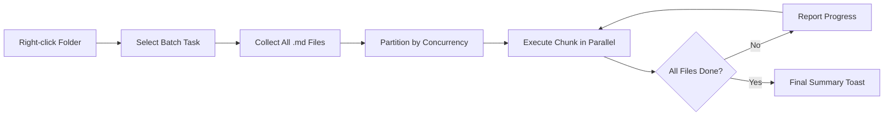

import TLDR from '@site/src/components/TLDR';

# Hromadná zpracování

<TLDR>
**Notemd zpracovává celé složky v jediném kroku s nastavitelnou konvergencí a kontrolou přepsání.** Klikněte pravým tlačítkem na složku a hromadně přidejte odkazy na wiki, extrahujte koncepty, provádějte výzkum nebo překládejte všechny poznámky uvnitř. Limity konvergence zabraňují chybám kvůli API omezení rychlosti. Je zpravován pokrok pro každý soubor. Chování přepsání lze nastavit: přeskočit existující, přidat nebo nahradit. Selhaly soubory jsou zaznamenány bez přerušení hromadného zpracování.

Toto je součástí [Obsidian Průvodce AI pro správu znalostí](/docs/pillar-ai-knowledge).
</TLDR>

## Přehled

Hromadná zpracování převádí složku s poznámkami na jednu operaci. Místo otevírání každé poznámky a spouštění příkazů samostatně kliknete pravým tlačítkem na složku a vyberete úlohu. Notemd prochází všechny soubory `.md`, aplikuje zvolenou akci a v reálném čase hlásí pokrok.

Tato funkce je nezbytná pro extrakci znalostí v celém úložišti. Po importu desítek PDF, například hromadné přidání odkazů následované hromadným extrahováním konceptů, vytvoříte svou znalostní síť během několika minut místo hodin.

## Jak to funguje

### Model hromadného provádění

1. **Sběr souborů** -- Notemd rekurentně prohledává cílovou složku (nebo pouze na nejvyšší úrovni v závislosti na nastaveních) a shromažďuje všechny soubory `.md`.
2. **Rozdělení konvergencí** -- Soubory jsou rozděleny do částí na základě nastavení `batchConcurrency`. Každá část běží paralelně; části běží sekvenčně.
3. **Provedení** -- Každý soubor je zpracován pomocí stejné logiky jako příkaz pro jednotlivé soubory. Jsou respektována nastavení poskytovatele a modelu pro každou úlohu.
4. **Hlášení pokroku** -- Oznámení se aktualizuje po dokončení každého souboru a zobrazuje `N / Total` pokrok.
5. **Zpracování chyb** -- Pokud soubor selže (chyba API, časový limit síťového spojení atd.), chyba je zaznamenána a hromadné zpracování pokračuje. Závěrečný souhrn uvádí všechny selhaly soubory.
6. **Dokončení** -- Souhrnné oznámení hlásí celkový počet zpracovaných souborů, úspěchy a selhání.

### Chování přepsání

Při zpracování souboru, který již obsahuje wiki-odkazy, konceptuální poznámky nebo překlady, chování Notemd závisí na nastavení přepsání:

| Režim | Chování |
|------|----------|
| **Přeskočit** | Stávající obsah zůstává nedotčen. Zpracovávají se pouze nezměněné soubory. |
| **Přidat** (výchozí) | Nový obsah je přidán. Stávající wiki-odkazy, koncepty nebo překlady zůstávají zachovány. |
| **Nahradit** | Soubor je zcela znovu zpracován. Všechny předchozí úpravy Notemd jsou přepsány. |

Konkrétně u wiki-odkazů: pokud poznámka již obsahuje `[[wiki-links]]`, režim **Přeskočit** ji nechá být, zatímco režim **Nahradit** odešle celou poznámku na LLM za účelem vložení nových odkazů. Použijte **Přeskočit** pro inkrementální zpracování a **Nahradit** pro znovuzpracování po aktualizaci modelu.

### Řízení souběžnosti

Nastavení `batchConcurrency` omezuje počet souběžných volání API. To zabrání chybám kvůli omezení rychlosti (HTTP 429) při zpracování velkých složek u poskytovatelů s přísnými kvótami.

| Souběžnost | Doporučeno pro | Typický dopad na omezení rychlosti |
|-------------|----------------|---------------------------|
| `1` | Bezplatné úrovně, přísní poskytovatelé | Žádný (sériový) |
| `3` (výchozí) | Většina cloudových poskytovatelů | Nízký |
| `5` | Ollama (lokální), štědré úrovně | Žádný / Nízký |
| `10` | Lokální modely s rychlou inferencí | Žádný |

Pokud při hromadné obrábění narazíte na chyby 429, snižte konvergenčnost na 1 nebo 2.

## Konfigurace

| Nastavení | Výchozí | Účinek |
|---------|---------|--------|
| `batchConcurrency` | `3` | Maximální počet paralelních API volání během operací se složkami |
| `batchOverwriteExisting` | `false` | Přepsat stávající obsah Notemd. `false` = režim přidání. |
| `batchSkipProcessed` | `false` | Přeskočit soubory, které již obsahují značky Notemd (např. odkazy na wiki) |
| `batchRecursive` | `true` | Zahrnout podadresáře při skenování složky |
| `enableStableApiCall` | `false` | Povolit logiku opakování (až 4 pokusy) pro každý soubor během hromadného zpracování |

### Modely na úrovni úkolu v hromadném režimu

Každá operace v hromadě využívá odpovídající model na úrovni úkolu. batch-add-links používá `addLinksProvider`, batch-research používá `researchProvider` a tak dále. To znamená, že můžete pro velkovýkoné operace použít levné modely a pro úkoly vyžadující vysokou kvalitu rezervovat drahé modely.

## Příklad

Máte složku `papers/` obsahující 40 importovaných výzkumných poznámek. Chcete přidat odkazy na wiki a extrahovat koncepty ze všech z nich:

1. Klikněte pravým tlačítkem na složku `papers/`
2. Vyberte **"Notemd: Zpracovat složku (přidat odkazy)"**
3. Notemd prohledá složku, najde 40 souborů `.md` a zpracovává je po 3 v kuse (výchozí konvergenční počet)
4. Vyskakuje toast se stavem: `12/40 files processed...`
5. Po přibližně 3 minutách se zobrazí souhrnný toast s informací: `39 succeeded, 1 failed (API timeout on paper-37.md)`
6. Opakujte pomocí **"Notemd: Zpracovat složku (vytáhnout koncepty)"** pro vytvoření poznámek ke konceptům ke všem 40 souborům

Soubor, který selhal, je zaznamenán. Později ho můžete spustit samostatně.

## Tipy

- **Začněte s nízkým konvergenčním počtem** -- Pokud si nejste jisti limity rychlosti vašeho poskytovatele, začněte s `1` a postupně je zvyšujte.
- **Použijte režim přeskočení pro inkrementální aktualizace** -- Po první kompletní várce přejděte na `batchSkipProcessed: true`, aby byly v následujících spuštěních zpracovány pouze nové poznámky.
- **Aktivujte stabilní volání API** -- `enableStableApiCall: true` přidává logiku opakování, která se zotavuje z dočasných síťových chyb během dlouhých várkách.
- **Spusťte to znovu po aktualizaci modelu** -- Pokud přejdete na lepší model, nastavte `batchOverwriteExisting: true` a spusťte to znovu pro lepší odkazy a koncepty.

---

## Další kroky

- [Workflows](/docs/features/workflows) -- Spojte výkony várky do jednoho tlačítka v postranním panelu
- [Custom Prompts](/docs/advanced/custom-prompts) -- Přizpůsobte výzvy pro hromadné extrakce
- [Troubleshooting](/docs/advanced/troubleshooting) -- Opravte chyby limitů rychlosti a selhání připojení během spuštění várky
- [LLM Poskytovatelé](/docs/providers/overview) -- Odkaz na konfiguraci modelu podle úlohy
